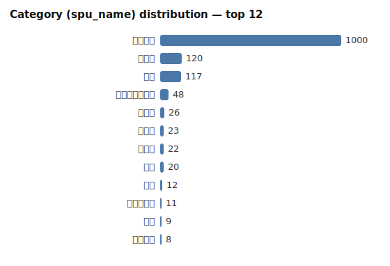
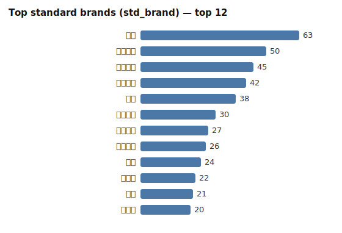
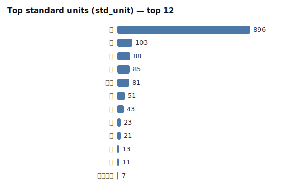
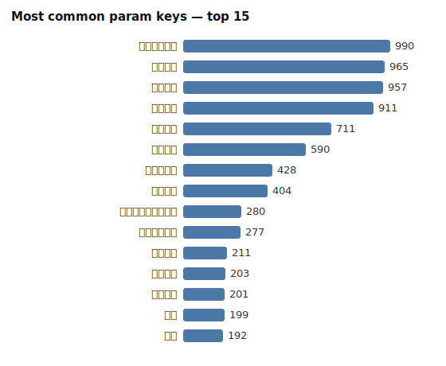

# material-sft — Exploratory Data Analysis (EDA)

> 自动生成 / Auto-generated by `analysis/material_sft_eda.py`. All numbers below are produced by that script against the live databench `/datasets/material-sft/samples` API. Re-run the script to regenerate.

## 1. Overview / 总览

| Metric | Value |
| --- | --- |
| Total samples / 样本总数 | 1454 |
| kind | sft=1454 |
| source | 中资数据/demo_material_data_20260623 (1454) |
| Distinct spu_id | 23 |
| Distinct spu_name (categories) | 23 |
| Assistant JSON parse failures | 0 |
| Distinct system prompts | 1 |

**关键结构性事实 / key structural fact:** `spu_id` 与 `spu_name` 一一对应（23 个 id ↔ 23 个类目），即 `spu_id` 是**类目级**标识，不是逐行唯一的商品 id。因此 1454 行里每个 `spu_id` 大量重复——**按 `spu_id` 分组等价于按类目分组**，这对划分训练/验证集有直接影响（见 §9）。

- 每个 spu_id 恰好对应一个 spu_name（无冲突）。

## 2. Category distribution / 类目分布

| spu_name | count | % |
| --- | --- | --- |
| 电力电缆 | 1000 | 68.8% |
| 复印纸 | 120 | 8.3% |
| 硒鼓 | 117 | 8.0% |
| 家用分体式空调 | 48 | 3.3% |
| 电视机 | 26 | 1.8% |
| 碳粉盒 | 23 | 1.6% |
| 面巾纸 | 22 | 1.5% |
| 卷纸 | 20 | 1.4% |
| 标签 | 12 | 0.8% |
| 普通干电池 | 11 | 0.8% |
| 插排 | 9 | 0.6% |
| 打印墨水 | 8 | 0.6% |
| 扫描仪 | 7 | 0.5% |
| 垃圾袋 | 6 | 0.4% |
| 碳粉 | 6 | 0.4% |
| 冰箱 | 4 | 0.3% |
| 投影仪 | 4 | 0.3% |
| 中性笔 | 3 | 0.2% |
| 垃圾桶（非医用） | 3 | 0.2% |
| 笔记本 | 2 | 0.1% |
| 电风扇 | 1 | 0.1% |
| 胶带 | 1 | 0.1% |
| 打印头 | 1 | 0.1% |

**严重类别不均衡 / severe class imbalance:** `电力电缆` 单独占 1000/1454 = 68.8%。Top-3 类目占 85.1%；尾部多个类目样本量为个位数。

> Training implication: 直接训练会让模型严重偏向 `电力电缆`，长尾类目（如标签、普通干电池等）几乎无法学到。建议按类目重采样/加权，或对长尾做数据增强；评测必须**按类目分层**报告指标，否则总体准确率会被 `电力电缆` 主导。

## 3. Brand / 品牌

| Metric | Value |
| --- | --- |
| Distinct std_brand | 388 |
| Rows with empty std_brand | 0 (0.0%) |
| Rows with a raw_brand | 1454 |
| raw_brand != std_brand (normalized) | 676 (46.5% of rows with raw_brand) |

**Top std_brand:**

| std_brand | count | % |
| --- | --- | --- |
| 惠普 | 63 | 4.3% |
| 特变电工 | 50 | 3.4% |
| 远东电缆 | 45 | 3.1% |
| 江苏上上 | 42 | 2.9% |
| 宝胜 | 38 | 2.6% |
| 中天科技 | 30 | 2.1% |
| 起帆电缆 | 27 | 1.9% |
| 安徽华能 | 26 | 1.8% |
| 天康 | 24 | 1.7% |
| 昆电工 | 22 | 1.5% |
| 得力 | 21 | 1.4% |
| 万马神 | 20 | 1.4% |
| 新绿天章 | 19 | 1.3% |
| 美的 | 19 | 1.3% |
| 金鸿电线电缆 | 17 | 1.2% |

**Normalization examples (raw_brand → std_brand):**

| raw_brand | std_brand | count |
| --- | --- | --- |
| `远东` | `远东电缆` | 22 |
| `安徽天康` | `天康` | 18 |
| `江苏上上电缆集团有限公司` | `江苏上上` | 17 |
| `惠普（HP）` | `惠普` | 15 |
| `金鸿` | `金鸿电线电缆` | 15 |
| `天章` | `新绿天章` | 13 |
| `亨通` | `亨通电力` | 13 |
| `起帆` | `起帆电缆` | 13 |
| `惠普(HP)` | `惠普` | 12 |
| `金凤` | `华菱金凤` | 12 |
| `上上` | `江苏上上` | 12 |
| `汉河牌` | `焦作汉河电缆` | 10 |
| `云超牌` | `云超` | 9 |
| `YX亚星` | `亚星` | 9 |
| `TBEA` | `特变电工` | 9 |

**Messy cases — one clean brand absorbing many raw variants:**

| std_brand | # distinct raw variants |
| --- | --- |
| 昆电工 | 7 |
| 太平洋 | 7 |
| 特变电工 | 6 |
| 江苏上上 | 5 |
| 远东电缆 | 5 |
| 起帆电缆 | 5 |
| 宝安电缆 | 5 |
| 中超 | 5 |
| 永通 | 5 |
| 惠普 | 4 |

## 4. Unit / 单位

| Metric | Value |
| --- | --- |
| Distinct std_unit | 25 |
| Distinct raw_unit | 36 |
| Rows with empty std_unit | 0 (0.0%) |
| raw_unit != std_unit (divergent) | 241 (16.6% of rows with raw_unit) |

**Standard unit distribution:**

| std_unit | count | % |
| --- | --- | --- |
| 米 | 896 | 61.6% |
| 箱 | 103 | 7.1% |
| 台 | 88 | 6.1% |
| 个 | 85 | 5.8% |
| 千米 | 81 | 5.6% |
| 支 | 51 | 3.5% |
| 包 | 43 | 3.0% |
| 套 | 23 | 1.6% |
| 盒 | 21 | 1.4% |
| 卷 | 13 | 0.9% |
| 提 | 11 | 0.8% |
| 平方毫米 | 7 | 0.5% |
| 卡 | 6 | 0.4% |
| 组 | 5 | 0.3% |
| 根 | 5 | 0.3% |

**raw_unit → std_unit mapping (where they differ):**

| raw_unit | std_unit | count |
| --- | --- | --- |
| `m` | `米` | 198 |
| `km` | `千米` | 17 |
| `mm2` | `平方毫米` | 5 |
| `只` | `个` | 3 |
| `件` | `箱` | 2 |
| `M` | `米` | 2 |
| `mm²` | `平方毫米` | 2 |
| `件` | `盒` | 1 |
| `单支装` | `支` | 1 |
| `只` | `瓶` | 1 |
| `包` | `提` | 1 |
| `个` | `包` | 1 |
| `包装` | `包` | 1 |
| `盒` | `卷` | 1 |
| `Km` | `千米` | 1 |
| `个` | `根` | 1 |
| `5 米` | `米` | 1 |
| `千米(公里)` | `千米` | 1 |
| `米/M` | `米` | 1 |

## 5. Params / 标准参数

| param-count stat | value |
| --- | --- |
| min | 1 |
| p25 | 6 |
| median | 7.0 |
| mean | 6.7 |
| p90 | 9 |
| p99 | 11 |
| max | 12 |

- Rows with **zero** params: 0 (0.0%)
- Rows with **duplicate keys** in params JSON: 0
- Empty/placeholder param **values** ("", 无, 暂无): 0

**Most common param keys (overall):**

| param key | count | % |
| --- | --- | --- |
| 主芯标称截面 | 990 | 68.1% |
| 导体芯数 | 965 | 66.4% |
| 绝缘材料 | 957 | 65.8% |
| 护套材料 | 911 | 62.7% |
| 额定电压 | 711 | 48.9% |
| 阻燃等级 | 590 | 40.6% |
| 铠装层类型 | 428 | 29.4% |
| 包装形式 | 404 | 27.8% |
| 接地导体标称截面积 | 280 | 19.3% |
| 接地导体根数 | 277 | 19.1% |
| 产品类型 | 211 | 14.5% |
| 耐火特性 | 203 | 14.0% |
| 无卤性能 | 201 | 13.8% |
| 型号 | 199 | 13.7% |
| 颜色 | 192 | 13.2% |
| 导体材料 | 191 | 13.1% |
| 低烟性能 | 191 | 13.1% |
| 品牌 | 124 | 8.5% |
| 包装规格 | 121 | 8.3% |
| 纸张规格 | 115 | 7.9% |

**Param keys by top category:**

*电力电缆* (n=1000):

| key | count | coverage |
| --- | --- | --- |
| 主芯标称截面 | 990 | 99.0% |
| 导体芯数 | 965 | 96.5% |
| 绝缘材料 | 957 | 95.7% |
| 护套材料 | 911 | 91.1% |
| 额定电压 | 703 | 70.3% |
| 阻燃等级 | 590 | 59.0% |
| 铠装层类型 | 428 | 42.8% |
| 接地导体标称截面积 | 280 | 28.0% |

*复印纸* (n=120):

| key | count | coverage |
| --- | --- | --- |
| 产品类型 | 120 | 100.0% |
| 包装形式 | 120 | 100.0% |
| 纸张规格 | 115 | 95.8% |
| 定量 | 110 | 91.7% |
| 最小包装单位 | 84 | 70.0% |
| 包装规格 | 82 | 68.3% |
| 颜色 | 47 | 39.2% |
| 系列 | 13 | 10.8% |

*硒鼓* (n=117):

| key | count | coverage |
| --- | --- | --- |
| 品牌 | 117 | 100.0% |
| 型号 | 117 | 100.0% |
| 包装形式 | 115 | 98.3% |
| 颜色 | 111 | 94.9% |
| 是否原装 | 72 | 61.5% |
| 标称打印量 | 72 | 61.5% |
| 适配机型系列 | 68 | 58.1% |
| 产品类型 | 17 | 14.5% |

*家用分体式空调* (n=48):

| key | count | coverage |
| --- | --- | --- |
| 包装形式 | 48 | 100.0% |
| 型号 | 48 | 100.0% |
| 安装方式 | 47 | 97.9% |
| 空调系统形式 | 46 | 95.8% |
| 制冷量（名义制冷量） | 43 | 89.6% |
| 变频类型 | 33 | 68.8% |
| 是否含安装 | 33 | 68.8% |
| 是否含辅材 | 32 | 66.7% |

*电视机* (n=26):

| key | count | coverage |
| --- | --- | --- |
| 包装形式 | 26 | 100.0% |
| 屏幕尺寸 | 25 | 96.2% |
| 产品型号 | 19 | 73.1% |
| 产品类型 | 12 | 46.2% |
| 存储容量（ROM） | 5 | 19.2% |
| 分辨率 | 4 | 15.4% |
| 运行内存（RAM） | 4 | 15.4% |
| 安装方式 | 4 | 15.4% |

## 6. Text length stats / 文本长度

Character counts.

| field | min | p25 | median | mean | p90 | p99 | max |
| --- | --- | --- | --- | --- | --- | --- | --- |
| user input | 13 | 30 | 38.0 | 43.0 | 65 | 103 | 199 |
| assistant JSON | 101 | 180 | 207.0 | 204.4 | 252 | 288 | 324 |

## 7. Data quality / 数据质量

| Check | Value |
| --- | --- |
| Distinct user inputs | 1454 / 1454 |
| Exact duplicate rows (user+assistant+spu_id) | 0 |
| Duplicate user inputs (extra copies) | 0 |
| Near-dup user inputs (ws/case, beyond exact) | 0 |
| Inputs with conflicting outputs | 0 |
| Inputs with tab / double-space | 102 |
| Inputs with leading/trailing whitespace | 0 |
| Empty std_brand | 0 |
| Empty std_unit | 0 |
| Assistant JSON parse failures | 0 |

## 8. Training readiness / 训练可用性

- **Imbalance (主要问题):** 单一类目 `电力电缆` 占 68.8%，需重采样/类目加权，评测必须按类目分层。这是本数据集训练前**最需要处理**的问题。

- **Leakage risk / 泄漏风险:** 低。无完全重复行、无去空白后的近重复输入（1454/1454 输入全部唯一），也无同输入多输出的标签冲突。但仍建议**按类目分层**划分，避免长尾类目在某一侧缺失。

- **Label consistency:** 0 解析失败、0 空 std_brand/std_unit、0 零参数行、0 重复参数键——标注一致性高，是干净的 SFT 目标。

- **Minor noise:** 102 条输入含 tab/连续空格（源表格遗留的空白伪影），建议规范化但不影响标签。

## 9. Suggested split & cleaning / 划分与清洗建议

**Split:** 因严重不均衡，不要纯随机划分。推荐：

1. **按类目分层 (stratify by spu_name)** —— 每个类目在 train/val 同比例出现，适合"已知类目内泛化"评测；对样本<5 的长尾类目可整体放入 train 或单独成集。

2. **类目加权 / 重采样** —— 训练时下采样 `电力电缆` 或上采样长尾，防止模型退化为单类目预测。

> 注意：`spu_id` 是**类目级**而非商品级标识，所以"按 spu_id 分组划分"等价于把整个类目划到一侧，只适合"未见类目泛化"这一特殊评测，不适合常规 SFT。

**Cleaning checklist (按本数据实测情况排序):**

- ✅ 已干净：无重复/冲突/解析失败/空值——可跳过去重与补全。

- ⚠️ 规范化 102 条输入的空白字符（tab、连续空格），保持与推理时输入格式一致。

- ⚠️ 审查可疑单位映射（如 `件→箱`、`件→盒`、`只→瓶`）——这类换算依赖商品语境，可能引入噪声。

- 🔁 处理类目不均衡：长尾增强/合并 + 评测分层。

- 📌 品牌归一化是核心任务信号（46.5% 行 raw≠std），保证同一实体的多种写法映射到同一 std_brand（参见 §3 变体表）。

