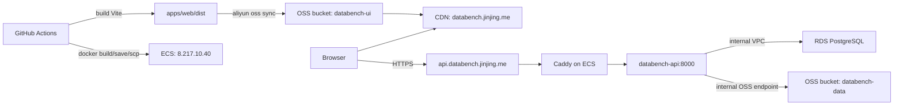

# Aliyun ECS Deployment Runbook

Chinese version: [aliyun-ecs.zh-CN.md](aliyun-ecs.zh-CN.md).

This document is the durable production deployment runbook for `databench-ts`.
It covers the current Alibaba Cloud resources, GitHub Actions flows, ECS runtime
files, frontend OSS/CDN publishing, DNS requirements, and the common failure
modes found during the first deployment.

## Overview

Production uses two independent deployment targets:

- Frontend: `apps/web` is built by GitHub Actions and synced to Aliyun OSS
  bucket `databench-ui`, then the CDN domain `databench.jinjing.me` is refreshed.
- Backend: `apps/api` is built as a Docker image by GitHub Actions, saved as a
  `.tar.gz`, copied to ECS over SSH, loaded on the server, migrated against RDS,
  and started behind Caddy at `api.databench.jinjing.me`.

There is no ACR registry in this setup. Backend images are shipped by `scp`.



## Cloud Resources

| Resource | Value |
| --- | --- |
| Region | China Hong Kong |
| Frontend bucket | `databench-ui` |
| Frontend CDN/domain | `databench.jinjing.me` |
| Backend API domain | `api.databench.jinjing.me` |
| Backend ECS | `i-j6cgxd69ntl25xp1wcgl`, `centurion-headscale` |
| Backend EIP | `8.217.10.40` |
| Backend private IP | `192.168.10.10` |
| Backend OS | Ubuntu 24.04 |
| VPC | `vpc-j6c3qfwjgg3ri3hn9nmbe` |
| Security group | `sg-j6ceza3ev99oyo109j2v` |
| RDS instance | `pgm-j6cgqlq44ku1k52n` |
| RDS internal host | `pgm-j6cgqlq44ku1k52n.pg.cnhk.rds.aliyuncs.com:5432` |
| RDS database/user | `databench` / `databench_app` |
| RDS whitelist | `192.168.0.0/16` |
| Data bucket | `databench-data` |
| Data bucket endpoint | `oss-cn-hongkong-internal.aliyuncs.com` via `OSS_INTERNAL=true` |

The ECS security group must allow inbound `80` and `443` for Caddy and inbound
`22` for SSH deployment. The API container itself binds only to
`127.0.0.1:8000` on the ECS host, so port `8000` does not need public exposure.

The old `/opt/liber-stack` Headscale stack is considered retired. The backend
deploy script will stop it before starting the new Databench stack so Caddy can
bind ports `80` and `443`.

## DNS

`databench.jinjing.me` is the frontend CDN domain.

`api.databench.jinjing.me` must point to the ECS EIP:

```text
Type: A
Name/Host: api.databench
Value: 8.217.10.40
TTL: 600 or provider default
```

The authoritative DNS for `jinjing.me` is currently GoDaddy/DomainControl:

```text
ns13.domaincontrol.com
ns14.domaincontrol.com
```

That means the `api.databench.jinjing.me` record must be added in GoDaddy DNS,
not in the Aliyun DNS console, unless the domain nameservers are later moved.

Caddy obtains the HTTPS certificate automatically. If DNS is missing or still
propagating, Caddy logs will show ACME DNS errors such as `NXDOMAIN looking up A
for api.databench.jinjing.me`, and GitHub Actions backend smoke tests will fail
with `curl: (6) Could not resolve host`.

## GitHub Configuration

Repository: `joezhoujinjing/databench`.

Backend deployment secrets:

| Secret | Purpose |
| --- | --- |
| `ECS_HOST` | ECS EIP, currently `8.217.10.40` |
| `ECS_USER` | SSH user, currently `root` |
| `ECS_SSH_KEY` | Private key matching `/root/.ssh/authorized_keys` on ECS |
| `ECS_KNOWN_HOSTS` | Optional pinned host keys. If absent, workflow uses `ssh-keyscan` |

Frontend deployment secrets:

| Secret | Purpose |
| --- | --- |
| `ALIYUN_ACCESS_KEY_ID` | AccessKey for the frontend deploy RAM user |
| `ALIYUN_ACCESS_KEY_SECRET` | AccessKey secret for the frontend deploy RAM user |

Repository variables:

| Variable | Current/default value |
| --- | --- |
| `DATABENCH_API_BASE_URL` | `https://api.databench.jinjing.me` |
| `ALIYUN_REGION` | `cn-hongkong` |
| `WEB_OSS_ENDPOINT` | `oss-cn-hongkong.aliyuncs.com` |
| `WEB_OSS_BUCKET` | `databench-ui` |
| `CDN_DOMAIN` | `databench.jinjing.me` |

Do not put backend runtime RDS or `databench-data` OSS credentials into GitHub
Secrets. Backend runtime credentials live only on ECS in `/opt/databench/api.env`.

## RAM Permissions

Backend runtime user: `databench-api-runtime`.

This user is used by the API process on ECS to access the private data bucket.
Its AccessKey belongs only in `/opt/databench/api.env`.

Minimum OSS policy:

```json
{
  "Version": "1",
  "Statement": [
    {
      "Effect": "Allow",
      "Action": ["oss:GetBucketInfo"],
      "Resource": ["acs:oss:*:*:databench-data"]
    },
    {
      "Effect": "Allow",
      "Action": ["oss:GetObject", "oss:PutObject"],
      "Resource": ["acs:oss:*:*:databench-data/*"]
    }
  ]
}
```

Frontend deploy user: `databench-ui-ci`.

This user is used only by GitHub Actions to upload static assets and refresh the
CDN. Its AccessKey is stored in GitHub Secrets.

Minimum frontend deploy policy:

```json
{
  "Version": "1",
  "Statement": [
    {
      "Effect": "Allow",
      "Action": ["oss:ListObjects"],
      "Resource": ["acs:oss:*:*:databench-ui"]
    },
    {
      "Effect": "Allow",
      "Action": ["oss:GetObject", "oss:PutObject", "oss:DeleteObject"],
      "Resource": ["acs:oss:*:*:databench-ui/*"]
    },
    {
      "Effect": "Allow",
      "Action": ["cdn:RefreshObjectCaches"],
      "Resource": ["acs:cdn:*:*:domain/databench.jinjing.me"]
    }
  ]
}
```

Keep the backend runtime key and frontend CI key separate. The backend key does
not need CDN or frontend bucket permissions; the frontend key does not need data
bucket permissions.

## ECS Runtime Files

The backend deploy root is `/opt/databench`.

Important files:

| Path | Purpose |
| --- | --- |
| `/opt/databench/api.env` | Real backend runtime environment. Not committed. Mode `600` |
| `/opt/databench/api.env.example` | Template copied from `deploy/ecs/api.env.example` |
| `/opt/databench/docker-compose.yml` | Compose file copied from `deploy/ecs/docker-compose.yml` |
| `/opt/databench/deploy.sh` | Deploy script copied from `deploy/ecs/deploy.sh` |
| `/opt/databench/caddy/Caddyfile` | Caddy reverse proxy config |
| `/opt/databench/compose.env` | Written by deploy script with the selected image tag |
| `/opt/databench/releases/*.tar.gz` | Uploaded backend image archives |

`/opt/databench/api.env` must contain:

```env
DATABASE_URL=postgresql://databench_app:<url-encoded-password>@pgm-j6cgqlq44ku1k52n.pg.cnhk.rds.aliyuncs.com:5432/databench?schema=public
DATABENCH_OBJECT_STORE=oss
OSS_REGION=oss-cn-hongkong
OSS_BUCKET=databench-data
OSS_ACCESS_KEY_ID=<databench-api-runtime access key id>
OSS_ACCESS_KEY_SECRET=<databench-api-runtime access key secret>
OSS_INTERNAL=true
DATABENCH_CORS_ORIGINS=https://databench.jinjing.me
DATABENCH_ROOT=/var/lib/databench
PORT=8000
```

If the database password contains reserved URL characters, encode them inside
`DATABASE_URL`. For example, `#` must be `%23`.

The deploy script validates required variables before loading the image or
starting services. It rejects missing values and obvious placeholders such as
`REPLACE_ME`.

`deploy/ecs/docker-compose.yml` also pins `DATABENCH_OBJECT_STORE=oss` for the
API service. This keeps production on Aliyun OSS even though local development
can select `DATABENCH_OBJECT_STORE=s3` for MinIO.

## Backend Docker Image

The backend image is built from `apps/api/Dockerfile`.

Key details:

- Base image: `node:22-bookworm-slim`.
- `pnpm@11.7.0` is enabled through Corepack.
- The Docker build copies `prisma.config.ts`, `prisma/`, `apps/`, `packages/`,
  and `tooling/` from the monorepo root.
- The build runs `pnpm install --frozen-lockfile` and
  `pnpm --filter @databench/api... build`.
- The runtime image copies the built `/app` tree and runs
  `node apps/api/dist/index.js`.
- `prisma.config.ts` must be present in the image because Prisma 7 reads the
  datasource URL from that config during `prisma migrate deploy`.

## Backend Deployment Flow

Workflow: `.github/workflows/deploy-backend.yml`.

Trigger:

- Automatically on pushes to `main` that touch backend, package, Prisma, deploy,
  or workflow files.
- Manually via `workflow_dispatch`.

GitHub Actions does the following:

1. Checks out the repo.
2. Builds `apps/api/Dockerfile` as `databench-api:${GITHUB_SHA}`.
3. Saves the image to `databench-api-${GITHUB_SHA}.tar.gz`.
4. Configures SSH from GitHub Secrets.
5. Creates `/opt/databench/releases` and `/opt/databench/caddy` on ECS.
6. Copies the image archive and deploy assets to ECS.
7. Runs `/opt/databench/deploy.sh <archive> <GITHUB_SHA>`.
8. Runs `deploy/smoke.sh https://api.databench.jinjing.me`.

`deploy/ecs/deploy.sh` does the server-side work:

1. Validates arguments and `/opt/databench/api.env`.
2. Loads the image archive with `docker load`.
3. Writes `/opt/databench/compose.env` with `DATABENCH_API_IMAGE`.
4. Runs database migrations:

   ```bash
   docker compose --env-file /opt/databench/compose.env \
     -f /opt/databench/docker-compose.yml \
     run --rm api node_modules/.bin/prisma migrate deploy
   ```

5. Stops `/opt/liber-stack/docker-compose.yaml` if it exists.
6. Starts `databench-api` and `databench-caddy`.
7. Waits for `http://127.0.0.1:8000/health` on ECS.

The migration step runs before the legacy stack is stopped. This avoids taking
down the old process when the new image or database migration is already known
to be broken. On the first deployment described here, the old stack had already
been retired manually by a failed attempt, but the current script order is the
safe behavior going forward.

## Backend Runtime Shape

The Compose project name is `databench`.

Services:

- `databench-api`
  - Image: `databench-api:<git-sha>`.
  - Env file: `/opt/databench/api.env`.
  - Binds host `127.0.0.1:8000` to container `8000`.
  - Uses Docker volume `databench_workspace-data` mounted at
    `/var/lib/databench`.
  - Healthcheck calls `http://127.0.0.1:8000/health`.
- `databench-caddy`
  - Image: `caddy:2-alpine`.
  - Binds public `80` and `443`.
  - Reads `/opt/databench/caddy/Caddyfile`.
  - Reverse proxies `api.databench.jinjing.me` to `api:8000`.
  - Stores ACME data in Docker volume `databench_caddy-data`.

Useful ECS checks:

```bash
ssh -i ~/.ssh/databench_ecs_deploy root@8.217.10.40

cd /opt/databench
docker compose --env-file compose.env -f docker-compose.yml ps
docker compose --env-file compose.env -f docker-compose.yml logs --tail=200 api
docker compose --env-file compose.env -f docker-compose.yml logs --tail=200 caddy
curl -fsS http://127.0.0.1:8000/health
curl -fsS http://127.0.0.1:8000/version
curl -fsS http://127.0.0.1:8000/capabilities
```

## Frontend Deployment Flow

Workflow: `.github/workflows/deploy-frontend.yml`.

Trigger:

- Automatically on pushes to `main` that touch frontend, selected API route or
  schema files, package files, or the workflow.
- Manually via `workflow_dispatch`.

GitHub Actions does the following:

1. Checks out the repo.
2. Installs Node using `.nvmrc` and installs dependencies with
   `pnpm install --frozen-lockfile`.
3. Builds `apps/web` with:

   ```bash
   VITE_DATABENCH_API_BASE_URL=https://api.databench.jinjing.me
   pnpm --filter @databench/web build
   ```

4. Installs Aliyun CLI.
5. Configures Aliyun CLI profile `ci` with `ALIYUN_ACCESS_KEY_ID` and
   `ALIYUN_ACCESS_KEY_SECRET`.
6. Mirrors `apps/web/dist/` to `oss://databench-ui/` using `--delete`.
7. Sets `Cache-Control:no-cache` on `oss://databench-ui/index.html`.
8. Refreshes CDN cache for:
   - `https://databench.jinjing.me/`
   - `https://databench.jinjing.me/index.html`

The frontend workflow does not wait for the backend workflow. If the frontend is
published before the backend DNS is ready, the UI may load but API requests will
fail until `api.databench.jinjing.me` resolves and Caddy has a certificate.

## First Deployment Checklist

Before deploying:

1. Confirm ECS SSH works:

   ```bash
   ssh -i ~/.ssh/databench_ecs_deploy root@8.217.10.40
   ```

2. Confirm Docker and Compose on ECS:

   ```bash
   docker --version
   docker compose version
   ```

3. Create ECS runtime files:

   ```bash
   mkdir -p /opt/databench/caddy /opt/databench/releases
   cp /opt/databench/api.env.example /opt/databench/api.env
   chmod 600 /opt/databench/api.env
   ```

4. Fill `/opt/databench/api.env` with real RDS and OSS credentials.
5. Verify ECS can reach RDS and OSS internal endpoints:

   ```bash
   timeout 5 bash -c '</dev/tcp/pgm-j6cgqlq44ku1k52n.pg.cnhk.rds.aliyuncs.com/5432'
   timeout 5 bash -c '</dev/tcp/oss-cn-hongkong-internal.aliyuncs.com/443'
   ```

6. Verify RDS credentials from ECS, stripping Prisma's `?schema=public` query for
   `psql`:

   ```bash
   docker run --rm --env-file /opt/databench/api.env postgres:17-alpine \
     sh -lc 'psql "${DATABASE_URL%%\?*}" -v ON_ERROR_STOP=1 -c "select current_database(), current_user;"'
   ```

7. Confirm GitHub Secrets and Variables exist.
8. Add DNS record `api.databench.jinjing.me -> 8.217.10.40` in GoDaddy.
9. Merge or push the deployment code to `main`.
10. Watch GitHub Actions and ECS logs.

## Normal Deployment

Backend:

1. Merge a backend, package, Prisma, or deploy change into `main`, or run
   `Deploy Backend` manually.
2. Watch the workflow.
3. On success, verify:

   ```bash
   curl -fsS https://api.databench.jinjing.me/health
   curl -fsS https://api.databench.jinjing.me/version
   curl -fsS https://api.databench.jinjing.me/capabilities
   ```

Frontend:

1. Merge a frontend or schema/API client change into `main`, or run
   `Deploy Frontend` manually.
2. Watch the workflow.
3. Verify the site at `https://databench.jinjing.me`.

Manual GitHub CLI examples:

```bash
gh workflow run "Deploy Backend" --repo joezhoujinjing/databench --ref main
gh workflow run "Deploy Frontend" --repo joezhoujinjing/databench --ref main
gh run list --repo joezhoujinjing/databench --limit 10
```

## Smoke Tests

`deploy/smoke.sh` checks:

- `/health`
- `/version`
- `/capabilities`

The backend workflow runs it against `https://api.databench.jinjing.me`.

If smoke fails with DNS errors but ECS health is OK, fix DNS first. If smoke
fails with TLS errors, check Caddy ACME logs and DNS propagation. If smoke fails
with `5xx`, inspect API logs.

## Rollback

Images remain on ECS after deploys. To rollback to a previous image tag:

```bash
ssh -i ~/.ssh/databench_ecs_deploy root@8.217.10.40
cd /opt/databench
printf 'DATABENCH_API_IMAGE=databench-api:<previous-sha>\n' > compose.env
docker compose --env-file compose.env -f docker-compose.yml up -d
docker compose --env-file compose.env -f docker-compose.yml ps
curl -fsS http://127.0.0.1:8000/health
```

This rollback does not roll back database migrations. If a migration is not
backward compatible, prepare a database rollback or forward fix before reverting
the application image.

Caddy certificates are stored in `databench_caddy-data` and survive container
restarts.

## Troubleshooting

### Backend workflow fails in `Deploy on ECS`

Open the job log:

```bash
gh run view <run-id> --repo joezhoujinjing/databench --job <job-id> --log
```

Then check ECS:

```bash
ssh -i ~/.ssh/databench_ecs_deploy root@8.217.10.40
cd /opt/databench
docker compose --env-file compose.env -f docker-compose.yml ps -a
docker compose --env-file compose.env -f docker-compose.yml logs --tail=200 api
docker compose --env-file compose.env -f docker-compose.yml logs --tail=200 caddy
```

Known first-deploy issue: if Prisma says
`The datasource.url property is required in your Prisma config file`, the image
is missing `prisma.config.ts`. `apps/api/Dockerfile` must copy that file into the
image.

### Backend workflow fails only in `Smoke test`

The deployment may still be running correctly on ECS. Check:

```bash
curl -fsS http://127.0.0.1:8000/health
dig +short api.databench.jinjing.me A
```

If the domain is `NXDOMAIN`, add or fix the GoDaddy DNS record. If DNS points to
ECS but HTTPS fails, inspect Caddy logs. Caddy cannot obtain a certificate until
public DNS resolves to the ECS EIP and port `80` or `443` is reachable.

### `psql` rejects `DATABASE_URL`

Prisma accepts `?schema=public`, but `psql` does not. For manual checks, strip
the query:

```bash
psql "${DATABASE_URL%%\?*}"
```

### Caddy redirects HTTP but HTTPS fails

This usually means Caddy is running but certificate issuance has not succeeded.
Check DNS and Caddy logs:

```bash
docker compose --env-file compose.env -f docker-compose.yml logs --tail=200 caddy
```

### Frontend deploy succeeds but API calls fail

The frontend is static and can deploy independently. Confirm:

- `VITE_DATABENCH_API_BASE_URL` was built as
  `https://api.databench.jinjing.me`.
- `api.databench.jinjing.me` resolves to `8.217.10.40`.
- Backend smoke endpoints work over HTTPS.
- `DATABENCH_CORS_ORIGINS` in `/opt/databench/api.env` includes
  `https://databench.jinjing.me`.

### Runtime credentials

Never commit or print real secrets. If a RAM AccessKey secret was not saved at
creation time, create a new AccessKey and disable the old one after deployment
is verified.
