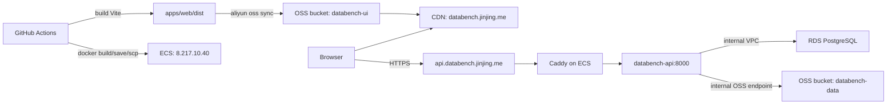

# Aliyun ECS Deployment

This is the production deployment plan for `databench-ts` on Alibaba Cloud.

## Target Architecture



## Current Cloud Resources

| Resource | Value |
| --- | --- |
| Region | China Hong Kong |
| Frontend bucket | `databench-ui` |
| Frontend CDN/domain | `databench.jinjing.me` |
| Backend host | ECS `i-j6cgxd69ntl25xp1wcgl`, `centurion-headscale` |
| Backend EIP | `8.217.10.40` |
| Backend private IP | `192.168.10.10` |
| Backend OS | Ubuntu 24.04 |
| VPC | `vpc-j6c3qfwjgg3ri3hn9nmbe` |
| Security group | `sg-j6ceza3ev99oyo109j2v` |
| RDS instance | `pgm-j6cgqlq44ku1k52n` |
| RDS internal host | `pgm-j6cgqlq44ku1k52n.pg.cnhk.rds.aliyuncs.com:5432` |
| RDS database/user | `databench` / `databench_app` |
| RDS whitelist | `192.168.0.0/16` |
| Data bucket | `databench-data` |
| Data bucket endpoint | `oss-cn-hongkong-internal.aliyuncs.com` via `OSS_INTERNAL=true` |

The old `/opt/liber-stack` Headscale stack can be abandoned. The deploy script
stops it before starting the new `databench` stack, so Caddy can bind ports 80
and 443.

## Runtime Environment

Create `/opt/databench/api.env` on ECS from `deploy/ecs/api.env.example`.

Required values:

```env
DATABASE_URL=postgresql://databench_app:<password>@pgm-j6cgqlq44ku1k52n.pg.cnhk.rds.aliyuncs.com:5432/databench?schema=public
OSS_REGION=oss-cn-hongkong
OSS_BUCKET=databench-data
OSS_ACCESS_KEY_ID=<databench-api-runtime access key id>
OSS_ACCESS_KEY_SECRET=<databench-api-runtime access key secret>
OSS_INTERNAL=true
DATABENCH_CORS_ORIGINS=https://databench.jinjing.me
DATABENCH_ROOT=/var/lib/databench
PORT=8000
```

If the database password contains `#`, encode it as `%23` inside
`DATABASE_URL`.

## RAM Permissions

Runtime API user: `databench-api-runtime`.

Custom policy: `DatabenchApiRuntimeOssPolicy`.

```json
{
  "Version": "1",
  "Statement": [
    {
      "Effect": "Allow",
      "Action": ["oss:GetBucketInfo"],
      "Resource": ["acs:oss:*:*:databench-data"]
    },
    {
      "Effect": "Allow",
      "Action": ["oss:GetObject", "oss:PutObject"],
      "Resource": ["acs:oss:*:*:databench-data/*"]
    }
  ]
}
```

Frontend deploy user can be the existing `databench-ui-ci` RAM user. It needs:

```json
{
  "Version": "1",
  "Statement": [
    {
      "Effect": "Allow",
      "Action": ["oss:ListObjects"],
      "Resource": ["acs:oss:*:*:databench-ui"]
    },
    {
      "Effect": "Allow",
      "Action": ["oss:GetObject", "oss:PutObject", "oss:DeleteObject"],
      "Resource": ["acs:oss:*:*:databench-ui/*"]
    },
    {
      "Effect": "Allow",
      "Action": ["cdn:RefreshObjectCaches"],
      "Resource": ["acs:cdn:*:*:domain/databench.jinjing.me"]
    }
  ]
}
```

## GitHub Configuration

Backend deployment secrets:

| Secret | Value |
| --- | --- |
| `ECS_HOST` | `8.217.10.40` |
| `ECS_USER` | `root` |
| `ECS_SSH_KEY` | private key for the public key installed in `/root/.ssh/authorized_keys` |
| `ECS_KNOWN_HOSTS` | optional; if absent, the workflow uses `ssh-keyscan` |

Frontend deployment secrets:

| Secret | Value |
| --- | --- |
| `ALIYUN_ACCESS_KEY_ID` | AccessKey for `databench-ui-ci` |
| `ALIYUN_ACCESS_KEY_SECRET` | AccessKey secret for `databench-ui-ci` |

Optional repository variables:

| Variable | Default |
| --- | --- |
| `DATABENCH_API_BASE_URL` | `https://api.databench.jinjing.me` |
| `ALIYUN_REGION` | `cn-hongkong` |
| `WEB_OSS_ENDPOINT` | `oss-cn-hongkong.aliyuncs.com` |
| `WEB_OSS_BUCKET` | `databench-ui` |
| `CDN_DOMAIN` | `databench.jinjing.me` |

## DNS

Point `api.databench.jinjing.me` to ECS EIP `8.217.10.40`.

Keep `databench.jinjing.me` pointed at the existing CDN.

## Deploy Flow

Backend:

1. GitHub Actions builds `apps/api/Dockerfile`.
2. The image is saved as a `.tar.gz` archive.
3. The archive and `deploy/ecs/*` are copied to `/opt/databench`.
4. `/opt/databench/deploy.sh` stops `/opt/liber-stack`, loads the image, runs
   `prisma migrate deploy`, starts `databench-api` and `databench-caddy`, then
   checks `http://127.0.0.1:8000/health`.
5. The workflow runs `deploy/smoke.sh https://api.databench.jinjing.me`.

Frontend:

1. GitHub Actions builds `apps/web` with
   `VITE_DATABENCH_API_BASE_URL=https://api.databench.jinjing.me`.
2. `apps/web/dist` is mirrored to `oss://databench-ui/`.
3. `index.html` is marked `Cache-Control: no-cache`.
4. CDN cache is refreshed for `/` and `/index.html`.

## Manual First Deploy Checklist

On ECS:

```bash
mkdir -p /opt/databench/caddy /opt/databench/releases
cp /opt/databench/api.env.example /opt/databench/api.env
chmod 600 /opt/databench/api.env
```

Edit `/opt/databench/api.env` with the real RDS password and OSS AccessKey.

Then trigger the `Deploy Backend` workflow manually.

## Rollback

Images remain on ECS after each deploy. To rollback:

```bash
cd /opt/databench
printf 'DATABENCH_API_IMAGE=databench-api:<previous-sha>\n' > compose.env
docker compose --env-file compose.env -f docker-compose.yml up -d
```

If Caddy issued a certificate for the API domain, it is stored in the
`databench_caddy-data` Docker volume and is reused across restarts.
