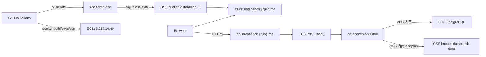

# 阿里云 ECS 部署手册

本文是 Databench 当前生产部署的中文运行手册，覆盖前端 OSS/CDN 发布、
后端 ECS 发布、GitHub Actions 配置、ECS 运行时文件、DNS、首发检查、
日常部署、回滚和排障。

英文版见：[aliyun-ecs.md](aliyun-ecs.md)。

## 总览

生产环境分成两个独立部署目标：

- 前端：`apps/web` 由 GitHub Actions 构建成静态文件，同步到阿里云 OSS
  bucket `databench-ui`，然后刷新 CDN 域名 `databench.jinjing.me`。
- 后端：`apps/api` 由 GitHub Actions 构建成 Docker 镜像，保存为
  `.tar.gz` 后通过 SSH 上传到 ECS，在服务器上加载镜像、执行 Prisma
  migration，并由 Caddy 对外提供 `https://api.databench.jinjing.me`。

当前没有使用 ACR 镜像仓库。后端镜像通过 `scp` 从 GitHub Actions 传到
ECS。



## 生产资源

| 资源 | 当前值 |
| --- | --- |
| 区域 | 中国香港 |
| 前端 bucket | `databench-ui` |
| 前端域名/CDN | `databench.jinjing.me` |
| 后端 API 域名 | `api.databench.jinjing.me` |
| 后端 ECS | `i-j6cgxd69ntl25xp1wcgl`, `centurion-headscale` |
| 后端 EIP | `8.217.10.40` |
| 后端内网 IP | `192.168.10.10` |
| 后端系统 | Ubuntu 24.04 |
| VPC | `vpc-j6c3qfwjgg3ri3hn9nmbe` |
| 安全组 | `sg-j6ceza3ev99oyo109j2v` |
| RDS 实例 | `pgm-j6cgqlq44ku1k52n` |
| RDS 内网地址 | `pgm-j6cgqlq44ku1k52n.pg.cnhk.rds.aliyuncs.com:5432` |
| RDS 数据库/用户 | `databench` / `databench_app` |
| RDS 白名单 | `192.168.0.0/16` |
| 数据 bucket | `databench-data` |
| 数据 bucket endpoint | 通过 `OSS_INTERNAL=true` 使用 `oss-cn-hongkong-internal.aliyuncs.com` |

ECS 安全组需要放行公网入方向 `80`、`443` 给 Caddy，放行 `22` 给 SSH
部署。API 容器本身只绑定到 ECS 本机 `127.0.0.1:8000`，所以不需要把
`8000` 暴露到公网。

旧的 `/opt/liber-stack` Python/Headscale 栈已经废弃。后端部署脚本会在新镜像
migration 成功后停止旧栈，避免旧 Caddy 占用 `80` 和 `443`。

## DNS 配置

前端域名：

```text
databench.jinjing.me
```

后端 API 域名需要指向 ECS EIP：

```text
Type: A
Name/Host: api.databench
Value: 8.217.10.40
TTL: 600 或服务商默认值
```

`jinjing.me` 当前权威 DNS 是 GoDaddy/DomainControl：

```text
ns13.domaincontrol.com
ns14.domaincontrol.com
```

因此 `api.databench.jinjing.me` 的 A 记录需要在 GoDaddy DNS 管理里添加，
不是在阿里云 DNS 控制台添加，除非后续把域名 NS 迁移到阿里云。

验证命令：

```bash
dig @ns13.domaincontrol.com api.databench.jinjing.me A +short
dig @ns14.domaincontrol.com api.databench.jinjing.me A +short
dig +short api.databench.jinjing.me A
```

期望都返回：

```text
8.217.10.40
```

Caddy 会自动申请 HTTPS 证书。如果 DNS 未配置或还未生效，Caddy 日志里会看到
类似 `NXDOMAIN looking up A for api.databench.jinjing.me` 的 ACME 错误，
GitHub Actions 后端 smoke test 也会因为无法解析域名失败。

## GitHub Actions 配置

仓库：

```text
joezhoujinjing/databench
```

后端部署使用的 GitHub Secrets：

| Secret | 用途 |
| --- | --- |
| `ECS_HOST` | ECS EIP，当前是 `8.217.10.40` |
| `ECS_USER` | SSH 用户，当前是 `root` |
| `ECS_SSH_KEY` | 能登录 ECS 的私钥，对应 ECS `/root/.ssh/authorized_keys` |
| `ECS_KNOWN_HOSTS` | 可选的 SSH known hosts；为空时 workflow 会用 `ssh-keyscan` |

前端部署使用的 GitHub Secrets：

| Secret | 用途 |
| --- | --- |
| `ALIYUN_ACCESS_KEY_ID` | 前端发布 RAM 用户的 AccessKey ID |
| `ALIYUN_ACCESS_KEY_SECRET` | 前端发布 RAM 用户的 AccessKey Secret |

Repository Variables：

| Variable | 当前/默认值 |
| --- | --- |
| `DATABENCH_API_BASE_URL` | `https://api.databench.jinjing.me` |
| `ALIYUN_REGION` | `cn-hongkong` |
| `WEB_OSS_ENDPOINT` | `oss-cn-hongkong.aliyuncs.com` |
| `WEB_OSS_BUCKET` | `databench-ui` |
| `CDN_DOMAIN` | `databench.jinjing.me` |

不要把后端运行时的 RDS 密码或 `databench-data` OSS 凭证放进 GitHub
Secrets。后端运行时凭证只放在 ECS 的 `/opt/databench/api.env`。

## RAM 权限拆分

生产里有两类 RAM 凭证，必须分开。

后端运行时用户：`databench-api-runtime`。

这个用户只给 ECS 上的 API 进程访问数据 bucket。它的 AccessKey 只应该写入
`/opt/databench/api.env`。

最小 OSS 权限：

```json
{
  "Version": "1",
  "Statement": [
    {
      "Effect": "Allow",
      "Action": ["oss:GetBucketInfo"],
      "Resource": ["acs:oss:*:*:databench-data"]
    },
    {
      "Effect": "Allow",
      "Action": ["oss:GetObject", "oss:PutObject"],
      "Resource": ["acs:oss:*:*:databench-data/*"]
    }
  ]
}
```

前端 CI 发布用户：`databench-ui-ci`。

这个用户只给 GitHub Actions 上传静态资源并刷新 CDN。它的 AccessKey 存在
GitHub Secrets。

最小前端发布权限：

```json
{
  "Version": "1",
  "Statement": [
    {
      "Effect": "Allow",
      "Action": ["oss:ListObjects"],
      "Resource": ["acs:oss:*:*:databench-ui"]
    },
    {
      "Effect": "Allow",
      "Action": ["oss:GetObject", "oss:PutObject", "oss:DeleteObject"],
      "Resource": ["acs:oss:*:*:databench-ui/*"]
    },
    {
      "Effect": "Allow",
      "Action": ["cdn:RefreshObjectCaches"],
      "Resource": ["acs:cdn:*:*:domain/databench.jinjing.me"]
    }
  ]
}
```

原则：

- 后端运行时 key 不需要 CDN 权限，也不需要前端 bucket 权限。
- 前端 CI key 不需要数据 bucket 权限，也不需要 RDS 权限。
- AccessKey Secret 只在创建时可见，没保存就新建 key，验证后禁用旧 key。

## ECS 运行时文件

后端部署目录：

```text
/opt/databench
```

关键文件：

| 路径 | 用途 |
| --- | --- |
| `/opt/databench/api.env` | 后端真实运行时环境变量，不提交到 Git，权限 `600` |
| `/opt/databench/api.env.example` | 从 `deploy/ecs/api.env.example` 复制过去的模板 |
| `/opt/databench/docker-compose.yml` | 从 `deploy/ecs/docker-compose.yml` 复制过去 |
| `/opt/databench/deploy.sh` | 从 `deploy/ecs/deploy.sh` 复制过去 |
| `/opt/databench/caddy/Caddyfile` | Caddy 反向代理配置 |
| `/opt/databench/compose.env` | `deploy.sh` 写入当前镜像 tag |
| `/opt/databench/releases/*.tar.gz` | GitHub Actions 上传的后端镜像压缩包 |

`/opt/databench/api.env` 至少需要这些变量：

```env
DATABASE_URL=postgresql://databench_app:<url-encoded-password>@pgm-j6cgqlq44ku1k52n.pg.cnhk.rds.aliyuncs.com:5432/databench?schema=public
DATABENCH_OBJECT_STORE=oss
OSS_REGION=oss-cn-hongkong
OSS_BUCKET=databench-data
OSS_ACCESS_KEY_ID=<databench-api-runtime access key id>
OSS_ACCESS_KEY_SECRET=<databench-api-runtime access key secret>
OSS_INTERNAL=true
DATABENCH_CORS_ORIGINS=https://databench.jinjing.me
DATABENCH_ROOT=/var/lib/databench
PORT=8000
```

如果数据库密码里有 URL 保留字符，需要在 `DATABASE_URL` 里编码。例如 `#`
要写成 `%23`。

部署脚本会在加载镜像或启动服务前校验这些变量。如果变量为空，或还保留
`REPLACE_ME` 之类占位值，部署会直接失败。

`deploy/ecs/docker-compose.yml` 也会给 API 服务显式注入
`DATABENCH_OBJECT_STORE=oss`。这样即使本地开发可以用
`DATABENCH_OBJECT_STORE=s3` 连接 MinIO，生产 ECS 仍然固定走 Aliyun OSS。

## 后端镜像和部署流程

后端镜像由 `apps/api/Dockerfile` 构建。

关键点：

- 基础镜像是 `node:22-bookworm-slim`。
- 通过 Corepack 启用 `pnpm@11.7.0`。
- Docker build 会复制 `prisma.config.ts`、`prisma/`、`apps/`、`packages/`
  和 `tooling/`。
- 构建阶段执行 `pnpm install --frozen-lockfile` 和
  `pnpm --filter @databench/api... build`。
- 运行时执行 `node apps/api/dist/index.js`。
- `prisma.config.ts` 必须进入镜像，因为 Prisma 7 在
  `prisma migrate deploy` 时会读取这个配置里的 datasource。

后端 workflow：

```text
.github/workflows/deploy-backend.yml
```

自动触发条件：

- push 到 `main`
- 且改动路径命中后端、共享 package、Prisma、部署脚本或 workflow 文件

主要命中路径：

```text
apps/api/**
packages/**
prisma/**
deploy/ecs/**
deploy/smoke.sh
package.json
pnpm-lock.yaml
pnpm-workspace.yaml
turbo.json
tsconfig.base.json
.github/workflows/deploy-backend.yml
```

也可以手动触发：

```bash
gh workflow run "Deploy Backend" --repo joezhoujinjing/databench --ref main
```

GitHub Actions 执行步骤：

1. checkout 代码。
2. 构建 `apps/api/Dockerfile`，镜像名是 `databench-api:${GITHUB_SHA}`。
3. 把镜像保存为 `databench-api-${GITHUB_SHA}.tar.gz`。
4. 用 GitHub Secrets 配置 SSH。
5. 在 ECS 上创建 `/opt/databench/releases` 和 `/opt/databench/caddy`。
6. 上传镜像压缩包、Compose 文件、部署脚本和 Caddyfile。
7. 在 ECS 上执行：

   ```bash
   /opt/databench/deploy.sh /opt/databench/releases/databench-api-${GITHUB_SHA}.tar.gz ${GITHUB_SHA}
   ```

8. 对公网域名执行 smoke test：

   ```bash
   deploy/smoke.sh https://api.databench.jinjing.me
   ```

ECS 上的 `deploy/ecs/deploy.sh` 会做这些事：

1. 校验参数和 `/opt/databench/api.env`。
2. `docker load` 加载镜像压缩包。
3. 写入 `/opt/databench/compose.env`：

   ```env
   DATABENCH_API_IMAGE=databench-api:<git-sha>
   ```

4. 先执行数据库 migration：

   ```bash
   docker compose --env-file /opt/databench/compose.env \
     -f /opt/databench/docker-compose.yml \
     run --rm api node_modules/.bin/prisma migrate deploy
   ```

5. migration 成功后，如果 `/opt/liber-stack/docker-compose.yaml` 存在，则停止旧栈。
6. 启动 `databench-api` 和 `databench-caddy`。
7. 在 ECS 本机等待 `http://127.0.0.1:8000/health` 返回成功。

注意：migration 是在停止旧栈前执行的。这样如果新镜像或 migration 已经失败，
不会先把旧服务停掉。

## 后端运行形态

Compose project name 是 `databench`。

服务：

- `databench-api`
  - 镜像：`databench-api:<git-sha>`
  - 环境变量文件：`/opt/databench/api.env`
  - 绑定 ECS 本机 `127.0.0.1:8000` 到容器 `8000`
  - Docker volume `databench_workspace-data` 挂载到 `/var/lib/databench`
  - healthcheck 请求 `http://127.0.0.1:8000/health`
- `databench-caddy`
  - 镜像：`caddy:2-alpine`
  - 对外绑定 `80` 和 `443`
  - 读取 `/opt/databench/caddy/Caddyfile`
  - 把 `api.databench.jinjing.me` 反代到 `api:8000`
  - ACME 证书数据保存在 Docker volume `databench_caddy-data`

常用 ECS 检查：

```bash
ssh -i ~/.ssh/databench_ecs_deploy root@8.217.10.40

cd /opt/databench
docker compose --env-file compose.env -f docker-compose.yml ps
docker compose --env-file compose.env -f docker-compose.yml logs --tail=200 api
docker compose --env-file compose.env -f docker-compose.yml logs --tail=200 caddy
curl -fsS http://127.0.0.1:8000/health
curl -fsS http://127.0.0.1:8000/version
curl -fsS http://127.0.0.1:8000/capabilities
```

公网检查：

```bash
curl -fsS https://api.databench.jinjing.me/health
curl -fsS https://api.databench.jinjing.me/version
curl -fsS https://api.databench.jinjing.me/capabilities
```

## 前端构建和部署流程

前端 workflow：

```text
.github/workflows/deploy-frontend.yml
```

自动触发条件：

- push 到 `main`
- 且改动路径命中前端、部分 API 契约/schema、共享构建配置或 workflow 文件

主要命中路径：

```text
apps/web/**
apps/api/src/openapi.ts
apps/api/src/routes/**
packages/schema/**
package.json
pnpm-lock.yaml
pnpm-workspace.yaml
turbo.json
tsconfig.base.json
.github/workflows/deploy-frontend.yml
```

也可以手动触发：

```bash
gh workflow run "Deploy Frontend" --repo joezhoujinjing/databench --ref main
```

GitHub Actions 执行步骤：

1. checkout 代码。
2. 用 `.nvmrc` 指定的 Node 版本安装环境。
3. 执行 `pnpm install --frozen-lockfile`。
4. 构建前端：

   ```bash
   VITE_DATABENCH_API_BASE_URL=https://api.databench.jinjing.me
   pnpm --filter @databench/web build
   ```

5. 安装 Aliyun CLI。
6. 用 `ALIYUN_ACCESS_KEY_ID` 和 `ALIYUN_ACCESS_KEY_SECRET` 配置 Aliyun CLI
   profile `ci`。
7. 用 `aliyun oss sync --delete` 把 `apps/web/dist/` 同步到
   `oss://databench-ui/`。
8. 给 `oss://databench-ui/index.html` 设置 `Cache-Control:no-cache`。
9. 刷新 CDN：

   ```text
   https://databench.jinjing.me/
   https://databench.jinjing.me/index.html
   ```

验证：

```bash
curl -I https://databench.jinjing.me
curl -fsS https://databench.jinjing.me | sed -n '1,40p'
```

前端 workflow 不会等待后端 workflow。如果前端先发布，而
`api.databench.jinjing.me` 还没解析或 Caddy 证书还没签发，页面可以打开，
但 API 请求会失败。

## 哪些改动会部署什么

当前不是每次合并 `main` 都前后端全量部署，而是按路径触发。

| 改动类型 | 触发后端 | 触发前端 |
| --- | --- | --- |
| `apps/web/**` | 否 | 是 |
| `apps/api/**` 普通后端逻辑 | 是 | 通常否 |
| `apps/api/src/routes/**` | 是 | 是 |
| `apps/api/src/openapi.ts` | 否 | 是 |
| `packages/**` | 是 | 只有 `packages/schema/**` 会触发前端 |
| `prisma/**` | 是 | 否 |
| `deploy/ecs/**` | 是 | 否 |
| `deploy/smoke.sh` | 是 | 否 |
| `package.json` / `pnpm-lock.yaml` / `turbo.json` / `tsconfig.base.json` | 是 | 是 |
| 文档改动 | 否 | 否 |

合并 PR 前仍然应该看 GitHub Actions 的实际 workflow 列表，因为路径规则变更
本身也会改变触发行为。

## 首发部署检查清单

首发或新环境部署前：

1. 确认 ECS SSH 可用：

   ```bash
   ssh -i ~/.ssh/databench_ecs_deploy root@8.217.10.40
   ```

2. 确认 ECS 上 Docker 和 Compose 可用：

   ```bash
   docker --version
   docker compose version
   ```

3. 创建 ECS 运行目录：

   ```bash
   mkdir -p /opt/databench/caddy /opt/databench/releases
   cp /opt/databench/api.env.example /opt/databench/api.env
   chmod 600 /opt/databench/api.env
   ```

4. 填写 `/opt/databench/api.env` 中真实的 RDS 和 OSS 运行时凭证。
5. 从 ECS 验证能连通 RDS 和 OSS 内网 endpoint：

   ```bash
   timeout 5 bash -c '</dev/tcp/pgm-j6cgqlq44ku1k52n.pg.cnhk.rds.aliyuncs.com/5432'
   timeout 5 bash -c '</dev/tcp/oss-cn-hongkong-internal.aliyuncs.com/443'
   ```

6. 从 ECS 验证 RDS 凭证。`psql` 不接受 Prisma 的 `?schema=public` query，
   所以手动检查时要去掉：

   ```bash
   docker run --rm --env-file /opt/databench/api.env postgres:17-alpine \
     sh -lc 'psql "${DATABASE_URL%%\?*}" -v ON_ERROR_STOP=1 -c "select current_database(), current_user;"'
   ```

7. 确认 GitHub Secrets 和 Variables 都已配置。
8. 在 GoDaddy 添加 `api.databench.jinjing.me -> 8.217.10.40`。
9. 合并或推送部署代码到 `main`。
10. 观察 GitHub Actions、ECS container 状态和 Caddy/API 日志。

## 日常部署

后端：

1. 合并命中后端路径的 PR 到 `main`，或手动运行 `Deploy Backend`。
2. 观察 workflow。
3. 成功后验证：

   ```bash
   curl -fsS https://api.databench.jinjing.me/health
   curl -fsS https://api.databench.jinjing.me/version
   curl -fsS https://api.databench.jinjing.me/capabilities
   ```

前端：

1. 合并命中前端路径的 PR 到 `main`，或手动运行 `Deploy Frontend`。
2. 观察 workflow。
3. 打开 `https://databench.jinjing.me` 验证页面。

常用 GitHub CLI：

```bash
gh workflow run "Deploy Backend" --repo joezhoujinjing/databench --ref main
gh workflow run "Deploy Frontend" --repo joezhoujinjing/databench --ref main
gh run list --repo joezhoujinjing/databench --limit 10
gh run watch <run-id> --repo joezhoujinjing/databench --exit-status
```

## Smoke Test

`deploy/smoke.sh` 会检查：

- `/health`
- `/version`
- `/capabilities`

后端 workflow 会对公网域名执行：

```bash
deploy/smoke.sh https://api.databench.jinjing.me
```

如果 smoke test 因 DNS 失败，但 ECS 本机 health 正常，优先修 DNS。如果是 TLS
失败，检查 GoDaddy A 记录、Caddy ACME 日志和安全组 `80`/`443`。如果是 `5xx`，
检查 API 日志。

## 回滚

后端镜像 tar 包和已加载镜像会留在 ECS 上。回滚到旧镜像 tag：

```bash
ssh -i ~/.ssh/databench_ecs_deploy root@8.217.10.40
cd /opt/databench
printf 'DATABENCH_API_IMAGE=databench-api:<previous-sha>\n' > compose.env
docker compose --env-file compose.env -f docker-compose.yml up -d
docker compose --env-file compose.env -f docker-compose.yml ps
curl -fsS http://127.0.0.1:8000/health
```

这个回滚只回滚应用镜像，不回滚数据库 migration。如果 migration 不向后兼容，
需要先准备数据库回滚或 forward fix。

Caddy 证书数据保存在 `databench_caddy-data` volume 中，容器重启不会丢。

## 常见问题

### 后端 workflow 在 `Deploy on ECS` 失败

先看 GitHub job 日志：

```bash
gh run view <run-id> --repo joezhoujinjing/databench --job <job-id> --log
```

再到 ECS 看容器：

```bash
ssh -i ~/.ssh/databench_ecs_deploy root@8.217.10.40
cd /opt/databench
docker compose --env-file compose.env -f docker-compose.yml ps -a
docker compose --env-file compose.env -f docker-compose.yml logs --tail=200 api
docker compose --env-file compose.env -f docker-compose.yml logs --tail=200 caddy
```

首发时遇到过的已知问题：如果 Prisma 报
`The datasource.url property is required in your Prisma config file`，说明镜像里
缺少 `prisma.config.ts`。`apps/api/Dockerfile` 必须把该文件复制进镜像。

### 后端 workflow 只在 `Smoke test` 失败

ECS 上的新服务可能已经正常运行。先检查：

```bash
curl -fsS http://127.0.0.1:8000/health
dig +short api.databench.jinjing.me A
```

如果域名是 `NXDOMAIN`，去 GoDaddy 修 DNS。如果 DNS 指向 ECS 但 HTTPS 失败，
看 Caddy 日志。Caddy 只有在公网 DNS 指向 ECS EIP 且 `80` 或 `443` 可达时，
才能成功签发证书。

### `psql` 不接受 `DATABASE_URL`

Prisma 可以使用 `?schema=public`，但 `psql` 不接受这个 query。手动检查时：

```bash
psql "${DATABASE_URL%%\?*}"
```

### Caddy HTTP 可访问但 HTTPS 失败

通常是 Caddy 正在运行，但证书还没签发成功。检查 DNS 和 Caddy 日志：

```bash
docker compose --env-file compose.env -f docker-compose.yml logs --tail=200 caddy
```

### 前端部署成功，但页面请求 API 失败

检查：

- 前端构建时 `VITE_DATABENCH_API_BASE_URL` 是否是
  `https://api.databench.jinjing.me`。
- `api.databench.jinjing.me` 是否解析到 `8.217.10.40`。
- 后端三个 smoke endpoint 是否能通过 HTTPS 访问。
- `/opt/databench/api.env` 里的 `DATABENCH_CORS_ORIGINS` 是否包含
  `https://databench.jinjing.me`。

### 凭证处理

不要提交、打印或贴出真实 secret。RAM AccessKey Secret 如果创建时没有保存，
就创建新的 AccessKey，部署验证通过后禁用旧 key。
