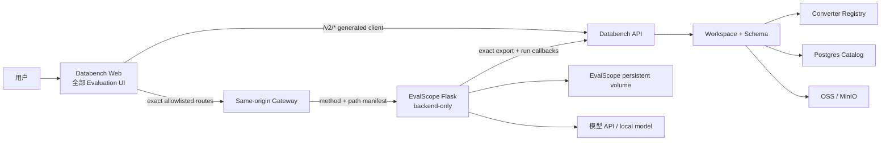
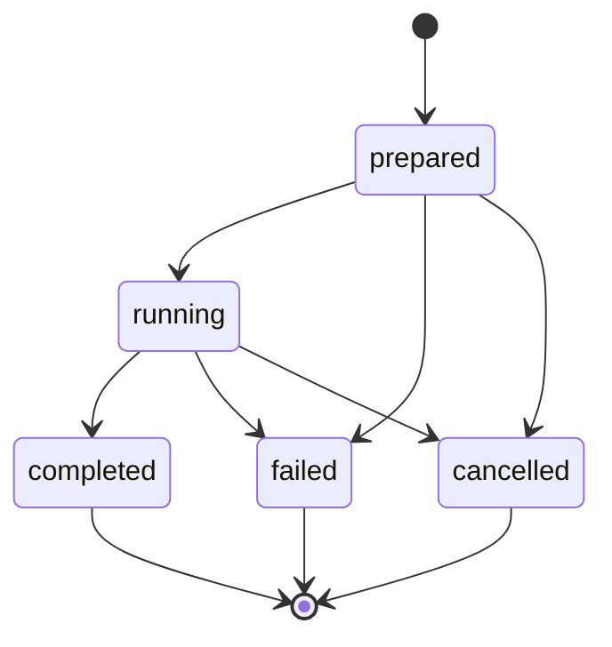
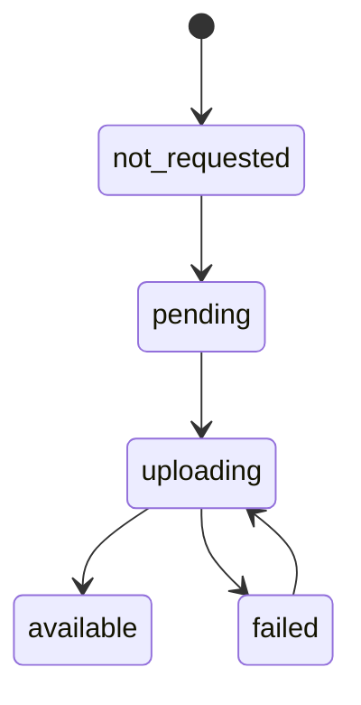

# EvalScope 功能等价 UI 迁移技术方案

- **状态:** Accepted——owner 于 2026-07-27 确认原方案并要求开始实施；2026-07-30 接受 §19 的
  单 Benchmark、原生 Metric 选择与显式主指标扩展
- **日期:** 2026-07-27
- **Databench 代码基线:** `databench-ts@25130a2ecba8075435b4c1aa20f3f6438193ef23`
- **EvalScope 代码基线:** `modelscope/evalscope@b2a62f05fd81e89ec2cf4f83b9a79ce0a5535d60`
- **规范依赖:** [ADR 0017](../decisions/0017-evalscope-native-ui-integration.md)
- **实施计划:** [PLAN.md](PLAN.md)

## 1. 目标与验收定义

目标不是在 Databench 中用 iframe 放入 EvalScope SPA，也不是重新凭印象设计一套测评页面，而是：

1. 把锁定 EvalScope React 基线的全部业务 UI 功能迁入 Databench Web；
2. 使用 Databench 的品牌、Shell、路由、视觉 token、组件和国际化；
3. 用户只访问 Databench，但仍能使用 EvalScope 的评测、压测、报告、逐样本、比较和 Benchmark 能力；
4. Databench Dataset exact version 成为 Evaluation task form 的第一类数据源；
5. EvalScope Python service 继续负责执行、指标、Judge 和报告 API，不迁成 TypeScript；
6. Databench 保存 Dataset/run 关系和有界摘要，完整结果归档到 object store。
7. Evaluation 启动前可查看全部原生 Metric、选择当前可用项，并在所有结果页面使用同一显式主指标。

“功能等价”按锁定基线逐项验收，至少同时满足：

- 页面和子页面存在；
- 所有可操作字段、筛选、排序、分页、选择、比较、启动、停止和跳转行为存在；
- success、empty、loading、validation、network、4xx、5xx 和 unavailable 状态存在；
- 报告中的 Markdown、代码、数学公式、媒体、tool call 和 agent trace 能正确显示；
- desktop、narrow viewport、keyboard、focus 和 screen-reader 关键路径不倒退；
- 对同一组 pinned API fixtures，迁移页与 upstream 页得到等价的 domain view model 和用户操作结果。

功能等价不等于像素等价。EvalScope Logo、独立顶栏、GitHub 链接、独立主题切换、独立语言切换和任意
服务器路径输入不作为业务功能复制；它们分别由 Databench 品牌壳、全局语言、全局主题和 operator
配置替代。PathBar 的用户目的并未删除：Dashboard、Reports 和 Performance 仍提供可见的
Refresh/Rescan 及原有 reset 语义。除此以外，不能以“Databench 风格”为由删除 capability manifest
中的上游业务能力。

首期 Dataset projection 仍只支持：

```text
Databench evalscope-general-qa@1.0.0
  → EvalScope general_qa
  → text-only prompt
  → selected candidate / verification ground truth
```

“首期 projection 只支持 general_qa”不限制 EvalScope 内置 Benchmark 和 performance UI；这些原生能力
必须与锁定基线保持完整可用。

`none` 仍是 converter 的已发布确定性输出 profile，供历史 artifact 兼容；在 Judge 指标实现前，它不是
可提交的 Evaluation target。Web 不提供该选项，provider admission 也拒绝手工构造的 `none` 任务。

## 2. 已验证的 EvalScope 基线事实

### 2.1 当前实现不是 Gradio

锁定基线的用户界面是：

```text
evalscope/web
├── React 19.2
├── Vite 8
├── Tailwind 4
├── React Router 7
├── Zod 4
├── Lucide
└── typed Fetch client
```

规模证据：

```text
TypeScript/TSX     21,096 lines
test files         34
global index.css   544 lines
```

v1.6.1 的 `evalscope app` 使用 Gradio 5.4 并默认监听 `7860`，主要展示评测报告；它不属于本方案的
迁移来源。锁定基线已经用 React + Vite 替换 Gradio，`evalscope app` 只是已弃用的
`evalscope service` alias，默认监听 `9000`。

### 2.2 前后端可以分离

`evalscope.service.app.create_app()` 先注册：

```text
/api/v1/eval/*
/api/v1/perf/*
/api/v1/reports/*
/api/v1/config
/health
```

只有发现 `evalscope/web/dist` 时才注册 SPA static catch-all。因此 production 可以保留 Flask API 并关闭
用户可见的 upstream SPA。

### 2.3 执行和持久化限制

- `/api/v1/eval/invoke` 和 `/api/v1/perf/invoke` 是 blocking HTTP request；
- UI 在 invoke request 等待期间每 5 秒轮询 progress 和 log；
- 活动子进程 registry 是单个 Python 进程内的 `task_id → Process` map；
- progress、logs、reports、predictions 和 reviews 落在 `EVALSCOPE_OUTPUT_DIR/<task_id>/`；
- upstream TaskRunner 的 running/log/result 是 React component state，刷新不会恢复 invoke request；
- evaluation 没有统一任务数据库；perf 的 SQLite 只服务压测结果；
- report catalogue 按配置的 output root 扫描文件目录；
- media endpoint 在基线中接受绝对路径且只校验扩展名/文件存在，production patch 必须增加 allowed-root
  realpath containment；
- service 默认没有可依赖的应用认证，不能直接暴露公网。

### 2.4 技术栈兼容与必须替换的边界

可迁移：页面、业务组件、domain model、formatting、report parser、Zod response schemas、API functions、
fixtures、绝大多数测试和国际化文案。

必须替换：

```text
BrowserRouter               → Databench TanStack Router
MainLayout / TopNav         → Databench RootLayout + EvaluationSubNav
ThemeContext                → Databench global theme/tokens
LocaleContext               → react-i18next evaluations namespace
root CSS variables          → .evaluation-surface scoped --es-* tokens
root_path PathBar           → operator-configured output root
hard-coded /api/v1          → configurable same-origin EvalScope API base
upstream UI primitives      → Databench primitives or themed domain primitives
```

## 3. 功能等价清单

实施前必须同时固化：

1. `upstream-manifest.json`：逐文件记录来源、digest、迁移状态和许可证；
2. `ui-capability-manifest.json`：逐能力记录 route、upstream component、field/action/state、default、
   responsive/a11y behavior、API、Databench target、classification、test 和 browser evidence。

文件级 `migrated/adapted` 不能证明文件内部 capability 完整。每个 upstream capability 必须且只能映射到
`upstream-parity`、`security-replacement` 或 `brand-shell-exclusion`；新增能力使用
`databench-extension`，不进入上游覆盖率分母。任何一项只有在代码、测试和真实浏览器 evidence 同时存在
时才算完成。

| Databench route | Upstream route | 必须保留的能力 |
|---|---|---|
| `/evaluations` | `/dashboard` | 总览、KPI、最近报告、模型/数据集摘要、进入任务/报告/性能 |
| `/evaluations/tasks` | `/tasks` | Evaluation/Performance tabs、URL tab 状态、两类任务完整表单、monitor |
| `/evaluations/reports` | `/reports` | 搜索、模型/数据集/分数筛选、排序、分页、card/table、compare selection |
| `/evaluations/reports/$reportId` | `/reports/:reportId` | header、summary、Overview、Details、Predictions、dataset/subset navigation |
| `/evaluations/compare` | `/compare` | 多报告选择、KPI、数据集交集/差异、radar/table、逐项并排比较 |
| `/evaluations/performance` | `/performance` | 压测报告列表、筛选、历史 run、进入详情和比较 |
| `/evaluations/performance/$runId` | `/perf-report` | run metadata、指标、charts、请求分页、success/failed 筛选、HTML report |
| `/evaluations/performance/compare` | `/perf-compare` | 多 run 选择、workload normalization、metric charts、比较结果 |
| `/evaluations/benchmarks` | `/benchmarks` | all/text/multimodal/agent/aigc catalogue 与计数、搜索、tag 筛选、分页、详情 Markdown/metadata、Paper 链接 |
| `/evaluations/viewer` | `/viewer` | 经安全转换的 HTML report viewer、错误/加载和安全“在新标签页打开”；原始 active HTML 不顶层打开 |

### 3.1 Evaluation task 表单

内置 Benchmark 模式必须保留：

```text
model
datasets autocomplete
metric mode: benchmark default / explicit selection
metrics multi-select + availability reason
primary metric
api_url
api_key
limit
eval_batch_size
repeats
timeout
stream
generation_config.temperature
generation_config.top_p
generation_config.max_tokens
generation_config.top_k
dataset_args JSON
validation + first-invalid focus + advanced section expansion
```

锁定基线的 autocomplete 只从 text + multimodal 列表产生建议；ArrowUp/ArrowDown/Enter/Escape、active
option、最多 8 个建议和 outside-click close 仍属于 `upstream-parity`。2026-07-30 的产品决策将逗号多值
改为单值：Web 只允许一个 Benchmark，wire 仍发送 `datasets: [benchmark]`，Provider 对数组长度严格校验
为 1。该变化在 E10 capability manifest 中标记为 owner-approved product replacement，不得继续保留一个
前端多选、后端单选的分裂契约。若以后把 agent/aigc 加入建议列表，应标记为
`databench-extension`，不得静默改变 pinned parity fixture。

Metric 区域依赖已选 Benchmark：

- 默认是“使用 Benchmark 默认指标”，不改写 upstream 默认行为；
- 切换为显式模式后，展示锁定 commit 的全部原生 Metric；不可用项保留展示并说明
  incompatible、dependency missing 或 asset missing；
- 至少选择一个、最多 16 个；选择一个时自动成为主指标，选择多个时必须显式选择主指标；
- 用户选择的是 canonical Metric，不选择或编辑 Python callable；参数只按 Descriptor 的 typed schema
  显示；
- Benchmark、Metric mode、Metric 列表、参数或主指标变化后，旧的 compatibility result 必须失效并重新
  查询，提交按钮在新结果返回前保持禁用；
- 当前 Benchmark 不在 Descriptor coverage 内时只能使用 Benchmark 默认模式，不能猜测兼容关系。

`dataset_args` 继续是任意 JSON object 编辑器，保留 raw input、JSON-object validation、first-invalid focus
和 payload shape；但 server-side admission 增加明确的 `security-replacement`：

- 递归拒绝 key 为 `path|dir|url|uri`，或以 `_path|_dir|_url|_uri` 结尾；
- 递归拒绝 absolute POSIX path、Windows drive/UNC path、`..` traversal、`file:` 和任意 URI-scheme-like
  string value；
- 不接受 browser 通过 alias/case/kebab key 绕过，key 先做 Unicode/大小写/`-`→`_` 规范化；
- 返回稳定 `dataset_args_locator_forbidden` field error，UI 保留并重新聚焦原始 JSON；
- 需要本地文件或远程数据源的 Benchmark 只能使用 operator 配置的 typed adapter，不能恢复自由 locator。

新增 Databench Dataset 模式：

```text
source kind
Ref search/selection
exact Dataset version readonly binding
task type
target source
inspect eligibility summary
fidelity change review/acceptance
```

### 3.2 Performance task 表单

必须保留：

```text
model
api type: openai / dashscope / local
url
api_key
parallel list
number list
rate
max_tokens
min_tokens
dataset
max_prompt_length
min_prompt_length
validation + first-invalid focus
```

### 3.3 Task monitor

Evaluation 和 Performance 都必须保留：

- 启动、运行中、完成、失败、停止状态；
- 进度显示；
- 增量日志；
- stop；
- report 入口；
- 后端 unavailable 和 polling error 的可恢复状态；
- 重复提交保护和 AbortSignal cleanup。

### 3.4 报告和逐样本能力

必须保留：

- Overview、Details、Predictions tabs；
- dataset/subset 选择；
- 指标原生 scale/format，不假设所有 score 都是 0..1；
- prediction 分页/虚拟列表；
- system/user/assistant/reasoning/tool 消息；
- function/tool call name、arguments、response；
- agent trace step、action、observation 和 final output；
- Markdown、GFM、KaTeX、syntax highlight、copy；
- image lightbox、audio、video；
- JSON fallback 和未知字段容错；
- compare selection 跨报告页与比较页保持；
- 空结果、部分数据、schema mismatch 和 media failure 状态。

下面的交互不是“实现时参考”，而是 capability manifest 和 GE6/GE7 的规范输入。

#### 3.4.1 Dashboard 与 Reports catalogue

Dashboard 必须保留：

- evaluation 总数、performance 总数、去重模型数、最近运行时间四个 KPI；原本可点击 KPI 的导航行为；
- evaluation + performance 合并、按时间排序且不预截断的 recent feed；
- All/Evaluation/Performance 类型筛选、模型/数据集/provider/protocol 搜索、分页和行详情跳转；
- eval/perf 部分加载失败仍显示成功一侧的 partial-data 状态；loading skeleton、welcome、no-data、no-match。

Reports catalogue 必须保留：

- 300ms debounced search；model/dataset multi-select；score min/max；time/score/model/dataset 排序和
  asc/desc；active filter chips、逐项移除和 clear；每页 20 条；
- desktop table 与 narrow card 是响应式呈现，不新增一个上游不存在的 view toggle；
- 当前页 select-all、跨 filter/sort 保留 selection、最多 5 个 selection 和 cap notice；一个 selection 才能
  View HTML，至少两个才能 Compare，Compare 页面最多消费锁定基线的前三个；
- configured-root 的可见 Refresh/Rescan 动作；刷新同时取消旧请求、清 cache，并重置 pagination、filters
  和 compare selection；不恢复 path 输入；
- retry、clear-filters、create-task/browse-benchmark empty-state actions。

#### 3.4.2 Report detail、Predictions 与 Single Sample

Overview 必须保留：

- avg/best/worst dataset、total samples summary；sortable dataset/score/sample table；点击 dataset 进入
  Details；
- 只有至少 3 个 dataset、metric 同类且 bounded 时才显示 table/radar 切换；heterogeneous/unbounded
  metric 不得生成误导 radar；
- 可折叠 Task Config JSON，未知字段保留 JSON fallback。

Details 必须保留：

- overall score、analysis Markdown、sortable subset/metric/score/num table、PerfMetricsPanel；
- 点击 subset 自动切换 Predictions 并预选该 subset。

Predictions/Single Sample 必须保留：

- subset selector、score threshold、All/Above/Below 三态及各自 count；threshold 只是 view filter，不改写
  pass/fail 语义；
- previous/next、sample X/Y 和原始 Index；按 sample index 跳转；按 message ID 前缀搜索、定位和高亮；
  invalid index/message ID 的可访问错误状态；
- legacy Input/Generated fallback、structured Messages 和 traced timeline 三种 presentation；
- system/user/assistant/tool/reasoning、Generated 与 Pred 差异、Expected/Extracted answer、normalized/raw
  score、Score JSON 和 Metadata collapsible；
- message ID/content copy、message perf chips、reasoning collapse/token count、tool arguments/result/error/latency；
- agent step、cross-step tool result linkage、env execution、nudge、loop error、stop reason、residual tool message；
- long message/trace virtualization、image lightbox、audio/video、unknown content JSON fallback。

#### 3.4.3 Evaluation Compare

- 由 URL 恢复并硬限制最多 3 个 model slot；至少保留 2 个；支持按 report name 添加、移除和取消添加；
- Score/Prediction tabs；score table 的 average row、dataset rows、radar 和 chart fallback；
- selected runs 的共同 dataset/subset 交集；没有交集时显示 incompatibility reason 且不破坏 selection；
- threshold、每模型 Any/Above/Below filter、All Any/All Above/All Below presets 和每模型 above rate；
- 对齐后的 sample pagination、previous/next、Left/Right keyboard navigation、showing X of Y；
- 每模型并排 ChatView、score/delta display 和单列异常不隐藏其他模型。

#### 3.4.4 Performance pages

Performance catalogue 必须保留：

- 搜索 model/dataset/api type/provider/protocol；按 time/RPS/latency 排序；provider 和 protocol 分别展示；
- selection/cap notice/clear；一个且 `has_html` 时 View HTML，两个以上 Compare，最多把前三个带入 compare；
- refresh/retry/no-data/no-match 和 schema-invalid refresh 时保留既有可见数据。

Performance detail 必须保留：

- provider resolution 的 metadata → known-host → Custom fallback，并把 Provider/Protocol 分成两个字段；
- Overview/Charts/Runs tabs；single-run 隐藏 Charts、默认进入 Runs，并使用 run summary/config 专用文案；
- basic KPI、summary table、best/run config、recommendations；unlimited rate 显示 closed-loop 而非 `INF`；
- embedding/rerank 隐藏 TTFT/TPOT/token percentile，不适用的 chart 不能占位冒充；
- per-run selector、concurrency/request-count/rate workload、percentile table/charts；
- request All/Success/Failed filter、总数、每页 50 条、分页、request charts/table、无 DB/无 percentile 状态。

Performance Compare 必须保留：

- 默认 oldest baseline + newest candidate；swap baseline 写入 URL 并在重载后保持；
- baseline/candidate/sample counts、absolute delta、percent delta、direction-aware
  improvement/regression/neutral/incomputable verdict；
- `<30` critical、`30..99` warning、`>=100` normal 的 low-sample 提示和 percentile de-emphasis；
- workload mismatch、missing perf data、sparse compare、symmetric config diff；即使部分 metric 不可计算，
  其他 metric 和 chart 仍显示；
- embedding/rerank 条件 chart、latency/throughput chart group 和 fallback table。

#### 3.4.5 Benchmark catalogue 与 Databench 扩展

上游 parity 只包括：all/text/multimodal/agent/aigc tabs + counts、300ms search、tag multi-filter、active
filter chips/clear、每页 24 个 responsive cards、category badge、samples/subsets/few-shot/tags/metrics、详情
modal、中英文完整 Markdown、Paper link、loading/no-result。

Benchmark detail → task preselection 不是锁定上游页面的功能，分类为 `databench-extension`。它可以覆盖五类
Benchmark，但必须有独立 route/payload/browser tests，不能提高 upstream parity coverage。Dataset detail →
Databench Dataset evaluation 同样属于 extension。

## 4. 总体架构



### 4.1 所有权

| 能力 | Owner |
|---|---|
| Databench Shell、主/次导航、路由、视觉、国际化 | Databench Web |
| Evaluation 页面和交互代码 | Databench Web，来源受 upstream manifest 追踪 |
| EvalScope API external adapter | Databench Web |
| canonical Dataset、identity、exact version | Databench |
| Dataset list/resolve/inspect/export | Databench Workspace + Schema |
| 模型配置语义、调用、指标、Judge | EvalScope |
| 评测/压测进程、progress、log、stop | EvalScope |
| report/prediction/perf 数据 API | EvalScope |
| Databench Dataset 与 evaluation run 关系 | Databench Postgres |
| 有界指标摘要 | Databench Postgres |
| 完整结果归档 | Databench object store |
| 在线结果与报告工作目录 | EvalScope persistent volume |

### 4.2 禁止的依赖

```text
EvalScope ─X→ Databench Postgres
EvalScope ─X→ Databench objects/v2 internal keys
EvalScope ─X→ OSS/MinIO long-lived credentials
apps/web ─X→ EvalScope filesystem
apps/web ─X→ temporary clone or container source path
apps/api ─X→ Catalog/Store/IO direct access
```

EvalScope 只经 Databench REST 使用 Dataset/run/archive。Databench API/CLI 仍只经 Workspace + Schema。

## 5. Databench Web 设计

### 5.1 代码布局

```text
apps/web/src/evaluations/
├── routes/
│   ├── dashboard.tsx
│   ├── tasks.tsx
│   ├── reports.tsx
│   ├── report-detail.tsx
│   ├── compare.tsx
│   ├── performance.tsx
│   ├── performance-detail.tsx
│   ├── performance-compare.tsx
│   ├── benchmarks.tsx
│   └── viewer.tsx
├── features/
│   ├── tasks/
│   ├── reports/
│   ├── predictions/
│   ├── compare/
│   ├── performance/
│   └── benchmarks/
├── components/
│   ├── charts/
│   ├── common/
│   └── domain/
├── domain/
├── api/
│   ├── client.ts
│   ├── schemas/
│   ├── eval.ts
│   ├── reports.ts
│   └── perf.ts
├── i18n/
├── styles/
├── test/fixtures/
├── UPSTREAM.md
├── upstream-manifest.json
└── ui-capability-manifest.json
```

不创建第二个 Vite app、不加入 React Router、不把 EvalScope 作为 git submodule。`apps/web` 是唯一前端
build 和 runtime。

### 5.2 Router 和导航

- 在 Databench TanStack route tree 增加全部 `/evaluations/*` routes；
- 主导航增加 `Evaluations`；
- Evaluation 页面在桌面使用 Databench 风格的“看板 / 报告 / 性能 / 任务 / 基准测试”左侧栏，
  窄屏退化为同五项可横向滚动的二级导航；
- route params 和 search params 使用 typed validation，替换 `useParams/useSearchParams/useNavigate`；
- 原 `/eval`、`/perf` legacy redirect 不作为 Databench public route；
- Dataset detail 增加“创建评测”，跳转到
  `/evaluations/tasks?tab=eval&source=databench&datasetVersion=<exact>`；
- 报告 ID 使用 opaque base64url route key，不把 filesystem path 放进 URL；
- direct refresh、unknown report/run、malformed search params 必须有稳定状态。

### 5.3 Databench 视觉适配

第一步先映射 common primitives：

```text
Button      → Databench Button
Card        → Databench Card/Surface
Tabs        → Databench Tabs
Badge       → Databench Badge
Field       → Databench Field
Alert       → Databench Alert
Skeleton    → Databench Skeleton
Breadcrumb  → Databench route breadcrumb
Table       → Databench table treatment
```

ScoreBadge、KpiCard、ChatBubble、AgentTrace、media、performance chart 等领域组件保留功能结构，但用
Databench token 重绘。禁止直接导入 upstream `index.css`。

```css
.evaluation-surface {
  --es-bg: var(--background);
  --es-card: var(--surface-raised);
  --es-card-soft: var(--surface-soft);
  --es-text: var(--foreground);
  --es-text-muted: var(--muted-foreground);
  --es-border: var(--border);
  --es-border-strong: var(--border-strong);
  --es-accent: var(--primary);
  --es-success: var(--success);
  --es-danger: var(--danger);
}
```

所有 upstream `var(--accent)` 等引用必须映射或改名为 `--es-*`。全局只允许 Databench `styles.css`
定义 root tokens。

### 5.4 主题和图表

- Evaluation 跟随 Databench 全局主题；首期 Databench 只有 dark theme，不复制 EvalScope ThemeToggle；
- Plotly HTML/chart endpoint 显式传 `theme=dark`，未来 Databench 增加 light theme 时再统一扩展；
- upstream compare palette、score gradient、chat roles 迁为 Evaluation scoped domain tokens；
- 不使用 iframe 嵌入 EvalScope SPA。HTML report 和 Plotly chart 作为 generated active content，只能进入
  Databench 的 `SafeGeneratedDocument`：服务端解析、清洗和重建允许的 DOM/图表数据后，由
  `sandbox="allow-scripts"` frame 显示，明确不包含 `allow-same-origin`、`allow-forms`、
  `allow-popups`、`allow-top-navigation` 或 `allow-downloads`；
- 禁止 `window.open`、普通 `<a target="_blank">` 或顶层导航打开 upstream 原始 HTML。用户点击报告
  入口只能进入 `/evaluations/viewer`，下载只允许 inert artifact attachment；
- 上游“在新标签页打开”用户能力原样保留：使用普通
  `<a target="_blank" rel="noopener noreferrer">` 打开 Databench
  `/evaluations/viewer?document=<opaque-id>` 壳，而不是 generated document URL；viewer 壳再加载内部无
  `allow-same-origin` frame。禁止 JavaScript `window.open(rawUrl)`；
- Markdown/GFM/analysis 统一走 allowlist sanitizer；移除 script、event handler、危险 URL、iframe、
  object/embed、form 和可执行 SVG。Plotly 不执行 upstream 拼接的任意 script，而是从校验后的结构化
  figure spec 重建；
- 固定一个 Plotly JS 版本、SHA-256 digest 和许可证，随 EvalScope image 和离线 bundle 分发；
  `reports.py`、`perf_archive.py`、`report.html.j2` 和 `perf_report.html.j2` 的所有
  `PLOTLY_CDN_URL` 路径都必须改写为本地受控资产；
- generated document response 使用逐响应 nonce，CSP 至少为 `default-src 'none'`，只允许 nonce script、
  受控 image/media/font/style 来源；同时设置精确 `Content-Type`、`X-Content-Type-Options: nosniff`、
  `Referrer-Policy: no-referrer` 和禁止顶层嵌入/导航的 frame 策略；
- KaTeX 字体和 syntax highlighter 按需加载。

### 5.5 国际化

- 把 upstream 中英文文案迁到 Databench `react-i18next` 的 `evaluations.*` namespace；
- 页面不再依赖 `LocaleContext` 或自己的 locale storage；
- Databench LanguageSwitcher 同时切换 Evaluation；
- upstream locale key parity test 迁入，防止中英文 key 漂移；
- Benchmark 后端返回的中英文 Markdown 按当前 Databench locale 选择，不在浏览器做非确定翻译。

### 5.6 依赖与 bundle

保留 Databench 已锁 React/Vite/Tailwind 版本，不用 upstream package.json 覆盖。只增加实际需要的依赖：

```text
@tailwindcss/typography
react-markdown
react-syntax-highlighter
remark-gfm
remark-math
rehype-katex
```

所有 Evaluation routes lazy import；Markdown/KaTeX/highlighter 继续二级 lazy；initial Databench dataset page
bundle 不得包含 Evaluation 重依赖。每个 UI Step 记录 bundle size delta，并设置可评审预算而不是静默膨胀。

### 5.7 两套 API client

Databench REST：

```text
apps/web/src/v2/api/generated client → /v2/*
```

EvalScope external REST：

```text
apps/web/src/evaluations/api → fixed base + method/exact-path manifest
```

EvalScope client 迁移 upstream Zod schemas，在 response parse 时 fail closed，并统一输出：

```ts
type EvalScopeApiErrorKind =
  | 'aborted'
  | 'network'
  | 'http-4xx'
  | 'http-5xx'
  | 'validation'
  | 'unavailable'
```

这些 schemas 描述第三方 pinned contract，不进入 `@databench/schema`，也不冒充 Databench wire contract。
每个 URL builder 都接收统一 gateway base；API base 和 generated-document path 都由它派生：

```ts
type EvalScopeClientConfig = {
  gatewayBase: '/evalscope-api'
  apiBase: '/evalscope-api/api/v1'
}
```

JSON、report HTML、chart、history report 和 media URL 全部走相同 builder。代码中出现新的裸
`'/api/v1'` 必须被静态检查拒绝。

### 5.8 Report root 和状态

- 删除普通用户可编辑的 PathBar；
- 在 Dashboard、Reports、Performance 原 PathBar 所在产品语义上保留可见
  `Configured report source / Refresh` 控件；不返回/显示 root 字符串。Refresh 调用 configured-root list，
  具有 loading/error/disabled 状态，并产生新的 `report_root_generation`/scan token；
- downstream `/api/v1/config` response schema 删除 `outputs_root`、`inputs_root` 和其他 filesystem
  locator；浏览器只接收 `service_version`、`evalscope_commit`、capabilities、
  `reports_configured`、`report_root_generation` 和本地 Plotly asset digest；

```ts
type EvalScopePublicConfig = {
  service_version: string
  evalscope_commit: string
  capabilities: string[]
  reports_configured: boolean
  report_root_generation: string
  plotly_asset_sha256: string
}
```

response fixture 使用 strict schema；出现 `outputs_root`、`inputs_root` 或绝对路径字段即 compatibility
test 失败，不能以“UI 不显示”代替不发送。

- reports/perf requests 不再发送任意 browser-supplied `root_path`，downstream Flask patch 只使用 app
  configured root，并对出现的 `root_path` 参数 fail closed；`/reports/list` 在 configured root 下提供
  原 PathBar `scanToken` 所需的刷新语义；
- Refresh 必须取消旧的 report/perf/dashboard 请求、清 bounded caches，并按上游行为重置相关 filters、
  pagination 和 compare selection；三个页面共享一次 generation，不各自制造不一致的局部刷新；
- selected reports、compare selection、filters 和 pagination 使用 route search state 或有界 context；
- report cache 保持有界，默认最多 32 个；
- TanStack Query 负责 request cancellation、retry 和 stale behavior，domain compare model 保持纯函数；
- Databench-sourced run 可以通过 `evaluation_runs_v2` 恢复 run/task locator，但这不等于恢复 EvalScope
  子进程；native task 只承诺 upstream parity，不新增虚假的 restart recovery。

## 6. 用户流程

### 6.1 从 Dataset detail 创建评测

```text
Dataset detail
  → 创建评测
  → /evaluations/tasks?tab=eval&source=databench&datasetVersion=<exact>
  → 显示 Ref（若存在）和 exact version
  → 选择 target source
  → inspect eligibility/fidelity
  → 选择 Benchmark 默认指标，或选择一个/多个原生 Metric 和主指标
  → 配置模型和 EvalScope 参数
  → 启动
  → progress/log/stop
  → Databench report route
```

如果 Ref 在页面打开后移动，已锁定 exact version 不变。UI 必须明确显示 immutable version，不在提交时
重新跟随 Ref。

### 6.2 从 Evaluation task page 创建评测

数据来源切换：

```text
EvalScope Benchmark
  └── 单 Benchmark autocomplete + Metric selection + dataset_args

Databench Dataset
  └── Ref/version/task type/target/inspect/fidelity + Metric selection
```

两种来源共享模型、API、generation 和运行监控表单。切换来源时不得把一类来源的 raw local path 或
dataset_args 静默带入另一类 payload。两种来源都只能提交一个 Benchmark；Databench Dataset 当前由 task
type 固定解析为 `general_qa`。

### 6.3 性能压测

Performance tab 完整保留 upstream fields、invoke、progress、log、stop 和 report。首期不把 Databench
Dataset converter 接到 performance data source，也不把 perf run 强制写入 `evaluation_runs_v2`。

### 6.4 报告浏览和比较

Report catalogue 从 EvalScope configured output root 读取所有 native 和 Databench-sourced reports。报告页
功能来源仍是 EvalScope API；Databench DB 只为 Databench-sourced run 增加 exact Dataset 关联、状态和
archive 信息。UI 可显示 `Databench Dataset` source badge，但不能因为某个报告没有 run row 就隐藏它。

Databench-sourced report 的内部执行标识继续是 `dataset_name=general_qa`，不得改写它来冒充业务数据集名。
provider gateway 根据 report name 对应的 task integration manifest 增加独立元数据：

```json
{
  "databench_source": {
    "source_ref": "support-qa",
    "dataset_version": "<64 hex>",
    "benchmark": "general_qa"
  }
}
```

列表和详情主展示使用 `source_ref`（为空时回退 exact version 短摘要），同时显示 exact version 短摘要和
`general_qa` Benchmark badge。native EvalScope report 没有该字段，保持原展示。

## 7. Databench → EvalScope Projection

### 7.1 Converter Registry

新增：

```text
converter name:    evalscope-general-qa
converter version: 1.0.0
media type:        application/x-ndjson
task view:         evaluation-qa
filename:          databench.jsonl
```

加入 `V2_CONVERTER_NAMES` 和 `ConverterTaskViewV2Schema`，继续走：

```text
inspect → normalized options → fidelity digest approval → stream exact version
```

不创建平行 registry，不改变 Dataset identity。

### 7.2 Options

```ts
{
  target_source:
    | 'selected-candidate'
    | 'verification-ground-truth'
    | 'none'
}
```

首期没有自由 field mapping、prompt template、任意 JSON Pointer 或用户脚本。新语义通过 converter
version/options schema 扩展。

### 7.3 共同准入

一个 canonical record 只有满足全部条件才进入 `general_qa`：

1. `record.contents` 非空且最后一个 role 是 `user`；
2. 每个 content 恰好一个 `type=text` part；
3. 不包含 `file_data`、`function_call`、`function_response` 或 thought part；
4. `record.tools` 为空；
5. text 可以为空字符串，但保持 exact Unicode，不 trim、不 normalize；
6. role 固定映射 `system → system`、`user → user`、`ai → assistant`。

不兼容 trajectory 必须显式排除，不能静默压成文本。

### 7.4 Target 规则

`selected-candidate`：

- 每个 `selected=true` compatible candidate 产生一行；
- candidate 必须恰好一条 `ai` content 和一个普通 text part；
- 多 selected candidates 产生多行并保留各自 candidate ID；
- 没有 compatible selected candidate 的 record 被排除。

`verification-ground-truth`：

- record 必须存在 verification；
- `ground_truth` 首期必须是 string；
- 每个 eligible record 一行；
- candidates 不参与 target。

`none`：

- 每个通过共同准入的 record 一行；
- JSONL 不输出 `response`；
- converter/历史 artifact 继续支持该确定性形态；
- Judge 指标实现前，Web 不提供该选项，EvalScope provider admission 拒绝新任务，不能用空 target
  产生 BLEU/ROUGE 分数。

DPO preference 不解释成 QA reference。

### 7.5 输出

```json
{
  "messages": [
    {"role": "system", "content": "你是一个助手"},
    {"role": "user", "content": "中国的首都是哪里？"}
  ],
  "response": "北京",
  "_databench": {
    "dataset_version": "<64 hex>",
    "record_id": "rec_<64 hex>",
    "record_digest": "<64 hex>",
    "candidate_id": "cand_<64 hex>"
  }
}
```

`candidate_id` 只在 selected profile 出现；`response` 在 none profile 省略。输出走
`deterministicJsonLineV2()`，顺序沿用 Workspace stable revision order。EvalScope downstream adapter
只把 `_databench` 复制到 `Sample.metadata`，不改变 prompt、metric 或 Judge。

### 7.6 Inspect 和 fidelity

```json
{
  "evalscope": {
    "benchmark": "general_qa",
    "subset": "databench",
    "total_records": 10000,
    "output_count": 9860,
    "excluded_records": 140,
    "excluded_by_reason": {
      "prompt_not_text_only": 40,
      "prompt_not_user_terminated": 15,
      "tools_not_supported": 5,
      "selected_candidate_missing": 80
    }
  }
}
```

reason 是有界 enum，只返回计数。Fidelity 至少声明 identity/metadata 未进入 input、semantic drop、target
transformation 和 `_databench` locator。存在 semantic change 时必须提交 exact
`accepted_fidelity_digest`。

### 7.7 本地文件

EvalScope 后端生成：

```json
{
  "datasets": ["general_qa"],
  "dataset_args": {
    "general_qa": {
      "local_path": "/var/lib/evalscope/inputs/<task_id>",
      "subset_list": ["databench"]
    }
  }
}
```

文件固定为：

```text
/var/lib/evalscope/inputs/<validated-task-id>/databench.jsonl
```

下载使用 exact `.partial`、fsync、close、rename；失败只删除该 task 的 exact 文件，禁止模糊清理 root。

## 8. 任务调用与 EvalScope backend patch

### 8.1 API 使用范围

网关不是 `/api/v1/*` 通用反向代理。下面是首期唯一允许的 HTTP method + exact path template；每个 path
另有独立 query/body Zod schema、response size/type 和 timeout。method 不同、path 不在表中、未知 query
参数或 upstream 新增 endpoint 一律 fail closed。

| Method | Exact allowed path template | Browser 语义 |
|---|---|---|
| `GET` | `/health` | service health；只返回有界状态 |
| `POST` | `/api/v1/eval/invoke` | blocking evaluation invoke |
| `POST` | `/api/v1/eval/stop` | 先持久化 stop intent，再停止 |
| `GET` | `/api/v1/eval/progress` | progress polling |
| `GET` | `/api/v1/eval/log` | 有界增量日志 |
| `GET` | `/api/v1/eval/report` | opaque report locator，不返回 filesystem path |
| `GET` | `/api/v1/eval/benchmarks` | all/text/multimodal/agent/aigc schema |
| `GET` | `/api/v1/eval/metrics` | 按单 Benchmark 返回 Descriptor Catalog、兼容性与离线 readiness |
| `POST` | `/api/v1/perf/invoke` | blocking performance invoke |
| `POST` | `/api/v1/perf/stop` | 先持久化 stop intent，再停止 |
| `GET` | `/api/v1/perf/progress` | progress polling |
| `GET` | `/api/v1/perf/log` | 有界增量日志 |
| `GET` | `/api/v1/perf/report` | opaque report locator |
| `GET` | `/api/v1/perf/list` | configured-root report list |
| `GET` | `/api/v1/perf/detail` | performance detail |
| `GET` | `/api/v1/perf/runs` | history runs |
| `GET` | `/api/v1/perf/requests` | bounded request rows |
| `GET` | `/api/v1/perf/chart` | safe generated-document descriptor |
| `GET` | `/api/v1/perf/compare/chart` | safe generated-document descriptor |
| `GET` | `/api/v1/perf/history/report` | safe generated-document descriptor |
| `GET` | `/api/v1/reports/list` | configured-root list/refresh，替代 scan |
| `GET` | `/api/v1/reports/load` | one report structured data |
| `GET` | `/api/v1/reports/load_multi` | bounded multi-report data |
| `GET` | `/api/v1/reports/dataframe` | bounded table data |
| `GET` | `/api/v1/reports/predictions` | server-paged predictions；全量 threshold counts、跨页导航及 index/message-ID 定位 |
| `GET` | `/api/v1/reports/analysis` | sanitized Markdown/HTML model |
| `GET` | `/api/v1/reports/html` | safe generated-document descriptor，不透传 raw HTML |
| `GET` | `/api/v1/reports/chart` | safe generated-document descriptor |
| `GET` | `/api/v1/reports/media/file` | allowed-root media stream |
| `GET` | `/api/v1/config` | 无路径的 capability/version schema |
| `GET` | `/generated-documents/{opaque_id}` | 仅供受限 iframe 读取的短期安全文档 |
| `GET` | `/generated-assets/plotly-{sha256}.min.js` | 固定 digest 的本地 Plotly bytes；无目录或任意 asset 参数 |

active HTML 类 upstream response 不直接到浏览器。adapter 解析、清洗并用本地 Plotly 资产重建后，先返回
短期 opaque `GeneratedDocumentDescriptor`；Databench viewer 再把 `/generated-documents/{opaque_id}` 放入
无 `allow-same-origin` 的 sandbox frame。该 route 校验 ID、expiry、当前访问上下文和
`Sec-Fetch-Dest: iframe`，同时以响应 CSP `sandbox allow-scripts` 二次限制；原始 HTML 只存在于
EvalScope 内部处理边界。

普通 HTTP 的非 loopback 内网 origin 不属于浏览器的 potentially trustworthy origin，Chromium 会把
`Sec-Fetch-Dest`、`Sec-Fetch-Site` 和 `Sec-Fetch-Mode` 整组省略。ADR 0012 可信内网离线 profile 因此
显式设置 `DATABENCH_EVALSCOPE_INTRANET_HTTP_DOCUMENTS=true`，只在 gateway 使用下列 fallback：

- `Sec-Fetch-Dest` 必须是缺失，而不是 `document`、`empty` 或其他明确值；
- 其他 Fetch Metadata 也必须全部缺失，部分 metadata fail closed；
- 当前请求和 `Referer` 必须都是相同的普通 HTTP origin；
- `Referer` path 必须是 `/evaluations` 或 `/evaluations/*`，无 Referer、跨源、其他产品面和 HTTPS
  缺失 metadata 均拒绝；
- gateway admission 后仍向内部 EvalScope provider 固定注入 `Sec-Fetch-Dest: iframe`，provider route
  继续严格要求该值，不把 fallback 扩散到内部服务。

该 fallback 默认关闭，不授权公共云或任意 HTTP 部署；短期不可猜 document ID、sanitizer、frame
`sandbox="allow-scripts"`、nonce CSP、`frame-ancestors`、`X-Frame-Options: SAMEORIGIN` 和本地固定
Plotly 边界全部保持不变。

明确阻断且不进入 gateway allowlist：

| Upstream endpoint | 首期决策 |
|---|---|
| `POST /api/v1/eval/resume/invoke` | 当前 React UI 未调用；不宣称恢复运行中子进程，后续须单独设计/评审 |
| `GET /api/v1/reports/scan` | production 页面未调用；由 configured-root `/reports/list` 的 refresh 语义替代 |

升级检查必须枚举 Flask `url_map` 与本表做差；新增 route 只能产生 blocked evidence，不能自动进入代理。

### 8.2 Task ID 和 invoke

- Web 使用 Web Crypto 构造 `eval_<uuid>` / `perf_<uuid>`：优先调用
  `crypto.randomUUID()`；在受控内网 HTTP 等不暴露该方法的上下文中，使用
  `crypto.getRandomValues()` 生成同格式 UUID v4；禁止退化为毫秒时间戳或 `Math.random()`；
- EvalScope 后端执行 character/length/basename allowlist；
- `EvalScope-Task-Id` 是 provider task locator，不是授权凭据，也不单独构成幂等键；
- Databench source payload 包含 integration envelope，EvalScope 在 `TaskConfig.from_dict()` 前移除；
- E10 后的新 Evaluation payload 还可包含 Provider-owned `metric_selection`；它必须在
  `TaskConfig.from_dict()` 前 resolve、校验和移除，不能依赖 `TaskConfig` 保存未知字段；
- native Benchmark/perf payload 保持 upstream schema；唯一例外是 §3.1 的 recursive
  `dataset_args_locator_forbidden` security admission，必须在 TaskConfig/path/network access 之前执行；
- API key 只从 browser 经 protected same-origin gateway 到 EvalScope，不写日志、PG、archive 或 URL；
- invoke 请求断开不代表子进程终止，UI 后续只能通过 progress/report/run evidence 展示状态。

在下载输入、创建 Databench run 或注册 upstream `Process` 前，统一 task admission 必须：

1. 校验并规范化所有执行相关字段；URL、header 名、数值默认值、dataset args 和 Databench envelope 都进入
   canonical config，transient UI 字段不进入；`dataset_args` 先通过递归 locator deny rules，拒绝 body 不
   建立 claim；
2. 用 server-held stable HMAC key 对包含 secret 的 RFC 8785 canonical config 计算
   `normalized_config_digest`；manifest 只保存 digest，不保存 API key；
3. 以 `<output_root>/<task_id>/task-claim.json` 的 exclusive create 原子 claim，并 fsync file 与父目录；
4. 后续 manifest 使用同目录临时文件 + fsync + atomic replace，进程 registry 的 `register_process` 遇到
   已存在 key 必须拒绝，禁止覆盖活动进程。

claim 结果固定为：

| Existing claim | 结果 |
|---|---|
| 无 | admission 成功，当前请求拥有准备/启动权 |
| 同 digest 且 active/preparing | `409 already_running`，返回有界 task/status locator，不启动第二个进程 |
| 同 digest 且 terminal | `200 terminal_replay`，重放已持久化 terminal envelope/callback，不重新执行 |
| 不同 digest | `409 task_id_conflict`，不泄漏既有 config 或 digest |

`task-claim.json`/`databench-integration.json` 记录 task kind、digest、phase、run ID、stop intent、terminal
evidence、sanitized error、provider report IDs、callback digest 和 archive attempt；所有字段有界且不含 secret、
prompt、prediction、绝对路径或 signed URL。`stop` 先原子写入 `stop_requested_at`，再发送信号；terminal
裁决看到 stop intent 时 cancel 优先于并发的 generic invoke failure，保证 cancel/fail callback 不互相覆盖。

Integration envelope：

```json
{
  "databench_source": {
    "source_ref": "customer-service",
    "dataset_version": "<64 hex>",
    "converter": "evalscope-general-qa",
    "options": {"target_source": "selected-candidate"},
    "accepted_fidelity_digest": "<64 hex>"
  }
}
```

EvalScope 忽略 browser 提供的 base URL、local path、storage URL 或 run ID。

Metric envelope：

```json
{
  "metric_selection": {
    "mode": "explicit",
    "metric_ids": ["exact_match", "rouge"],
    "primary_metric_id": "exact_match",
    "parameters": {
      "rouge": {"rouge_types": ["rougeL"]}
    }
  }
}
```

`mode=benchmark_default` 时不允许同时提供 `metric_ids`、`primary_metric_id` 或 `parameters`。
`mode=explicit` 时 Provider 先通过 checked-in Descriptor 将 alias 解析为 canonical ID，按 canonical ID
排序形成与 UI 点选顺序无关的执行集合，再验证兼容性、依赖、资产、参数和输出 key；主指标独立保存，
不得通过把它移到数组第一项表达。请求同时在 `dataset_args.<benchmark>.metric_list` 提供值时返回
`422 metric_selection_conflict`，避免两套 authority。

### 8.3 Databench source preparation

EvalScope backend 对 Databench source 按顺序执行：

```text
validate task/config + atomic task claim
→ create evaluation run (prepared)
→ stream exact export to task-local partial
→ fsync + rename
→ resolve/validate/strip metric_selection
→ merge general_qa local_path/subset_list + compiled metric_list into TaskConfig
→ transition run to running
→ run upstream evaluation
→ normalize metrics + provider report IDs
→ complete/fail/cancel callback
→ schedule/archive result
```

create/callback response 丢失时使用 provider task ID 和 task-local integration manifest 重放。

normalization 从 blocking invoke 的 `result` 中递归识别 report，展开 metric/category/subset leaf 到
`EvaluationMetricV2`；aggregate-only metric 回退为 `subset=null`。输出最多 10,000 项，只保留有限
dataset/subset/metric/category、finite score 和安全 sample count。样本、prompt、prediction 和嵌套
provider result 不进入 Postgres。

EvalScope 的 aggregate report key 固定为 sample output key 的 `mean_*` 形式，例如
`exact_match → mean_exact_match`。该名称只属于 Provider 执行与报告边界：
`TaskConfig.primary_output_key` 使用 `mean_exact_match` 选择 EvalScope 主输出；callback 前再按
Descriptor binding 归一化为 canonical `metric_id=exact_match`、`output_key=exact_match` 和
`metric=exact_match`。scoring identity、Postgres、Databench REST 与 Web 不保存或依赖 Provider
前缀，也不允许用删除任意 `mean_` 前缀的启发式规则代替 Descriptor binding。

显式 Metric 模式下，任一请求 Metric 抛异常、缺少 Descriptor 声明的必需输出、返回 non-finite 值或被
upstream 静默跳过，都使任务失败，错误固定为
`phase=metric, code=metric_execution_failed`；不得用 0、空数组或部分成功完成回调替代失败。Descriptor
明确声明为 aggregate-only 的 Metric 可以没有逐样本分数，此时 Prediction `NScore=null`，但报告主分数
必须存在。

普通 Evaluation 默认关闭 upstream `analysis_report`，避免 benchmark 完成后再发起一次未显式请求的模型
调用；只有请求体中的 literal boolean `analysis_report=true` 才启用分析。Web 当前不提交该字段。

Evaluation 表单的 `limit` 默认留空并从请求中省略，表示评测 inspect 产生的全部 eligible rows；inspect
完成后 UI 明确显示本次全量样本数。model request `timeout` 默认 300 秒，仍受 provider compile-time
ceiling 和总 task runtime 上限约束。

service 每次启动都在接受新 invoke 前扫描 task-local manifest：

1. 已有 completed/failed/cancelled terminal evidence：幂等重放缺失 callback/archive scheduling；
2. 已持久化 stop intent 但 terminal callback 未完成：收敛为 `cancelled` 并重放 callback；
3. `prepared`/`running` 且本实例无活动进程、也无 terminal/stop evidence：收敛为 `failed`，稳定错误
   `code=provider_interrupted`，再重放 callback；
4. malformed/越界 manifest：隔离该 task、记录不含内容的 operator error，不据此启动进程。

另提供不经浏览器 gateway 的 authenticated operator-only exact endpoint
`POST /internal/v1/databench/tasks/{task_id}:reconcile`，复用同一收敛函数并写审计日志。它用于 callback-loss
或异常卷状态的手动重试，不恢复子进程、不改变为通用 scheduler。

### 8.4 Backend patch 边界

downstream patch 限定在：

1. backend-only/static SPA disable flag；
2. configured output root 和禁止 browser root override；
3. media/report allowed-root containment；
4. `DatabenchClient` 和 Databench source invoke preparation；
5. `_databench` metadata retention；
6. run callback、metric/report ID normalization；
7. result packager/archive retry；
8. task atomic claim、stop intent、startup/manual reconciliation；
9. generated HTML/chart isolation、本地 Plotly 资产和无路径 config schema；
10. native `dataset_args` locator admission；
11. model endpoint policy、production WSGI/health/config hardening；
12. checked-in Metric Descriptor、Catalog endpoint、Provider-owned selection compiler 和显式主指标报告
    metadata。

不再修改 EvalScope React source selector；该功能完全在 Databench Web 实现。

## 9. Evaluation Run 数据模型

### 9.1 Prisma 草案

```prisma
model V2EvaluationRun {
  id                         String    @id @db.Uuid
  namespaceId                String    @map("namespace_id") @db.Uuid
  provider                   String
  providerTaskId             String    @map("provider_task_id")
  createProfile              String    @map("create_profile")
  createRequestDigest        String    @map("create_request_digest") @db.Char(64)
  providerReportIds          Json?     @map("provider_report_ids_json")
  datasetVersion             String    @map("dataset_version") @db.Char(64)
  sourceRef                  String?   @map("source_ref")
  converter                  String
  converterVersion           String    @map("converter_version")
  converterOptions           Json      @map("converter_options_json")
  fidelityDigest             String    @map("fidelity_digest") @db.Char(64)
  benchmark                  String
  modelName                  String?   @map("model_name")
  modelDeploymentId          String?   @map("model_deployment_id") @db.Uuid
  modelArtifactId            String?   @map("model_artifact_id") @db.Uuid
  modelDeploymentDigest      String?   @map("model_deployment_digest") @db.Char(64)
  evalscopeCommit            String?   @map("evalscope_commit")
  scoringConfig              Json?     @map("scoring_config_json")
  primaryMetricId            String?   @map("primary_metric_id")
  primaryOutputKey           String?   @map("primary_output_key")
  status                     String
  metrics                    Json?     @map("metrics_json")
  error                      Json?     @map("error_json")
  archiveStatus              String    @map("archive_status")
  archiveAttempt             Int       @default(0) @map("archive_attempt")
  resultArtifactKey          String?   @map("result_artifact_key")
  resultArtifactDigest       String?   @map("result_artifact_digest") @db.Char(64)
  resultArtifactSizeBytes    BigInt?   @map("result_artifact_size_bytes")
  archiveError               Json?     @map("archive_error_json")
  createdAt                  DateTime  @default(now()) @map("created_at") @db.Timestamptz(6)
  startedAt                  DateTime? @map("started_at") @db.Timestamptz(6)
  finishedAt                 DateTime? @map("finished_at") @db.Timestamptz(6)
  updatedAt                  DateTime  @default(now()) @updatedAt @map("updated_at") @db.Timestamptz(6)

  namespace       V2IdentityNamespace @relation(fields: [namespaceId], references: [id], onDelete: Restrict, onUpdate: Restrict)
  dataset         V2DatasetSnapshot   @relation(fields: [datasetVersion], references: [version], onDelete: Restrict, onUpdate: Restrict)
  modelDeployment V2ModelDeployment?  @relation(
    fields: [namespaceId, modelDeploymentId, modelArtifactId, modelDeploymentDigest],
    references: [namespaceId, id, artifactId, createDigest],
    onDelete: Restrict,
    onUpdate: Restrict
  )

  @@unique([namespaceId, provider, providerTaskId], map: "uq_evaluation_runs_v2_provider_task")
  @@index([namespaceId, datasetVersion, createdAt, id], map: "idx_evaluation_runs_v2_dataset")
  @@index([namespaceId, status, createdAt, id], map: "idx_evaluation_runs_v2_status")
  @@map("evaluation_runs_v2")
}
```

与旧方案相比删除 `report_url`，增加 bounded `provider_report_ids_json`。它最多 32 个 opaque string、每个
最多 512 UTF-8 bytes，不接受 path、URL、credential 或嵌套对象。Databench route 由 run/report key
动态生成。

Migration 使用 raw CHECK 固定 provider、status、archive status、digest、terminal timestamp、JSON shape
和 result artifact 三字段同空/同非空。Deployment、Artifact 与 Deployment digest 三字段也必须同空/同非空，
并通过同 namespace 的 composite FK 固定。E10 additive migration 再要求
`scoring_config_json / primary_metric_id / primary_output_key` 三者同空或同非空，并限制 JSON depth、
entries、strings 和参数 shape；旧行保持三者为 null。所有 FK 显式 `RESTRICT`。

`source_ref` 只是启动时 display locator，不与 mutable Ref 建 FK。真正 binding 只认 exact
`dataset_version`。

### 9.2 Execution 状态机



相同 transition 重放成功；terminal 后不同 body 返回 409。Databench 的 `running` 不证明 EvalScope 子进程
仍存在。重启 reconciliation 不增加假 `unknown`/`recovering` 状态：task-local manifest 有 terminal evidence
时重放同一 transition；无活动进程且无 terminal/stop evidence 时走已有 `prepared|running → failed`，错误固定
为 `phase=provider_reconcile, code=provider_interrupted`；stop intent 则收敛为 `cancelled`。因此 run 不会无限
停在非终态，同时本方案仍不宣称恢复运行中的子进程。

### 9.3 Archive 状态机



Execution completed 不依赖 archive available。

### 9.4 Metrics

```ts
type EvaluationMetricV2 = {
  dataset: string
  subset: string | null
  metric_id: string | null
  output_key: string | null
  metric: string
  score: number | null
  sample_count: number | null
  categories: string[]
}
```

最多 10,000 项；strings/categories 有界；score finite。禁止 input、target、prediction、prompt、API key、
header 或任意嵌套对象。模型配置只保存 allowlist 摘要。E10 新任务的 `metric_id/output_key` 必填；旧
callback 和旧行解析时允许为 null。`metric` 继续保存 provider report label，不能代替 canonical ID。

### 9.5 Manual 与 Deployment 两个 create identity profile

- `evaluation-run-create-v1` 保留既有 manual model identity，`model_name` 必填且 Deployment 三字段为空；
- `evaluation-run-create-v2` 用于 Databench Deployment：Workspace 从 active Deployment 读取 served model、
  Artifact ID 与 Deployment create digest，忽略浏览器提供的 model material，并把三者加入 canonical
  identity；
- E10 中显式选择 Metric 的新任务使用 `evaluation-run-create-v3`（manual model）或
  `evaluation-run-create-v4`（Databench Deployment），把 canonical Metric ID 集合、typed parameters、
  `primary_metric_id`、`primary_output_key`、EvalScope commit 和每项 implementation digest 写入 RFC 8785
  identity；同一 Metric 集合不因 UI 点选顺序产生不同 digest；
- Benchmark 默认模式没有冻结具体 canonical Metric 集合，因此不回填或虚构 scoring config；manual /
  Deployment 的新任务继续分别使用 v1/v2。旧任务也继续按原 profile 读取和重放，不静默扩大 identity
  envelope；
- 同一个 `(namespace, provider, provider_task_id)` 不能在两个 profile 或两个 Deployment 之间漂移，
  mismatch 稳定返回 409；
- Deployment disable 后允许读取和重放已经存在的 Run；只拒绝新的 provider task admission，返回 422
  `validation_error`，字段 `/model_deployment_id`，issue code `model_deployment_disabled`；
- Dataset source 与 Model source 是独立维度。只有 exact Databench Dataset 才进入本表，所以
  `Benchmark + Databench Deployment` 只产生 EvalScope task，不产生 source-less Evaluation Run。

## 10. Databench REST

### 10.1 复用 Dataset API

Databench Web 使用：

```text
GET  /v2/refs
GET  /v2/datasets/{ref_or_version}
POST /v2/datasets/{ref_or_version}:inspect-export
```

EvalScope backend 使用：

```text
GET  /v2/datasets/{exact_version}
POST /v2/datasets/{exact_version}:inspect-export
POST /v2/datasets/{exact_version}:export
```

不创建第二套 Dataset list/inspect handler。

### 10.2 Evaluation Run API

```text
POST /v2/evaluation-runs
GET  /v2/evaluation-runs/{run_id}
GET  /v2/evaluation-runs?dataset_version=<exact>&model_deployment_id=<id>&cursor=<cursor>
POST /v2/evaluation-runs/{run_id}:start
POST /v2/evaluation-runs/{run_id}:complete
POST /v2/evaluation-runs/{run_id}:fail
POST /v2/evaluation-runs/{run_id}:cancel
POST /v2/evaluation-runs/{run_id}:prepare-result-upload
POST /v2/evaluation-runs/{run_id}:finalize-result-upload
POST /v2/evaluation-runs/{run_id}:fail-result-upload
```

所有 Databench request/response/error schema 在 `@databench/schema`，进入 OpenAPI 和 generated client。
handler 只调用 Workspace。

Create 接受 provider task ID、exact version、source ref、converter/options 和 fidelity digest。Workspace 对
exact version 重新 inspect 并要求 normalized plan 完全匹配。`(namespace, provider, provider_task_id)` 只是
唯一定位键；Workspace 使用 `@databench/hashing` 的 RFC 8785 路径和固定
`evaluation-run-create-v1` domain 计算并保存 canonical create-request digest，同 digest 重放，mismatch
返回 409。完整执行 config 的原子 claim 和 digest 由 §8.2 的 EvalScope task admission 负责。

Deployment create 使用 `evaluation-run-create-v2`；Workspace 在一个 admission transaction 中验证
Deployment 仍为 active，并以复合 FK 保存 exact Deployment/Artifact/create digest。列表 cursor 同时绑定
Dataset、Deployment 和 status filter，避免翻页时切换 lineage 范围。

ADR 0019 MR6 的 Model Version Deployment 使用 `evaluation-run-create-v5/v6`；Workspace 只接受 opaque
Deployment ID 并补齐 Model/Version/Deployment digest、nullable Artifact、source mutability/verification、
evidence digest 和 DB observation time。Artifact source 强制 exact Artifact + immutable/content_verified；
Repository/Service source 强制 Artifact null 且不能伪装 content_verified。v1-v4 row、identity、FK 与 read
shape 不回填、不改写。

Complete 接受 bounded metrics 和 provider report IDs，不接受 URL、filesystem path、完整 result 或日志。
E10 Complete 还要求 scoring config、`primary_metric_id`、`primary_output_key` 与 metric outputs 完全对应；
主输出缺失或冲突时拒绝 complete 并由 Provider 走 metric failure callback。Fail/cancel 只接受 bounded
phase/code/sanitized message。

### 10.3 Model Deployment API 与 internal resolve

```text
POST /v2/model-deployments
GET  /v2/model-deployments                         public projection
GET  /v2/model-deployments/{deployment_id}         public projection
POST /v2/model-deployments/{deployment_id}:check
POST /v2/model-deployments/{deployment_id}:disable

GET  /internal/v1/model-deployments/{deployment_id}:resolve
     service credential；不登记 OpenAPI

GET  /internal/v2/model-deployments/{deployment_id}:resolve
     service credential；Model Version Deployment strict 三来源 union；不登记 OpenAPI
```

首个 contract 只支持 `openai_compatible + operator_attested + auth_mode=none`。public projection 不包含
endpoint、create digest 或 base-model resolve material。internal resolver 只接受 active Deployment，返回
served model、endpoint、Artifact/base-model binding 与 create digest；EvalScope client 的 origin 只能来自
operator config，不能由 browser payload 覆盖。

2026-08-05 owner 将上述公共 mutation 的用户鉴权延后到统一 RBAC。service credential 仍专用于 internal
resolve。endpoint/served model 发生变化时必须新建 Deployment ID；disable 不删除历史 Run/Report；
health 只是有时间戳的 `/models` observation，不自动改变 lifecycle。

## 11. 完整结果归档

### 11.1 Allowlist

允许：

```text
reports/**
reviews/**
predictions/**
progress.json
databench-result-manifest.json
```

禁止：

```text
task_config.yaml
logs/**
inputs/**
dotenv / key / credential
absolute path / symlink / device / socket
task work_dir 以外内容
```

packager 对 structured files 执行 credential-key denylist；命中即阻断 archive。格式固定 `tar.zst`，path
按 UTF-8 bytes 排序，mtime/uid/gid/mode 固定，保证 retry stable bytes。

### 11.2 Staging 和 immutable object

```text
staging/evaluations/v1/<run_uuid>/<attempt>/result.tar.zst
objects/v2/evaluation-result-v1/<digest[0:2]>/<digest>.tar.zst
```

- prepare 返回 15 分钟 exact-key conditional PUT；
- 默认上限 1 GiB；
- EvalScope 无 list/delete/bucket credential；
- Workspace 校验 size/BLAKE3 后 conditional-create final object；
- PG transaction 保存 locator 后 best-effort exact staging delete；
- finalize、response loss 和 immutable object orphan 都必须可安全重放；
- 禁止 prefix delete。

在线报告继续读 EvalScope volume。operator 清理 online output 后，provider report 可能 unavailable，但
archive 仍存在；UI 必须区分“在线可查看”和“仅归档可用”。首期不从 archive 重建在线报告。

归档、在线 volume、PG locator 的保留和一致性备份责任见
[RETENTION.md](RETENTION.md)。

## 12. Gateway、安全与运行资源

### 12.1 Gateway

```text
GET /evalscope-api/health
  → GET EvalScope /health

<method> /evalscope-api<exact allowlisted path>
  → <same method> EvalScope <exact path>

GET /evalscope-api/generated-documents/{validated opaque_id}
  → sanitized, nonce-CSP, sandboxed document store

GET /evalscope-api/generated-assets/plotly-{configured sha256}.min.js
  → exact immutable local Plotly asset, application/javascript + nosniff

everything else
  → 404/405 without upstream forwarding
```

不代理 EvalScope `/`、`/dashboard`、`/assets/*` 或 static SPA。development Vite proxy 使用相同前缀和
rewrite，避免开发/生产路径分叉。Caddy/Vite/production gateway 都从 §8.1 的 method/path manifest 生成或
contract-test；不得出现 `/api/v1/*` wildcard。query/body/content-type/response-type 也逐 route 校验。

如果环境存在 Databench auth，Evaluation proxy 必须复用同一用户访问门；ADR 0012 `auth_mode=none` 只
允许可信内网，不构成公网授权。

### 12.2 Secrets

- API key/password fields 使用 password input；
- gateway access log 不记录 request body、authorization、query 中的 secret；
- API key 不进入 route state、localStorage、sessionStorage、PG、result manifest 或 archive；
- error sanitizer 不返回完整 TaskConfig/traceback；
- browser 不接触 Databench service credential、object signed PUT 以外的 storage capability。

### 12.3 Files

- task/report/provider ID character、length 和 basename allowlist；
- browser 不能覆盖 report root；
- media realpath 必须位于配置的 outputs/inputs allowed roots，扩展名和 MIME 同时检查；
- inline media 只允许固定 raster image/audio/video MIME allowlist；SVG、HTML、XML、PDF 和 MIME/extension
  mismatch 均拒绝 inline，不能借 media endpoint 绕过 generated-document 边界；
- upstream raw HTML、Markdown 和 analysis 都视为不可信 active content；Markdown/HTML sanitizer 使用固定
  allowlist 和 malicious corpus 测试，不能依赖 `analysis_html | safe` 或 upstream
  `autoescape=False`；
- generated document 只允许短期 opaque locator，响应设置 nonce CSP、`Content-Security-Policy: sandbox
  allow-scripts`、精确 content type、nosniff、no-referrer 和只允许 Databench viewer 的
  `frame-ancestors`；frame 属性不得包含 `allow-same-origin`；

```text
Content-Security-Policy:
  sandbox allow-scripts;
  default-src 'none';
  script-src 'nonce-<per-response-random>';
  style-src 'nonce-<per-response-random>';
  img-src data: blob: <configured-gateway-origin>;
  media-src blob: <configured-gateway-origin>;
  font-src data: <configured-gateway-origin>;
  connect-src 'none';
  object-src 'none';
  frame-src 'none';
  worker-src 'none';
  base-uri 'none';
  form-action 'none';
  frame-ancestors <configured-databench-origin>
Content-Type: text/html; charset=utf-8
X-Content-Type-Options: nosniff
Referrer-Policy: no-referrer
Cache-Control: private, no-store
```

本地 Plotly external script tag 也必须携带当前 nonce，且 URL 只能是 digest-pinned asset route；CSP 不允许
`unsafe-inline`、`unsafe-eval`、remote host 或网络 `connect-src`。nonce 每个 response 随机生成，不能从 task
ID 推导。

- raw report URL 永不交给 `<a>`/`window.open`，top-level `Sec-Fetch-Dest: document` 请求 generated document
  fail closed；可信内网 HTTP 只兼容 metadata 整组缺失且具有同源 `/evaluations/*` Referer 的 Viewer
  请求，viewer 仍只嵌入经过安全转换的文档；
- Plotly 只从镜像内固定 asset/spec renderer 重建，禁止 CDN、任意 script URL、inline event handler 和
  upstream script passthrough；所有 report/chart/perf template 路径必须共用同一 renderer；
- archive packager拒绝 symlink/hardlink/path traversal。

### 12.4 Model endpoint SSRF 与 egress

Evaluation `api_url` 和 Performance `url` 是 server-side network destination，不是普通字符串：

- 只接受规范化的 `http`/`https` URL；拒绝 URL userinfo、fragment、Unix socket、`file:`、`ftp:`、
  `gopher:` 和其他 scheme；
- 默认 deny。operator 以 hostname/CIDR + port + scheme 配置 allowlist；metadata、link-local、loopback、
  RFC1918、carrier-grade NAT、multicast、unspecified 和 IPv6 ULA 默认拒绝；确需内网或 localhost 模型
  服务必须精确显式允许；
- 初次解析和每次新连接都重新解析全部 A/AAAA，并要求每个候选 IP 仍在 allowlist；transport 连接到已
  校验 IP，同时保留原 hostname 做 TLS SNI/证书校验，防止 DNS rebinding/TOCTOU；
- redirect 默认关闭；若 capability 明确需要，限制 hop 数并对每一跳重新执行 scheme/host/port/DNS/IP
  校验，禁止 credential/header 跨 origin 转发；
- EvalScope 容器 egress policy 只允许配置的模型网段/端口、Databench internal API、必要 DNS 和
  archive exact PUT destination，显式拒绝 cloud metadata 与宿主控制面；应用 allowlist 和网络策略
  必须同时生效；
- error/log 只报告 stable policy code，不回显 credential、完整 URL query、解析出的敏感拓扑或 response
  body。

Databench Deployment 不绕过本节：browser 只提交 opaque ID，EvalScope internal resolve 后仍对 resolved
endpoint 执行同一 policy。resolved URL 不写入 task integration manifest；为了清洗 upstream report/log，
只在当前进程的 task-bound 内存表保存到 terminal response 转换完成，输出前必须移除或替换。

### 12.5 Task admission、stop 与重启收敛

- §8.2 task claim 覆盖 native evaluation、Databench-source evaluation 和 performance，不能只保护新增
  Dataset 分支；
- claim、manifest、stop intent 和 terminal evidence 必须落在 persistent output volume，采用 exclusive
  create/atomic replace + file/dir fsync；
- 任何 `register_process(task_id, process)` overwrite 都视为实现错误；同 ID active process 只能返回
  `already_running`；
- service 启动先完成 manifest scan/reconciliation，再通过 readiness 并接受 invoke；
- prepared/running restart、callback response loss、terminal replay、stop/invoke failure race、malformed
  manifest 和 manual reconcile 都必须有 fault-injection test；
- reconciliation 只确定性终结或重放，不重新运行模型调用，不构成 lease/scheduler/recovery engine。

live admission 顺序固定为：payload 基础校验和 canonical config digest → atomic claim →
terminal/already-running replay → capacity/drain → internal v2 resolve 一次 → endpoint policy → credential JIT
resolve → provider prepare/run。claim 前不执行 capacity、endpoint、Registry、credential 或 provider I/O；
claim 后的 capacity/drain/resolve/policy/credential/provider 失败都写入同一 typed terminal，不能留下无终态
claim。terminal replay 不读取当前 disk capacity、Registry、Deployment lifecycle、endpoint policy 或 secret，
因此后续 disable/ref 撤销不破坏原终态。

### 12.6 Blocking invoke 和资源

- production 使用一个 WSGI process + threads，使 in-memory registry 单一且 polling 可并发；
- 显式限制 evaluation/performance/model concurrency；
- 网关 invoke timeout 必须覆盖允许的最长 task，idle/read timeout 分离；
- CPU/GPU、内存、request body、input/output disk、archive size 和 task runtime 都有 fail-closed gate；
- 超过并发返回 typed rejection，不建立无界内存 queue；
- shutdown/upgrade 前进入 drain，不接受新任务；运行中任务的非恢复限制必须展示给 operator。

## 13. 部署与配置

### 13.1 EvalScope runtime

```text
replicas: 1
process: production WSGI, one process, threaded
serve upstream SPA: false
outputs: /var/lib/evalscope/outputs (persistent)
inputs:  /var/lib/evalscope/inputs  (bounded staging)
```

必要配置：

```text
EVALSCOPE_OUTPUT_DIR
EVALSCOPE_INPUT_DIR
EVALSCOPE_SERVE_WEB=false
EVALSCOPE_ALLOWED_MEDIA_ROOTS
EVALSCOPE_INPUT_MAX_BYTES
EVALSCOPE_OUTPUT_MAX_BYTES
EVALSCOPE_MAX_CONCURRENT_EVALS
EVALSCOPE_MAX_CONCURRENT_PERF
EVALSCOPE_TASK_RUNTIME_SECONDS
EVALSCOPE_EVALUATION_SAMPLE_LIMIT_MAX
EVALSCOPE_EVALUATION_BATCH_SIZE_MAX
EVALSCOPE_EVALUATION_REPEATS_MAX
EVALSCOPE_PERFORMANCE_PARALLEL_MAX
EVALSCOPE_PERFORMANCE_REQUESTS_MAX
EVALSCOPE_PERFORMANCE_RATE_MAX
EVALSCOPE_MODEL_TOKENS_MAX
EVALSCOPE_REQUEST_TIMEOUT_SECONDS_MAX
EVALSCOPE_TASK_CONFIG_HMAC_KEY
EVALSCOPE_OPERATOR_TOKEN
EVALSCOPE_MODEL_ENDPOINT_POLICY
EVALSCOPE_MODEL_CREDENTIALS
EVALSCOPE_MODEL_REDIRECT_MAX_HOPS=0
EVALSCOPE_PLOTLY_ASSET_PATH
EVALSCOPE_PLOTLY_ASSET_SHA256
DATABENCH_BASE_URL
DATABENCH_SERVICE_CREDENTIAL       # 有认证时
```

task HMAC key 属于稳定 secret 配置，升级/重启必须保留且进入配置 escrow；Plotly version/digest/license 和
asset bytes 进入 image/offline manifest。ADR 0019 MR4 已以 strict `model-endpoint-policy-v1` JSON 和
consumer-minimal `model-credentials-v1` projection 取代本节最初的逗号 allowlist；缺少 policy 时所有用户
提交的 model URL fail closed。旧 `EVALSCOPE_MODEL_ENDPOINT_ALLOWLIST` 与
`EVALSCOPE_DATASET_ENDPOINT_ALLOWLIST` 不再是当前 runtime 配置，不能重新接回。

MR6 的 Deployment bearer secret 只在 claim 后解析，并经 anonymous FD 移交 patched upstream spawn
child：parent TaskConfig 保持无 secret，child 读取 FD 后只在内存中设置 `SecretStr`。FD header 不含 secret；
`auth_profile=none` 完全不发送该 header。argv、environment、task claim、integration manifest、response 和
归档均不得出现 secret。

不再需要 `EVALSCOPE_PUBLIC_BASE_URL` 或 frame origin。

### 13.2 Databench runtime

```text
DATABENCH_EVALSCOPE_ENABLED=false
DATABENCH_EVALSCOPE_INTERNAL_BASE_URL
DATABENCH_EVALSCOPE_PROXY_PREFIX=/evalscope-api
DATABENCH_EVALSCOPE_ALLOWED_ROUTES_MANIFEST
DATABENCH_EVALUATION_ARCHIVE_SIGNED_URL_TTL_MS=900000
DATABENCH_EVALUATION_ARCHIVE_MAX_BYTES=1073741824
```

功能 disabled-by-default。EvalScope health、fixed commit、proxy prefix、persistent roots 或 resource limits
不满足时 capability fail closed，其他 Databench Dataset 功能仍可用。

### 13.3 离线包

E9 本地实现将固定 EvalScope image 和 volume 纳入离线包，并更新：

- bundle manifest、镜像计数和 digest；
- Compose、Caddy、health/dependency order；
- Web static bundle 和包含锁定 Python dependencies 的预构建 EvalScope image；
- 固定 Plotly JS asset、digest、许可证和全部 report/perf template 的 local-asset patch；
- install/upgrade/drain/rollback；
- PostgreSQL、MinIO、EvalScope volume 的备份责任；
- 断网 lifecycle smoke；
- 旧包回滚对 evaluation table/objects 的兼容。

仓库 static/Compose/bundle contract 完成不等于 GE9：只有真实 Ubuntu 22.04 amd64 目标机断网跑完
install → eval/report/archive → restart → upgrade → rollback 后，才能关闭离线目标 gate。

Owner 于 2026-07-28 明确：offline source build 不是本集成的交付边界。fresh image build 可以联网获取
`uv.lock`/digest 固定的 Python inputs 和 base OS packages；离线 bundle 必须携带已构建且记录 digest 的
image，使目标机 install/start/eval/report/upgrade/rollback 全程无公网访问。仓库不提交 wheelhouse 或
Debian mirror；未来若要求 air-gapped source build，必须单独设计供应链和制品 gate。

### 13.4 单 ECS 受控公网测试 profile

Owner 于 2026-08-08 只授权在既有 ECS 上进行受控公网测试。该 profile 不替代 §13.3，也不关闭公共云
D3。部署保持 `Web/CDN → same-origin /evalscope-api → Databench API → Docker private EvalScope:9000`：

- CDN 只按 `/evalscope-api/*` 条件回源到 `api.databench.jinjing.me`，保留原路径并禁止缓存；
- API 镜像内置 exact route manifest；EvalScope 镜像与 API 镜像使用同一 Git revision 发布、保留和回滚；
- API 的 `DATABENCH_EVALSCOPE_ACCESS_TOKEN` 至少 32 字节并稳定保存在 ECS `api.env`；无 token 的通用/
  离线 profile 行为不变；
- 有效 Bearer 换取最长 1 小时、默认 15 分钟的签名 HttpOnly Cookie。Cookie 仅限
  `/evalscope-api`、`Secure`、`SameSite=Strict`，不含原 token；
- EvalScope 不映射宿主机端口，使用持久化 input/output volumes、只读根、无 GPU、单 eval/perf 并发、
  1.25 CPU、1536 MiB 和 256 PID；默认任务最多 100 samples、30 分钟；
- endpoint policy 默认 deny-all。operator 只可用版本化 exact hostname/CIDR/port policy 开放测试模型；
  不允许为了公网 UI 恢复通用网络出口；
- 发布失败不得删除当前容器引用镜像或 persistent volumes，双镜像 archive 和最近回滚版本定向保留。

这是容量受限测试面，不是 production readiness 证据。

## 14. Upstream 源码、许可证与升级

### 14.1 来源文件

新增：

```text
THIRD_PARTY_NOTICES.md
apps/web/src/evaluations/UPSTREAM.md
apps/web/src/evaluations/upstream-manifest.json
apps/web/src/evaluations/ui-capability-manifest.json
deploy/evalscope/upstream.lock
deploy/evalscope/patches/
```

manifest 每项记录：

```json
{
  "upstream_commit": "b2a62f...",
  "upstream_path": "evalscope/web/src/pages/ReportsPage.tsx",
  "target_path": "apps/web/src/evaluations/routes/reports.tsx",
  "upstream_sha256": "...",
  "status": "migrated|adapted|excluded",
  "reason": "router-adapter|databench-shell|brand-only|..."
}
```

`upstream-manifest.json` 只用于 source/license/digest tracking。`ui-capability-manifest.json` 的最小记录为：

```json
{
  "parity_id": "reports.predictions.search-message-id",
  "upstream_route": "/reports/:reportId",
  "upstream_component": "components/reports/PredictionsTab.tsx",
  "capability": "action",
  "default_or_rule": "message id prefix lookup and highlight",
  "responsive_a11y": "named input; Enter activates; visible invalid state",
  "api_operations": ["GET /api/v1/reports/predictions"],
  "target": "apps/web/src/evaluations/features/predictions/...",
  "classification": "upstream-parity",
  "tests": ["..."],
  "browser_evidence": ["..."]
}
```

coverage checker 必须同时拒绝：未分类 upstream capability、没有 target/test/evidence 的 parity、安全替代未
保留用户目的、extension 被计入 upstream coverage、target capability 没有 manifest 记录。PathBar 的 editable
root 是 `security-replacement`，其 Refresh/Rescan 用户目的是 replacement target；Benchmark launch 是
`databench-extension`。

Apache-2.0 copyright/license 必须保留；修改需要可识别。EvalScope/ModelScope Logo、名称图形和 GitHub
品牌入口不迁为 Databench 自有资产。

### 14.2 Upgrade 流程

```text
fetch explicit upstream commit
→ generate source tree diff from previous lock
→ classify UI/API/file-layout changes
→ update manifest and notices
→ port domain changes into Databench style/components
→ update Zod fixtures
→ run parity + compatibility matrix
→ browser evidence review
→ move production lock
```

禁止构建时 `git clone main`、浮动 PyPI dependency 或自动覆盖已修改文件。

每次升级至少验证：

| 维度 | 必测 |
|---|---|
| Source | pinned commit/license/file digest 和 upstream diff classification |
| Capability coverage | capability manifest 双向 coverage、classification、test/evidence、无 orphan/extension inflation |
| Routes | 全部 parity routes、params、search、direct refresh 和 safe new-tab viewer |
| Tasks | eval/perf fields、validation、invoke/progress/log/stop/report；text+multimodal autocomplete；`dataset_args` locator admission/raw preservation |
| Refresh | Dashboard/Reports/Performance configured-source Refresh/Rescan、cancel/generation/cache/filter/page/selection reset |
| Reports | list/load/dataframe/predictions/analysis/charts/media；threshold、Above/Below、Index/message-ID jump/highlight |
| Evaluation Compare | URL slots、add/remove、dataset/subset intersection、threshold/per-model filters、presets、pagination/keyboard、parallel errors |
| Performance | catalogue selection；single-run/embedding branches；runs/requests；baseline swap/delta verdict/low-sample/workload mismatch/config diff |
| Benchmarks parity | all/text/multimodal/agent/aigc 计数、filters、detail、Markdown、Paper；不包含 launch |
| Databench extensions | Benchmark launch preselection 和 Databench Dataset source 单独验收，不计入 upstream coverage |
| API | request/response Zod fixtures 和 error categories |
| Files | output tree、report IDs、predictions/reviews/perf DB |
| Databench | exact version、converter、run callback、archive |
| Security | exact proxy allowlist、active HTML/sandbox/CSP、SSRF/egress、root/media/secret/resource limits |

## 15. 失败、重试和一致性

| 故障 | 结果与恢复 |
|---|---|
| EvalScope disabled/unhealthy | Evaluation routes显示 unavailable；Dataset 其他功能不受影响 |
| Ref 提交前移动 | 已选 exact version 继续执行；Ref 只展示 |
| inspect 后请求被篡改 | backend exact re-inspect/fidelity mismatch 拒绝 |
| create response 丢失 | 相同 provider task ID + normalized body 重放 |
| 同 task ID 并发/不同 config | 原子 claim；同 config 返回 `already_running`/terminal replay，不同 config 409 |
| export 下载失败 | prepared → failed，清 exact partial |
| invoke browser connection 丢失 | 不自动判 task 失败；按 progress/run/report evidence 展示 |
| progress/log 暂时失败 | bounded retry，保留最后状态并显示 degraded |
| stop 与 invoke failure 竞态/返回丢失 | stop intent 先落盘；cancel 优先；provider stop + callback 幂等重放 |
| EvalScope 运行失败 | fail callback；sanitized error；原生日志留受控 volume |
| 用户请求的任一 Metric 失败或主输出缺失 | 整体 fail callback；`phase=metric, code=metric_execution_failed`；不生成 0 分或 partial completed |
| complete callback 丢失 | task-local integration manifest 重放 |
| provider report unavailable | run/summary仍可见；在线报告标记 unavailable；archive 状态独立 |
| archive PUT/finalize 失败 | execution 不变，新 attempt 或 idempotent finalize |
| EvalScope service 重启 | 启动扫描 manifest；terminal evidence 重放，stop intent 收敛 cancelled，其余失联非终态以 `provider_interrupted` failed；不恢复子进程 |
| Databench API 不可用 | EvalScope 不假装 callback/archive 成功；本地结果保留重试 |
| malformed upstream response | Zod validation error，不把未知结构交给页面 |
| 用户提交非允许 model URL/DNS rebinding/redirect | invoke 前或连接前 fail closed，返回 stable endpoint-policy error |
| report/Markdown 含 script/event/危险 URL | sanitizer 删除或拒绝；raw HTML 不到浏览器，viewer 只加载 sandboxed safe document |
| Plotly CDN/外部资源不可用 | 不产生外部请求；所有 chart/report/perf HTML 使用随镜像交付的固定资产 |

每个 task 写原子 `task-claim.json`；Databench source task 另写不含 secret 的
`databench-integration.json`，记录 run ID、task ID、config digest、exact version、stop intent、已确认
transition、provider report IDs 和 archive attempt。它们只用于 admission/reconciliation/replay，不是通用
任务数据库。

## 16. 代码落点

接受后预计修改：

```text
packages/schema/src/v2/
  converter.ts
  evaluation.ts
packages/io/src/v2/
  converter-registry.ts
  converter-projection.ts
packages/catalog/src/v2/
  catalog.ts
  types.ts
packages/store/src/v2/
  evaluation-artifact.ts
  evaluation-staging.ts
packages/workspace/src/v2/
  workspace.ts
  evaluation.ts
apps/api/src/routes/v2/
  evaluations.ts
apps/web/src/evaluations/
apps/web/src/router.tsx
apps/web/src/routes/__root.tsx
apps/web/src/i18n/locales/
apps/web/src/styles.css
prisma/
  schema.prisma
  migrations/<timestamp>_evaluation_runs_v2/
workers/evalscope/
  src/databench_evalscope/
  tests/
  pyproject.toml
  uv.lock
deploy/evalscope/
  upstream.lock
  patches/
  Dockerfile
  README.md
deploy/offline/
docker-compose.yml
THIRD_PARTY_NOTICES.md
docs/evalscope/
```

`workers/evalscope` 保存 Databench-owned Python provider service，与 `workers/python` 同级，但分别使用
内部 HTTP 和 gRPC；两者都不进入 TS package DAG。`deploy/evalscope` 只保留 Python backend image、
upstream patch/vendor 和 gateway manifest。实际落点变化必须同步更新 `docs/project-structure.md`、
`docs/directory-layout.md`、`docs/HANDOFF.md` 和产品 surface。

## 17. 测试与 Gate

### 17.1 UI parity

- `upstream-manifest.json` 的 source/license/digest 完整；`ui-capability-manifest.json` 每项都有
  classification/target/test/evidence locator；
- capability coverage checker 双向拒绝 uncovered upstream capability、orphan target、无 test/evidence
  parity、未保留用户目的 security replacement 和计入 coverage 的 extension；
- upstream pinned fixtures 与 migrated domain model 对拍；
- 34 个 upstream tests 文件分类为 migrated/adapted/replaced/excluded；`excluded` 只允许
  `brand-shell-exclusion`，文件状态不代替其内部 capability coverage；
- eval/perf 表单所有字段、defaults、validation、payload 和 first-invalid focus；Benchmark autocomplete
  精确覆盖 text + multimodal suggestions、最多 8 项、multi-value、ArrowUp/Down/Enter/Escape 和
  outside-click；agent/aigc suggestion extension 不计 parity；
- native `dataset_args` 覆盖 raw JSON/object validation、raw preservation 和递归 locator 拒绝；
- task monitor polling/stop/report/abort；
- Dashboard/Reports/Performance 可见 Refresh/Rescan，验证 request cancellation、generation、cache/filter/
  page/selection reset 和 partial/invalid refresh；
- reports overview/details/predictions；覆盖 metric-aware radar condition、threshold、All/Above/Below counts、
  Index jump、message-ID search/highlight、previous/next 和 invalid states；
- chat/reasoning/tool/agent/media/Markdown/KaTeX/code；
- evaluation compare 覆盖 URL 的 2–3 slots、add/remove/cancel、dataset/subset intersection、无交集、
  threshold/per-model filters/presets/above rate、对齐 pagination/keyboard 和单列异常隔离；
- performance catalogue/detail/compare 覆盖 selection、safe HTML、single-run、closed-loop、embedding/rerank、
  request filters/50-page、baseline swap URL persistence、absolute/percent delta、direction-aware verdict、
  low-sample thresholds、workload mismatch、missing/sparse data 和 symmetric config diff；
- benchmark `upstream-parity` 覆盖 all/text/multimodal/agent/aigc 计数、300ms 搜索、tag filters、
  24/page cards、详情中英文 Markdown 和 Paper link；launch preselection 作为 `databench-extension`
  单独测试且不提高 parity coverage；
- TaskMonitor、ReportHeader、catalogue 和 viewer 的上游 new-tab actions 打开 Databench viewer route +
  opaque document ID，验证不会导航至 raw HTML；
- desktop/narrow/keyboard/focus/a11y；
- direct refresh/404/unavailable/schema mismatch；
- screenshot evidence 验证 Databench 视觉，不作为唯一功能证据。

### 17.2 Converter

- selected/ground-truth/none fixed JSONL bytes；
- stable order、Unicode、空文本、多 selected；
- tools/file/function/thought/multi-part exclusions；
- inspect count 与 stream count；
- fidelity digest/mismatch；
- `_databench` exact locator。

### 17.3 Catalog/Workspace/API

- additive migration/raw CHECK；
- create idempotency/mismatch；
- create-request digest replay/mismatch；
- state transition matrix；
- provider report IDs/metrics/error bounds；
- exact-version FK/Ref move independence；
- archive digest/size/conditional-create/replay/exact cleanup；
- real Postgres + MinIO lifecycle。

### 17.4 EvalScope compatibility

- pinned reproducible image：锁定 source/base/dependencies/patch/assets，并以预构建 image 进入离线包；
- backend-only mode不暴露 SPA；
- real export → general_qa；
- invoke/progress/log/stop/report；
- all reports/perf API fixtures；
- `_databench` metadata；
- callback/archive retry；
- configured root 和 media escape negative tests；
- strict `/config` fixture 不含/不接受 absolute filesystem locator；
- `dataset_args` locator matrix：key 大小写/camel/snake/kebab/alias/nested array/object，value 的 POSIX
  absolute、Windows drive/UNC、`..`、`file:` 和 URI-like；拒绝返回稳定
  `dataset_args_locator_forbidden` 且原始 JSON 不丢失；
- method + exact-path gateway manifest；`/eval/resume/invoke`、`/reports/scan` 和 synthetic upstream route
  均 blocked；
- task claim race、same/mismatched digest、process overwrite rejection、terminal replay、stop/fail race；
- prepared/running restart、callback loss、`provider_interrupted`、startup/manual reconcile；
- model endpoint scheme/host/port/IP allowlist、dual-stack DNS rebinding、redirect 和 metadata negative tests；
- opaque Deployment payload、public mutation/internal service credential separation、一次 internal resolve、disabled admission、
  claim 前零外部 resolve、anonymous FD spawn-child secret、terminal replay 不依赖当前容量/Registry/
  credential、endpoint/report/log redaction；
- malicious Markdown/HTML/Plotly spec corpus；raw active HTML 永不到浏览器；
- WSGI concurrent invoke + polling。

### 17.5 Browser/deployment

- same-origin exact proxy only，direct EvalScope root 和非允许 API 不可访问；
- no CORS/EvalScope-SPA-iframe/postMessage dependency；generated document frame 无 `allow-same-origin`；
- Dataset preselection；
- Dataset source 与 Model source 独立；Deployment 模式 request body 只有
  `databench_deployment_id + databench_source`，明确断言无 `model/api_url/api_key`；
- Artifact detail 注册/check/disable/list Deployment，并展示 Deployment-bound Evaluation Runs 的 exact
  Dataset、Artifact、task/report lineage；
- `Benchmark + Deployment` 明确标为 source-less expert/untracked，不冒充 Databench Evaluation Run；
- no credentials in URL/log/PG/archive；
- persistent volume restart；
- report/viewer 不能顶层打开 raw HTML；同页和新标签页都只打开 Databench viewer + opaque ID；
  popup blocked 时有可访问错误；CSP/nonce/nosniff/content type/frame policy 在 E3 起即成立；
- disconnected network 下 report/chart/perf viewer 零外部请求，Plotly asset digest 与 offline manifest 一致；
- resource/concurrency rejection；
- bundle split/size evidence；
- offline install → eval → report → archive → restart → upgrade → rollback。

每个实施 Step 按改动比例运行并记录：

```bash
git diff --check
pnpm lint
pnpm build
pnpm typecheck
pnpm test
pnpm openapi:check
pnpm v2:status:check
pnpm peers check
pnpm offline:check
```

涉及 Store/Catalog/Workspace/API 必须运行真实 Postgres + MinIO；涉及 UI 必须跑真实浏览器；涉及离线包
必须跑断网 lifecycle，不能只做静态 Compose 检查。

本方案完成不等于 V16/V17、公共云 D3 或 EvalScope 多实例生产就绪。

## 18. 后续扩展

新增 Databench evaluation task type 只允许纵向扩展：

1. 新 converter name/version/options/inspect/stream/fixed bytes；
2. Databench source selector 增加 task type 到 EvalScope benchmark 的静态映射；
3. capability compatibility 提示；
4. 复用同一 run/callback/archive/UI shell。

```text
evalscope-general-mcq@1.x → general_mcq
evalscope-general-fc@1.x  → general_fc
evalscope-general-vqa@1.x → general_vqa
```

模型品牌不参与 converter identity。只有任务语义或 wire output 变化才增加 converter version。EvalScope
upstream 新增 UI 功能时，先进入 capability manifest，再按 Databench 风格迁移；不得只升级 backend 而让
前端能力长期漂移。
