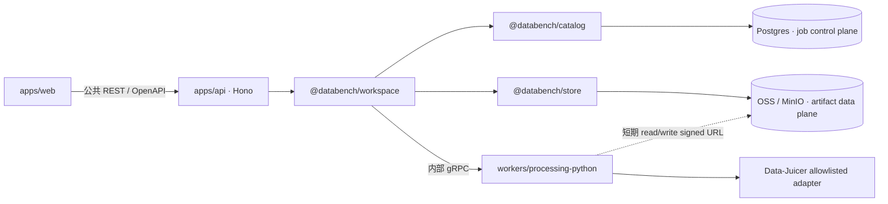

# Databench Processing Service 交接包

- **交接日期：** 2026-07-23
- **当前阶段：** 技术设计第二轮必须项已修复；尚未开始 P1 运行时代码
- **下一步：** P1 — Proto 与双语言生成链
- **适用范围：** 本机和可信私有网络中的第一版 Processing Service
- **总设计：** [TECHNICAL_DESIGN.md](TECHNICAL_DESIGN.md)
- **锁定决策：**
  [ADR-0010](../decisions/0010-python-processing-service-grpc.md)

## 1. 一句话交接

在现有 TypeScript monorepo 内增加一个可选启用的长期 Python 3.11 Processing Service：
Hono REST/OpenAPI 仍是唯一公共 API，`@databench/workspace` 通过内部 gRPC 调 Python，
Postgres 保存任务控制面，OSS/MinIO 承载大工件。第一版接 Data-Juicer，但只生成
write-once sealed staging artifacts，不发布 Dataset/version/ref/run/lineage。

当前设计已经关闭第二轮评审发现的必须问题：

- Python generated package 的绝对 import 与安装路径一致；
- Proto 文件路径满足 Buf package-directory lint；
- Apple Silicon 不再使用 `/usr/local` Rosetta `uv`/Python；
- `RunJob` stream 有完整、确定性的事件自动机；
- 用户取消、lease expiry、协议失败后有跨 API 重启的 durable cleanup fence；
- P1/P2/P3/P4 的测试职责不再互相越界；
- ADR 与技术方案对断流、取消顺序、artifact seal 的描述一致。

## 2. 当前状态

| 项目 | 状态 |
|---|---|
| ADR-0010 架构决策 | 已接受，并完成第二轮窄修订 |
| Processing 技术方案 | Revised draft；必须阻塞项已解决，等待 owner 最终接受 |
| Proto 源文件 | 尚未创建 |
| Python worker package | 尚未创建 |
| Prisma `processing_jobs` | 尚未创建 |
| Processing REST/UI | 尚未创建 |
| Data-Juicer adapter | 尚未迁入 monorepo |
| 本机 native `uv` | `/Users/hanlu/.local/bin/uv`，0.11.1，arm64 |
| 本机 native Python | `/Users/hanlu/.local/bin/python3.11`，3.11.15，arm64 |
| 下一切片 | P1 — 只做 Proto、生成、固定向量和工具链 gate |

不要把桌面 `llm-data-top5-lab` 当作运行时依赖。现有实验可作人工参考，但 P1 必须在
本 monorepo 内建立自己的 `.python-version`、`pyproject.toml`、`uv.lock` 和 codegen。

## 3. 权威文件与阅读顺序

接手者必须按顺序阅读，后面的文件不能推翻前面的锁定决策：

| 顺序 | 仓库文件 | 职责 |
|---:|---|---|
| 1 | `AGENTS.md` | 仓库总规则、依赖 DAG、禁止事项、当前状态 |
| 2 | `docs/processing/HANDOFF.md` | 本交接入口、当前阶段、下一步 |
| 3 | `docs/decisions/0010-python-processing-service-grpc.md` | 为什么使用长期 Python + gRPC，以及不可变边界 |
| 4 | `docs/processing/TECHNICAL_DESIGN.md` | 状态机、Proto、任务、artifact、配置、测试和 P1–P6 施工规范 |
| 5 | `docs/project-structure.md` | 包依赖、顶层目录和 generated 隔离规则 |
| 6 | `docs/directory-layout.md` | 文件级权威落点 |
| 7 | `docs/architecture.md`、`docs/tech-stack.md` | 总体架构及 Python boundary |
| 8 | `docs/conventions.md` | ESM、错误、确定性、配置和测试规则 |
| 9 | `docs/decisions/0003-storage-postgres-object-store.md` | Postgres 控制面 + 对象存储数据面 |
| 10 | `docs/decisions/0008-object-store-aliyun-oss.md` | 生产 OSS、本地 MinIO/S3 adapter |
| 11 | `docs/decisions/0009-*`、`0011-*`、`docs/v2/*` | 只在讨论未来 canonical finalizer 时阅读；当前不授权 v2 实现 |

若文件之间出现冲突，优先级是：已接受 ADR → Processing 技术方案 →
`project-structure`/`directory-layout` → 其他说明文件。发现新冲突先修文档，不在代码里
暗自选择一套语义。

## 4. 已锁架构



锁定项：

1. TypeScript 是 gRPC client，Python 是长期 gRPC server。
2. 公共产品接口仍是 Hono REST/OpenAPI；浏览器不访问 gRPC。
3. Zod 拥有领域和公共模型；Proto 只拥有内部 transport。
4. `apps/api` 只经 Workspace + Schema 使用 Processing，不能直接 import gRPC、
   Catalog、Store 或 generated code。
5. Python 不连接 Postgres，不持有 OSS/MinIO 长期密钥，不计算 Databench version。
6. 第一版一个 API、一个进程内 Dispatcher、一个 Python replica、一个 batch slot。
7. 不增加 Redis、RabbitMQ、工作流引擎或独立 dispatcher 服务。
8. 不做多租户、LLM、任意 YAML/module/shell、运行时安装、自动重试或分布式执行。
9. Data-Juicer v1 只生成 staging artifacts，不进入 canonical publication。

## 5. 包边界

```text
hashing ← schema ← {engine, io, catalog} ← {ops, store} ← workspace ← apps/api
```

| 层 | Processing 职责 | 禁止 |
|---|---|---|
| `schema` | Job/processor/params/progress/artifact 的 Zod 与 OpenAPI | gRPC、Prisma、Store SDK |
| `catalog` | 单表 queue、lease、CAS、cleanup fence | Schema、gRPC、Store、Data-Juicer |
| `store` | 受限 staging namespace、signed URL、verify、seal、stream read | job 状态机、Python registry |
| `workspace` | 唯一 orchestration 与 gRPC client owner | 向 API 暴露 generated Proto |
| `apps/api` | 路由、HTTP 错误映射、entrypoint lifecycle | 直连 Catalog/Store/gRPC |
| Python worker | registry、执行隔离、Data-Juicer adapter | PG、长期存储密钥、canonical publication |

## 6. Proto 与生成布局

唯一 Proto 源：

```text
proto/databench/processing/v1/processing.proto
package databench.processing.v1;
```

该路径同时满足 Buf 的 package-directory 规则，并让 `grpcio-tools` 生成：

```text
workers/processing-python/src/databench/processing/v1/processing_pb2.py
workers/processing-python/src/databench/processing/v1/processing_pb2_grpc.py
```

可安装 import 必须是：

```python
from databench.processing.v1 import processing_pb2
from databench.processing.v1 import processing_pb2_grpc
```

TypeScript generated 只进入：

```text
packages/workspace/src/internal/grpc/generated/
```

硬门：

- 不改写 generated import；
- 不使用临时 `PYTHONPATH`；
- Python source tree 和构建后的 wheel 都要通过 import smoke；
- generated 文件提交，但不手改；
- `proto:check` 在临时目录生成，只比较两个 generated root，不运行全仓
  `git diff --exit-code`；
- P1 建立 baseline；后续 Proto 变更相对 merge-base/main 跑 `buf breaking`。

标准 `grpc.health.v1.Health` 由 Python `grpcio-health-checking` 提供，不复制 health
Proto，也不生成 TS health binding。Workspace readiness 使用有界
`DescribeCapabilities`。

## 7. 原生工具链

第一版固定：

```text
uv      0.11.1 arm64
Python  3.11.15 arm64
Node    22 LTS
pnpm    11.7.0
```

P1 tooling 支持 `DATABENCH_PROCESSING_UV_BIN`，默认解析 `uv`。Apple Silicon
preflight 必须拒绝：

- `/usr/local` 下的 uv/Python；
- uv build target 为 x86_64；
- `platform.machine() != "arm64"`；
- Python 不是 3.11.15；
- uv 不是 0.11.1；
- executable 位于另一个实验项目目录。

当前机器验证命令：

```bash
command -v uv
command -v python3.11
uv --version
python3.11 -c 'import platform; print(platform.python_version(), platform.machine())'
```

当前交接机器的预期输出路径位于 `/Users/hanlu/.local/bin/`，架构为 arm64；接手者
可以使用自己的受控 native 路径，但不得回退到 `/usr/local` Rosetta 工具或其他实验
项目中的 executable。

## 8. 同步与异步 RPC

```proto
service ProcessingService {
  rpc DescribeCapabilities(DescribeCapabilitiesRequest)
      returns (DescribeCapabilitiesResponse);
  rpc ProcessInline(ProcessInlineRequest)
      returns (ProcessInlineResponse);
  rpc RunJob(RunJobRequest)
      returns (stream JobEvent);
  rpc CancelJob(CancelJobRequest)
      returns (CancelJobResponse);
}
```

- `ProcessInline`：最多 1 MiB JSON、默认 10 秒，只先提供内部
  `fixture.echo-json`，没有公共 HTTP route。
- `RunJob`：只传 job、processor、参数和 artifact target；数据集字节不走 gRPC。
- `CancelJob`：有界幂等 cleanup，响应必须说明 matching execution 的结果和
  single batch slot 是否 idle。

`JsonPayload` 固定使用 `schema_name + schema_version + json_utf8 bytes`。不要使用
`google.protobuf.Struct`，不要把 Data-Juicer preset/operator 字段复制进 Proto。

## 9. RunJob 自动机

必须实现和测试以下顺序：

```text
accepted(seq=1)
  ├─ heartbeat*
  ├─ started（恰好一次；leased → running）
  │    ├─ progress*
  │    ├─ heartbeat*
  │    └─ artifact_created+（首个 running → uploading；每个 target 最多一次）
  └─ completed | failed | cancelled（恰好一个且最后）
       └─ 5 秒内 gRPC OK EOF
```

关键规则：

- progress/artifact 不能出现在 started 前；
- completed 只能在所有 required artifact 都已声明后；
- duplicate、skip、倒序 sequence、重复 started、未知 target 都是协议违规；
- worker 只有在 process group 已停止且不会继续上传后，才能发送 terminal；
- terminal 到 `OK EOF` 有独立 5 秒 deadline，不能等完整 job deadline；
- 没有 terminal、non-OK EOF、deadline 或协议违规都使当前 attempt 确定性 failed；
- v1 不从孤立 upload 猜测成功，也不自动 reconciliation/retry。

## 10. Job、lease 与 durable cleanup fence

公开状态：

```text
queued → leased → running → uploading → completed
   └────────────── active states ──────────────→ failed/cancelled
```

`finalizing` 只为未来 v2 保留，v1 不进入。

第一版 `attempt=1`、`max_attempts=1`。claim 使用 Postgres advisory lock +
`FOR UPDATE SKIP LOCKED`，但只有不存在任何 `lease_token IS NOT NULL` row 时才能 claim。

`lease_token` 有两个连续用途：

1. active job 的 stale-event fencing；
2. TS 无法证明 worker 已停止时，terminal row 的 durable cleanup handle。

以下路径写 `finished_at`，但保留 attempt/token：

- 用户取消 active job；
- lease expiry；
- job deadline；
- sequence/protocol violation；
- non-OK EOF；
- RPC 已发出但没有收到 accepted。

Dispatcher 每轮先处理 cleanup-pending，再 claim。只有 `CancelJob` 返回 matching
execution 已停止或不存在且 `slot_idle=true`，Catalog 才用 id+attempt+token CAS 清除
fence。RPC timeout、worker unavailable 或 slot busy 时不 claim 下一个任务。这样关闭：

```text
terminal CAS 成功 → API crash → Python child 仍占 slot → 新 job 被错误 claim/failed
```

正常 worker terminal + `OK EOF` 已证明执行停止，可在 terminal CAS 中直接清 fence。

## 11. Artifact 数据面

```text
processing/jobs/<job-id>/attempts/<attempt>/input.jsonl
processing/jobs/<job-id>/attempts/<attempt>/uploads/<target-token>/output.jsonl
processing/jobs/<job-id>/attempts/<attempt>/uploads/<target-token>/stats.json
processing/jobs/<job-id>/attempts/<attempt>/uploads/<target-token>/logs.jsonl
processing/jobs/<job-id>/attempts/<attempt>/artifacts/output.jsonl
processing/jobs/<job-id>/attempts/<attempt>/artifacts/stats.json
processing/jobs/<job-id>/attempts/<attempt>/artifacts/logs.jsonl
```

- `uploads/`：worker 可写，只限当前 attempt/target token。
- `artifacts/`：Store 条件式 seal，worker 永远没有写权限。
- Store 实际检查 object、size、content type、limit、digest；不信任 worker 自报。
- ETag 不是内容 digest，尤其不能把 multipart ETag 当 checksum。
- completed 只引用 verified + write-once sealed artifact。
- 浏览器下载由 API 流式代理 sealed object，不暴露 signed URL。
- v1 `output_version=null`、`output_ref=null`、`result_kind=staging_artifacts`。

## 12. 实施切片

每个切片独立 PR，当前 gate 未通过不得进入下一片：

### P1 — Proto 与生成链（下一步）

- 创建 Proto/Buf/tooling/worker 最小 package；
- 固定 `databench.processing.v1` service/messages/field numbers/comments；
- TS/Python deterministic generation；
- native uv/Python preflight；
- source-tree + wheel import smoke；
- descriptor、oneof、JsonPayload、固定跨语言 wire vectors；
- Buf lint、baseline、后续 breaking/check-generated CI gate；
- 不实现 server、不建 job 表、不接 Data-Juicer。

### P2 — Worker/Client skeleton

- Python gRPC server + standard health；
- Workspace 私有 `ProcessingClient` 和 gRPC adapter；
- `fixture.echo-json` inline E2E；
- 最小真实 RunJob terminal→OK EOF；
- 无公共 inline route。

### P3 — Durable job/Dispatcher

- Zod job model、Prisma migration、Catalog CAS 方法；
- API-entrypoint-only dispatcher lifecycle；
- global single slot、preparation renew、terminal CAS、cleanup fence；
- 真实 Postgres 下 cancel/expiry/crash/stale-token 竞争测试。

### P4 — Staging data plane/RunJob

- OSS/MinIO staging API、signed URL、worker-reachable endpoint；
- upload verify、conditional write-once seal；
- 完整 stream 自动机；
- fake worker/artifact server 注入 RST、partial upload、旧 PUT、部分 seal、取消和 crash。

### P5 — Data-Juicer adapter

- 锁定 Data-Juicer 与依赖；
- versioned non-LLM preset；
- 100 / 10k / 100k 三层数据测试；
- 报告 records/s、CPU、峰值 RSS、bytes、过滤比例和 phase duration；
- 只生成 staging artifacts。

### P6 — Local/private REST 与 artifact-only UI（条件切片）

- Zod → OpenAPI → generated web client；
- job list/detail/progress/cancel/artifact download；
- 明确显示“处理完成，未发布为 Dataset”；
- 当前 ADR 顺序仍要求 owner 先接受仅调整 UI 顺序的窄修订，未修订前不得开始 P6。

## 13. P1 首个 PR 的文件范围

```text
proto/
  buf.yaml
  buf.lock
  buf.gen.yaml
  databench/processing/v1/processing.proto

tooling/proto/
  package.json
  src/index.ts
  scripts/check-generated.mjs
  tsconfig.json

workers/processing-python/
  .python-version
  pyproject.toml
  uv.lock
  src/databench/__init__.py
  src/databench/processing/__init__.py
  src/databench/processing/v1/__init__.py
  src/databench/processing/v1/processing_pb2.py
  src/databench/processing/v1/processing_pb2_grpc.py
  tests/test_generated_contract.py

packages/workspace/src/internal/grpc/generated/
  ... ts-proto output only
```

P1 允许修改根 `package.json`、`pnpm-workspace.yaml`、`turbo.json`、CI 和 Python ignore，
但只为生成/gate 调度；不能顺手实现 P2 server/client。

## 14. P1 验收清单

- [ ] `command -v uv` 指向受控 native executable；
- [ ] uv 0.11.1 arm64；Python 3.11.15 arm64；
- [ ] `buf lint` 通过；
- [ ] Proto package/path 为 `databench.processing.v1` / `databench/processing/v1`；
- [ ] TS/Python generation 可重复且临时目录比较无差异；
- [ ] Python source-tree import 通过；
- [ ] 构建 wheel、安装到干净临时 venv、import 通过；
- [ ] TS generated 只在 Workspace internal 目录；
- [ ] 参数使用 `JsonPayload`，Proto 无 Data-Juicer 领域参数副本；
- [ ] ArtifactRead/Write 包含 target、method、headers、expiry、max bytes、content type；
- [ ] artifact event 使用有算法标签的 digest，不使用 ETag 充当 digest；
- [ ] CancelJobResponse 能表达 cleanup result 和 `slot_idle`；
- [ ] 固定跨语言 wire vectors 通过；
- [ ] check-generated 不受仓库其他未提交改动影响；
- [ ] 现有 lint/typecheck/test/openapi gates 无回归。

## 15. 明确不做与待决策项

当前禁止：

- v1 importer/finalizer；
- Dataset version/ref/run/cache/lineage publication；
- 任意 Data-Juicer YAML/operator list；
- LLM/provider 配置；
- 多租户、RBAC、配额、计费；
- 多 worker replica；
- 自动 retry/checkpoint/resume；
- Redis/RabbitMQ/工作流引擎；
- 公网 Processing；
- 浏览器直接 signed URL 或 gRPC。

仍待 owner/后续切片决定：

1. P6 是否在 canonical v2 finalizer 前提前交付 artifact-only UI；
2. v2 技术方案和实施计划何时最终接受；
3. 未来 finalizer 的独立技术方案；
4. D3/S22 生产 API/worker 托管平台；
5. P2 独立 process/process-group 的最终实现；
6. P4 OSS 与 MinIO conditional seal/version 差异；
7. P5 第一组实际 Data-Juicer operator/preset。

## 16. 故障测试红线

P3/P4 合入前至少覆盖：

- cancel CAS 后、CancelJob 前 API crash；
- expiry CAS 后、cleanup 前 API crash；
- cleanup timeout/slot busy 时不能 claim 新 job；
- stale cleanup token 不能清另一个 fence；
- heartbeat 与 expiry 边界竞争只有一个成功；
- accepted 前 RPC 不确定失败；
- terminal 后 EOF 超时；
- duplicate/skip/out-of-order event；
- 部分 upload、digest 不符、超限；
- 部分 seal 后取消；
- seal 完成、completion CAS 前 crash；
- completed 后旧 signed PUT 不能改变 sealed artifact。

时间竞争必须跑真实 Postgres；对象完整性必须跑可编程 fake artifact server，并在 P4
补 MinIO/OSS adapter 集成。不能只写 happy-path mock。

## 17. 接手者开工提示词

可把下面内容直接交给实现者：

> 在本仓库根目录实施 Processing P1。先完整阅读
> `AGENTS.md`、`docs/processing/HANDOFF.md`、ADR-0010、Processing
> `TECHNICAL_DESIGN.md`、`project-structure.md`、`directory-layout.md` 和
> `conventions.md`。只实现 Proto 与双语言确定性生成链，不进入 P2。使用 native
> arm64 uv 0.11.1 + Python 3.11.15，拒绝 `/usr/local` Rosetta；Proto 路径固定为
> `proto/databench/processing/v1/processing.proto`，Python import 固定为
> `databench.processing.v1.*`。完成 source-tree/wheel import smoke、固定 wire vectors、
> Buf lint/baseline/check-generated，并保证现有全量 gate 无回归。保留用户已有工作树
> 改动，不修改旧仓库 `~/Desktop/databench/`。

## 18. 交接完成标准

接手者在开始 P1 前，应能明确回答：

1. 为什么 Zod 与 Proto 不是同一套模型？
2. 为什么大数据不能走 gRPC/Postgres？
3. 为什么取消后不能立即清 lease token？
4. 为什么 `RESOURCE_EXHAUSTED` 不能被当作正常调度机制？
5. 为什么 completed artifact 必须经过 verify + write-once seal？
6. 为什么 v1 Data-Juicer 结果不是 Dataset？
7. P1 为什么不能顺手实现 server/job/UI？

如果这七项有任何一项不清楚，先回到 ADR-0010 和技术方案，不要开始编码。
