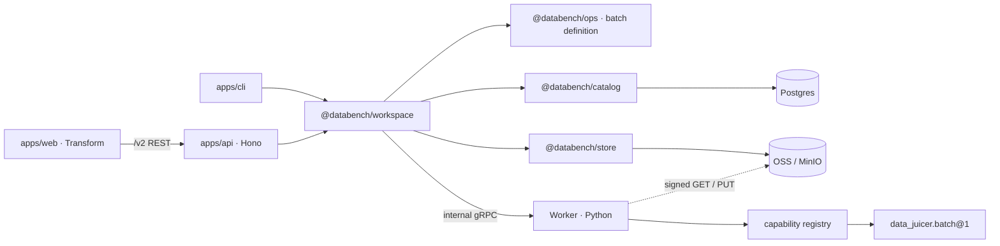
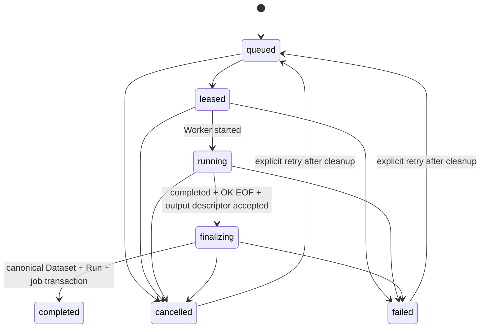
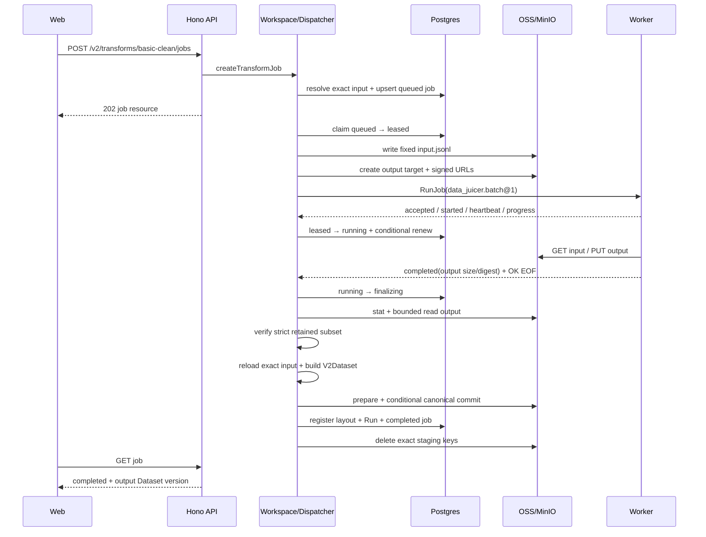

# Worker 与 Data-Juicer 接入技术方案

- **状态：** Accepted design；P0-P1 已完成，下一步 P2 Job 控制面
- **日期：** 2026-07-25
- **决策：**
  [ADR 0010 — Long-running Python Worker over internal gRPC](../decisions/0010-python-processing-service-grpc.md)
- **实现基线：** v2-only 当前代码；V0-V15 与产品切换 R0-R5 已完成，V16/V17 状态不变
- **首个目标：** 固定 `basic-clean@1` 从现有 Dataset 生成新的 canonical Dataset
- **部署范围：** 本机和可信私有网络；不自动进入 ADR 0012 离线发布包

## 1. 目标

本方案只交付一条可验证的纵向路线：

```text
exact input Dataset
  → TS 生成固定 JSONL 投影
  → Worker 执行固定 Data-Juicer 计划
  → TS 校验 retained identities
  → TS 发布 canonical output Dataset
  → V2Run / cache / lineage
```

第一版完成后，用户可以在 Transform 产品中提交“基础清洗”，关闭页面后任务继续运行，
重新打开可查看进度、取消任务，并在成功后进入新的 Dataset 版本、记录、血缘和导出。

Worker 是通用的长期 Python 服务。Data-Juicer 是首个 capability，不是服务边界或公共
产品模型。

## 2. 非目标

当前不实现：

- 页面算子编排、拖拽 DAG 或保存用户自定义流程；
- 自定义 Data-Juicer YAML、operator list 或参数；
- 用户选择 canonical 字段、JSONPath 或 `extra` 字段映射；
- Data-Juicer 文本清洗结果写回 canonical record；
- 脱敏、candidate 改写、derive identity 或 record parent lineage；
- LLM/provider、模型下载或 Worker 对外网络访问；
- 多租户、配额、多 Worker 调度、分布式计算；
- Redis/RabbitMQ/工作流引擎、独立 dispatcher 服务；
- 自动重试和 attempt/event 历史表；
- 提高当前 100k records / 512 MiB canonical bytes 限制；
- 将 Worker 加入 ADR 0012 离线包。

## 3. 最新代码基线与必要改动

### 3.1 当前已经存在并必须复用

当前 `V2Workspace` 已经提供：

- Ref → exact Dataset/layout resolution；
- eager `V2Dataset` 读取和缓存 lease；
- transform cache key 与 `run_<cache-key>`；
- Store `prepare()` / conditional `commit()`；
- `registerTransformResult()` 原子登记 layout + Run；
- determinism conflict；
- exact Dataset/record lineage；
- Ref CAS；
- canonical inspect/export。

Data-Juicer finalizer 不复制 identity、publish 或 lineage 算法。需要把当前
`#publishTransform()`、run validation 和 cache-hit verification 中可共享的部分提取为
Workspace 内部 helper，供同步 transform 和 batch finalizer 共同调用。

### 3.2 当前同步 transform 不能直接承载 Worker

`V2TransformDefinition.run()` 当前在 HTTP 请求内接收内存 `V2Dataset`，返回另一个
`V2Dataset`，然后立即提交。Data-Juicer 100k 的实测约 61.5 秒，因此不能把 gRPC 调用塞进
现有 `run()`。

新增平行的内部 contract：

```ts
interface V2BatchTransformDefinition<P extends object> {
  readonly name: string
  readonly version: string
  readonly inputRoles: readonly string[]
  readonly paramsSchema: z.ZodType<P>
  readonly paramsExample: P
  readonly identityMode: 'preserve'
  readonly capability: { readonly name: string; readonly version: string }

  projectInput(
    inputs: readonly V2Dataset[],
    params: P,
    signal: AbortSignal,
  ): AsyncIterable<WorkerInputRowV1>

  executionParameters(params: P): JsonObjectV2

  finalize(
    inputs: readonly V2Dataset[],
    retained: readonly RetainedRecordIdentityV1[],
    limits: Readonly<V2DatasetLimits>,
    signal: AbortSignal,
  ): Promise<V2Dataset>
}
```

`V2BatchTransformRegistry` 位于 `@databench/ops`。API 可以把同步和 batch descriptor 合并
展示，但执行入口保持不同：同步使用现有 `/run`，batch 创建 job。

### 3.3 当前 Store 没有临时交换面

现有 Store 只拥有 canonical `objects/v2/` 的 prepare/commit/read/audit。需要增加严格受限的
Worker staging 能力，但不能改变 canonical key 或 conditional commit 语义。

### 3.4 当前 Catalog 没有 job

现有 Prisma 只有 v2 snapshot/layout/run/input/revision/parent/ref/claim。需要增加一张
`transform_jobs_v2` 控制面表。样本、Data-Juicer 输出和完整日志不能进 Postgres。

### 3.5 当前 API 没有后台 runtime owner

当前 v2 middleware 在第一次请求时惰性打开 Workspace；`apps/api/src/index.ts` 直接启动
Hono，没有 dispatcher、signal shutdown 或显式 Workspace close。Worker 启用时必须改为
entrypoint 显式组合；`createApp()` 和 OpenAPI 导出仍保持无副作用。

## 4. 总体架构



权威边界：

| 层 | 负责 | 禁止 |
|---|---|---|
| Schema | public transform-job Zod、错误、OpenAPI DTO | Proto、Prisma、Data-Juicer |
| Ops | batch transform definition、固定投影与 finalizer 纯逻辑 | Store、Catalog、gRPC |
| Catalog | job lease/CAS、layout+Run+job transaction | Schema、Worker、样本 payload |
| Store | canonical commit 与 exact-key staging I/O | job 状态机、capability 选择 |
| Workspace | 唯一产品编排、cache、Worker client、finalization | 向应用暴露 Proto DTO |
| API | REST 映射、entrypoint 生命周期 | 直连 Catalog/Store/gRPC |
| Worker | 通用执行 runtime 与 adapter | Databench identity、PG、canonical keys |

## 5. 权威目录

P1 的 Proto、Worker package 和 Workspace internal client 已落地；其余目录仍按对应 Step 创建，
不能把计划中的 P2-P6 文件误写成当前实现。

```text
proto/
├─ buf.yaml
├─ buf.gen.yaml
└─ databench/worker/v1/worker.proto

workers/python/
├─ .python-version
├─ pyproject.toml
├─ uv.lock
├─ Dockerfile
├─ src/
│  ├─ databench_worker/
│  │  ├─ grpc_server.py
│  │  ├─ registry.py
│  │  ├─ runner.py
│  │  ├─ runtime/
│  │  │  ├─ artifacts.py
│  │  │  ├─ cancellation.py
│  │  │  ├─ progress.py
│  │  │  └─ subprocess.py
│  │  └─ adapters/
│  │     └─ data_juicer.py
│  └─ databench/worker/v1/
│     ├─ worker_pb2.py
│     └─ worker_pb2_grpc.py
└─ tests/

packages/ops/src/v2/batch/
├─ contracts.ts
├─ registry.ts
└─ basic-clean.ts

packages/workspace/src/
├─ internal/worker/
│  ├─ client.ts
│  ├─ grpc-client.ts
│  ├─ dispatcher.ts
│  └─ generated/
└─ v2/
   ├─ batch-transform.ts
   └─ transform-publication.ts

packages/store/src/v2/
├─ worker-staging.ts
└─ worker-staging-keys.ts

apps/api/src/routes/v2/transform-jobs.ts
```

Generated Python import 必须正常工作于 source tree 和 wheel：

```python
from databench.worker.v1 import worker_pb2, worker_pb2_grpc
```

不得通过 import rewrite 或临时 `PYTHONPATH` 修复错误布局。

## 6. Worker 定位

### 6.1 通用 capability host

Worker 注册能力，而不是暴露模块或函数：

```python
class CapabilityAdapter(Protocol):
    name: str
    version: str

    def validate_parameters(self, value: object) -> object: ...
    async def run(self, context: RunContext) -> CompletedOutput: ...
```

第一版 registry 只包含：

```text
fixture.copy@1          tests only
data_juicer.batch@1     runtime capability for the first product transform
```

未来新增 capability 不自动成为产品功能。必须先有 TS-owned 领域输入、输出校验、资源限制和
finalizer，再注册 adapter。

### 6.2 Worker 不拥有业务逻辑

Worker 不解析 `PostTrainingRecordV2`，不决定哪个 Dataset/Ref 被处理，不生成 `text`，不选择
产品 preset，不判断结果能否发布。Workspace 发送完整、已经选择好的执行参数。

Data-Juicer adapter 只完成技术映射：把已验证的执行参数转成固定版本 Data-Juicer 调用，
管理本地文件、执行、取消和输出。它仍必须做独立安全校验，拒绝未允许的 operator、路径、
网络和运行时安装。

### 6.3 进程隔离

gRPC event loop 不直接运行 Data-Juicer。adapter 在受控子进程中运行，使 Worker 能够：

- 发送独立 heartbeat；
- 在 deadline/cancel 后终止进程树；
- 区分正常退出、signal、OOM 候选和协议错误；
- 将 stdout/stderr 写入有界、脱敏 ring buffer；
- 在执行结束后删除 job 专属临时目录。

第一版 Worker 总 batch 并发为 1，Data-Juicer 固定 `np=1`。

## 7. 首个 batch transform

### 7.1 产品定义

```text
name:          basic-clean
version:       1
input roles:   [base]
params:        {}
identity mode: preserve
capability:    data_juicer.batch@1
```

operation version `1` 固定以下全部行为：

- `py-data-juicer==1.5.3`；
- `record-text-v1` 投影；
- `basic-clean-v1` 执行计划；
- Data-Juicer `np=1`；
- input/output JSONL schema；
- retained identity 的校验和 deterministic keep 语义。

任一项改变必须发布新的 operation version，并形成新的 cache key。

### 7.2 `record-text-v1`

对每个 `RecordRevisionV2`：

1. 按现有数组顺序遍历 `record.contents`；
2. 再按现有数组顺序遍历每个 candidate 的 `contents`；
3. 对每个 content 按 part 顺序取 `type === 'text'` 的 `text`；
4. 使用单个 `\n` 连接这些原始字符串；
5. 不在 TS 中 trim、Unicode normalize 或 collapse whitespace；
6. 忽略非文本 part；没有文本时得到空字符串。

这是 record 级选择投影，不是新的 canonical 格式。第一版不区分 prompt/answer，不提供字段选择。

输入行严格为：

```json
{"record_id":"rec_<64 hex>","record_digest":"<64 hex>","text":"..."}
```

行顺序使用 `V2Dataset.records()` 已固定的 `(record_digest, record_id)` 顺序。Input writer 使用
确定性 UTF-8 JSONL；不得使用裸 `JSON.stringify` 参与任何 Databench identity，但 staging
transport 本身不进入 canonical identity。

### 7.3 `basic-clean-v1`

TS-owned 固定执行计划基于已实测的 Data-Juicer 1.5.3 operator：

```yaml
np: 1
process:
  - whitespace_normalization_mapper: {}
  - text_length_filter:
      min_len: 40
  - document_deduplicator:
      lowercase: false
```

Workspace 将这份固定计划编译为内部
`databench.worker.data-juicer-batch-parameters/1` JSON payload 后发送；public request 仍是
`params={}`。Worker adapter 只接受该 schema、`np=1` 和自身 allowlist 中的 operator/参数，
但不在 Python 中决定阈值或产品 preset。调用者不能把任意 YAML/JSON plan 透传给 Worker。

实验中的 `specified_numeric_field_filter(field_key=quality)` 不进入产品 preset，因为 canonical
record 没有该稳定字段。`whitespace_normalization_mapper` 只改变临时判断文本，变化后的文本不
写回 Databench；它会影响长度/去重选择，因此属于 operation version 的确定性语义。

`document_deduplicator` 的 keep-first 输入顺序由 `(record_digest, record_id)` 固定。最终输出
`V2Dataset` 自己再次排序，因此 Worker 输出行顺序不影响 Dataset identity。

### 7.4 Worker 输出

adapter 从 Data-Juicer 结果中只导出：

```json
{"record_id":"rec_<64 hex>","record_digest":"<64 hex>"}
```

Workspace 严格验证：

- 每行 shape 正确、大小受限；
- `(record_id, record_digest)` 在 exact input 中存在；
- 没有重复 identity；
- 结果数量不超过输入；
- Worker 声明的 count/digest 与实际输出一致。

未知 ID、同 ID 错误 digest、重复行、超限或 malformed JSONL 都使 job 失败，不能发布任何 Run。
空结果合法，并使用现有 empty Dataset identity 规则。

## 8. Proto 与 gRPC

### 8.1 服务

第一版协议只实现当前需要的三个 RPC：

```proto
service WorkerService {
  rpc DescribeCapabilities(DescribeCapabilitiesRequest)
      returns (DescribeCapabilitiesResponse);

  rpc RunJob(RunJobRequest)
      returns (stream JobEvent);

  rpc CancelJob(CancelJobRequest)
      returns (CancelJobResponse);
}
```

短同步 Python 计算等真实需求出现后，可以向同一 v1 package 加 unary RPC；本次不预先实现。
Python 同时提供标准 `grpc.health.v1.Health`。Workspace readiness 使用有 deadline 的
`DescribeCapabilities`，不复制 health Proto。

### 8.2 `RunJobRequest`

概念字段：

```text
execution_id
job_id
attempt
lease_token
capability_name
capability_version
parameters: JsonPayload { schema_name, schema_version, utf8_json }
inputs[]:  { name, read_url, media_type, size, digest }
outputs[]: { name, write_url, media_type, max_size }
deadline_unix_ms
```

URL 和 lease token 是 secret，禁止进入普通日志、error message 或 tracing attribute。
`JsonPayload` 保留 JSON 数字和严格 Zod/Pydantic validation，不能使用
`google.protobuf.Struct` 替代业务 JSON。

### 8.3 事件自动机

`JobEvent` 使用 `oneof`：

```text
accepted
started
progress
heartbeat
completed
failed
cancelled
```

规则：

1. `accepted` 恰好一次且必须最先出现；
2. `started` 恰好一次；它之前只允许 heartbeat；
3. `progress` 与 heartbeat 只允许在 terminal 前出现；
4. terminal 恰好一次；
5. `completed` 只表示 Worker 写完声明输出，不表示 Dataset 已发布；
6. 合法 terminal 后必须在独立短 deadline 内收到 gRPC `OK` EOF；
7. terminal 后新事件、无 terminal EOF、non-OK EOF、重复 terminal 都是协议失败。

Worker event timestamp 只用于诊断。lease、start/finish 和竞争判断全部使用数据库时钟。

### 8.4 Capabilities

Worker 返回当前安装的：

```text
name
version
mode=batch
parameter_schema_name/version
input/output names and media types
```

TS batch registry 是产品 operation 的来源；Worker capability 只是运行时兼容性确认。Worker
缺少精确 `data_juicer.batch@1` 时，新 job fail-fast，不由 TS 猜测降级版本。

## 9. Transform job 控制面

### 9.1 一张表

根 Prisma 增加下一可用 migration 和逻辑模型 `V2TransformJob`：

```text
id                    job_<cache_key>, primary key
cache_key             unique char(64)
op / op_version
params_json            bounded, first operation is {}
input_version          exact Dataset version
capability_name/version
status
attempt
lease_owner/token/expires_at
progress_json          bounded summary only
input_key/output_key   exact staging keys, never signed URLs
input_count/output_count
output_version         nullable; completed must be non-null
error_json             stable code + safe summary
created_at/started_at/finished_at/updated_at
```

`input_version` 和 `output_version` 外键指向 `dataset_snapshots_v2`。表中不保存 sample text、
完整 Worker log、Data-Juicer Dataset 或 signed URL。

`job_id = 'job_' + cache_key`，与 `run_id = 'run_' + cache_key` 一样确定。`cache_key` 继续使用
当前 `TransformCacheIdentityV1Schema` 和 `@databench/hashing`：

```json
{
  "identity_profile": "databench-v2-jcs-1",
  "op": "basic-clean",
  "op_version": "1",
  "input_dataset_versions": ["<exact version>"],
  "params": {}
}
```

### 9.2 状态机



`completed` 要求 `output_version` 非空且相同 cache key 的 `V2Run` 已存在。Worker terminal
不能直接把 job 改成 completed。

### 9.3 创建与 cache hit

`createTransformJob()`：

1. Zod 校验 operation 和 request；
2. 解析 Ref 为 exact input version；
3. 检查 Dataset/layout 已登记且 manifest 可验证；
4. 规范化 params；
5. 计算 cache key/job ID；
6. 如果 `V2Run` 已存在，幂等创建/返回 completed cache-hit job；
7. 如果相同 cache key job 已存在，返回现有 job；
8. 否则插入 queued job。

同一个 cache key 不并行创建多个 Python 执行。重新提交 create 返回原 job；失败/取消后只能
通过显式 retry 将同一 job 条件式放回 queued。retry 必须确认 cleanup fence 已清除、旧 staging
exact keys 已处理，并保留同一个 job/cache key；系统不自动 retry。

### 9.4 Claim 与 lease

一个 API entrypoint 内的 dispatcher loop：

1. 使用 Postgres advisory lock 串行化单槽 claim；
2. 确认不存在任意 `lease_token IS NOT NULL` 的执行/cleanup fence；
3. `FOR UPDATE SKIP LOCKED` 选择最早 queued job；
4. 条件更新为 leased，`attempt += 1`；
5. 写入随机 lease token、dispatcher owner、数据库时钟 expiry；
6. 提交后才做 staging preparation 和 gRPC。

默认 lease 30 秒、heartbeat 10 秒。preparation 与 finalizing 都运行 TS renewer；只有当前、
未过期 attempt/token 可续租。任何事件更新同时检查：

```text
job_id + attempt + lease_token + lease_expires_at > database_now()
```

### 9.5 取消与 cleanup fence

取消顺序：

1. Catalog 条件提交 `cancelled`；
2. 停止接受该 attempt 的普通事件；
3. 取消 gRPC call；
4. 调用 `CancelJob(execution_id, attempt, lease_token)`；
5. Worker 确认 matching execution stopped/absent 后才清除 lease token；
6. 删除 exact staging keys。

如果 Worker 不可达，cancelled/failed row 保留 lease token 作为 drain fence；dispatcher 周期性重试
幂等 `CancelJob`。只有 Worker 明确返回 matching execution 已停止/不存在且 slot idle，或者运维先
重启并确认 Worker 空闲，才能清除 fence；不能仅因本地 timeout 自动释放。旧 token 永远不能停止
新 attempt。

### 9.6 断流和重启

- abnormal EOF、deadline、协议错误：当前 attempt failed；
- active lease 到期：sweeper 使用 DB 时钟条件标记 failed；
- 不自动 requeue；
- API 重启后先处理 expired lease/cleanup fence，再 claim 新 job；
- finalizing crash 不猜测成功；immutable orphan object 可安全保留，显式 retry 后由当前
  publish determinism/conditional create 收敛。

## 10. 临时数据面

### 10.1 Key

只有 Store key builder 可以生成：

```text
staging/worker/v1/<job-id>/<attempt>/input.jsonl
staging/worker/v1/<job-id>/<attempt>/output.jsonl
```

`job-id`、attempt 和 logical name 先严格校验。禁止调用方传 raw key，禁止 prefix delete，禁止
任何 key 与 `objects/v2/` 重叠。

### 10.2 Store 能力

概念接口：

```ts
interface WorkerStagingStore {
  createInput(key, source, options): Promise<StagingObjectDescriptor>
  createOutputTarget(key, options): Promise<SignedWriteTarget>
  signRead(key, options): Promise<SignedReadSource>
  statExact(key): Promise<StagingObjectDescriptor | null>
  readExact(key, options): AsyncIterable<Uint8Array>
  deleteExact(key): Promise<void>
}
```

约束：

- TS input 使用 conditional create；
- output key 每 attempt 唯一；
- signed URL TTL 大于 job deadline + terminal/finalize buffer；
- signed PUT 限定 method、key、content type，尽可能限制 content length；
- TS 对实际对象重新做 size/digest/media type 检查，不信任 Worker event；
- OSS 和 S3/MinIO 行为由同一 contract tests 锁定；
- MinIO signed URL 使用 Worker 可达 endpoint，不能把 API 容器内 `localhost` 发给 Worker。

### 10.3 为什么第一版不 seal staging

旧方案把 staging artifact 当公共最终结果，因此需要 write-once seal。新方案不同：

- staging 从不成为 job 的最终产品结果；
- Worker terminal + OK EOF 后不再写 output；
- TS 随即读取、验证并从原 canonical records 构造 Dataset；
- completed 只引用 canonical immutable Dataset/Run；
- staging 在成功/失败/取消后 exact-key 删除。

因此第一版不增加 staging copy/seal/version-generation 子系统。若未来要把 Worker 原始输出作为
长期可下载 artifact，必须单独设计 immutable artifact publication。

## 11. 完整执行时序



## 12. Canonical finalizer

### 12.1 不在 Python 中做的事

Worker 不读取 canonical Parquet，不构造 `PostTrainingRecordV2`，不调用 hashing，不写 manifest，
不访问 Catalog。它只处理 TS 已经投影的 flat JSONL。

### 12.2 TS finalization

Workspace 在 finalizing 状态：

1. 读取并严格解析 retained JSONL；
2. 重新加载 exact input Dataset；
3. 将每个 retained pair 映射回 input revision；
4. 使用原始 `revision.record` 构造 `V2Dataset`；
5. 对 input + output 做当前 aggregate working-set admission；
6. 只在 finalization 期间取得 transform semaphore，不在 60 秒 Worker 执行期间持有内存
   Dataset lease 或 semaphore；
7. canonical Store prepare/commit；
8. Catalog 单事务登记 layout、Run、lineage inputs 和 completed job；
9. 读取 Run/manifest 验证；
10. best-effort exact staging cleanup。

需要新增 Catalog 方法使 batch completion 原子包含：

```text
register layout if needed
register deterministic V2Run
verify job is current finalizing attempt/token
set job completed + output_version + counts
clear lease
```

同步 transform 仍使用现有 `registerTransformResult()`；两个入口复用 transaction helper，不能复制
run/lineage invariant。

### 12.3 Determinism race

同 cache key：

- 同 output Dataset：幂等收敛到同一 Run；
- 不同 output Dataset：`DeterminismConflictErrorV2`，job failed；
- attempted canonical object 已 conditional commit 但未获胜时可以成为可审计 orphan，不能移动 Ref；
- cache hit 必须验证 run metadata 和 output manifest，不能只相信 job row。

## 13. API、CLI 与 Web

### 13.1 REST

第一版公共路由：

```text
POST /v2/transforms/basic-clean/jobs
GET  /v2/transform-jobs
GET  /v2/transform-jobs/{jobId}
POST /v2/transform-jobs/{jobId}:cancel
POST /v2/transform-jobs/{jobId}:retry
```

创建请求严格为：

```json
{"inputs":["dataset-ref-or-version"]}
```

只允许一个输入，没有 `params`、Ref update 或 YAML。创建总是返回 `202` 和 job resource；如果
相同 cache key 已完成，resource 可立即是 `completed + cache_hit=true`。

读取 job 不要求 Worker 在线。Worker 未配置或缺少 capability 时，创建返回稳定的 dependency/
capability unavailable error；路由仍存在于确定性 OpenAPI。

### 13.2 Job resource

公共资源至少包含：

```text
id
operation{name, version}
input_dataset_versions
status
attempt
progress{phase, completed_units, total_units?}
input_count/output_count
output_dataset_version?
cache_hit
error?
created_at/started_at/finished_at
```

不公开 lease owner/token、signed URL、staging key、Python traceback 或 Worker 内部路径。

### 13.3 Web

一级导航不变。`/transforms` 增加一个“基础清洗”入口和最近任务；详情子路由可使用：

```text
/transforms/jobs/:jobId
```

第一版页面只有：

- 选择一个输入 Dataset；
- 显示固定“基础清洗”；
- 提交；
- 轮询状态、取消；
- 失败/取消后的显式重试；
- 完成后链接 output Dataset 和 lineage；
- 显示 input/output/filtered counts。

不显示 Worker、gRPC、Data-Juicer YAML 或算子编排器。高级技术信息可只显示 operation/version。

### 13.4 CLI

CLI 不是 P6 的首要 blocker，但实现时仍只经 Workspace/Schema。建议命令：

```text
databench transform submit basic-clean --input <ref-or-version>
databench transform job list
databench transform job show <job-id>
databench transform job cancel <job-id>
```

不要改变现有同步 `databench transform run` 的返回语义。

## 14. Runtime 生命周期

### 14.1 启动

仅真实 entrypoint 做：

```ts
const workspace = await V2Workspace.open(workspaceOptions)
const workerRuntime = workerEnabled
  ? await openWorkerRuntime({ workspace, ...workerOptions })
  : null
await workerRuntime?.start()
const app = createApp({ v2Workspace: workspace, ...httpOptions })
const server = serve({ fetch: app.fetch, port })
```

`openWorkerRuntime`、dispatcher 和 gRPC implementation 从 Workspace package 的正式 export
进入 API；API 不 deep import generated code。

### 14.2 停止

SIGTERM/SIGINT：

1. HTTP server 停止接受新请求；
2. dispatcher 停止 claim；
3. 当前 preparation/finalization 尝试在 shutdown deadline 内完成；
4. 当前 Worker call 进入 durable cancel/drain；
5. close Worker client；
6. close Workspace/Catalog；
7. close server/process。

强制退出后由 DB lease expiry 恢复为 failed，不自动重跑。

### 14.3 测试/生成无副作用

以下操作不得启动 dispatcher 或连接 Worker：

- `createApp()`；
- `createOpenApiDocument()`；
- route unit tests；
- OpenAPI export；
- 注入 fake `V2Workspace` 的测试。

## 15. 配置

### 15.1 TypeScript/API

| 变量 | 默认 | 含义 |
|---|---:|---|
| `DATABENCH_WORKER_ENABLED` | `false` | 显式启用 Worker runtime |
| `DATABENCH_WORKER_TARGET` | `127.0.0.1:50051` | internal gRPC target |
| `DATABENCH_WORKER_JOB_DEADLINE_MS` | `900000` | 15 分钟 |
| `DATABENCH_WORKER_LEASE_MS` | `30000` | DB lease |
| `DATABENCH_WORKER_HEARTBEAT_MS` | `10000` | Worker heartbeat |
| `DATABENCH_WORKER_TERMINAL_EOF_MS` | `5000` | terminal → OK EOF |
| `DATABENCH_WORKER_SIGNED_URL_TTL_MS` | `1200000` | 20 分钟 |
| `DATABENCH_WORKER_SHUTDOWN_MS` | `30000` | graceful shutdown |

配置加载时要求：

- lease > 2 × heartbeat；
- terminal EOF < lease；
- signed URL TTL > job deadline + terminal/finalize buffer；
- target 不能是公网地址，除非后续安全 ADR 明确授权；
- Worker disabled 时不创建 client/dispatcher/timer。

### 15.2 Python

| 变量 | 默认 | 含义 |
|---|---:|---|
| `DATABENCH_WORKER_BIND` | `127.0.0.1:50051` | gRPC bind |
| `DATABENCH_WORKER_TEMP_ROOT` | OS temp 下专属目录 | job 临时文件 |
| `DATABENCH_WORKER_MAX_JOBS` | `1` | batch slot |
| `DATABENCH_WORKER_LOG_LEVEL` | `info` | 结构化日志级别 |

Data-Juicer adapter 的版本、`np`、operator allowlist 和网络禁用不是环境变量，不允许运维在
运行时改变；它们由 capability version 和 lock 固定。

## 16. 安全

1. Worker 端口只在 loopback/private network；第一版不实现公网/mTLS。
2. lease token 是 stale-attempt fence，不替代网络认证。
3. signed URL 只给 exact key/method，短 TTL，日志全部 redaction。
4. Worker 没有 DB 连接和长期对象存储密钥。
5. Data-Juicer 默认无网络，不能下载模型或调用 provider。
6. 参数只接受 TS 生成、Zod/Pydantic 校验的固定 schema。
7. adapter 拒绝 shell/module/path/YAML/runtime install。
8. input/output/temp 文件路径由 Worker 创建，不信任请求中的本地路径。
9. Python traceback 只进受保护服务日志；公共错误使用稳定 code 和安全摘要。
10. 样本文本不进入 Postgres、普通 telemetry 或 progress JSON。

## 17. 可观测性

结构化日志使用：

```text
job_id, execution_id, attempt, capability, capability_version,
phase, duration_ms, input_count, output_count, safe_error_code
```

不得记录：

```text
signed URL, lease token, sample text, full parameter bytes, traceback in public response
```

建议指标：

- queued/running/finalizing job gauge；
- job duration 与 queue wait；
- Worker RPC/heartbeat/protocol failure；
- cancel/lease expiry/cleanup timeout；
- staging bytes 与 cleanup failure；
- Data-Juicer input/output/filtered count；
- batch determinism conflict；
- Worker capability mismatch。

## 18. 测试方案

### 18.1 Proto/toolchain

- Buf lint 和 P1 baseline 后的 breaking check；
- deterministic TS/Python generation diff；
- source-tree 与 wheel import smoke；
- fixed wire vectors 覆盖 request、artifact、event oneof；
- unknown oneof/enum、oversized JSON、invalid UTF-8 fail closed；
- Apple Silicon 拒绝 `/usr/local` Rosetta uv/Python。

### 18.2 Worker unit

- registry duplicate/missing version；
- fixed parameter validation；
- URL/token log redaction；
- download digest mismatch；
- output size/digest；
- cancel/deadline/child process tree termination；
- terminal → OK EOF 与异常退出；
- job temp cleanup。

### 18.3 Catalog/dispatcher（真实 Postgres）

- deterministic job ID/cache key；
- concurrent create same cache key；
- one global slot claim；
- DB-clock lease renew/expiry race；
- preparation/finalization renew；
- cancel-first + cleanup fence；
- stale attempt/event/terminal rejection；
- restart recovery；
- completed requires output Dataset + Run；
- no sample payload in Prisma schema/queries。

### 18.4 Store（真实 MinIO + adapter contract）

- exact key builder/path traversal；
- input conditional create；
- signed GET/PUT and Worker-reachable endpoint；
- wrong method/content type/expired URL；
- actual HEAD/read size and digest mismatch；
- exact cleanup idempotency；
- no prefix delete；
- staging namespace never overlaps `objects/v2/`。

### 18.5 Finalizer

- valid strict subset；
- empty output；
- duplicate/unknown ID；
- correct ID with wrong digest；
- malformed/truncated/oversized output；
- original record bytes/digests preserved；
- cache hit；
- same/different output race；
- crash after object commit before catalog；
- normal Dataset read/lineage/export after completion。

### 18.6 Data-Juicer

锁定 `py-data-juicer==1.5.3` 和 `np=1`：

- 100-row semantic fixture，逐个断言 retained identities；
- 10k、100k 真实执行；
- 100k 重复运行 output identity 完全一致；
- whitespace mapper 的临时文本变化不写回 canonical output；
- exact dedupe keep 结果与固定 input order 一致；
- 网络关闭仍能完成；
- cancel 与 deadline 能终止。

实验数据作为容量依据：

| rows | `np=1` 时间 | 吞吐 |
|---:|---:|---:|
| 10k | 7.139 s | 1,401 rows/s |
| 100k | 61.512 s | 1,626 rows/s |
| 500k | 311.738 s | 1,604 rows/s |

这些数据来自原实验 plan（其中还包含后来删除的 `quality` filter），用于证明必须异步和初步
估算容量，不是 `basic-clean-v1` 的 golden。P4 必须用本文精确 plan 重新测量。500k 只保留
Worker benchmark，不作为当前 Databench E2E，因为超过 100k canonical limit。

### 18.7 跨层 E2E

真实 Postgres + MinIO + Worker：

```text
ingest exact Dataset
→ submit job
→ observe progress
→ complete canonical Dataset
→ read records
→ exact lineage
→ inspect/export
```

同时覆盖 cancel、Worker restart、API restart、abnormal EOF、tampered output 和 cache hit。
最终 Web smoke 从 `/transforms` 提交，刷新 job detail 后仍能看到结果。

## 19. 实施切片

### P0 — 文档对齐（已完成）

- 修订 ADR 0010；
- 重写本文与 HANDOFF；
- 窄修订 v2 general async-job non-goal；
- 记录 planned layout，不声称 runtime 已实现。

Gate：链接、术语、v1/artifact-only 残留和 `git diff --check`。

### P1 — Worker 基础（已完成）

- `databench.worker.v1` Proto/Buf/codegen；
- `workers/python` 原生工具链与最小 server；
- health/capabilities/RunJob/CancelJob；
- TS transport-neutral client + gRPC implementation；
- `fixture.copy@1` 仅用于测试；
- 不建 job 表、不接 Data-Juicer。

Gate：Buf lint 与确定性双语言 codegen、Python source/wheel import、标准 health、正常复制、
matching token 取消、异常 EOF、原生 ARM64 Python/uv preflight，以及当前全仓 gate。

### P2 — Job 控制面

- Zod/OpenAPI transform-job DTO；
- Prisma migration/Catalog lease/CAS；
- fake Worker dispatcher；
- API entrypoint 显式 start/stop；
- 不做 staging 和 canonical finalization。

### P3 — 临时数据面

- Store exact staging keys、signed URLs、bounded read/delete；
- projection writer 和 retained result reader；
- fake capability 跑 staging round-trip；
- 真实 MinIO gate。

### P4 — Data-Juicer

- pin 1.5.3/uv lock；
- adapter/allowlist/subprocess；
- `record-text-v1` + `basic-clean-v1`；
- 100/10k/100k 与 determinism/cancel gate；
- 此 Step 仍不得把 Worker 输出当 Dataset。

### P5 — Canonical finalizer

- retained subset validation；
- `V2Dataset` output；
- refactor shared transform publication；
- layout+Run+job atomic Catalog completion；
- cache/lineage/crash/determinism gates。

### P6 — 产品面

- `/v2` routes、OpenAPI、generated client；
- Transform 页最小提交/进度/取消/结果；
- 可选 CLI job commands；
- 无 composer、无自定义配置。

### P7 — 最终 Gate

- lint/build/typecheck/test/openapi/v2 status；
- native Worker tests；
- real Postgres/MinIO/Worker 100k；
- restart/cancel/cache/determinism；
- browser lifecycle；
- ADR 0012 offline gate 不在本 Step，除非另行修订。

## 20. 第一版验收标准

- Worker 名称、Proto 和目录不绑定 Data-Juicer；
- Worker 只有 generic runtime + allowlisted capability adapter；
- Python 不访问 PG、canonical keys、identity、Run、Ref 或 lineage；
- Data-Juicer operation 无公共参数、无编排、无 YAML；
- job 创建锁定 exact input version 和 cache key；
- staging 只作为临时交换，不成为公共结果；
- completed 必须有可读 canonical Dataset、Run 和 exact lineage；
- output records 与 input revisions 完全一致，只做 selection；
- 100k E2E、重复 determinism、cancel/restart/abnormal EOF 全部通过；
- 当前同步 transforms、OpenAPI、CLI/Web 路由和 v2 fixed vectors不回归；
- V16/V17 和公共云 D3 状态保持真实，不借本功能宣称 production readiness。
