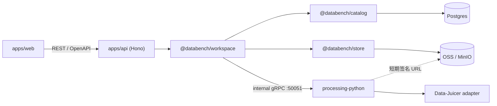
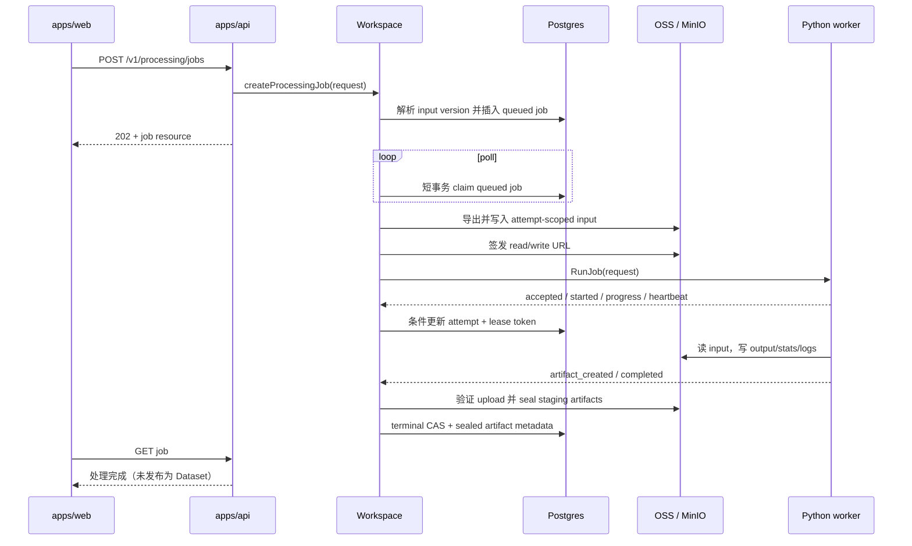
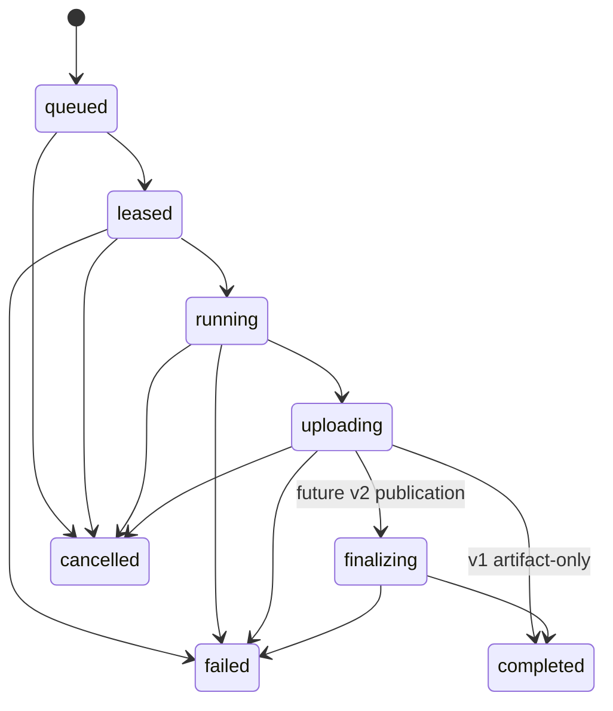

# Processing Service 技术方案

- **状态：** Revised draft — mandatory second-review blockers resolved; owner approval pending
- **日期：** 2026-07-23
- **对应决策：**
  [ADR-0010 — Python Processing Service over internal gRPC](../decisions/0010-python-processing-service-grpc.md)
- **适用范围：** 本机与可信私有网络中的第一版 Processing Service

## 1. 这份文档解决什么问题

ADR-0010 已经决定“为什么这样做”和不可改变的架构边界；本文进一步定义
“如何在当前 monorepo 中实现”，作为后续 Proto、Python worker、任务表、对象存储
工件和 API 变更的共同施工依据。

本文不是实现提交。本阶段不创建 Proto、不添加 Python 依赖、不修改 Prisma schema，
也不启动任何新服务。

### 1.1 第一版目标

第一版必须做到：

1. 在仓库内增加一个由原生 ARM64 Python 3.11 和原生 `uv` 管理的长驻 Python
   Processing Service。
2. TypeScript 作为 gRPC client，Python 作为 gRPC server；Hono REST/OpenAPI
   仍是唯一公共产品 API。
3. 用一个确定性的内部 fixture 跑通 `ProcessInline` 跨语言链路。
4. 用 Postgres 中的一张 `processing_jobs` 表支持持久化异步任务、进度、取消、
   lease 和进程重启后的明确恢复行为。
5. 用 OSS/MinIO 暂存大输入、输出、统计和日志；gRPC 只传控制信息与小数据。
6. 接入一个固定版本、固定算子集合的 Data-Juicer batch adapter。
7. Data-Juicer 第一版只生成开发/测试暂存工件，不生成 Databench Dataset version，
   不更新 ref，不写 lineage。

### 1.2 第一版明确不做

- 不做多租户、项目隔离、RBAC、配额、计费和公网暴露。
- 不做 LLM processor、模型供应商配置或自动重试付费任务。
- 不增加 Redis、RabbitMQ、独立调度服务或通用工作流引擎。
- 不做多 Python replica、worker 路由或分布式取消。
- 不做运行时安装 Python 包、任意 YAML、任意模块导入或任意 shell 执行。
- 不把大数据集放进 Proto 消息或 Postgres。
- 不改变现有 `/v1/transforms/*` 同步语义。
- 不在 canonical v2 的身份、版本和物理布局实现完成前增加兼容 importer/finalizer。

## 2. 已有代码边界

实现必须保持现有依赖 DAG：

```text
hashing ← schema ← {engine, io, catalog} ← {ops, store} ← workspace ← apps/api
```

具体约束如下：

| 边界 | 技术方案要求 |
|---|---|
| `apps/api` | 只通过 `@databench/workspace` 与 `@databench/schema` 使用 Processing 能力 |
| `packages/schema` | 继续拥有领域模型、公共 REST 校验和 OpenAPI 源 |
| `packages/catalog` | 只实现 Prisma/Postgres job 元数据操作，不知道 gRPC 和 Data-Juicer |
| `packages/store` | 提供受限的暂存工件与签名 URL 能力，不知道任务状态机 |
| `packages/workspace` | 组合领域校验、Catalog、Store 和内部 `ProcessingClient` |
| Python worker | 不连接 Postgres，不持有 OSS/MinIO 长期凭据，不计算 Databench version |

`apps/api/src/app.ts` 中的 `createApp()` 和 `createOpenApiDocument()` 必须保持无后台
副作用。Dispatcher 只能在真正的 API entrypoint 中启动，不能从路由、中间件、
模块顶层或 OpenAPI 生成路径启动。

## 3. 运行时架构



### 3.1 控制面与数据面

- **控制面：** REST、gRPC、Postgres job metadata、状态、进度、错误摘要。
- **数据面：** OSS/MinIO 中的 JSONL、Parquet、统计、日志和其他大工件。
- **发布面：** Dataset、version、ref、run/cache、lineage，始终由 Databench
  Workspace 拥有；第一版 Data-Juicer 不进入此面。

### 3.2 进程拓扑

第一版只有：

- 一个 API 进程；
- 一个 API 进程内 Dispatcher；
- 一个 Python Processing Service replica；
- 同一时间最多一个 batch job。

本机原生开发时，Python 默认监听 `127.0.0.1:50051`。全容器开发时，Python 可在
容器内监听 `0.0.0.0:50051`，但 Compose 不把该端口发布到宿主机公网接口，只允许
API 容器通过私有 service network 访问。

## 4. 建议仓库布局

```text
proto/
  buf.yaml
  buf.lock
  buf.gen.yaml
  databench/processing/v1/processing.proto

tooling/
  proto/
    package.json
    scripts/check-generated.mjs

packages/schema/src/
  processing.ts

packages/catalog/src/
  processing-jobs.ts

packages/store/src/
  staging-artifacts.ts

packages/workspace/src/
  processing.ts
  processing-client.ts
  processing-dispatcher.ts
  internal/grpc/
    grpc-processing-client.ts
    generated/

apps/api/src/
  routes/processing.ts

workers/processing-python/
  .python-version
  pyproject.toml
  uv.lock
  Dockerfile
  src/databench_worker/
    __init__.py
    config.py
    grpc_server.py
    job_runner.py
    registry.py
    adapters/
      __init__.py
      fixture.py
      data_juicer.py
    presets/
  src/databench/
    __init__.py
    processing/
      __init__.py
      v1/
        __init__.py
        processing_pb2.py
        processing_pb2_grpc.py
  tests/
```

`workers/processing-python` 是 monorepo 内独立的 Python workspace，不加入 pnpm
workspace。`tooling/proto` 是 pnpm workspace 内的生成工具包，根级 Proto/Turbo
命令经它调用 worker 目录中的原生 `uv run --frozen ...`；pnpm 只负责调度，不管理
Python 依赖。

上述顶层目录和文件必须同时登记在
[`project-structure.md`](../project-structure.md) 与
[`directory-layout.md`](../directory-layout.md) 后才可进入 P1。Workspace generated
文件只能位于 `src/internal/grpc/generated/`，不得从 package `index.ts` 导出，也不得
被 `apps/api` 深 import。Python generated 使用独立顶层私有 package
`databench.processing.v1`，不得嵌进 `databench_worker/generated`，避免
`grpcio-tools` 的绝对 import 与安装后的 package path 不一致。

## 5. 两套契约的职责

### 5.1 Zod：领域与公共 API

`packages/schema/src/processing.ts` 是以下内容的唯一手写来源：

- Processing job 的公共状态、请求和响应；
- Data-Juicer 第一版公开参数；
- processor capability 的公共视图；
- 进度和错误摘要的有界结构；
- 工件下载描述；
- OpenAPI schema。

建议的第一版公共模型：

```ts
type ProcessingJobStatus =
  | 'queued'
  | 'leased'
  | 'running'
  | 'uploading'
  | 'finalizing'
  | 'completed'
  | 'failed'
  | 'cancelled'

interface CreateProcessingJobRequest {
  processor: 'data_juicer'
  input: {
    dataset: string // ref 或 version；Workspace 在创建任务时解析为 version
  }
  parameters: {
    preset: string // 只能是 capability registry 返回的已安装 preset
  }
}

interface ProcessingJob {
  id: string
  processor: string
  processor_version: string
  status: ProcessingJobStatus
  result_kind: 'staging_artifacts'
  input_versions: string[]
  progress: ProcessingProgress | null
  artifacts: ProcessingArtifact[]
  output_version: string | null
  error: ProcessingError | null
  created_at: string
  started_at: string | null
  finished_at: string | null
}
```

实际实现使用 Zod 并遵循仓库 snake_case wire convention；上面的 TypeScript
只用于说明字段边界。

第一版请求没有 `output_ref`。数据库可以保留 nullable `output_ref` 作为未来 v2
finalizer 的接缝，但 API 不允许调用者提交它。`output_version` 在第一版
Data-Juicer job 中始终为 `null`。

公共 `ProcessingArtifact` 只暴露：

- 稳定的 `artifact_id`；
- 类型，如 `output`、`stats`、`logs`；
- 文件名、content type、byte size 和可选 digest；
- Databench API 下的下载地址。

它不暴露对象存储 key、签名 URL、内部 endpoint、lease token 或 worker 信息。

### 5.2 Proto：内部传输

Proto package 固定为：

```text
databench.processing.v1
```

第一版 service：

```proto
service ProcessingService {
  rpc DescribeCapabilities(DescribeCapabilitiesRequest)
      returns (DescribeCapabilitiesResponse);
  rpc ProcessInline(ProcessInlineRequest)
      returns (ProcessInlineResponse);
  rpc RunJob(RunJobRequest)
      returns (stream JobEvent);
  rpc CancelJob(CancelJobRequest)
      returns (CancelJobResponse);
}
```

同时实现标准 `grpc.health.v1.Health` service。Python 使用固定版本
`grpcio-health-checking` 自带 binding；本仓库不复制标准 health Proto，v1 Workspace
也不生成或调用 TS health client，而用有界 `DescribeCapabilities` 判断 worker 能力。

核心传输对象应表达：

| 对象 | 必需信息 |
|---|---|
| `ProcessorRef` | processor name、精确 version |
| `JsonPayload` | schema name、schema version、UTF-8 JSON bytes |
| `ArtifactRead` | target ID、logical name、`GET` URL、有界 required headers、expiry、max bytes、content type、可选 expected digest algorithm/value |
| `ArtifactWrite` | target ID、logical name、`PUT` URL、有界 required headers、expiry、max bytes、content type |
| `RunJobRequest` | job ID、attempt、lease token、processor、`JsonPayload parameters`、输入和输出 target |
| `JobEvent` | job ID、attempt、lease token、sequence、timestamp 和 typed event body；artifact 声明含 target ID、实际 bytes、content type、digest algorithm/value |
| `CancelJobRequest` | job ID、attempt、lease token |
| `CancelJobResponse` | cleanup result + worker single-slot 是否已 idle；token mismatch 不得停止其他执行 |
| `TraceContext` | request ID、trace ID |

`JobEvent` 使用 `oneof`，初始事件类型为：

- `accepted`
- `started`
- `progress`
- `heartbeat`
- `artifact_created`
- `completed`
- `failed`
- `cancelled`

每个事件都带 job ID、attempt 和 lease token。TypeScript 在处理事件前先进行 fencing
检查；旧 attempt 的迟到事件不能更新 job 或发布工件。

领域 JSON 和 processor parameters 都通过 `JsonPayload.json_utf8` 传输，不使用
`google.protobuf.Struct`，以免 Proto JSON 转换成为第二套领域模型并改变数字表示。
Workspace 收到数据后必须按 `schema_name + schema_version` 选择 Zod schema 解析，
解析失败就是 processor contract violation。

`RunJobRequest.parameters` 的 `schema_name/schema_version` 指向 Zod-owned 参数
schema。Workspace 必须先用 Zod parse，再编码 UTF-8 JSON bytes；Python 只做
adapter-local 与 allowlist 防御性校验。Proto capability 可以携带已安装 preset 名称
快照，但 Proto 不定义 `preset`、Data-Juicer operator 或其他公共业务参数字段。

### 5.3 生成工具

建议固定：

- Buf CLI：固定版本的 `@bufbuild/buf`；
- TypeScript：`ts-proto` + `@grpc/grpc-js`；
- Python codegen/runtime：`grpcio`、`grpcio-tools`、`grpcio-health-checking`，全部进入
  worker 的 `uv.lock`；P1 只加入生成/import 所需依赖，P2 再加入 health/server runtime。

P1 就必须创建 worker 的 `.python-version`、最小 `pyproject.toml` 和 `uv.lock`，只先
加入 Proto 生成/导入所需依赖；P2 再增加 server/runtime 代码，P5 才增加
Data-Juicer 依赖。生成链固定为：

```text
pnpm --filter @databench/proto proto:generate
  ├─ buf generate ...                         # ts-proto → Workspace 私有 generated
  └─ <native-uv> run --frozen python -m grpc_tools.protoc \
       -I ../../proto \
       --python_out=src --grpc_python_out=src \
       ../../proto/databench/processing/v1/processing.proto
                                                # cwd=worker；Python → src/databench/processing/v1

pnpm --filter @databench/proto proto:check
  ├─ buf lint
  ├─ 在临时目录重新生成并逐字节比较两个 generated 目录
  ├─ TS import + Python source-tree/wheel import smoke
  └─ buf breaking --against <merge-base/main proto module>
```

命令的实际参数由 `tooling/proto` package script 单一维护，根脚本和 CI 不复制长命令。
Python 命令从 `DATABENCH_PROCESSING_UV_BIN` 读取显式 executable，未设置时解析
`uv`。Apple Silicon preflight 必须拒绝 `/usr/local` 或 build target 为 x86_64 的
`uv`，要求版本为锁定的 `0.11.1`，并验证 `uv run --frozen python` 是 `3.11.15` 且
`platform.machine()` 为 `arm64`；不得引用
另一个桌面实验项目中的工具路径。

Python package discovery 必须同时包含 `databench_worker` 和 `databench`。生成路径与
Proto package `databench.processing.v1` 一致，不能为此关闭 Buf package-directory lint。
生成目录中的三个 `__init__.py` 是静态 package marker；生成命令不得覆盖或删除。
P1 import smoke 至少验证 `databench.processing.v1.processing_pb2` 与
`processing_pb2_grpc` 可从 source tree 和
构建后的 wheel 导入，不允许 import rewrite 或临时修改 `PYTHONPATH`。

P1 是第一个 Proto baseline：若目标分支尚无 `proto/buf.yaml`，该次只运行 lint、生成与
双语言 import smoke；P1 合入后所有 Proto 变更必须相对 merge base/main 运行 breaking
check，不能继续跳过。

生成文件提交进仓库，但不得手改。CI 只比较两处声明的 generated 输出，不得用全仓库
`git diff --exit-code` 把无关用户改动当成 codegen 失败。Proto
兼容规则为：

- 不复用已删除 field number；
- v1 只做向后兼容增加；
- 不原地改变 field 类型或语义；
- 不把领域 schema 复制进 Proto。

### 5.4 `RunJob` 事件与 stream 终止协议

以下自动机必须写进 Proto 注释。P1 验证 descriptor/oneof/跨语言固定 wire vector；
P2 用最小真实 server/client 验证正常 terminal→`OK EOF`；P3/P4 再验证数据库转换、
异常 EOF、取消和故障注入：

1. 每个 stream 的 `sequence` 从 1 开始并严格递增；重复、跳号或倒序都是
   `processing_protocol_violation`。
2. `accepted` 恰好一次且必须是 sequence=1，表示 Python 已登记 active job，并从此
   承担 heartbeat；数据库仍保持 `leased`。
3. `started` 恰好一次，执行 `leased → running`。在它之前只允许 `heartbeat` 或
   `failed/cancelled` terminal；`progress` 和 `artifact_created` 都必须在它之后。
4. 第一个 `artifact_created` 执行 `running → uploading`，后续声明保持
   `uploading`。target ID 必须来自当前 request allowlist，且每个 target 最多声明一次；
   重复、未知 target 或相互矛盾的 size/content type/digest 都是协议违规。该事件只是
   未验证的上传声明，不直接进入公共 artifact 列表。
5. `progress` 可出现在 `running/uploading`；`heartbeat` 可出现在 accepted 后的任一
   active 阶段。二者都不能出现在 terminal 后。
6. `completed` 只能从 `uploading` 发出，且所有必需 logical artifact 已恰好声明一次；
   `failed/cancelled` 可从 accepted 后的 `leased/running/uploading` 发出。
   `completed/failed/cancelled` 三者恰好一个，且必须是最后一个应用事件。
7. Worker 只有在对应执行单元及其 process group 已停止、不会再写 upload 后，才能发出
   terminal，并必须立即以 gRPC `OK` 结束 stream。Workspace 收到 terminal candidate
   先合法续租，再要求在独立的 terminal→EOF deadline（默认 5 秒且小于 lease）内收到
   `OK EOF`；超时按协议失败处理，不能把 terminal 后的静默等待到整个 job deadline。
8. Workspace 等到正常 EOF 后才执行 terminal CAS。`completed` 转由 TS seal renewer
   续租并实际验证/seal；正常 `failed/cancelled + OK EOF` 因 worker 已停止可以直接
   落终态并清 execution fence。
9. `OK EOF` 无 terminal、非 `OK` EOF、deadline、sequence/状态违规，都使仍 active
   的 v1 job 条件式进入 `failed`，保留 upload 工件但保留 cleanup-pending fence，调用
   `CancelJob` 确认 worker slot idle；不自动 reconcile/retry。
10. 上传完成但 `completed` 送达前断线同样按 failed 处理。第一版不从孤立 upload
    猜测成功；未来若要自动 reconciliation，必须另写可幂等算法和 ADR 修订。
11. 用户已通过 durable CAS 取消任务后，客户端取消产生的 gRPC `CANCELLED` 只用于
    回收资源，不得把 job 从 `cancelled` 改成 failed。Worker 主动返回 `cancelled`
    仍只是候选，只有 Workspace 的 fenced terminal CAS 能决定 durable state。

Worker event timestamp 只用于诊断；lease、started/finished time 和 terminal 竞争全部
使用 Postgres 时钟。任何 stream 出口都必须落入上述确定结果，不能无限等待 lease
之外的隐式状态。

`CancelJob` 是有界、幂等的 unary cleanup RPC：匹配 job/attempt/token 时，Python
执行 cooperative → terminate → kill，并在 process group 已停止、后续 upload 已停止
后返回。找不到匹配 execution 时不得终止别的 token。响应必须显式报告 single batch
slot 是否 idle；只有 `stopped` 或 `not_found` 且 `slot_idle=true` 才能清除 durable
cleanup fence。RPC 超时或 slot 仍 busy 时保留 fence 并重试，不得 claim 新任务后再靠
`RESOURCE_EXHAUSTED` 消耗它。

标准 `grpc.health.v1.Health` 由 Python 的 `grpcio-health-checking` 实现，不复制进
本仓库 Proto，也不生成 TS health binding；P2 server test 验证该标准服务。

## 6. 同步短任务

`ProcessInline` 只处理有界的小 payload：

1. Workspace 用 Zod 校验调用参数；
2. TS client 设置 10 秒默认 deadline；
3. Python registry 根据精确 processor name/version 查找实现；
4. Python 返回 `JsonPayload`；
5. Workspace 再用对应 Zod schema 校验结果；
6. 调用者得到领域值或类型化错误。

第一阶段只注册私有的 `fixture.echo-json`：

- 输入和输出都是通用 JSON fixture；
- 输出确定性；
- 不访问网络、不访问对象存储；
- 只用于跨语言 contract、deadline 和 error mapping 测试；
- 不进入 processor 公共列表，也不增加公共 HTTP endpoint。

在选定真实产品级 inline processor 前，Web UI 和公共 REST 不暴露
`ProcessInline`。

默认限制：

- JSON payload 最大 1 MiB；
- gRPC 单消息最大 4 MiB；
- deadline 10 秒；
- 超限在发起 gRPC 前由 Workspace 拒绝。

## 7. 异步 batch job 全流程



### 7.1 创建任务

Workspace 在返回 job ID 前完成：

1. 校验公共请求；
2. 通过有界 deadline 的 `DescribeCapabilities` 读取 Python registry 的已安装能力；
   Workspace 可以在 Processing runtime 内缓存默认 30 秒的短时 snapshot，但不存在
   第二份 TS processor registry；snapshot 缺失/过期时等待一次有界 capability RPC，
   worker 不可用则拒绝创建任务；
3. 把输入 ref 解析为不可变 version；
4. 记录精确 processor version；
5. 创建 `queued` job，`attempt = 0`、`max_attempts = 1`；
6. 返回 job resource。

任务创建不等待 Python 执行 job，也不预占长事务；但 capability snapshot 缺失或过期
时会等待上述有界 RPC。第一版不提供自动重试按钮；手动重跑会创建一个新的 job ID，
从而保留失败任务的可诊断性。

### 7.2 Claim 与 lease

Dispatcher 只在当前没有 active batch job 时轮询，每秒最多 claim 一个任务。
Catalog 在短 Postgres 事务内完成：

1. 获取 Processing 固定 key 的 transaction-scoped Postgres advisory lock；
2. 确认不存在任何 `lease_token IS NOT NULL` 的 execution fence；它既覆盖
   `leased/running/uploading` active job，也覆盖 `failed/cancelled` cleanup-pending job，
   从而把 concurrency=1 约束到数据库而不只依赖进程内布尔值；
3. 从 `queued` 中按 `created_at, id` 取第一个任务；
4. 使用 `FOR UPDATE SKIP LOCKED` 锁定候选；
5. 把状态改为 `leased`；
6. 把 attempt 从 0 增为 1；
7. 写入随机 lease token、dispatcher owner 和 lease expiry；
8. 提交并返回完整 job snapshot。

事务提交后才准备工件和调用 gRPC。任何网络、对象存储或 Python 操作都不得发生在
该事务中。

虽然第一版只有一个 Dispatcher，这个 claim 形状仍防止开发热重载或短暂双实例同时
取走两个不同任务。Python worker 也必须把第二个并发 `RunJob` 立即返回
`RESOURCE_EXHAUSTED`，不得在进程内静默排队；该响应是最后防线，不能替代数据库
execution fence，也不能直接消耗一个尚未执行的新 job。

### 7.3 心跳与 fencing

建议默认值：

- Python heartbeat：10 秒；
- lease：30 秒；
- Dispatcher poll：1 秒。

收到合法 `accepted`、`started`、`progress`、`heartbeat` 或 `artifact_created` 时，Catalog
通过以下条件更新：

```text
id = job_id
AND attempt = event.attempt
AND lease_token = event.lease_token
AND lease_expires_at > database_clock_now()
AND status IN (leased, running, uploading)
```

更新成功才延长 lease。更新行数为 0 表示事件已过期，Dispatcher 丢弃该事件并取消
对应 gRPC call。lease token 只用于 stale-event fencing，不是最终的服务认证机制，
不得写入日志或公共错误。

从 claim 成功到收到首个合法 `accepted` 事件之间，Python 尚不能承担 heartbeat。
Dispatcher 必须启动 preparation renewer，在导出 Dataset、上传 input、签发 URL 和建立
gRPC stream 期间按当前 attempt/token 条件续租。该续租：

- 使用 Postgres 时钟；
- 只允许未过期的 `leased` job 续租，不能复活过期 lease；
- `accepted` 本身先完成一次合法 event renew，再停止 preparation renewer；此后只有
  合法 worker event 才续租；
- 受独立 preparation deadline 约束，默认 10 分钟；
- 在发出 `RunJob` 前失败可条件式写入 `failed` 并清 fence；一旦 RPC 已发出却未收到
  合法 `accepted`，worker 是否已登记执行未知，必须写 `failed` 但保留 cleanup fence，
  再走 `CancelJob` drain。

`failExpiredProcessingLeases` 与所有 renew/event/terminal CAS 都使用互斥条件：expiry
sweeper 只处理 `lease_expires_at <= database_clock_now()`，其他更新只处理严格大于当前
数据库时间的 lease。实现不得用 Node/Python 本地时钟判断谁胜出。

`lease_token` 在 active 阶段用于 stale-event fencing；TS 需要终止一个可能仍存活的
执行时，同一 token 在 terminal row 上继续作为 cleanup-pending handle。cleanup-pending
不再续租，也不允许事件更新，但在 worker 明确确认 slot idle 前阻止下一次 claim。

### 7.4 完成语义

Python 的 `completed` 表示 processor 已完成并上传声明的工件，不表示 Databench
Dataset 已发布。

第一版 Data-Juicer 路径：

```text
running → uploading → completed
```

Workspace 验证：

- 所有必需 logical artifact 已声明；
- upload object 位于当前 job/attempt/target-token namespace；
- Store 对实际对象执行 HEAD/metadata 检查，不信任 worker event 自报结果；
- 实际 size/content type 不超限，checksum/digest 按 adapter 能力验证，绝不把 multipart
  ETag 当内容摘要；
- Store 把验证后的对象条件式 seal 到 worker 无权写入的 staging artifact key，或者
  固定不可变 object version/generation；
- 当前 lease 仍未过期，job 仍为 `uploading`。

所有必需工件 seal 成功后，Workspace 用一次 terminal CAS 同时写入 sealed artifact
metadata、终态时间并清除 lease，然后标记：

```text
result_kind = staging_artifacts
output_version = null
output_ref = null
```

UI 必须显示“处理完成（未发布为数据集）”，不能把它展示成新的 Databench version。

Worker 的 signed PUT 即使尚未过期，也只能覆盖或新增它自己的 upload target，不能
改变 completed job 引用的 sealed key/version。seal 过程中若取消或 terminal CAS
失败，sealed/upload 对象成为可清理孤儿，但不能进入 job 公共结果。

从合法 `completed` candidate + `OK EOF` 到 terminal CAS 之间，Workspace 在
`uploading` 状态运行 TS-owned seal renewer，规则与 preparation renewer 相同：只能续租
未过期的当前 attempt/token，并受独立 seal deadline（默认 10 分钟）约束。这只是
staging artifact 完整性步骤，不读取/导入领域数据，也不是 v2 canonical finalizer。

`finalizing` 状态为 v2 预留。第一版 Data-Juicer 不进入该状态，也不记录 run/cache、
lineage 或 ref。

## 8. Job 数据模型

建议 Prisma 模型如下；字段名以实际迁移时的仓库 convention 为准：

```prisma
enum ProcessingJobStatus {
  queued
  leased
  running
  uploading
  finalizing
  completed
  failed
  cancelled
}

model ProcessingJob {
  id                String              @id @db.Uuid
  processor         String
  processorVersion  String              @map("processor_version")
  status            ProcessingJobStatus
  resultKind        String              @default("staging_artifacts") @map("result_kind")
  params            Json                @map("params_json")
  inputVersions     Json                @map("input_versions_json")
  inputArtifacts    Json                @map("input_artifacts_json")
  outputRef         String?             @map("output_ref")
  outputArtifacts   Json                @map("output_artifacts_json")
  outputVersion     String?             @map("output_version")
  attempt           Int                 @default(0)
  maxAttempts       Int                 @default(1) @map("max_attempts")
  leaseOwner        String?             @map("lease_owner")
  leaseToken        String?             @map("lease_token") @db.Uuid
  leaseExpiresAt    DateTime?           @map("lease_expires_at") @db.Timestamptz(6)
  progress          Json?               @map("progress_json")
  error             Json?               @map("error_json")
  createdAt         DateTime            @default(now()) @map("created_at") @db.Timestamptz(6)
  startedAt         DateTime?           @map("started_at") @db.Timestamptz(6)
  finishedAt        DateTime?           @map("finished_at") @db.Timestamptz(6)
  updatedAt         DateTime            @updatedAt @map("updated_at") @db.Timestamptz(6)

  @@index([status, createdAt], map: "idx_processing_jobs_dispatch")
  @@index([leaseExpiresAt], map: "idx_processing_jobs_lease")
  @@map("processing_jobs")
}
```

JSON 字段只保存有界控制信息：

- `params_json`：经过 Zod 校验的 preset 选择；
- `input_versions_json`：解析后的 version 列表；
- `*_artifacts_json`：logical ID、内部 key、size、digest、content type；
- `progress_json`：phase、current、total、message 等最后快照；
- `error_json`：code、用户可理解 message、retryable 和有界 detail。

完整输入、输出、日志、traceback 和统计绝不进入 Postgres。所有 JSON 字段在写入前
设置数量和字节上限。

### 8.1 状态转换



允许的写操作必须集中在 Catalog 方法中，不能由 Workspace 任意更新 `status` 字符串。
建议提供明确方法：

- `createProcessingJob`
- `claimNextProcessingJob`
- `renewProcessingPreparationLease`
- `renewProcessingTerminalEofLease`
- `renewProcessingSealLease`
- `markProcessingJobRunning`
- `updateProcessingJobProgress`
- `recordProcessingUploadClaim`
- `completeArtifactProcessingJob`
- `failStoppedProcessingJob`
- `failProcessingJobForCleanup`
- `cancelProcessingJob`
- `failExpiredProcessingLeases`
- `listProcessingCleanupPending`
- `completeProcessingCleanup`
- `getProcessingJob`
- `listProcessingJobs`

各方法使用明确、互不混淆的 CAS：renew/event/normal terminal/cleanup-complete 携带
attempt + lease token 并检查影响行数；queued cancel 没有 token；expiry sweeper 由数据库
条件发现已过期 active row。renew/event/normal terminal 必须同时要求未过期 lease。
terminal-EOF renew 只允许收到唯一合法 terminal candidate 后的当前 active status，并受
5 秒 deadline 约束，不能接受任何后续应用事件。

所有 terminal CAS 都设置 `finished_at`，但只有 worker terminal + `OK EOF` 已证明执行
停止的 normal terminal，以及 `completeProcessingCleanup`，才能清空
`lease_owner/lease_token/lease_expires_at`。TS-side cancel、expiry、deadline、协议失败和
non-OK EOF 先保留 attempt/token 作为 cleanup fence。通过 raw SQL 更新时也必须显式
更新 `updated_at`，不能依赖 Prisma `@updatedAt` 自动处理 raw statement。

## 9. Dispatcher 生命周期与恢复

### 9.1 启动

真实 API entrypoint 负责显式构造共享 Workspace：

```ts
const workspace = Workspace.open(workspaceOptions)
const app = createApp({ workspace, ...httpOptions })
const dispatcher = createProcessingDispatcher({ workspace, ...processingOptions })
await dispatcher.start()
const server = serve({ fetch: app.fetch, port })
```

这是结构示例，不是本阶段代码。`dispatcher.start()` 必须只完成初始化并启动后台 loop
后返回，不能长期阻塞；初始化失败时 API 不开始监听。它不要求 worker 当时健康，但
必须成功建立本地 runtime、配置、Catalog/Store 与可关闭的 gRPC client。`createApp()`
和 `createAppFromConfig()` 本身仍不启动 dispatcher，不创建 timer，也不发起 gRPC
连接。

### 9.2 停止

收到 `SIGINT`/`SIGTERM` 时按顺序：

1. 停止 HTTP 接受新请求，并让 in-flight HTTP 在有界 grace period 内结束；
2. 停止 claim 新任务以及 preparation/seal renewer；
3. 给当前 gRPC call 发送 cancel；
4. 在有界 grace period 内等待当前事件消费退出；
5. 关闭 gRPC channel；
6. 关闭 Workspace/Catalog。

如果进程被强制终止，当前 job 的 lease 到期后变成 `failed`，不自动重新运行 Python。

### 9.3 重启恢复

启动时和每轮 poll 前，Dispatcher 调用由 Postgres 自己取时钟的
`failExpiredProcessingLeases()`：

- `leased/running/uploading` 且 lease 已过期 → `failed`；
- error code 固定为 `processing_lease_expired`；
- 保留 attempt-scoped 工件用于诊断或人工清理；
- 保留原 attempt/token 作为 cleanup-pending execution fence；
- 不自动 requeue。

每轮先处理所有 cleanup-pending row，再考虑 claim。Dispatcher 对它们发送有界、幂等
`CancelJob`；只有响应确认 matching execution 已停止或不存在且 `slot_idle=true`，才用
`id + attempt + token + terminal status` CAS 清空 execution fence。RPC 超时、worker
不可达或 slot 仍 busy 时保持 fence，本轮不得 claim；下轮和 API 重启后继续重试。
这关闭“terminal CAS 后、worker cleanup 前再次崩溃”的窗口。

`finalizing` 将来由 TS 执行且要求幂等，可以在确认 v2 finalizer 后采用不同恢复策略；
第一版没有该路径。

### 9.4 取消

取消请求本身就是 durable terminal transition：

- `queued`：Catalog 用 CAS 原子改为 `cancelled` 并写 `finished_at`；
- `leased/running/uploading`：Catalog 用 `id + active status + attempt + lease token`
  CAS 原子改为 `cancelled`，写 `finished_at`，但保留 attempt/token 作为 cleanup fence；
- `completed/failed`：返回明确 conflict；已经 `cancelled` 则幂等返回当前资源。

只有 cancellation CAS 成功后，Dispatcher 才取消活动 gRPC call，并进入可跨重启重试的
`CancelJob` cleanup。Python 的响应只确认资源回收，不决定 durable state；确认
`slot_idle=true` 后 Catalog 再 CAS 清除 execution fence。取消与 completion 同时发生时，
两者的 terminal CAS 只有一个能成功；之后到达的 `completed` 或 expiry 更新因
status/token fencing 被拒绝。

第一版不允许取消已经进入未来 `finalizing` 的任务，因为那一阶段只做可幂等的
TS publication；具体语义在 v2 finalizer 方案中决定。

## 10. 暂存工件

### 10.1 key 规则

所有 Processing 工件都位于：

```text
processing/jobs/<job-id>/attempts/<attempt>/input.jsonl
processing/jobs/<job-id>/attempts/<attempt>/uploads/<target-token>/output.jsonl
processing/jobs/<job-id>/attempts/<attempt>/uploads/<target-token>/stats.json
processing/jobs/<job-id>/attempts/<attempt>/uploads/<target-token>/logs.jsonl
processing/jobs/<job-id>/attempts/<attempt>/artifacts/output.jsonl
processing/jobs/<job-id>/attempts/<attempt>/artifacts/stats.json
processing/jobs/<job-id>/attempts/<attempt>/artifacts/logs.jsonl
```

这些不是 canonical `objects/<hash>/...` key。Python 不能指定完整 key，只能使用
TS 已创建的 logical read/write target。`uploads/` 是 worker 可写的临时区；
`artifacts/` 是 Store 条件式创建或固定 version/generation 的 sealed 区，worker
永远拿不到其写权限。

### 10.2 Store 接口

`@databench/store` 增加 namespace-aware 的 staging artifact 能力。接口接收
`jobId + attempt + logical artifact kind`，在 Store 内部构造并校验 key，避免
Workspace 或 Python 传入任意 canonical key。

能力至少包括：

- 流式写入 input artifact；
- 检查实际 upload object 的 metadata、size 和 checksum；
- 生成限时 read URL；
- 生成限时 write URL；
- 把验证后的 upload seal 为 write-once artifact，并返回固定 key/version/generation；
- 流式读取 sealed artifact；
- 删除指定 attempt 的暂存工件。

OSS 和 S3/MinIO adapter 必须实现相同语义。签名 URL 生成时使用 Python worker
实际可访问的 endpoint，签名后不得替换 host。seal 优先使用 provider 的 conditional
create/copy 或 object version/generation；若 provider 不能给出可信内容 digest，Store
必须在流式读取 upload、条件式写 sealed object 时计算标明算法的 digest。ETag 只能
作为 provider metadata，不能冒充内容 digest。

### 10.3 URL 与权限

- input URL：仅允许读一个 input object；
- output/stats/log URL：每个仅允许写一个带随机 target token 的 upload object；
- batch 默认 deadline 60 分钟；
- worker URL TTL 默认 75 分钟；
- URL 不写 Postgres、不进 progress、不进异常消息、不进普通日志；
- Proto debug logging 必须关闭或提供字段级 redaction。

第一版 job 超过 60 分钟即失败，不做 URL refresh。后续只有真实运行数据证明需要时，
才讨论双向 stream 或可续期凭据。

### 10.4 清理

第一版先提供显式维护命令，按 job 状态和保留期删除失败/取消/过期任务的暂存工件，
不增加常驻 GC 服务。删除前必须只解析受限 namespace，并支持 dry-run。

成功的 sealed artifact-only 输出需要保留多久属于运维配置；建议开发默认 7 天。该值不是
领域语义，未来可以调整。

## 11. Workspace 设计

### 11.1 Transport-neutral client

Workspace 内部定义：

```ts
interface ProcessingClient {
  describeCapabilities(): Promise<ProcessingCapabilities>
  processInline(request: InlineProcessingRequest, signal?: AbortSignal): Promise<unknown>
  runJob(request: ProcessingRunRequest, signal?: AbortSignal): AsyncIterable<ProcessingEvent>
  cancelJob(request: ProcessingCancelRequest): Promise<ProcessingCancelResult>
  close(): Promise<void>
}
```

- `GrpcProcessingClient` 是接口的内部实现；
- 单元测试使用 deterministic fake；
- `apps/api` 不导入接口实现或 generated Proto；
- Proto DTO 只在 `packages/workspace/src/internal/grpc/` 出现；
- Workspace 对进入和离开 transport 的值都做显式映射与 Zod 校验。

### 11.2 Workspace 对外方法

第一版 API 只需要：

- `listProcessingProcessors()`
- `createProcessingJob(request)`
- `listProcessingJobs(query)`
- `getProcessingJob(id)`
- `cancelProcessingJob(id)`
- `getProcessingArtifactDownload(id, artifactId)`

Dispatcher 通过单独的 Workspace orchestration surface 使用 claim、事件消费和
Store 能力。API route 不得直接调用 Catalog job 方法。

### 11.3 输入导出

第一版 Data-Juicer job 接受一个现有 Databench v1 Dataset ref/version。创建任务时
Workspace 固定解析后的 version；dispatch 时从该 version 导出约定的 JSONL profile
并流式写入 attempt-scoped `input.jsonl`。

该 JSONL 只是 Data-Juicer adapter 输入，不是新的 canonical v2 物理格式。输出
`output.jsonl` 也不自动调用当前 `addJsonl()`，避免把临时兼容映射误当成 v2
identity/finalizer。

## 12. 公共 REST 设计

建议第一版路由：

```text
GET  /v1/processing/processors
POST /v1/processing/jobs
GET  /v1/processing/jobs
GET  /v1/processing/jobs/{id}
POST /v1/processing/jobs/{id}:cancel
GET  /v1/processing/jobs/{id}/artifacts/{artifactId}/download
```

行为：

- `POST jobs` 返回 `202` 和完整 job resource；
- list 使用现有 pagination convention，并支持可选 status；
- cancel 为幂等操作：已经 cancelled 返回当前资源，completed/failed 返回明确冲突；
- download 校验 artifact 属于 job 且是 sealed key/version 后，由 API 流式代理 Store
  read response；v1 不把 bearer 型签名 URL 放进浏览器、`Location`、JSON 或日志；
- 不增加公共 inline route。

`CapabilityFeaturesSchema` 后续增加 `processing: boolean`。未配置 Python target 时：

- processing capability 为 `false`；
- Processing 路由保持在确定性的 OpenAPI 中，但运行时返回统一
  `processing_disabled` 错误；
- 不创建 Dispatcher，不尝试连接 gRPC。

这能保持 OpenAPI 与部署环境无关，同时避免“仅生成 OpenAPI 就启动后台服务”。

### 12.1 错误映射

Python/gRPC → Workspace typed domain error → API error envelope：

```text
INVALID_ARGUMENT        → processing_invalid_parameters     → 422
NOT_FOUND               → processor_not_available           → 409
DEADLINE_EXCEEDED       → processing_deadline_exceeded      → 504
RESOURCE_EXHAUSTED      → processing_resource_exhausted     → 503
UNAVAILABLE             → processing_service_unavailable    → 503
cancelled job           → processing_job_cancelled          → job state
stale lease/event       → internal discard/fencing          → 不公开 transport detail
```

只有 `apps/api` 映射 HTTP status。Python traceback 只进入受保护的日志工件，浏览器
只看到稳定 code、简短 message 和安全的 detail。

所有对外错误码遵守 `conventions.md` 的集中 snake_case 枚举。`@databench/schema`
需要增加类型化的 unavailable、deadline-exceeded、resource-exhausted 领域错误分类；
Workspace 把 gRPC status 映射为这些领域错误，只有 `apps/api` 把分类映射为 503/504。
Proto `failed` event 只携带稳定的 snake_case processor error code 和安全摘要，不携带
HTTP status，也不成为另一份公共错误枚举。

## 13. Python Processing Service

### 13.1 运行时

- `.python-version` 固定 `3.11.15`；
- `uv.lock` 提交；
- 本机要求 `platform.machine() == "arm64"`；
- Apple Silicon 上 `uv` 与 Python 都必须为 arm64，禁止使用 `/usr/local` 下的 Rosetta
  工具；第一版固定 `uv 0.11.1`，codegen 入口支持
  `DATABENCH_PROCESSING_UV_BIN` 显式指定并执行版本/架构 preflight；
- `uv sync --frozen` 和 `uv run --frozen`；
- Docker image 同时固定 Python minor、uv version 和 lock；
- 容器不以 root 运行，并使用独立临时目录。

### 13.2 Registry

Registry entry 至少包含：

- processor name；
- 精确 processor version；该版本必须能唯一指向 adapter 版本、锁定的
  Data-Juicer 版本和 preset 内容，不能只使用易漂移的展示名称；
- 支持 `inline`、`batch` 中的哪一种；
- 输入/输出 schema reference；
- preset 列表；
- 最大并发、deadline 和资源提示；
- factory/handler。

Registry 只从代码和构建进镜像的 preset 加载。RPC 参数不能包含 Python module、
class、文件系统路径、shell 命令或远程安装地址。

初始 registry：

| Processor | 可见性 | 模式 | 用途 |
|---|---|---|---|
| `fixture.echo-json` | internal test only | inline | 跨语言确定性测试 |
| `data_juicer` | local/private | batch | 固定 non-LLM preset 的 Data-Juicer 处理 |

### 13.3 执行隔离

gRPC event loop 不直接运行重 CPU/阻塞的 Data-Juicer 调用。`job_runner` 在有界执行
单元中运行 adapter，使 health check、heartbeat 和 cancellation 仍能响应。

第一版 batch concurrency 固定为 1，因此可以使用单独的 worker process 或有界
process executor。具体选型在 worker skeleton spike 中用以下标准确定：

- Data-Juicer 是否能被协作式取消；
- 是否会阻塞 Python gRPC event loop；
- macOS 和 Linux 容器启动行为是否一致；
- 子进程退出后临时文件是否可清理；
- 不允许在 job 内启动未受控的额外 distributed runtime。

“可以真正终止运行中的 job”是 spike 的通过条件，不只是比较项。如果 executor 无法
终止已进入 C extension、第三方子进程或阻塞 I/O 的任务，就必须改用由 parent 管理的
独立 process/process group。取消和 deadline 统一执行：cooperative cancel → 有界
grace → terminate process group → kill，并验证没有孤儿进程、后续 PUT 或残留临时
目录。无论采用哪种执行单元，对外 gRPC 契约和 job state machine 不改变。

### 13.4 Data-Juicer adapter

第一版 adapter：

1. 接收一个只读 input URL 和预先分配的 output/stats/log write URL；
2. 下载到 job 专属临时目录；
3. 从 registry 解析命名 preset；
4. 调用固定版本 Data-Juicer library；
5. 定期报告有界 progress/heartbeat；
6. 输出 JSONL、统计和日志；
7. 上传到预分配 target；
8. 返回不含签名 URL 的 artifact metadata；
9. 清理本地临时目录。

Parent 必须把 child stdout/stderr 同时送入受保护的结构化服务日志，并保留有界、脱敏
的末尾 ring buffer；`logs.jsonl` 是补充工件，不能是崩溃诊断的唯一来源。OOM、signal、
deadline 和 forced kill 进入安全的 exit-kind/error ID，不把 traceback 写进公共
`error_json`。

具体 Data-Juicer operator 名称必须以最终锁定版本的实际 registry 为准，并在 adapter
PR 中形成版本化 preset 文件和 golden fixture。第一版至少有：

- 一个最小 deterministic smoke preset，用于跨平台集成测试；
- 一个基础 non-LLM cleaning preset，用于本机真实数据评估。

不接受调用者提交任意 Data-Juicer YAML 或任意 operator 列表。增加或改变 preset
等同于改变 processor version，必须有测试和变更记录。

## 14. 配置

建议环境变量：

| 变量 | 默认值 | 说明 |
|---|---:|---|
| `DATABENCH_PROCESSING_ENABLED` | `false` | 显式启用本地/私有 Processing |
| `DATABENCH_PROCESSING_TARGET` | 无 | 如 `127.0.0.1:50051` |
| `DATABENCH_PROCESSING_DISPATCHER_ID` | 启动时生成 | lease owner，仅用于诊断 |
| `DATABENCH_PROCESSING_POLL_MS` | `1000` | claim 间隔 |
| `DATABENCH_PROCESSING_HEARTBEAT_MS` | `10000` | 预期 worker heartbeat |
| `DATABENCH_PROCESSING_LEASE_MS` | `30000` | job lease |
| `DATABENCH_PROCESSING_PREPARATION_DEADLINE_MS` | `600000` | input 准备/建 stream deadline |
| `DATABENCH_PROCESSING_SEAL_DEADLINE_MS` | `600000` | output 验证/seal deadline |
| `DATABENCH_PROCESSING_TERMINAL_EOF_MS` | `5000` | terminal event 到 `OK EOF` 的上限，必须小于 lease |
| `DATABENCH_PROCESSING_INLINE_DEADLINE_MS` | `10000` | inline deadline |
| `DATABENCH_PROCESSING_JOB_DEADLINE_MS` | `3600000` | batch deadline |
| `DATABENCH_PROCESSING_SIGNED_URL_TTL_MS` | `4500000` | worker URL TTL |
| `DATABENCH_PROCESSING_CAPABILITY_TTL_MS` | `30000` | capability snapshot freshness |
| `DATABENCH_PROCESSING_CONCURRENCY` | `1` | 第一版只允许 1 |

Python 侧对应：

| 变量 | 默认值 | 说明 |
|---|---:|---|
| `DATABENCH_WORKER_BIND` | `127.0.0.1:50051` | 本机绑定地址 |
| `DATABENCH_WORKER_MAX_INLINE_BYTES` | `1048576` | inline payload 上限 |
| `DATABENCH_WORKER_MAX_MESSAGE_BYTES` | `4194304` | gRPC 消息上限 |
| `DATABENCH_WORKER_CONCURRENCY` | `1` | batch 并发 |
| `DATABENCH_WORKER_CANCEL_GRACE_MS` | `5000` | terminate 前的协作取消窗口 |
| `DATABENCH_WORKER_ARTIFACT_HOSTS` | 无 | batch 模式必填的 scheme/host/port allowlist |
| `DATABENCH_WORKER_TEMP_ROOT` | 系统临时目录下的专属目录 | job 临时文件 |

约束必须在 Zod/Pydantic config load 时检查：

- processing enabled 时 target 必填；
- URL TTL 大于 job deadline + 安全余量；
- lease 至少大于两次 heartbeat；
- terminal→EOF deadline 小于 lease；
- 第一版 concurrency 只能为 1；
- 启用 batch processor 时 artifact host allowlist 非空；
- 非 loopback/私有部署不允许无意启用 plaintext worker。

## 15. 安全边界

第一版只授权本机和可信私有网络：

- gRPC 端口不经过公网 ingress；
- Processing REST 路由不得在 Internet-facing 部署中启用；
- Python 没有数据库凭据；
- Python 没有对象存储长期 access key；
- 签名 URL 权限限制到单个 object 和单一读/写动作；
- 参数不允许 secrets；
- worker 默认无外网需求；
- 禁止运行时安装依赖；
- 浏览器 token 不复用为 worker credential。

Python 还必须校验 artifact URL 的 scheme 与允许的对象存储 host/port；即使 gRPC
处在可信私网，也不能把任意 caller URL 当作可访问目标，以避免 SSRF 或把输出上传到
未配置 endpoint。allowlist 来自 worker 启动配置，不来自 RPC request。

未来生产托管平台确定后，再单独决定 mTLS 或 TLS + service credential。本文不提前
实现一套与平台不匹配的认证系统。

## 16. 可观测性

日志统一使用以下关联字段：

```text
request_id
trace_id
job_id
attempt
processor
processor_version
event_type
```

禁止记录：

- lease token；
- signed URL 或其中的 query；
- 数据内容；
- 完整 params 中可能出现的敏感值；
- Python traceback 到公共 API 日志。

Postgres `progress_json` 只保留最后快照。完整事件和日志进入 attempt-scoped
`logs.jsonl`。第一版不新增 event history table。

建议最低指标：

- queued job 数；
- active job 数；
- job duration；
- completed/failed/cancelled 数；
- lease expiry 数；
- stale event 丢弃数；
- gRPC unavailable/deadline 数；
- artifact upload/download duration 和 bytes；
- preparation duration 和 renew failure；
- last-heartbeat age、cancel latency、stream termination reason；
- child exit kind/signal 与 forced-kill 数。

如果当前栈尚无 metrics backend，先输出结构化、无敏感信息的计数日志，不为这一版
引入新的有状态观测系统。

## 17. 测试方案

### 17.1 Contract 和生成

- Buf lint；
- Proto breaking check；
- TS/Python 临时目录重新生成与声明的 generated 目录逐字节一致；
- Apple Silicon codegen preflight 拒绝 x86_64 `uv`/Python；
- Python generated 从 source tree 和 wheel 均可 import，不修改 `PYTHONPATH`；
- 两端 capability snapshot 一致；
- 未知 field 可被旧 client 安全忽略；
- JSON bytes 通过 Zod 后保持预期值；
- parameters 使用 `JsonPayload`，Proto 中没有 Data-Juicer 业务参数副本；
- P1 用固定 wire vector 验证 accepted/started/artifact/terminal oneof 和字段；P2 验证
  正常 terminal→OK EOF，P3/P4 验证完整状态自动机与异常 EOF。

### 17.2 Python unit

- registry 只加载 allowlist；
- fixture 确定性；
- 未知 processor/preset 拒绝；
- payload/message 上限；
- URL 和 lease token 日志脱敏；
- 临时目录成功/失败/取消均清理；
- Data-Juicer adapter 使用 fake artifact server 验证 I/O；
- 永不返回和生成孙进程的 test adapter 经 cancel/deadline 后可被强制终止；
- crash/OOM/signal 路径仍留下有界、脱敏的 parent diagnostic。

### 17.3 Catalog 和 Dispatcher

- FIFO claim；
- 两个并发 claimant 只能有一个成功；
- 两个 Dispatcher 重叠时全局只产生一个 active job；
- claim 事务不跨 gRPC；
- preparation 超过一个 lease 周期仍能条件续租；
- preparation 期间 crash 后 lease 只能过期失败，不能被旧 token 复活；
- seal 超过一个 lease 周期仍能续租，seal 期间 crash 后只能过期失败；
- heartbeat 延长 lease；
- terminal candidate 合法续租一次且 terminal→EOF 超时后进入 cleanup-pending failed；
- heartbeat renew 与 `failExpired` 在边界竞争时只有一个成功；
- 错 attempt/token 不能更新；
- lease expiry 变为 failed，不自动 requeue；
- queued 和 running 取消；
- cancel 与 completed 并发时只有一个 terminal CAS 成功；
- cancelled 后的迟到 completed 被拒绝；
- API 重启后的过期 lease 恢复；
- API 重启时 worker 仍执行旧 job，先清理/隔离旧 slot 再 claim；
- cancellation CAS 后、`CancelJob` 前 crash，重启后仍保留 cleanup fence 并恢复清理；
- expiry CAS 后、`CancelJob` 前 crash，重启后仍不能 claim 下一任务；
- `CancelJob` timeout 或 `slot_idle=false` 时 queued job 不被 claim；
- cleanup 完成的 stale token 不能清除另一个 execution fence；
- `max_attempts = 1`；
- claim 后、input 上传后、artifact 上传后、terminal event 后/DB CAS 前逐点 crash；
- OK EOF 无 terminal、non-OK EOF、重复/跳号/倒序 event 都得到确定 failed 结果。

### 17.4 Store

- S3/MinIO 与 OSS 生成的 URL 权限和 TTL；
- worker 可访问签名时使用的 host；
- write URL 不能读取、read URL 不能写入；
- namespace traversal 被拒绝；
- 大工件流式处理，不整体读入内存；
- 对象缺失、部分上传、超限、digest 不符都不能 completed；
- worker 的旧 PUT URL 不能覆盖 completed job 的 sealed artifact；
- seal 只完成部分工件时取消获胜，公共 artifacts 仍为空；
- seal 完成、completion CAS 前 crash 时 sealed 对象不公开且可作为 orphan 清理；
- 下载 route 只流式读取 sealed key/version，不签发浏览器 URL；
- dry-run 清理不会删除 canonical objects。

时间类单测使用 injected/fake clock，但 lease 边界、advisory-lock claim 和 terminal CAS
竞争必须运行真实 Postgres。gRPC/工件集成测试使用可编程 fake worker 与 fake artifact
server 注入延迟、RST/EOF、重复事件、部分上传和旧 PUT，不能只依赖 happy-path mock。

### 17.5 跨语言 E2E

分三层数据规模：

| 层级 | 数据规模 | 运行位置 | 目的 |
|---|---:|---|---|
| PR smoke | 100 条左右 | CI | contract、状态、工件正确性 |
| integration | 10,000 条左右 | 本机/定时 CI | 进度、内存、取消、吞吐 |
| soak | 100,000 条以上 | 手动本机/测试环境 | 长任务、URL TTL、资源峰值 |

数据覆盖空值、长文本、Unicode、重复记录、异常格式、过滤后空集和大单条记录。
Data-Juicer E2E 必须断言：

- 输出和统计可下载；
- job 是 `completed + staging_artifacts`；
- `output_version` 为 null；
- 没有新增 Dataset、run、ref 或 lineage；
- 同一 fixture/preset/version 的确定性字段一致；
- signed URL 和数据内容没有出现在普通日志。

性能报告至少记录总耗时、records/s、CPU、峰值 RSS、输入/输出 bytes、过滤比例和各
phase 耗时；性能阈值先作为观测数据，不在第一轮武断设硬门。

## 18. 实施切片

每个切片独立 PR，先过当前切片 gate 再进入下一步：

1. **TD — 技术方案**
   - 评审本文；
   - 不改 runtime。
2. **P1 — Proto 与生成链**
   - Processing service v1、capabilities messages 与标准 health binding 来源策略；
   - 唯一 `databench.processing.v1` Python package、TS/Python deterministic generation；
   - worker `.python-version`、最小 codegen `pyproject.toml`/`uv.lock`；
   - 原生 ARM64 `uv`/Python preflight、source-tree/wheel import smoke；
   - parameters JsonPayload、stream automaton 注释、descriptor/oneof/固定 wire vector；
   - Buf/CI gate 与首个 baseline 规则。
3. **P2 — Worker/Client skeleton**
   - 在 P1 原生 Python 3.11/uv codegen 基线上增加 Python server runtime；
   - Python server（含标准 health）、TS `ProcessingClient`；
   - 最小真实 `RunJob` 验证 terminal→`OK EOF`；
   - `fixture.echo-json` inline E2E；
   - 无公共 inline route。
4. **P3 — Durable job/Dispatcher**
   - Zod job model、Prisma migration、Catalog 状态方法；
   - API-entrypoint lifecycle dispatcher；
   - 全局单 slot claim、preparation renew、原子取消/terminal CAS、durable cleanup fence；
   - fake client + 真实 Postgres 下的 lease、drain crash 恢复和 stale-event 竞争测试。
5. **P4 — Staging data plane/RunJob**
   - OSS/MinIO 暂存接口与 signed URL；
   - upload verification、write-once seal 与完整 server-streaming 自动机；
   - fake batch adapter E2E，覆盖异常 EOF、部分 seal、取消和 completion-CAS crash。
6. **P5 — Data-Juicer adapter**
   - 固定 Data-Juicer/依赖；
   - versioned non-LLM presets；
   - 100/10k/100k 多层测试和报告；
   - 只产出 staging artifacts。
7. **P6 — Local/private artifact-only REST 与 UI（条件切片）**
   - Zod → OpenAPI → web client；
   - job 列表、详情、进度、取消、工件下载；
   - 清楚标注“未发布为 Dataset”；
   - ADR-0010 当前实施顺序把 UI 放在 v2 finalizer 之后，因此先做 artifact-only UI
     需要 owner 接受一份仅调整顺序、不改变安全边界的 ADR 修订；修订前不得开始 P6。

**v2 finalizer 不是本 v1 序列的 P7。** 它是外部阻塞的后续项目：只有
`docs/v2/PLAN.md` 被 owner 接受，且 canonical v2 schema、identity/version、physical
layout 与 importer gates 全部完成后，才能另立技术方案实施。届时才允许 Dataset
version、ref、run/cache 和 lineage publication。

## 19. 第一版验收门

进入下一切片前，当前实现必须满足：

- `createApp()` / OpenAPI 生成没有 timer、gRPC 或 DB 后台副作用；
- API 没有直接依赖 gRPC、Catalog、Store 或 Python；
- Python 无 Postgres 和长期对象存储凭据；
- 原生 ARM64 本机验证不经过 `/usr/local` Rosetta `uv`/Python；
- Python generated 的 source-tree/wheel import smoke 通过，无 rewrite/PYTHONPATH workaround；
- Proto/Zod 职责没有重复；
- Proto parameters 使用 Zod-owned schema reference + JSON bytes；
- 大 payload 不经过 gRPC/Postgres；
- preparation/seal renew、未过期 lease fencing、原子取消/terminal CAS、durable cleanup
  fence、重启和 stale event 有真实 Postgres 集成测试；
- stream sequence/terminal/EOF 语义有 TS/Python contract tests；
- completed 只引用实际验证且 write-once sealed 的 staging artifacts；
- Data-Juicer 只运行 allowlisted non-LLM preset；
- Data-Juicer job 不生成 Dataset version/ref/lineage；
- Processing 只在本机或可信私有网络显式启用；
- lint、typecheck、Vitest、Python tests、Proto generation check、
  `openapi:check` 全部通过。

## 20. 留到对应实现切片确认的细节

以下不需要现在改变架构，但必须在对应 PR 中用 spike/test 给出结论：

1. Data-Juicer 锁定版本对原生 ARM64 Python 3.11 的完整依赖兼容性。
2. 在“运行中 job 必须可 terminate/kill”的硬 gate 下，采用独立 worker process、
   managed process group 还是可证明可终止的 bounded executor。
3. 第一批 operator 的实际名称、参数与 deterministic preset 内容。
4. OSS SDK 与 S3 SDK 的流式 upload、signed PUT、conditional seal、object
   version/generation 和 metadata 差异。
5. 本机 10k/100k 数据测试后是否需要调整 60 分钟 deadline、75 分钟 URL TTL
   和资源上限。

这些结论不得改变 ADR-0010 已锁定的 TS client → Python server、内部 gRPC、
Databench 独占 publication、无 v1 finalizer 和本地/私有第一版边界；如确实需要
改变，必须先修订 ADR。
