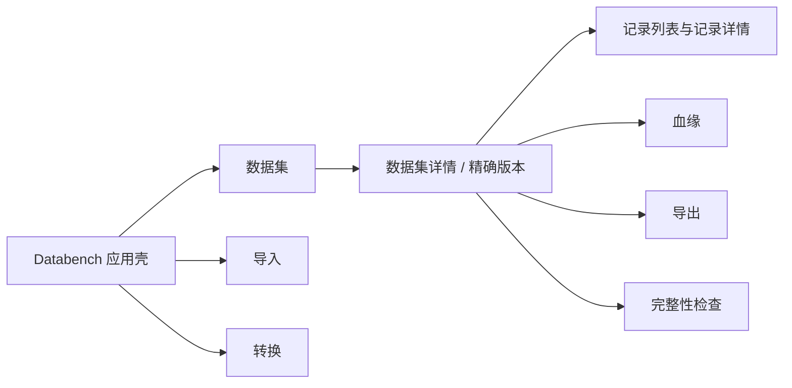

# Databench v2 产品切换与 v1 退役技术方案

- **状态:** 已接受——owner 于 2026-07-24 采用第三版单层导航视觉稿并授权实施
- **日期:** 2026-07-24
- **决策者:** owner
- **上游决策:** [ADR 0013](../decisions/0013-v2-product-cutover-and-v1-retirement.md)
- **现有基线:** V0-V15 完成，v2 capability 已由 owner 提前开启；V16/V17 仍未开始
- **实现约束:** 按 [CUTOVER-PLAN.md](CUTOVER-PLAN.md) 一个 Step 一个 PR 施工

## 1. 目标

把当前“v1 默认页面 + v2 独立页面”改成只有一套 Databench 产品：

- 用户打开 Databench 直接进入现有 v2 数据集；
- 顶部只有“数据集 / 导入 / 转换”三个主入口；
- 页面和路由不要求用户理解 v1/v2；
- v1 Web、API、CLI、领域代码、表和对象最终退役；
- v2 的 canonical record、identity、layout、API 与存储协议不重写。

本次不是给 v2 再套一层新 UI，也不是把 v1/v2 合并成一个巨型兼容模型。它是产品入口切换，
随后沿依赖方向删除已经不再可达的 v1 实现。

## 2. 设计依据与截图解读

Owner 提供的截图已经给出核心视觉方向：深色、宽表格、克制边框、高信息密度，页面顶部是
“数据集 / 导入 / 转换”三项导航。该方向与现有 v2 页面样式一致，因此本方案不重新选择配色、
圆角、字号或组件体系，只调整信息架构与文案层级。

目标用户动作是：

```text
找到一个数据集 → 查看不可变版本和记录 → 导入或转换 → 查看血缘 → 检查并导出
```

用户不应先回答“我要进 v1 还是 v2”。

## 3. 推荐 UI 信息架构



### 3.1 应用壳

保留现有单一 sticky header：

- 左侧：Databench 标识，点击回到 `/datasets`；
- 中部：`数据集`、`导入`、`转换`；
- 右侧：语言切换、连接状态与连接设置；
- 主内容：只有一层页面内容，不再渲染 `V2Layout` 的第二层导航。

桌面宽度沿用当前 `max-w-[100rem]`。窄屏时主导航允许水平滚动，连接工具保持可达；不为本次
切换引入新的移动端抽屉系统。

### 3.2 数据集列表

截图中的主体结构保留：

1. 页面标题“训练后数据集”；
2. 简短说明，解释这里只列出可见引用，不声称发现所有 detached snapshots；
3. 右侧主动作“新建数据集”，进入 `/ingest`；
4. 按引用或精确版本筛选；
5. 四列表格：`引用 / 精确版本 / 记录数 / 更新时间`；
6. Ref message 继续作为低强调 badge 展示。

删除以下实施期表达：

- `V2 / refs` eyebrow；
- “V2 命名引用”；
- 顶部另一个“V2 数据集”入口。

“引用”仍保留，因为它是用户需要理解的可变指针；“精确版本”明确其不可变语义。空状态的
主动作同样是“新建数据集”。

### 3.3 数据集详情

详情页先解析 ref 并锁定 exact version，保持当前正确语义。页面层次调整为：

- 标题：ref name；若直接按 version 打开，则显示“精确版本”；
- 元信息：record count、layout、schema、size、identity profile；
- 主内容：虚拟化记录列表；
- 上下文动作：`查看血缘`、`导出`、`完整性检查`、`返回数据集`；
- 后台发现 ref 已移动时只显示“有新版本”提示，不自动替换当前记录列表。

血缘与导出不放入一级导航，因为没有数据集上下文时无法完成主要任务。这样顶栏保持截图中的
三项，同时不损失现有 v2 能力。

### 3.4 导入与转换

- `/ingest` 继续提供 canonical JSONL 文件和标准 Record JSON 数组两种入口；
- 页面用“导入数据集”而不是“V2 导入”；
- `/transforms` 继续显示 registry、ordered inputs、params 与 preserve/derive 提示；
- 运行成功导航到 `/datasets/<exact-version>`；
- Ref CAS conflict 继续保留查看当前版本、保留新版本、重新确认移动三个动作。

### 3.5 记录、血缘与导出

Unified Record renderer、服务端 eligibility、bounded lineage、fidelity review 与流式下载保持
现有行为。只改路由和用户可见版本文案，不把这些已经过 gate 的逻辑重新实现一遍。

## 4. Web 路由设计

| 当前路径 | 目标路径 | 行为 |
|---|---|---|
| `/` | `/datasets` | replace redirect |
| v1 `/datasets` | `/datasets` | 改为当前 v2 refs 列表 |
| v1 `/datasets/$ref` | `/datasets/$ref` | 改为当前 v2 数据集详情 |
| `/v2/datasets/$ref/records/$recordId` | `/datasets/$ref/records/$recordId` | 完整 Record 详情 |
| v1 `/ingest` | `/ingest` | 改为当前 v2 导入 |
| v1 `/transforms` | `/transforms` | 改为当前 v2 转换 |
| v1 `/lineage/$ref` | `/lineage/$ref` | 改为当前 v2 bounded lineage |
| `/v2/export/$ref` | `/export/$ref` | fidelity inspect + export |
| `/recipe` | 无 | 退役，返回产品 404 |
| `/vocabularies*` | 无 | 退役，返回产品 404 |
| `/v2/...` Web routes | 无 | 退役；`/v2` 前缀专属于 REST API |

不保留 `/v2/...` Web redirect。部分路径与 `/v2` REST API 在 method/path 上重叠，反向代理无法仅
凭 URL 稳定判断这是浏览器直接刷新还是 API 请求。产品切换后只有无版本 Web 路由需要 SPA
fallback，`/v2/*` 始终交给 API。

## 5. Capability 与连接状态

当前 root 同时存在 v1 `CapabilityGate` 和 v2 `PostTrainingV2Gate`。切换后：

1. 应用壳始终渲染，确保语言与连接设置可用；
2. 内容区统一经过现有 `post_training_v2` 协议兼容检查；
3. absent、disabled、401、403、network、incompatible 仍为不同状态；
4. 旧 v1 `features.recipes/transforms/lineage/vocabularies` 不再决定导航；
5. v2 capability 仍校验 API 2、record schema、identity、layout 与 fidelity profile。

`post_training_v2` 名称保留在 wire contract 中。它是兼容握手字段，不在 UI 中显示。

## 6. API 与 OpenAPI

### 6.1 保留

- `/health`、`/version`、`/capabilities`；
- 全部 `/v2` routes；
- `@databench/schema` 的 v2 contracts；
- generated OpenAPI client；
- 现有 typed errors、request ID、no-store、CORS、streaming ingest/export。

### 6.2 删除

- 全部 `/v1` routes；
- v1 Sample、Recipe、Vocabulary wire contracts；
- OpenAPI 中的 `/v1` paths/components；
- v1 feature flags及其 route tests。

删除后 `openapi.json` 只发布 meta + `/v2`。不把 `/v2` 重写成 `/v1` 或无版本 API，因为这会
制造与 canonical schema 版本无关的第二次 breaking contract。

## 7. CLI

目标 help surface：

```text
databench dataset ingest/show/records/audit/export
databench converter list/show
databench transform list/run
databench ref list/show/move
databench lineage show
```

这些命令直接调用当前 v2 Workspace/Schema handler。现有 v1 `add/samples/recipe/vocab` 命令删除。
`databench v2 ...` 若保留短期 alias，也必须调用相同 handler且不出现在主命令目录；alias 删除不影响
任何数据或协议。

## 8. 代码退役边界

| 层 | 保留 | 退役 |
|---|---|---|
| Web | 当前 v2 api/components/features、共享无业务 UI、连接/i18n | v1 routes/features/sample/vocabulary 组件与 v1 API hooks |
| API | meta、`routes/v2`、统一错误映射 | `/v1` datasets/transforms/recipes/refs/lineage/vocab routes |
| CLI | 当前 v2 handlers，提升为默认命令 | v1 handlers、recipe、vocabulary commands |
| Workspace | `V2Workspace`、v2 cache/refs/transforms/export | v1 `Workspace`、Recipe/Vocabulary orchestration |
| Ops/IO | v2 transforms、canonical/converters | v1 Sample transforms、recipe/export parity path |
| Engine/Store | `V2Dataset`、record-json-v1、file-backed conditional store | v1 Dataset、legacy object layout reader/writer |
| Catalog | `V2Catalog` 与九张 v2 表 | v1 dataset/run/ref/vocabulary catalog APIs |
| Schema/Hashing | ADR 0009/0011 v2 schema与fixed vectors | v1 Sample schema、Python parity hashing surface |
| Tests | v2 fixed vectors、lifecycle、browser、offline gates | Python parity、v1 wire/UI golden 与 coexistence assertions |

删除顺序必须从调用方到依赖层：Web/API/CLI → Workspace → Ops/IO/Store/Catalog →
Schema/Engine/Hashing。每层删除后用 package exports 与 `rg` guard 证明没有残余调用，再进入下一层。

`src/v2`、`V2*` 和 `*_v2` 保持不动。它们是稳定协议/存储名称，不需要为了产品 UI 无版本化而
机械改名。

## 9. Postgres 与对象存储退役

### 9.1 Postgres

v1 tables 当前包括：

```text
datasets
runs
refs
vocabularies
vocab_refs
```

处理方式：

1. 应用代码先停止读写；
2. preflight 输出每表行数、外键与估算大小；
3. operator 备份或明确放弃后执行 forward migration；
4. Prisma schema 删除 v1 models，但历史 migration 文件不改写；
5. migration 后确认九张 v2 表、namespace、refs 和 manifests不变。

### 9.2 Object Store

v1 object key 位于 legacy `objects/<vv>/...`，v2 位于 `objects/v2/...`。清理工具必须：

- 只匹配经过 legacy key parser验证的 v1 keys；
- 显式排除 `objects/v2/`，禁止对 `objects/` 做递归模糊删除；
- 先输出 key count、bytes、sample keys与清单 digest；
- dry-run默认开启；执行时要求精确清单 digest确认；
- 删除后再验证全部 v2 manifests/artifacts仍可 audit。

应用发布与数据删除分开。先发布 v2-only 产品并观察，再执行不可逆清理。
R4 的命令、确认顺序、失败 migration 恢复与最终验证以
[V1-RETIREMENT-RUNBOOK.md](V1-RETIREMENT-RUNBOOK.md) 为准。

## 10. 实施切片与 Gate

本方案接受后另建 `CUTOVER-PLAN.md`，按一个 Step 一个 PR施工。建议切片如下：

| Step | 目标 | Gate |
|---|---|---|
| R0 | ADR/技术方案/覆盖矩阵接受 | 文档一致性，无“实现时再决定”的产品路由 |
| R1 | Web 单壳、无版本 routes、文案与浏览器 E2E | 主导航仅三项；所有无版本 URL可直接刷新 |
| R2 | CLI 默认 v2；删除 v1 Web/API/CLI surface | OpenAPI无 `/v1`；help无 v1命令；v2 lifecycle绿 |
| R3 | 从调用方到基础包删除 v1领域实现与 golden | package exports无 v1 surface；全量 v2 tests绿 |
| R4 | Prisma forward migration与 object cleanup runbook/tool | dry-run清单；v2 audit前后相同；需 operator确认 |
| R5 | v2-only final gate、文档与离线包验证 | lint/typecheck/test/openapi/real deps/browser/offline全绿 |

R0-R5 不自动把 V16/V17 标为完成。若继续暂停 V16/V17，状态文档必须真实记录这是 owner 的发布
例外；若要宣称完整 production readiness，仍需完成剩余 recovery/security/capacity gate。

## 11. 验收标准

### 11.1 产品与 UI

- 首屏 `/datasets` 使用现有 v2 refs数据；
- 只有“数据集 / 导入 / 转换”三个主导航；
- 页面没有用户可见的 v1/v2 选择或 `V2 / refs`；
- Recipe、Vocabularies 和旧 v1 URL不可达；
- 数据集详情可进入 record、lineage、export、audit；
- 中文/英文、键盘、焦点、虚拟列表与错误状态保持现有 gate。

### 11.2 Contract 与运行时

- OpenAPI无 `/v1` paths，Web只使用 generated `/v2` contract；
- API/CLI仍只经 Workspace + Schema；
- v2 identity/layout/artifact/fidelity fixed vectors无变化；
- Postgres无 record payload；对象仍 conditional create；Ref仍 CAS；
- 真实 Postgres + MinIO 生命周期和离线单机 smoke通过；
- `/datasets`、detail、record、lineage、export直接刷新均返回 SPA，`/v2/*` 始终进入 API。

### 11.3 退役完整性

- repo中没有可达 v1 route、CLI command、Workspace或 package export；
- fresh install最终态不保留 v1 models/tables；
- existing install清理前有清单，清理后 v2 catalog/object audit一致；
- 不修改或删除 `~/Desktop/databench/` 旧参考仓库。

## 12. UI 接受记录

Owner 于 2026-07-24 采用第三版视觉稿：保留 Databench 品牌 header，把“数据集 / 导入 / 转换”
提升到同一 64px header；正文直接从“训练后数据集”开始，不再保留第二层 tabs。右侧保留语言
与真实连接状态。该选择表达的是 v2 已成为整个产品，而不是一个仍需版本入口的子模块。
