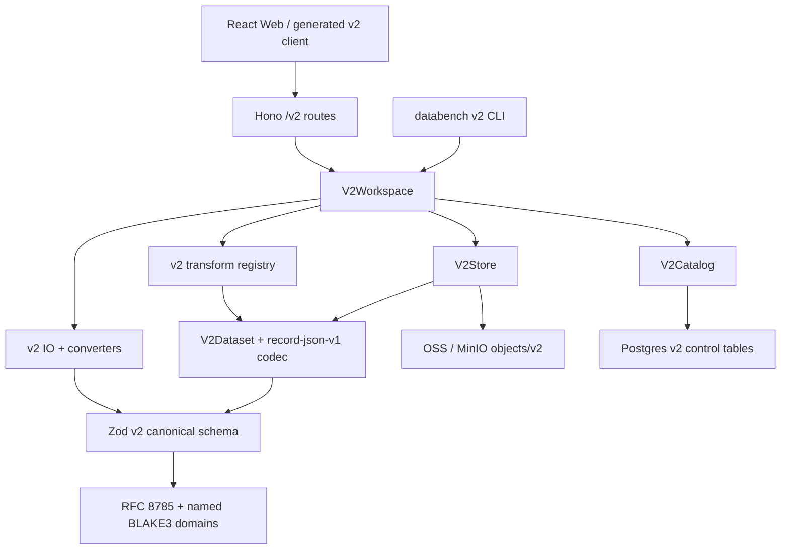
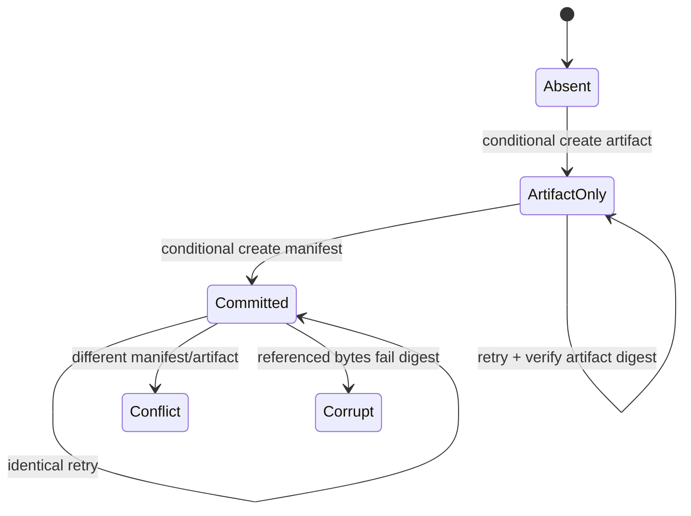
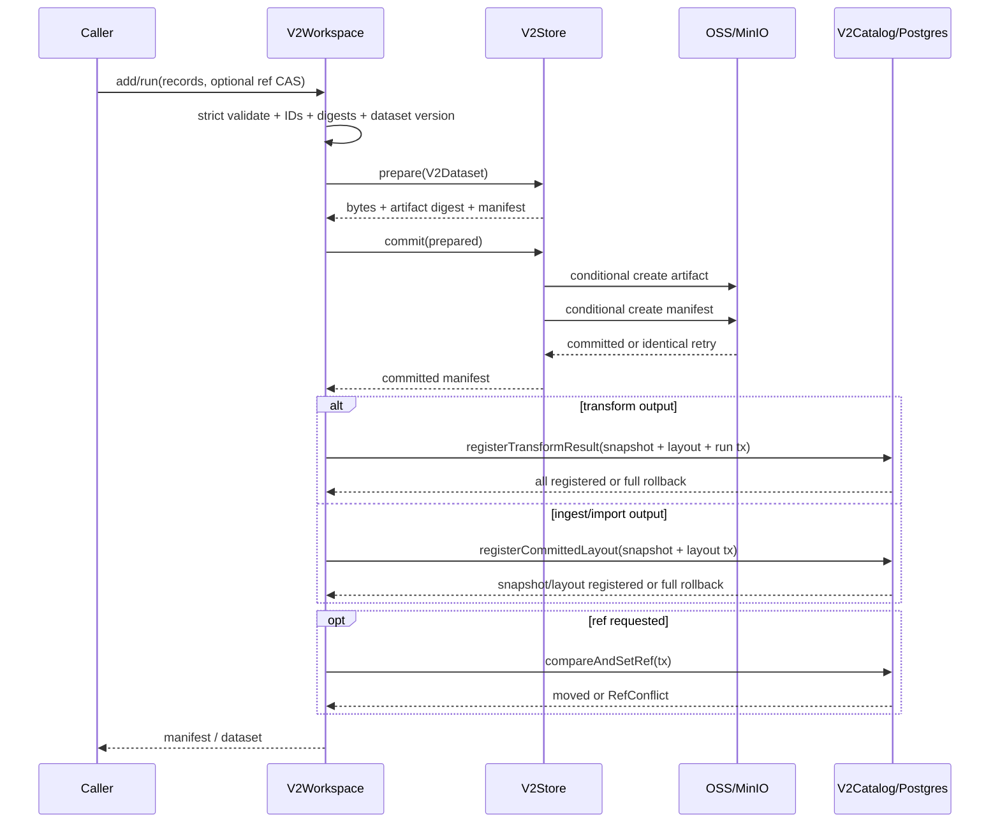
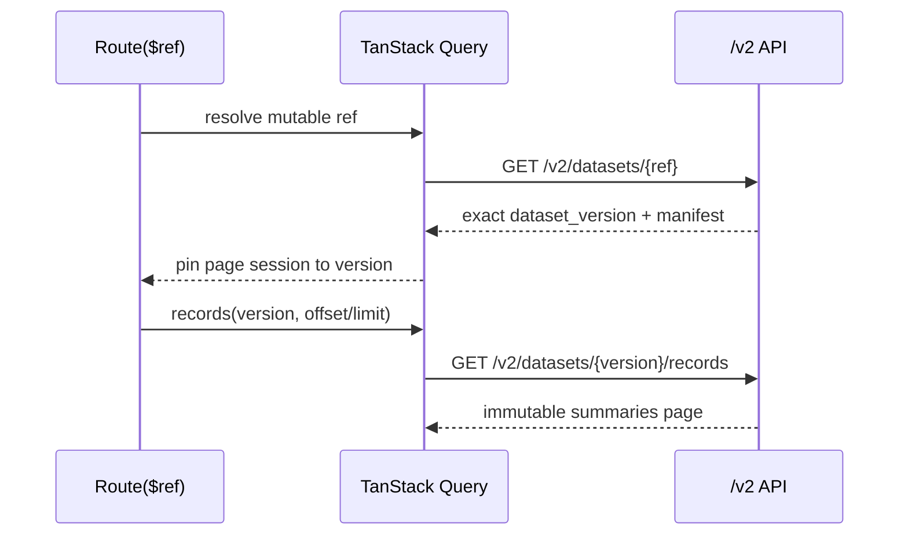

# Databench v2 技术方案

- **状态:** 已接受——owner 于 2026-07-23 确认；实施计划已接受，按 V0-V17 实施
- **日期:** 2026-07-23
- **决策者:** owner
- **接受记录:** owner 于 2026-07-23 接受 review 修订后的全文与 Q1-Q14
- **规范依赖:** [ADR 0009](../decisions/0009-canonical-post-training-record-v2.md)、
  [ADR 0011](../decisions/0011-identity-hashing-versioning-v2.md)
- **下游文档:** [v2 实施计划](PLAN.md)；已接受，按 V0-V17 逐步实施
- **适用范围:** v2.0 logical schema、identity、data plane、control plane、Workspace、
  `/v2` API、CLI 与 Web 完整纵向链路

## 1. 文档职责

ADR 0009 回答“canonical record 是什么”，ADR 0011 回答“ID、digest、version 与 artifact
identity 怎样定义”。本文回答“这些决策在 Databench 系统中怎样协同工作”。

本文是技术设计，不安排 PR 顺序。它必须明确:

- 每个 package 负责什么、公开什么接口;
- 一条 record 从请求进入到 Parquet、manifest、catalog、ref 的完整数据流;
- logical record、runtime row、Parquet row 与 Postgres metadata 的边界;
- ID 分配、幂等、并发写、失败恢复与事务边界;
- `/v2` API 的 wire contract 与错误语义;
- v1/v2 如何同时存在且互不污染。

实施步骤、依赖顺序与每步 gate 由下游 `docs/v2/PLAN.md` 承载。本文接受不等于授权开始
实现；只有下游计划也被接受后才进入代码阶段。

## 2. 目标与约束

### 2.1 目标

v2.0 必须提供:

1. `PostTrainingRecord 2.0.0` 的 strict writer 与 compatible reader;
2. stable logical IDs、full record digest、logical dataset version 与 raw artifact digest;
3. immutable dataset snapshot、可变 ref、可复现 transform cache 与 exact lineage;
4. Postgres 控制面 + OSS/MinIO 对象存储数据面;
5. canonical JSONL、trainer converters、`/v2` API、CLI 与 Web 展示;
6. 多 API 实例并发下不会覆盖已发布 artifact/manifest/ref;
7. v1 代码、对象、表、API 与 golden tests 保持可运行。

### 2.2 继承的硬约束

- TypeScript、Node 22、纯 ESM、Vitest、Biome;
- Zod 是唯一手写逻辑 schema 源;
- 所有 hash 入口只能来自 `@databench/hashing`;
- sample/record payload 永远不进 Postgres;
- `apps/api` 只能经 `workspace + schema` 触达数据;
- 对象存储生产使用 Aliyun OSS，本地使用 MinIO/S3 adapter;
- Lance 不进入 v2 首期;
- v2 不要求旧 Python golden parity。

### 2.3 非目标

- v1 自动迁移、双写或 v1→v2 ID 映射;
- nested Parquet 查询优化、全局 record search index;
- annotation workflow、异步 job platform、distributed compute;
- retention/GC/legal hold/destructive redaction;
- 生产部署平台选择。

## 3. 技术决策总览

Owner 接受本文即接受 T1-T20。后文给出每项的具体结构和时序。

| ID | 决策 | 选择 |
|---|---|---|
| T1 | v1/v2 演进方式 | 加法式隔离；不原地重写 v1 |
| T2 | package 组织 | 复用现有 package DAG，在各包增加 `src/v2/` |
| T3 | runtime dataset | 独立 eager `V2Dataset`，默认最多 100k records / 512 MiB canonical bytes |
| T4 | 首个物理 layout | `record-json-v1` 三列 lossless Parquet；`hyparquet-writer` + ZSTD WASM |
| T5 | logical identity namespace | workspace-local immutable UUID |
| T6 | ID 审计语义 | ID 分配后 opaque；machine creation 使用 immutable identity claim |
| T7 | control plane | 新增独立 v2 Prisma tables，不复用 v1 datasets/runs/refs |
| T8 | object commit | artifact conditional create，manifest conditional create 为提交点 |
| T9 | 跨存储一致性 | 不伪造分布式事务；manifest→catalog→ref 分阶段提交并可重试 |
| T10 | ref 并发 | compare-and-swap，不允许静默 lost update |
| T11 | transform identity | registry 强制声明 preserve/derive 与 strict params |
| T12 | API | 独立 `/v2`，同一 OpenAPI 文档发布 |
| T13 | 首期 ingest | canonical v2 JSONL；provider/raw adapters 独立扩展 |
| T14 | converter | canonical、TRL SFT/DPO/GRPO-RLVR、ms-swift 必须有 fidelity |
| T15 | 上线开关 | final gate 前 v2 capability 默认关闭，v1 保持工作 |
| T16 | 前端演进 | 同一 SPA 内新增完整 v2 vertical slice，不复用 v1 Sample view/model |
| T17 | Record read API | 列表返回 summary，详情按 ID 延迟读取完整 record；任务资格由服务端计算 |
| T18 | Export transport | 无状态 JSON 预检 + 普通文件流；semantic loss 绑定精确 fidelity digest |
| T19 | Sidecar 边界 | v2.0 不强制 sidecar；未来 sidecar 是带 revision join key 的可重建派生数据 |
| T20 | Ref 解析 | ref name 只允许小写 ASCII，且禁止伪装成 64 hex version |

## 4. 总体架构



依赖层级保持现有 DAG:

```text
L0  hashing
L1  schema      → hashing
L2  engine      → schema, hashing
    io          → schema
    catalog     → Prisma only
L3  ops         → engine, schema
    store       → engine, schema, hashing
L4  workspace   → engine, io, ops, store, catalog, schema, hashing
L5  apps/api    → workspace, schema
    apps/cli    → workspace, schema
L6  web         → generated OpenAPI client only
```

`catalog` 不 import `schema`。它只保存和比较 opaque strings、JSON metadata 与数据库时间。
Zod validation 在 `workspace/schema` 边界完成后，catalog 才接收已验证的 primitive metadata。

## 5. v1/v2 隔离

### 5.1 代码隔离

v2 不把 `Sample | PostTrainingRecord` 做成一个大 union。公开类型和类明确区分:

```text
v1: Dataset, Manifest, Store, Catalog, Workspace
v2: V2Dataset, DatasetManifestV2, V2Store, V2Catalog, V2Workspace
```

同一 package 可以同时导出两组 API，但调用方必须显式选择。禁止通过 schema version
字符串在一个巨型函数内部到处分支。

### 5.2 持久化隔离

```text
v1 objects: objects/<vv>/<version>.parquet
v2 objects: objects/v2/<layout>/<vv>/<dataset_version>/<artifact_digest>.parquet
```

Postgres v2 tables 使用独立表名；v1 `datasets/runs/refs` 不增加可空 v2 columns。v2 ref
不会解析到 v1 dataset version，反向同样禁止。

### 5.3 产品隔离

- API: `/v1` 与 `/v2`;
- CLI:现有命令与 `databench v2 ...`;
- Web:构建阶段使用独立 v2 routes;
- capability:final gate 前 `post_training_v2.enabled=false`;
- 不提供自动 migration 或后台 dual writer。

## 6. Hashing 技术设计

### 6.1 `@databench/hashing` 公共 API

`hashing` 保持无 Zod、无 Prisma、无 Polars。v2 公开接口建议固定为:

```ts
type CanonicalJsonPrimitive = null | boolean | string | number
type CanonicalJsonValue =
  | CanonicalJsonPrimitive
  | readonly CanonicalJsonValue[]
  | { readonly [key: string]: CanonicalJsonValue }
type CanonicalJsonObject = { readonly [key: string]: CanonicalJsonValue }

type V2CreationProfile =
  | 'source-root-v1'
  | 'artifact-row-v1'
  | 'direct-root-v1'
  | 'derived-record-v1'
  | 'candidate-v1'
  | 'signal-event-v1'
  | 'preference-event-v1'

interface IdentityClaimHashInputV1 {
  claim_profile: 'databench-identity-claim-v1'
  identity_profile: 'databench-v2-jcs-1'
  namespace: string
  entity_kind: 'record' | 'candidate' | 'signal' | 'preference'
  creation_profile: V2CreationProfile
  claim_material: CanonicalJsonValue
}

interface IdentityRequestHashInputV1 {
  request_profile: 'databench-identity-request-v1'
  identity_profile: 'databench-v2-jcs-1'
  namespace: string
  entity_kind: 'record' | 'candidate' | 'signal' | 'preference'
  creation_profile: V2CreationProfile
  normalized_request: CanonicalJsonValue
}

interface DatasetIdentityEnvelopeV2 {
  identity_profile: 'databench-v2-jcs-1'
  record_schema_version: '2.0.0'
  record_digests: readonly string[]
}

interface TransformCacheIdentityV1 {
  identity_profile: 'databench-v2-jcs-1'
  op: string
  op_version: string
  input_dataset_versions: readonly string[]
  params: CanonicalJsonObject
}

const V2_IDENTITY_PROFILE = 'databench-v2-jcs-1'
const V2_EXPORT_FIDELITY_PROFILE = 'databench-export-fidelity-1'

function canonicalJsonV2(value: unknown): string
function compareJcsUtf16(left: string, right: string): number

function deriveV2RecordId(
  seed: SourceRootSeedV1 | ArtifactRowSeedV1 | DirectRootSeedV1 | DerivedRecordSeedV1,
): `rec_${string}`
function deriveV2CandidateId(seed: CandidateSeedV1): `cand_${string}`
function deriveV2SignalId(seed: EventSeedV1): `sig_${string}`
function deriveV2PreferenceId(seed: EventSeedV1): `pref_${string}`

function hashV2IdentityClaimKey(identity: IdentityClaimHashInputV1): string
function hashV2IdentityRequest(identity: IdentityRequestHashInputV1): string
function hashV2Record(record: unknown): string
function hashV2DatasetIdentity(identity: DatasetIdentityEnvelopeV2): string
function hashV2TransformCache(identity: TransformCacheIdentityV1): string
function hashV2ExportFidelity(identity: CanonicalJsonValue): string
function hashArtifactBytes(bytes: Uint8Array): string
function createArtifactHasher(): {
  update(chunk: Uint8Array): void
  digestHex(): string
}
```

调用方不能传 entity kind、seed profile 或自定义 domain string。四个 logical ID 函数分别
固定 ADR 0011 的精确 domain：

```text
databench.id.databench-v2-jcs-1.record.v1\0
databench.id.databench-v2-jcs-1.candidate.v1\0
databench.id.databench-v2-jcs-1.signal.v1\0
databench.id.databench-v2-jcs-1.preference.v1\0
```

`source-root-v1`、`artifact-row-v1` 等是 Schema 层的 creation request 判别值，不额外写入
上述 ADR 已固定的 entity preimage；每个具名函数只能接收相应 strict seed schema 验证后的
value。Hashing package只拥有这些纯 TS preimage types和 domain函数；Schema import这些类型并
提供唯一 strict Zod schema，不能反向让 Hashing依赖 Schema。`hashArtifactBytes` 是 raw-byte checksum，刻意不加 logical domain prefix。
`hashV2ExportFidelity` 只用于把用户批准绑定到一份确定的 export plan，不是新的
dataset/entity identity。

### 6.2 JCS 输入边界

`canonicalJsonV2` 处理已经成为 JavaScript value 的输入，因此无法发现原始 JSON duplicate
keys。职责拆分为:

1. IO/API duplicate-aware raw JSON parser检查 duplicate keys、bytes与 nesting depth;
2. Zod strict schema 检查类型、默认值、safe integer 与 cross-field invariants;
3. `canonicalJsonV2` 检查 JCS value domain、lone surrogate、finite number 与循环引用;
4. 具名 hash API 产生 digest。

所有默认值必须在第 2 步物化。Hashing 层不猜 schema default，也不把 `undefined` 当成
`null`。

`@databench/schema` 提供统一 `parseRawJsonV2(bytes, limits)`，所有会进入 identity/hash 的 v2
JSON routes必须使用 raw-body middleware执行 `bytes → duplicate/depth check → Zod`，禁止
Hono `c.req.json()` 的 last-key-wins解析；JSONL每一行复用同一 parser。递归 `JsonValue` schema
对每个 number执行 finite检查，具名 integer字段再执行 safe-integer约束。

## 7. Schema 技术设计

### 7.1 文件边界

```text
packages/schema/src/v2/
├─ json-value.ts
├─ content.ts
├─ part.ts
├─ candidate.ts
├─ signal.ts
├─ preference.ts
├─ tool.ts
├─ verification.ts
├─ provenance.ts
├─ record.ts
├─ identity.ts
├─ manifest.ts
├─ converter.ts
├─ contracts.ts
├─ reader.ts
└─ index.ts
```

ADR 0009 的逻辑字段不在本文重复定义；上述文件只是职责拆分，不允许改变已经接受的字段。

### 7.2 Writer 与 Reader

公开入口分离:

```ts
function parseCanonicalRecordV2(input: unknown): PostTrainingRecordV2
function normalizeCanonicalRecordV2(input: unknown): PostTrainingRecordV2
function readCompatibleRecordV2(input: unknown): CompatiblePostTrainingRecordV2
function writeCompatibleRecordV2(record: CompatiblePostTrainingRecordV2): string
```

- `parseCanonicalRecordV2`:strict，不添加调用方没有请求的语义，只验证已经物化的 canonical
  record;
- `normalizeCanonicalRecordV2`:边界 writer，只接受字段完整的 canonical draft；它规范化
  RFC 3339 timestamp、MIME type 与 tags，但不为缺失字段临时发明 default，所有 v2.0 字段
  仍按 ADR 0009 必须显式存在，并且只接受 canonical `role='user' | 'ai'`;
- `readCompatibleRecordV2`:支持 major 2 的未知 minor fields 与 `UnknownPart` round-trip，不能
  把未知内容丢掉后伪装成 strict 2.0.0 record。
- `writeCompatibleRecordV2`:只承诺 unknown field/part 的 value-level round-trip；property
  插入顺序、空白和原 JSON lexeme 不保留。其输出不能进入 strict digest、dataset 或 converter。

只有 strict `PostTrainingRecordV2` 可以进入 record digest、`V2Dataset` 与 canonical writer。
`assistant/model/AI` 等 provider role alias 只能由 `@databench/io` 的具名 adapter 映射，不能
进入通用 canonical normalizer，避免同一个“canonical”入口悄悄接受不同外部方言。

### 7.3 Revision runtime 结构

`record_digest` 不写回 record，runtime 使用包装类型:

```ts
class RecordRevisionV2Value { // package-private，不导出
  readonly #brand = true

  constructor(
    readonly record: DeepReadonly<PostTrainingRecordV2>,
    readonly record_json: string,
    readonly record_digest: string,
  ) {}
}

export type RecordRevisionV2 = RecordRevisionV2Value
export function createRecordRevisionV2(input: unknown): RecordRevisionV2
```

`RecordRevisionV2` 是 opaque branded type，使用不导出的内部 class private brand，外部不能用
object literal或从合法 revision spread后覆盖字段来伪造。唯一构造入口是 package公开的
`createRecordRevisionV2` factory，供依赖 Schema的 Engine调用；实现 class与构造器不导出。Factory
必须在同一处完成 defensive deep clone → strict parse → recursive freeze → JCS → digest，避免
record、JSON 与 digest 来自三个不同调用点。`V2Dataset` 的
`records/get` 只能返回 deep-frozen revision 或新的 defensive clone，任何调用方都不能通过
修改 nested candidate/signal/extra 让 `record` 与 `record_json/digest` 漂移；测试需覆盖
原输入对象和返回对象的深层修改尝试。

### 7.4 Tool JSON Schema validation

`Tool.input_schema` 使用直接依赖的 Ajv 2020 实例校验 Draft 2020-12，不通过 provider SDK
间接获得 validator。配置固定为 strict mode、禁止远程 schema loader与非 fragment外部 `$ref`；
允许同一 schema 内合法的递归 `#...` local refs，拒绝 unresolved refs且不做无限静态展开，根类型
必须为 object。Schema 先经过 byte/depth/node/ref数量和 compile time budget，再 compile；instance
validation仍受 nesting depth限制。Compile budget按当前 Node worker thread CPU time计量，不把
OS调度暂停或其他 worker的并行负载误算为 schema编译耗时。未知 `format` 按 JSON Schema
annotation处理且不影响有效性；
需要 assertion的 formats必须在固定 allowlist中显式注册。每个 function call的 `args` 必须通过
对应 tool schema。Ajv版本由 lockfile固定，升级需重新跑协议 fixtures，但不改变 canonical bytes。

## 8. Logical ID 与幂等

### 8.1 Namespace

v2.0 没有 organization/tenant domain model，因此选择 workspace-local namespace:

- 首次初始化 v2 catalog 时产生随机 UUID;
- 数据库中只有一个 scope=`default` 的 active namespace;
- namespace 与数据库备份一起迁移，不从目录名、host 或 workspace display name 计算;
- canonical import 保留 ID，不使用目标 namespace 重算。

### 8.2 Pure derivation 与 stateful allocation

Pure functions 位于 `schema + hashing`，stateful conflict/idempotency 位于 `workspace +
catalog`:

```ts
type RootIdentityRequest =
  | SourceRootIdentityRequestV1
  | ArtifactRowIdentityRequestV1
  | DirectRootIdentityRequestV1
type DerivedRecordIdentityRequest = DerivedRecordIdentityRequestV1
type CandidateIdentityRequest = CandidateIdentityRequestV1
type EventIdentityRequest = SignalIdentityRequestV1 | PreferenceIdentityRequestV1

interface V2IdentityAllocator {
  allocateRoot(input: RootIdentityRequest): Promise<string>
  deriveRecord(input: DerivedRecordIdentityRequest): Promise<string>
  allocateCandidate(input: CandidateIdentityRequest): Promise<string>
  allocateEvent(input: EventIdentityRequest): Promise<string>
}
```

Machine creation 流程:

1. strict-validate identity request;
2. 若相应 direct/event request或 candidate generation run没有稳定 key，先生成固定为 64
   lowercase hex的 256-bit CSPRNG seed/token，并把它作为本次 immutable seed；
3. 规范化 exact strict seed + 初始语义 payload；namespace必须是 canonical lowercase UUID，
   artifact digest为 raw bytes BLAKE3 64-hex，row/output index为非负 safe integer；
4. 用 §6 的具名 ADR entity公式派生 proposed entity ID；
5. 计算不含 server-assigned ID/lifecycle time 的 `request_digest` 与只含 strict seed equivalence
   的 `claim_key_digest`，PG 不保存原 claim material；
6. 在一个 catalog transaction 中 compare/insert claim全部 immutable fields；
7. 相同 claim + 相同 request digest + entity ID返回已有 ID；
8. 非 `derived-record-v1` 的相同 claim + 不同 request digest/entity ID抛
   `IdentityConflictError`；
9. `derived-record-v1` 的相同 claim/profile/entity ID复用 logical ID，允许不同 request digest
   进入后续 revision流程；若 entity ID不一致仍抛 `IdentityConflictError`。

Logical ID 创建后作为 opaque identity。后续 source/provenance 修正不要求当前 record 可以
反推原 seed；immutable claim 承担 machine creation首次分配审计。Derived claim保存首次
`request_digest`且后续不得覆盖；它不是 revision幂等键。

外部 allocation draft与最终 hash request是两个边界。`IdentityAllocationDraftV1`只允许 direct的
`idempotency_key_or_random_seed`、candidate的 `generation_run_id`、event的
`producer_event_key`显式为 `null`；字段不能省略，空字符串不是“缺失”。Schema的 materializer接收
注入式 `randomBytes32()`，先 defensive clone并 strict-validate draft，再且仅调用一次 RNG，把结果
物化进完整 request，最后 strict parse与 recursive freeze。后续 catalog transaction retry必须复用
同一 frozen request，不得重新随机；Schema包自身不读取环境 RNG。

每个 `*IdentityRequestV1` 都是 strict discriminated union member：顶层固定包含
`creation_profile`、相应的 strict seed 和将要创建的完整初始语义实体（去掉 server-assigned
`id`）；不得以开放 `JsonObject` 代替 request schema。Record 使用
`Omit<PostTrainingRecordV2, 'id'>`，candidate/signal/preference 分别使用对应实体的 `Omit<..., 'id'>`
并显式携带 owner ID。Catalog lifecycle time、server-assigned ID 与 credentials 不在 request。

Claim 的两个摘要不能复用 record/entity digest，固定使用以下 strict envelopes:

```ts
interface IdentityClaimKeyV1 {
  claim_profile: 'databench-identity-claim-v1'
  identity_profile: 'databench-v2-jcs-1'
  namespace: string
  entity_kind: 'record' | 'candidate' | 'signal' | 'preference'
  creation_profile: V2CreationProfile
  claim_material:
    | SourceRootSeedV1
    | ArtifactRowSeedV1
    | DirectRootSeedV1
    | DerivedRecordSeedV1
    | CandidateSeedV1
    | EventSeedV1
}

interface IdentityRequestDigestV1 {
  request_profile: 'databench-identity-request-v1'
  identity_profile: 'databench-v2-jcs-1'
  namespace: string
  entity_kind: 'record' | 'candidate' | 'signal' | 'preference'
  creation_profile: V2CreationProfile
  normalized_request:
    | SourceRootIdentityRequestV1
    | ArtifactRowIdentityRequestV1
    | DirectRootIdentityRequestV1
    | DerivedRecordIdentityRequestV1
    | CandidateIdentityRequestV1
    | SignalIdentityRequestV1
    | PreferenceIdentityRequestV1
}
```

- `claim_key_digest = hashV2IdentityClaimKey(...)`，domain 为
  `databench.identity-claim-key.databench-v2-jcs-1.v1\0`;
- `request_digest = hashV2IdentityRequest(...)`，domain 为
  `databench.identity-request.databench-v2-jcs-1.v1\0`;
- producer event key、client idempotency key、generation run ID、op与 op version统一限制为
  1024 UTF-8 bytes；按编码后的字节数而不是 JavaScript UTF-16 code unit计量。256-bit random
  seed/token仍固定为 64 lowercase hex；原始 claim material只能存在于当前请求内，不能写
  PG、log、metric 或 error detail;
- `normalized_request` 必须通过对应 creation profile 的 exact strict schema，排除
  server-assigned entity IDs 与 catalog lifecycle time，但保留所有初始语义字段和 seed 输入;
- 两个 digest 都是 64 位小写 hex；任何 envelope/domain 调整必须发布新 claim/request profile，
  不能静默改变已有 claim 的幂等边界。

Claim key 的生成规则也固定，不留给 adapter 临时选择:

| creation profile | `claim_material`（与 entity ID seed 一一对应） |
|---|---|
| `source-root-v1` | 完整 `SourceRootSeedV1` |
| `artifact-row-v1` | 完整 `ArtifactRowSeedV1` |
| `direct-root-v1` | 完整 `DirectRootSeedV1`；缺 key 时先生成 256-bit seed |
| `derived-record-v1` | 完整 `DerivedRecordSeedV1` |
| `candidate-v1` | 完整 `CandidateSeedV1` |
| `signal/preference-event-v1` | 完整 `EventSeedV1`，其中 producer 属于 ADR seed |

Claim scope 不能比 entity seed 更宽：除 `EventSeedV1` 本身已有 producer 外，不额外混入调用方
producer/adapter name，否则两个 claims 可能派生同一 entity ID 再撞唯一约束。非
`derived-record-v1` 的相同 strict seed claim若带来不同 normalized request必须冲突；derived
claim按首次 ID分配审计规则复用 logical ID。

### 8.3 Seed 形状

```ts
interface SourceRootSeedV1 {
  namespace: string
  source: { name: string; kind: string; original_id: string }
}

interface ArtifactRowSeedV1 {
  namespace: string
  source_artifact_digest: string
  row_index: number
}

interface DirectRootSeedV1 {
  namespace: string
  idempotency_key_or_random_seed: string
}

interface DerivedRecordSeedV1 {
  op: string
  op_version: string
  params: JsonObject
  parent_ids: string[]
  output_index: number
}

interface CandidateSeedV1 {
  record_id: string
  generation_run_id: string
  output_index: number
}

interface EventSeedV1 {
  owner_id: string
  producer: string
  producer_event_key: string
}

interface SourceRootIdentityRequestV1 {
  creation_profile: 'source-root-v1'
  seed: SourceRootSeedV1
  initial_record: Omit<PostTrainingRecordV2, 'id'>
}

interface ArtifactRowIdentityRequestV1 {
  creation_profile: 'artifact-row-v1'
  seed: ArtifactRowSeedV1
  initial_record: Omit<PostTrainingRecordV2, 'id'>
}

interface DirectRootIdentityRequestV1 {
  creation_profile: 'direct-root-v1'
  seed: DirectRootSeedV1
  initial_record: Omit<PostTrainingRecordV2, 'id'>
}

interface DerivedRecordIdentityRequestV1 {
  creation_profile: 'derived-record-v1'
  seed: DerivedRecordSeedV1
  initial_record: Omit<PostTrainingRecordV2, 'id'>
}

interface CandidateIdentityRequestV1 {
  creation_profile: 'candidate-v1'
  owner_record_id: string
  seed: CandidateSeedV1
  initial_candidate: Omit<CandidateV2, 'id'>
}

interface SignalIdentityRequestV1 {
  creation_profile: 'signal-event-v1'
  owner_candidate_id: string
  seed: EventSeedV1
  initial_signal: Omit<SignalV2, 'id'>
}

interface PreferenceIdentityRequestV1 {
  creation_profile: 'preference-event-v1'
  owner_record_id: string
  seed: EventSeedV1
  initial_preference: Omit<PreferenceRelationV2, 'id'>
}
```

Seed schema 使用 strict Zod。Derived record 刻意使用 parent logical IDs 而不是 parent
digests，使同一 transform 对 parent 后续 revisions 产生同一 derived logical record 的新
revision；精确 parent digests 仍进入 `Lineage.parent_refs` 和 record digest。每次 derived
request仍须完整 strict validation并计算当前 `request_digest`，但已有相同 claim/profile/entity ID
时不与首次摘要做冲突比较，也不覆盖首次摘要；新的 record digest注册为该 logical ID的新
revision。同一 exact transform inputs/cache key产生不同 output仍由 §13 的 determinism gate拒绝。

Request schema同时验证 seed与 initial entity的 cross-field一致性：source tuple、record/candidate
owner ID、lineage parent IDs、event owner/producer及 generation run不得各写一份不同值；任何
不一致在计算 proposed ID前拒绝。初始实体包含全部 canonical字段和显式 null/empty值，不接受
partial patch。

`EventSeedV1.producer` 固定等于 `initial_signal.source.id` 或
`initial_preference.source.id`；`source.type/version`仍保留在完整 request并参与
`request_digest`，但不进入 entity seed。`CandidateSeedV1.generation_run_id`只存在 seed中，不向
`CandidateV2`重复增加字段；完整 `generator` payload仍参与 `request_digest`。

Candidate/Signal/Preference request在 Schema内先验证可局部判断的不变量，包括 role/局部 trajectory、
signal chain、匿名 human source、credential隔离与 preference pair。必须读取 owner record revision
才能判断的 declared tool/args、shared call response、跨 candidate signal ID、supersession target与
candidate membership，由 Workspace allocator在写 claim前完成；纯 `prepareIdentityClaimV2`只生成
无状态 proposal，不代表 owner-context admission已通过，禁止先落 immutable claim再做该校验。

Seed profile 组合固定为：root record 使用 `source-root-v1 | artifact-row-v1 | direct-root-v1`，
派生 record 使用 `derived-record-v1`，candidate 使用 `candidate-v1`，signal/preference 使用
各自的 `signal-event-v1 | preference-event-v1` request profile和共同的 `EventSeedV1`。不匹配的
entity kind/profile 在进入 hashing 前由 strict schema 拒绝。

Root profile选择不留给调用方自由切换：`source.original_id`非空时只能使用
`source-root-v1`；文件/原始 artifact adapter在没有 original ID时使用 `artifact-row-v1`；人工或
API直接创建且没有稳定 original ID时使用 `direct-root-v1`。因此 artifact/direct request若携带
非空 `source.original_id`必须拒绝。Canonical import已携带合法 v2 ID，保留该 ID且不走 root
allocator。各 adapter必须固定自己的 profile，不能对同一输入按重试路径临时切换。

`CandidateSeedV1.generation_run_id` 的来源固定：内部 transform使用 `run_<cache_key>`；provider
import使用非空稳定 provider run ID；没有稳定 run时生成并 claim 64 lowercase hex的 256-bit
random run token，此时响应丢失后的重试不保证合并。`output_index` 是该 run内稳定的非负 safe
integer，不得取 candidate当前数组位置；完整 generator与初始 candidate payload进入
`request_digest`。修正 candidate contents时创建新 candidate ID和新 creation request，不能复用
旧 seed/ID。

v2.0 canonical JSONL 已携带合法 canonical IDs，不使用 `ArtifactRowSeedV1`。未来首个 raw/file
adapter 上线前必须另行固定：`source_artifact_digest` 是收到的原始 bytes digest、BOM/空行的
data-row 计数规则，以及“两遍 spool（先算 digest，再按 0-based data row 分配 ID）”流程；禁止
一边接收未知 digest 的流一边分配 artifact-row ID。

## 9. `V2Dataset` 与物理 layout

### 9.1 Runtime 模型

v2.0 复用当前 in-process engine 形态，`V2Dataset` 是 eager dataset。它可以从 iterable
构建，但完成 snapshot 前 records 必须物化，以便检查 logical ID uniqueness、排序和计算
dataset version。

```ts
interface DatasetSnapshotIdentityV2 {
  readonly identity_profile: 'databench-v2-jcs-1'
  readonly record_schema_version: '2.0.0'
  readonly dataset_version: string
  readonly num_records: number
}

interface V2DatasetLimits {
  readonly max_records: number
  readonly max_canonical_bytes: number
  readonly max_record_bytes: number
}

class V2Dataset {
  readonly identity: DatasetSnapshotIdentityV2
  readonly canonicalBytes: number

  static fromRecords(records: Iterable<unknown>, limits: V2DatasetLimits): V2Dataset
  records(offset?: number, limit?: number): Iterable<RecordRevisionV2>
  get(recordId: string): RecordRevisionV2 | null
}

interface V2TransformWorkingSetInput {
  readonly inputDatasets: readonly V2Dataset[]
  readonly outputUpperBoundBytes: number
  readonly frameEstimateBytes: number
}

interface V2TransformWorkingSetEstimate {
  readonly inputCanonicalBytes: number
  readonly outputUpperBoundBytes: number
  readonly frameEstimateBytes: number
  readonly totalBytes: number
}

function estimateV2TransformWorkingSet(
  input: V2TransformWorkingSetInput,
): V2TransformWorkingSetEstimate

function admitV2TransformWorkingSet(
  input: V2TransformWorkingSetInput,
  budgetBytes: number,
): V2TransformWorkingSetEstimate
```

`hashV2DatasetIdentity` 只接受字段精确为 profile/schema/sorted `record_digests` 的
`DatasetIdentityEnvelopeV2`，绝不能接收包含 `dataset_version` 自身或 `num_records` 的 snapshot
metadata。`V2Dataset` 是 logical set，不携带 layout；`record-json-v1` 只属于 codec、prepared
artifact、manifest 与 catalog layout，使同一 logical version 可以并存多个物理 layout。
`record-json-v1` codec直接消费稳定排序的 row iterable并按 row group有界转置，不物化第二份完整
Polars frame，也不从 `V2Dataset` 公共 API导出物理 writer能力；写入前仍须取得 working-set
admission，frame estimate在该 codec中表示一个 row-group window及其列转置/压缩工作集。

`fromRecords`只接受 raw canonical record；每条 unknown都必须经过唯一
`createRecordRevisionV2`，不能信任 caller提供的 digest/JSON，也没有 revision fast path。它在逐条
JCS后累计每个 `record_json` 的 UTF-8 byte length之和，不计算 newline、hash domain、digest或
JS object overhead；该 `canonicalBytes`统计不进入 dataset identity。Limits先于 iterable消费
校验为非负 safe integer，默认分别为100,000 records、512 MiB总 canonical bytes与16 MiB单条；
实际值等于上限允许，只有 `actual > limit`时抛带 `resource/limit/actual` detail的
`ResourceLimitError`。每次按 count → revision/JCS → 单条 bytes → checked-add总 bytes →
ID/collision → retain的顺序执行，任一步失败都不返回或保留部分 Dataset；调用方 iterable已经发生的
外部副作用无法回滚，但 abrupt completion必须关闭 iterator。外部 JSON/JSONL仍须在解析/JCS前执行
逐条 transport byte gate；内部 transform则必须在运行前执行 aggregate working-set admission。

`records()`固定返回 `(record_digest, record_id)`直接 ASCII比较的升序 defensive snapshot；offset
默认0，limit默认到末尾，0与越界返回空，负数、小数、非有限或 unsafe值拒绝。`get()`按 logical ID
做 O(1) exact lookup，未命中（包括格式不匹配的字符串）返回 `null`。同 logical ID重复输入，无论
是否同一 revision，都抛 validation error；同 digest映射不同 canonical bytes抛 integrity error。

Working-set estimator固定为 checked sum：所有 ordered input datasets的 `canonicalBytes`之和（重复
input保守地重复计数）+ output upper bound + frame estimate。所有分量和 budget都是非负 safe
integer，每次加法先检查溢出；exact budget允许，超预算由 `admitV2TransformWorkingSet`抛
`CapacityExceededError`。v2.0不承诺超内存处理。未来 chunked dataset/manifest是独立设计，不能在
首期把“一份 Parquet + manifest”偷偷改成 shards。

### 9.2 `record-json-v1`

Parquet schema固定为以下显式 schema；empty dataset也必须提供同一 schema，禁止从首批 rows推断：

| Column | Physical type | Annotation | Repetition | 内容 |
|---|---|---|---|---|
| `record_id` | `BYTE_ARRAY` | `UTF8` | `REQUIRED` | `rec_` + 64 hex |
| `record_digest` | `BYTE_ARRAY` | `UTF8` | `REQUIRED` | full record digest |
| `record_json` | `BYTE_ARRAY` | `UTF8` | `REQUIRED` | strict record RFC 8785 bytes 对应字符串 |

Writer contract:

- rows 按 `(record_digest, record_id)` ASCII 升序；第二字段只处理理论 hash tie，不参与
  dataset version;
- column 顺序严格如上;
- writer固定为 `hyparquet-writer@0.16.1`，ZSTD compressor固定为
  `@bokuweb/zstd-wasm@0.0.27`，两者均由 lockfile精确锁定;
- compression codec固定 `ZSTD`，每个 page显式调用 `compress(bytes, 3)`，即 level 3;
- 三列 encoding都固定 `PLAIN`，禁止 dictionary或自适应 encoding;
- `statistics:false`，每列 `columnIndex:false`、`offsetIndex:false`;
- row group target精确固定 65,536 rows，最后一组仅允许为剩余行数;
- uncompressed data page size target精确固定 `1_048_576` bytes;
- `kvMetadata: []`，不写 timestamp、hostname、run ID 或 application metadata；footer
  `created_by` 固定为 `hyparquet`;
- 任一设置或依赖升级导致 bytes 变化时发布新 layout version。

V5 pre-spike已经否决 `nodejs-polars@0.25.1`：其 N-API把 `rowGroupSize`绑定为 `i16`，无法表示
65,536；其输出 schema还会把本 layout三列写为 `OPTIONAL`，且公开 API不能强制 physical
`REQUIRED`。省略 row-group参数、依赖 chunk推断或改成 32,767都会改变/放宽 layout contract，
因此不得作为绕法。`nodejs-polars`仍可用于其他 engine计算，但不再参与 `record-json-v1` bytes。

首期 codec使用 `hyparquet-writer` 的 row writer消费已经稳定排序的 sync/async iterable；显式
columns/schema即使 empty也不走类型或 nullability推断。Store以 `O_CREAT|O_EXCL|O_NOFOLLOW`
创建并独占受控 temp `FileHandle`，codec的 handle API只向该稳定文件实例顺序写入，最多缓冲一个
65,536-row group及其列转置；writer `finish`与 file sync成功后，codec仍通过同一 handle第二遍
流式读取，每个 chunk调用 `createArtifactHasher().update(chunk)`并 checked-add size，最终返回
`{artifactDigest, artifactSizeBytes}`。禁止 `readFile`、整份 `Uint8Array`或在 writer内部假设已经
同时得到最终 digest。path API仅是 handle API的便利包装；V6的 `PreparedArtifactV2`必须持有同一
handle直至 commit/discard，上传时再次累计 digest/size，不能在 prepare/hash/upload之间按 path
重开文件。cold read同样使用下载时取得的同一 handle完成 hash与 decode。

`record-json-v1` v2.0明确支持的 artifact平台集合仅为 `linux-x64-gnu` 与 `darwin-arm64`；CI分别
使用这两个 ABI 的 required job，并逐字节比较同一份 committed Parquet fixture。其他
OS/arch即使依赖可安装，也不视为 layout支持平台，加入前必须先通过相同 fixture gate。

确定性 artifact matrix至少覆盖 empty、单行 Unicode、高/低 cardinality、超长 record JSON、
65,535/65,536/65,537 row-group边界，并在 `linux-x64-gnu` 与 `darwin-arm64`同时断言 row order与
raw bytes。这里的 low cardinality特指除 identity外的 payload vocabulary高度重复，用来覆盖
ZSTD对重复内容的稳定行为；合法 artifact的 `record_id`唯一，且 `record_digest`/完整
`record_json`也随 identity变化，不把它们误称为低基数物理列。任一 matrix失败都阻断
`record-json-v1` 发布并回到技术方案修订 writer，不能由实现 agent临时换库或维护平台特有 bytes。

### 9.3 Encode/Decode invariants

写入前:

1. strict record valid;
2. `record_json` 重新 JCS;
3. `record_id === record.id`;
4. digest 重算一致;
5. record ID dataset 内唯一;
6. 同一 record digest 如果对应不同 canonical bytes，视为 digest collision并拒绝;
7. dataset version 重算一致。

读取后执行相同校验。Manifest、Parquet columns、record rows 任一不一致都抛 integrity
error，不尝试“修好后继续”。

任何第三方 Parquet/Compact Thrift解析或 ZSTD分配之前必须完成物理预检：artifact与 footer bytes
有硬上限；footer使用无分配 Compact Thrift scanner按 expected row-group数限制深度、field、
struct、单 list及累计元素；column chunks从byte 4起严格连续、无重叠/空洞并恰好结束于 footer；
每个 page header最多4 KiB、10 fields/2 structs且精确为
`DATA_PAGE_V2 + PLAIN + zero levels`。预检累计三列 page rows与 uncompressed bytes：`record_id`
固定每行72 bytes（4-byte length + 68 UTF-8 bytes），`record_digest`固定每行68 bytes，
`record_json`不超过 `max_canonical_bytes + 4 * num_records`。每页 compressed bytes不得超过该
uncompressed size的 `ZSTD_compressBound`，frame-declared output必须在
`min(max_record_bytes,max_canonical_bytes)`与 page-layout预算内；这些检查通过后才允许依赖分配
row arrays或 WASM memory。短读、footer/page结构异常与 snapshot变化统一为 typed integrity，
显式调用方资源上限仍使用 `ResourceLimitError`。

## 10. Manifest 与 Object Store

### 10.1 Manifest

```ts
interface DatasetManifestV2 {
  manifest_version: '2.0.0'
  identity_profile: 'databench-v2-jcs-1'
  dataset_version: string
  record_schema_version: '2.0.0'
  hash_algorithm: 'blake3'
  num_records: number
  layout_version: 'record-json-v1'
  artifact_digest: string
  artifact_size_bytes: number
  columns: ['record_id', 'record_digest', 'record_json']
}

interface DatasetLayoutIdentityV2 {
  identity_profile: 'databench-v2-jcs-1'
  record_schema_version: '2.0.0'
  dataset_version: string
  num_records: number
  layout_version: 'record-json-v1'
  artifact_digest: string
  artifact_size_bytes: number
}
```

Manifest 经 strict Zod + RFC 8785 JCS 序列化。Dataset name、ref、created time、writer
host、临时 key 与 signed URL 不进入 manifest。`DatasetLayoutIdentityV2`是所有
`exists/read/audit`与 cache key的唯一 layout身份；它必须从 strict manifest投影，不允许只传
dataset version后由 Store猜测 artifact。Manifest硬上限固定16 KiB；读取必须使用 duplicate-aware
raw parser，raw bytes必须逐字节等于 strict parse后重新生成的 canonical JCS。重复键、合法但非
canonical bytes或未知字段是 `IntegrityError`；同一个 manifest key已有另一份 canonical manifest
时，仅 commit竞争路径报告 `LayoutConflictError`；read/audit的请求 identity与远端 manifest不符，
或 manifest自身字段与所在 key不符，均报告 `IntegrityError`。

### 10.2 Object keys

```text
objects/v2/record-json-v1/<vv>/<dataset_version>/<artifact_digest>.parquet
objects/v2/record-json-v1/<vv>/<dataset_version>/manifest.json
```

- `<vv>` 是 dataset version 前两位;
- `layout_version` 只允许 `[a-z0-9][a-z0-9._-]{0,63}`，防止 path traversal;
- version/digest 必须先验证 64 lowercase hex，再构造 key;
- key builder 只在 `packages/store/src/v2/keys.ts` 定义一次。

### 10.3 Store API

```ts
interface V2OperationContext {
  signal?: AbortSignal
}

interface V2Store {
  readonly readDatasetLimits: Readonly<V2DatasetLimits>
  prepare(dataset: V2Dataset, context?: V2OperationContext): Promise<PreparedArtifactV2>
  commit(prepared: PreparedArtifactV2, context?: V2OperationContext): Promise<DatasetManifestV2>
  discard(prepared: PreparedArtifactV2, cleanupContext?: V2OperationContext): Promise<void>
  exists(identity: DatasetLayoutIdentityV2, context?: V2OperationContext): Promise<boolean>
  read(identity: DatasetLayoutIdentityV2, context?: V2OperationContext): Promise<V2Dataset>
  audit(identity: DatasetLayoutIdentityV2, context?: V2OperationContext): Promise<AuditResultV2>
  ping(context?: V2OperationContext): Promise<void>
}
```

`PreparedArtifactV2` 是 store-owned opaque handle，包含 digest/size/manifest metadata，但不向
Workspace 暴露本地绝对路径。`prepare` 是无远端副作用的本地操作：在权限 `0700` 的专用临时
目录创建 `0600` 文件，按 §9.2 完成 Parquet 后第二遍流式计算 incremental BLAKE3/size，再生成
manifest；不得把整份 Parquet 复制成另一个 `Uint8Array` 常驻 heap。`commit` 从 handle 流式执行远端
conditional-write。Workspace 必须在 `finally` 调用幂等 `discard`，成功、冲突、取消与异常都
清理 handle。进程启动时只清理 store 自己前缀下超过安全年龄的 stale temp，不扫描任意系统
目录。业务调用方不能跳过 prepare 自己拼 manifest。

`PreparedArtifactV2`由未导出实现 class构造，运行时含 Store实例 owner token与
`prepared → committing → committed → discarded`状态；公开类型使用不可导出的 unique-symbol
brand。伪造、跨 Store、discard后 commit及并发 commit全部拒绝。成功 commit后仍必须允许一次
幂等 discard关闭 handle并删 temp；discard重复调用不报错。commit失败把状态恢复为 prepared，
允许同一 prepared bytes安全重试。调用方取消后的 finally cleanup不得复用已经 aborted的业务
signal；cleanupContext缺省为不带 signal，且一旦开始 close/unlink/reservation release必须跑完。

Store 在 prepare/read 前执行 admission：检查预计/manifest size、受控 temp volume 可用空间，
并通过全局 prepare semaphore 与 read/load semaphore限制并发；等待和 I/O 都传播 cancellation。
无法安全接纳时抛 `CapacityExceededError`，不得先写满磁盘或把多份 512 MiB dataset 同时装入
heap。清理器只处理本实例专用 prefix 且文件名/owner marker合法的 stale entry。

V6固定配置默认值：`tempRoot`必须由部署显式给出绝对路径（不默认使用任意系统 temp）；Store在
该目录写入内容固定为 `databench-v2-temp-v1\n`的 owner marker，root `0700`、file `0600`；
stale age 24h；prepare并发2、read并发2；磁盘 safety margin 512 MiB；每次 reservation按
`canonicalBytes + 256 * numRecords + 64 MiB`（prepare）或 manifest artifact size（read）计算，
并与进程内未释放 reservation及 `statfs` free bytes一起准入。默认 provider request timeout
30s。默认 read semaphore允许两个下载/校验并行，但完整 eager decode另经单并发 heap gate，避免
同时构造两份上限512 MiB的 dataset。所有等待、文件读写、S3 request与本地 stream传播 signal；OSS普通 SDK请求没有原生
AbortSignal，固定语义为销毁本地 upload/download stream并依赖30s request timeout有界结束，不能
宣称远端请求已原子取消。OSS `x-oss-forbid-overwrite`在 bucket versioning为 Enabled或Suspended
时会被服务端忽略，因此v2只能使用从未启用 versioning的专用 bucket；adapter在每次 commit前通过
bucket info fail-closed校验，部署/IAM同时禁止运行期间开启 versioning。

### 10.4 Commit 状态机



写入协议:

1. `prepare` 完成全部 bytes/digests;
2. S3/MinIO 用 `If-None-Match: *`，OSS 用 `x-oss-forbid-overwrite: true` 创建 artifact;
3. artifact 已存在时先比较 HEAD size，再流式下载并重算 BLAKE3；size 与 digest 都一致才视为
   crash recovery，校验过程不得整对象读入 heap;
4. 条件创建固定 manifest key;
5. manifest 已存在时读取、strict-validate并比较 canonical bytes;
6. 完全一致为幂等成功，任何字段不同为 `LayoutConflictError`;
7. manifest 成功存在才表示 object-store layout committed。

Artifact 与 manifest 的 conditional create 都只允许四类结果：`created`；明确的
precondition/file-already-exists；transport 失败导致的 `ambiguous`；以及 auth/其他 typed
failure。明确 already-exists 必须读取并验证；ambiguous 必须 probe，并只重试**同一次**
conditional create 后再验证。任何 409/412/timeout 都不能一概当成功，且任何分支都禁止
fallback 到普通 PUT。OSS/S3 provider error 映射必须有集成测试。

四态精确映射固定为：S3 `412 PreconditionFailed`、OSS `FileAlreadyExists/ObjectAlreadyExists`
为 `already_exists`；S3 `409 ConditionalRequestConflict`、timeout、socket reset、5xx或响应丢失为
`ambiguous`；明确2xx为 `created`；auth、参数、bucket不存在及其他确定性4xx为 `failure`。
`ambiguous`先 HEAD/probe；缺失时仅重放同一份 conditional create一次，再 probe；仍不能判定时
抛 typed dependency error，不得降级为普通覆盖 PUT。

普通覆盖式 PUT 在 v2 路径被禁止。未被 manifest 引用的 artifact 是 orphan，不对 reader
可见；GC 不属于本方案。

### 10.5 Read/Audit

`exists` 读取小型 manifest并 HEAD artifact，至少比较 key 与 `artifact_size_bytes`，但不下载
整个 Parquet，因此它只回答“提交对象看起来可用”，不等同 integrity audit。`read` 必须先把
下载 stream 的 size/digest 全部验证通过，再 decode并向调用方暴露 records；不能在最终 digest
未知时提前返回部分数据。Cold read在通过 size/free-space/semaphore admission后流式写入专用
`0600` temp file并同时 hash，验证完成后 rewind/decode为 immutable dataset，最后清理 temp；
不得为了“先验证再 decode”把 artifact整份放入 Buffer。`audit` 除 read 校验外返回结构化结果，
不修改对象。

### 10.6 Sidecar 边界

v2.0 没有任何必需 sidecar，也不新增 sidecar catalog table。Canonical record、record
digest、dataset version、任务资格和 trainer export 都不能依赖 sidecar 才成立。未来的
embeddings、统计、检索索引、大型 trace、标注工作流状态与媒体元数据可以作为可重建的
派生数据加入对象存储，但必须遵守以下边界:

- record-level join key 至少是 `(dataset_version, record_id)`;
- candidate-level join key 是 `(dataset_version, record_id, candidate_id)`;
- sidecar 必须声明 `sidecar_type`、`sidecar_schema_version`、producer/version、源
  `dataset_version`、artifact digest 与 columns;
- sidecar 不改变 canonical record digest 或 dataset version，也不能成为修复 canonical
  payload 的覆盖层;
- Postgres 未来只允许保存 sidecar manifest/control metadata，不保存 sidecar 行 payload;
- 只用稳定 record/candidate ID 连接多个 revisions 被禁止;
- 某项派生结果一旦成为训练选择或发布审计的必要真相，必须通过显式 transform 写回新的
  canonical record revision，而不是让 exporter 暗中读取 sidecar。

仅保留 `objects/v2/sidecars/` 作为未来独立前缀；v2.0 禁止写入。具体 key 不能现在固定，因为
它必须同时容纳 producer/version、normalized config digest、源 revision和重建代次。首个 sidecar
上线前必须以独立 ADR 定义 identity、manifest、conditional commit、catalog、生命周期与 GC，
不能复用一个只含 dataset version 的唯一 manifest key。

## 11. Postgres Catalog

### 11.1 Prisma 模型

下面是技术结构，最终 migration 使用 snake_case table/column names:

```prisma
model V2IdentityNamespace {
  id        String   @id @db.Uuid
  scope     String   @unique
  createdAt DateTime @default(now()) @map("created_at") @db.Timestamptz(6)

  claims V2IdentityClaim[]
  refs   V2Ref[]

  @@map("identity_namespaces_v2")
}

model V2IdentityClaim {
  namespaceId   String   @map("namespace_id") @db.Uuid
  entityKind    String   @map("entity_kind")
  claimKeyDigest String  @map("claim_key_digest") @db.Char(64)
  claimProfile  String   @map("claim_profile")
  requestProfile String  @map("request_profile")
  creationProfile String @map("creation_profile")
  entityId      String   @map("entity_id")
  requestDigest String   @map("request_digest") @db.Char(64)
  createdAt     DateTime @default(now()) @map("created_at") @db.Timestamptz(6)

  namespace V2IdentityNamespace @relation(fields: [namespaceId], references: [id], onDelete: Restrict, onUpdate: Restrict)

  @@id([namespaceId, entityKind, claimKeyDigest])
  @@unique([namespaceId, entityId])
  @@map("identity_claims_v2")
}

model V2DatasetSnapshot {
  version             String   @id @db.Char(64)
  identityProfile     String   @map("identity_profile")
  recordSchemaVersion String   @map("record_schema_version")
  numRecords          BigInt   @map("num_records")
  createdAt           DateTime @default(now()) @map("created_at") @db.Timestamptz(6)

  layouts V2DatasetLayout[]
  refs    V2Ref[]
  producingRuns V2Run[]
  consumingRunInputs V2RunInput[]
  representativeRevisions V2RecordRevisionLocation[]

  @@map("dataset_snapshots_v2")
}

model V2DatasetLayout {
  datasetVersion String   @map("dataset_version") @db.Char(64)
  layoutVersion  String   @map("layout_version")
  artifactDigest String   @map("artifact_digest") @db.Char(64)
  artifactSizeBytes BigInt @map("artifact_size_bytes")
  manifestKey    String   @map("manifest_key")
  columns        Json     @map("columns_json")
  committedAt    DateTime @default(now()) @map("committed_at") @db.Timestamptz(6)

  dataset V2DatasetSnapshot @relation(fields: [datasetVersion], references: [version], onDelete: Restrict, onUpdate: Restrict)

  @@id([datasetVersion, layoutVersion])
  @@unique([manifestKey], map: "uq_dataset_layouts_v2_manifest_key")
  @@map("dataset_layouts_v2")
}

model V2Run {
  id            String   @unique @db.Char(68)
  cacheKey      String   @id @map("cache_key") @db.Char(64)
  lineageSeq    BigInt   @unique @default(autoincrement()) @map("lineage_seq")
  op            String
  opVersion     String   @map("op_version")
  params        Json     @map("params_json")
  outputVersion String   @map("output_version") @db.Char(64)
  createdAt     DateTime @default(now()) @map("created_at") @db.Timestamptz(6)

  output V2DatasetSnapshot @relation(fields: [outputVersion], references: [version], onDelete: Restrict, onUpdate: Restrict)
  inputs V2RunInput[]

  @@index([outputVersion], map: "idx_runs_v2_output")
  @@map("runs_v2")
}

model V2RunInput {
  cacheKey       String @map("cache_key") @db.Char(64)
  position       Int
  datasetVersion String @map("dataset_version") @db.Char(64)

  run     V2Run             @relation(fields: [cacheKey], references: [cacheKey], onDelete: Restrict, onUpdate: Restrict)
  dataset V2DatasetSnapshot @relation(fields: [datasetVersion], references: [version], onDelete: Restrict, onUpdate: Restrict)

  @@id([cacheKey, position])
  @@index([datasetVersion], map: "idx_run_inputs_v2_dataset")
  @@map("run_inputs_v2")
}

model V2RecordRevisionLocation {
  recordId       String @map("record_id") @db.Char(68)
  recordDigest   String @map("record_digest") @db.Char(64)
  datasetVersion String @map("dataset_version") @db.Char(64)

  dataset    V2DatasetSnapshot     @relation(fields: [datasetVersion], references: [version], onDelete: Restrict, onUpdate: Restrict)
  childEdges V2RecordParentEdge[]

  @@id([recordId, recordDigest])
  @@index([datasetVersion], map: "idx_record_revision_locations_v2_dataset")
  @@map("record_revision_locations_v2")
}

model V2RecordParentEdge {
  childRecordId     String @map("child_record_id") @db.Char(68)
  childRecordDigest String @map("child_record_digest") @db.Char(64)
  position          Int
  parentRecordId    String @map("parent_record_id") @db.Char(68)
  parentRecordDigest String @map("parent_record_digest") @db.Char(64)

  child V2RecordRevisionLocation @relation(fields: [childRecordId, childRecordDigest], references: [recordId, recordDigest], onDelete: Restrict, onUpdate: Restrict)

  @@id([childRecordId, childRecordDigest, position])
  @@unique([childRecordId, childRecordDigest, parentRecordId], map: "uq_record_parent_edges_v2_parent_id")
  @@index([parentRecordId, parentRecordDigest], map: "idx_record_parent_edges_v2_parent")
  @@map("record_parent_edges_v2")
}

model V2Ref {
  namespaceId String   @map("namespace_id") @db.Uuid
  name        String
  version     String   @db.Char(64)
  message     String?
  updatedAt   DateTime @default(now()) @map("updated_at") @db.Timestamptz(6)

  namespace V2IdentityNamespace @relation(fields: [namespaceId], references: [id], onDelete: Restrict, onUpdate: Restrict)
  dataset   V2DatasetSnapshot   @relation(fields: [version], references: [version], onDelete: Restrict, onUpdate: Restrict)

  @@id([namespaceId, name])
  @@index([version], map: "idx_refs_v2_version")
  @@map("refs_v2")
}
```

`V2RunInput.position` 从 0 连续递增，保留输入语义顺序并通过 FK 保证每个 input version 已
登记；不得把 inputs 退回无法查询/FK 的 JSON array。`V2Run`、run inputs 与 identity claim
都是 write-once；不能沿用 v1 run 的 upsert-overwrite 行为。所有 v2 外键在 migration 中使用
`ON DELETE RESTRICT`，因为 GC/删除不属于 v2.0。
`manifestKey` 全局唯一，防止一个固定提交点被登记到两个 layout identity。

`V2RecordRevisionLocation` 只保存 `(record_id, record_digest) → representative
dataset_version`，不保存 record JSON 或任何 payload。相同 revision 出现在多个 snapshots 时
使用 `INSERT ... ON CONFLICT DO NOTHING`，并发 winner 的首次已登记且不可删除 snapshot 成为
代表；`dataset_version` 不参与 identity，也不能因另一合法 snapshot 不同而报 immutable conflict。
它满足 exact parent resolution，不是全文搜索或按内容查询索引。读取 locator 后仍须从代表
snapshot 取出并验证 exact ID/digest；未来引入 snapshot GC 时必须先设计 locator repoint，
v2.0 不允许删除其代表 snapshot。

`V2RecordParentEdge` 只保存 exact revision identities和语义顺序，不保存 payload。Parent 可以
暂时没有本地 locator，因此 parent 端刻意没有 FK；child 必须已有 locator。Registration 在同一
transaction 中插入/逐字段比较 edges，并用 recursive CTE检查新增 child 是否可再次到达自身；
图遍历基于 edge identities而非“当前可解析 payload”，因此晚到的 parent及其 outgoing edges也会
重新触发检环。Child logical ID 等于任一 parent ID、重复 parent logical ID或形成跨 snapshot环
均拒绝；unresolved exact ref原样保留，不能解析到同 ID 的另一 digest。

数据库中的 `numRecords` 使用 `BigInt`，manifest 与 HTTP contract 使用 JSON number。
Workspace/API 在转换前必须证明它不大于 `Number.MAX_SAFE_INTEGER`；请求/manifest 超出时
返回 `ValidationError`，已登记 catalog row 超出时视为 `IntegrityError`，禁止静默精度丢失。
v2.0 eager runtime 本身也不接受超过该边界的 snapshot。

Prisma 不能表达的数据库不变量由 migration raw SQL `CHECK` 固定：所有 digest/version 为 64 位
lowercase hex，实体 ID为对应 prefix + 64 hex，count/size/position非负，ref匹配小写 regex且
不等于 64-hex，`run_id = 'run_' || cache_key`。Identity claim另以 CHECK固定 claim/request
profile字面量、entity kind与 creation profile组合、entity kind与 ID prefix组合。维护脚本也必须
经过这些约束，不能只依赖 Zod。

### 11.2 Catalog API

```ts
type CatalogCreationProfileV2 =
  | 'source-root-v1'
  | 'artifact-row-v1'
  | 'direct-root-v1'
  | 'derived-record-v1'
  | 'candidate-v1'
  | 'signal-event-v1'
  | 'preference-event-v1'

interface CatalogIdentityClaimInputV2 {
  namespaceId: string
  entityKind: 'record' | 'candidate' | 'signal' | 'preference'
  claimKeyDigest: string
  claimProfile: 'databench-identity-claim-v1'
  requestProfile: 'databench-identity-request-v1'
  creationProfile: CatalogCreationProfileV2
  entityId: string
  requestDigest: string
}

interface CatalogIdentityClaimRowV2 extends CatalogIdentityClaimInputV2 {
  createdAt: Date
}

type CatalogIdentityClaimResultV2 =
  | { status: 'created'; row: CatalogIdentityClaimRowV2 }
  | { status: 'existing_claim'; row: CatalogIdentityClaimRowV2 }
  | { status: 'existing_entity'; row: CatalogIdentityClaimRowV2 }

interface V2Catalog {
  getOrCreateNamespace(scope: 'default'): Promise<string>
  insertOrReadIdentityClaim(
    input: CatalogIdentityClaimInputV2,
  ): Promise<CatalogIdentityClaimResultV2>

  registerCommittedLayout(input: RegisterLayoutV2): Promise<void>
  registerTransformResult(input: RegisterTransformResultV2): Promise<void>
  getSnapshot(version: string): Promise<SnapshotMetadataV2 | null>
  getLayout(version: string, layout: string): Promise<LayoutMetadataV2 | null>

  findRun(cacheKey: string): Promise<CatalogRunRowV2 | null>
  lineageSnapshotSequence(): Promise<bigint>
  listRunsProducing(
    version: string,
    afterCacheKey: string | null,
    limit: number,
    lineageSequenceAtOrBefore: bigint,
  ): Promise<CatalogRunPageV2>
  locateRecordRevision(recordId: string, recordDigest: string): Promise<string | null>
  getRecordParents(
    recordId: string,
    recordDigest: string,
  ): Promise<Array<{ position: number; parentRecordId: string; parentRecordDigest: string }>>

  resolveRef(namespaceId: string, nameOrVersion: string): Promise<string>
  compareAndSetRef(input: CompareAndSetRefV2): Promise<CatalogRefRowV2>
  listRefs(
    namespaceId: string,
    afterName: string | null,
    limit: number,
  ): Promise<{ rows: CatalogRefRowV2[]; nextName: string | null }>
}
```

这里的 `CatalogIdentityClaim*V2/CatalogRunRowV2/CatalogRefRowV2` 都是 Catalog-local primitive
metadata形状，不从 Schema或 Hashing import；`CatalogCreationProfileV2` 的7个字面量也在 Catalog
本地展开，不能引用域包 alias。Claim input严格只含上述8个 digest/profile/ID字段，禁止 seed、
`claim_material`、`normalized_request`、idempotency key或 producer event key进入 Catalog、Prisma、
SQL log、metric或 error detail。Workspace负责把 `PreparedIdentityClaimV2`映射为 Catalog input，
并把返回 row映射后通过 Schema的 strict prepared-claim parser再比较；Workspace才抛 typed domain
error。已存 row strict parse失败必须转为 `IdentityClaimIntegrityErrorV2`（HTTP 500
`integrity_error`），不能作为 caller validation映射成 422；incoming claim解析失败仍是
`ValidationError`/Zod validation。Opaque cursor的签名/验证也在 Workspace，Catalog只接收已验证的
seek key与 limit。

Namespace 初始化和 identity claim 都禁止 `SELECT → INSERT` 竞态。`scope='default'` 使用
`INSERT ... ON CONFLICT DO NOTHING` 后 SELECT；claim插入也必须使用**不指定 conflict target**的
`ON CONFLICT DO NOTHING`，使 claim key复合唯一约束与 `(namespace_id, entity_id)`唯一约束都进入
同一 read-after-conflict分支，然后只返回 `created | existing_claim | existing_entity` primitive
结果，不在 Catalog内比较或抛领域错误。若
insert未返回，先按 `(namespace_id, entity_kind, claim_key_digest)`读取，再按
`(namespace_id, entity_id)`读取；两处都不存在视为数据库一致性错误。Workspace对非 derived claim
逐字段比较 profiles、creation profile、entity ID与 request digest；derived已有 claim只比较
profiles、creation profile与 entity ID。首次 `request_digest`永不更新，entity ID唯一冲突由
Workspace映射为 `IdentityConflictError`；禁止通过 upsert-update改写既有 claim。

Schema的普通 claim comparator对所有 profile都严格比较 `request_digest`；只有 V10内部
derived-revision流程可以调用单独的 derived comparator启用上述复用规则，避免普通 creation路径
误把任意 payload变化当作合法 revision。

### 11.3 Registration transaction

两个 registration 方法都只能在 remote manifest committed 且由 Store 返回
`VerifiedCommittedLayoutV2` 后调用。首次 commit 可以用本地 prepared bytes完成验证；任何
“manifest 已存在、catalog 不存在”的恢复路径必须 strict-read manifest、HEAD size并流式重算
artifact BLAKE3（必要时完整 decode/audit），再构造 verified proof。Catalog 不能信任 caller
自行拼出的 manifest/prepared metadata。

`registerCommittedLayout` 用于 ingest/import，在一个 PG transaction 中:

1. insert snapshot；已存在时逐字段比较 profile/schema/count;
2. insert layout；已存在时逐字段比较 artifact/manifest key/columns;
3. 对每条已验证 revision执行 locator insert-on-conflict-do-nothing，并登记 exact parent edges;
4. 对新增 edges执行 recursive CTE cycle check;
5. 任一不一致或成环抛 typed conflict并回滚;
6. 不更新已有 immutable metadata。

`registerTransformResult` 接受 layout metadata 与完整 immutable run metadata，在**同一个 PG
transaction** 中执行上述 snapshot/layout 比较和 run insert:

1. 相同 cache key 首次写入 `id/op/op_version/params/inputs/output_version`，并强制
   `id === 'run_' + cache_key`;
2. 已存在时必须逐字段完全一致才视为幂等成功;
3. 同 cache key 不同 output 或 metadata 抛 `DeterminismConflictError`;
4. snapshot、layout 或 run 任一步失败时整个 transaction 回滚，不产生“有 snapshot 但没有
   producing run”的 catalog 状态。

PG 不负责证明 object bytes 正确；Workspace 在调用前验证 manifest，reader 在消费时验证
artifact。PG transaction 失败不会回滚已经 committed 的 object manifest；重试验证该
manifest 后重新执行完整 registration。

### 11.4 Ref compare-and-swap

```ts
interface CompareAndSetRefV2 {
  namespace_id: string
  name: string
  new_version: string
  expected_version: string | null
  message: string | null
}
```

- `expected_version=null`:ref 必须不存在;
- 有值:当前 ref 必须等于该 version;
- 不匹配返回 `RefConflictError`，包含当前 version但不自动重试覆盖;
- CAS 必须是单条条件写入，禁止先 SELECT 再 UPDATE，也禁止普通 Prisma upsert;
- 成功 create/move 使用数据库 `transaction_timestamp()` 设置 `updated_at`；幂等读取或冲突
  不更新时间;
- new version 必须已有至少一个 committed layout catalog row。

Ref name 固定匹配 `[a-z0-9][a-z0-9._-]{0,127}`，并额外禁止完整
`[0-9a-f]{64}`。因此 `ref_or_version` 可以无歧义地先识别 exact lowercase-hex version，其他
值再按 ref name 验证；不接受大写、slash、空白、Unicode normalization alias、`.` 或
`..`。API 不静默 lowercase；Web 可以给出小写建议，但提交非法名称仍返回 validation error。

内部显式 maintenance 命令未来可以提供 force move，但普通 API/UI 不暴露 last-write-wins。

`expected_version=null` 使用 plain `INSERT`；PK conflict 后读取 current并返回 typed conflict。
有 expected value时使用等价于以下单 SQL 的条件更新：

```sql
UPDATE refs_v2
SET version = $new, message = $message, updated_at = transaction_timestamp()
WHERE namespace_id = $namespace AND name = $name AND version = $expected
RETURNING version, message, updated_at;
```

0 rows 时再读取 current只用于构造 conflict detail，不得随后覆盖。若第一次 CAS 已成功但 HTTP
响应丢失，原 expected重试得到 409 是安全的“结果未知后可确认”语义，不笼统承诺写请求完全
幂等；v2.0 不为此增加 mutation-event 表。

## 12. Workspace 编排与一致性

### 12.1 Workspace API

```ts
interface AddRecordsV2Options {
  ref: string | null
  expected_ref_version: string | null
  message: string | null
}

interface RunTransformV2Options {
  ref: string | null
  expected_ref_version: string | null
  params: JsonObject
}

class V2Workspace {
  addRecords(records: Iterable<unknown>, options: AddRecordsV2Options): Promise<IngestResultV2>
  addJsonl(source: AsyncIterable<Uint8Array>, options: AddRecordsV2Options): Promise<IngestResultV2>
  get(refOrVersion: string): Promise<V2Dataset>
  withDataset<T>(
    refOrVersion: string,
    consume: (dataset: V2Dataset, exactVersion: string) => T | Promise<T>,
  ): Promise<T>
  describeDataset(refOrVersion: string): Promise<DatasetViewV2>
  getRecordPage(refOrVersion: string, offset: number, limit: number): Promise<RecordPageV2>
  getRecordView(refOrVersion: string, recordId: string): Promise<RecordViewV2 | null>
  audit(refOrVersion: string): Promise<AuditResultV2>
  run(name: string, inputs: string[], options: RunTransformV2Options): Promise<RunTransformResultV2>
  listTransforms(): Promise<RegistryPageV2<TransformDescriptorV2>>
  listConverters(): Promise<RegistryPageV2<ConverterDescriptorV2>>
  getConverter(name: string): Promise<ConverterDescriptorV2 | null>
  listRefs(page: CursorPageRequestV2): Promise<CursorPageV2<RefMetadataV2>>
  getRef(name: string): Promise<RefMetadataV2 | null>
  putRef(name: string, request: PutRefRequestV2): Promise<RefMetadataV2>
  inspectExport(
    refOrVersion: string,
    request: InspectExportRequestV2,
  ): Promise<ExportPlanV2>
  export(datasetVersion: string, request: ExportRequestV2): Promise<ExportStreamV2>
  lineage(refOrVersion: string, page: LineagePageRequestV2): Promise<DatasetLineageV2>
}
```

`ExportStreamV2` 是 `{plan, bytes}` 的内部 opaque结果，API只从已复核的 plan设置 response headers；
`LineagePageRequestV2` 固定包含 max depth/nodes/opaque cursor。Wire DTO虽在 §15定义，源码都由
`@databench/schema` 导出，Workspace不手写第二份平行类型。`get()` 只供内部编排/CLI；API routes
使用 describe/page/view方法，eligibility与summary在 Workspace/shared schema policy中计算，
不能把领域规则下放到 Hono route。需要在一次调用中持有一个或多个 eager dataset 的内部编排
必须使用 `withDataset()`（多输入时嵌套并叠加 aggregate working-set admission），在完整消费期间保持
cache pin；`get()` 返回后的引用属于调用方 working set，不得用它绕过 V10 aggregate admission。

### 12.2 Persist sequence



没有跨 OSS/PG 的分布式 transaction。系统依靠不可变对象、严格提交顺序与幂等重试取得
一致性。Transform 的固定顺序是 `manifest → PG(snapshot + layout + immutable run) transaction
→ ref CAS`。前三项 catalog metadata 同库原子提交；失败时全部回滚并从 manifest 重试。
Ref CAS 刻意使用后续独立 transaction，因此 ref 冲突不会删除已登记的 transform output，
调用方仍可按 exact version 访问它。

### 12.3 可恢复状态

| 状态 | 可见性 | 重试行为 |
|---|---|---|
| artifact 不存在 | 不可见 | 重新 prepare/commit |
| artifact 存在、manifest 不存在 | 不可见 orphan | 验证 artifact后补 manifest |
| manifest 存在、catalog 不存在 | object committed但产品不可发现 | strict manifest + HEAD + stream digest验证后重试完整 registration tx |
| catalog 存在、ref 未移动 | version 可按 hash读取，旧 ref 安全 | 重试 ref CAS |
| ref CAS 冲突 | 新 version仍 immutable存在 | 返回 409，不覆盖别人更新 |
| manifest 指向损坏 artifact | 不可消费 | integrity error + audit告警 |

API 请求超时后重试不会覆盖 immutable data：相同 dataset/layout/identity claim得到幂等成功；
冲突得到稳定 typed error。Ref CAS 的响应丢失按 §11.4 返回可确认的 409，不承诺透明重放成功。

### 12.4 Runtime read cache 与 admission

`get/getRecords/getRecord` 不得为每一页或每一条详情重复下载并 decode同一份 Parquet。
Workspace 进程内维护 byte-weighted bounded `V2DatasetCache`，key固定为：

```text
(dataset_version, layout_version, artifact_digest)
```

- API auth/tenant检查必须在进入 cache前完成；cache entry 不跨 workspace tenant boundary共享;
- 同 key load使用 promise coalescing，受全局 load semaphore、cancellation与 temp/heap admission约束;
- distinct cold load/audit等待队列默认最多64项；超限立即返回 typed capacity error，同 key coalesced
  waiter不重复占队列项；
- entry只缓存完整验证过 digest/schema的 immutable `V2Dataset`；失败 promise立即移除;
- LRU按 canonical bytes + decoded overhead权重逐出未 pin entries，不因 mutable ref命名缓存;
- 当前请求 pin 的 entry不得逐出；没有容量接纳且无法逐出时返回 503
  `capacity_exceeded`，不能 OOM后重启;
- exact-version entry immutable；artifact/layout发生 integrity冲突时 evict并告警，而不是覆盖。

Workspace按 Store公开的 immutable `readDatasetLimits` 与
`max_canonical_bytes + 256 × max_records`证明每次 cold load的 reservation上界；Workspace ingest
limits不得高于Store read limits，注入的cache若 `maxEntryWeight`或总 capacity小于Store上界，构造时
fail closed。一个 cache实例只能归属一个 trusted Workspace，禁止跨 tenant/workspace共享。取消可以
立即结束 caller等待，但 load slot与byte reservation必须等底层 Store operation真正 settle后才释放，
不能在后台 decode尚未结束时提前放行。

`discard`固定在 optional ref CAS之后的 `finally`执行，不复用业务 signal，并对瞬时 cleanup失败有界
重试一次。若逻辑发布/Ref CAS已经成功，持续 cleanup故障不得把成功改报为失败；它通过无 payload的
warning或注入 telemetry hook报告，进程启动 stale-temp清理作为最终恢复。若已有 primary failure，
cleanup故障作为 suppressed error附着且不得覆盖 primary。

该 cache 是性能层，不改变 Store 每次 cold load 的完整 digest验证，也不成为 catalog truth。

## 13. Transform 技术设计

### 13.1 Registry

```ts
interface V2TransformDefinition<P extends JsonObject> {
  readonly name: string
  readonly version: string
  readonly paramsSchema: ZodType<P>
  readonly identityMode: 'preserve' | 'derive'
  rngSeed(params: P): number | null
  estimateWorkingSet(
    inputs: readonly V2Dataset[],
    params: P,
    limits?: V2DatasetLimits,
  ): V2TransformResourceEstimate
  run(inputs: readonly V2Dataset[], params: P, context: V2TransformContext): Promise<V2Dataset>
}

interface V2TransformResourceEstimate {
  readonly outputUpperBoundBytes: number
  readonly frameEstimateBytes: number
}

interface V2TransformContext {
  readonly run_id: `run_${string}`
  readonly identity_allocator: V2IdentityAllocator
  readonly seeded_rng: DeterministicRng | null
  readonly limits: V2DatasetLimits
  readonly working_set_budget_bytes: number
  readonly signal: AbortSignal
}

interface V2TransformLimits {
  readonly max_input_datasets: number
  readonly max_working_set_bytes: number
  readonly max_concurrent_runs: number
  readonly max_pending_runs: number
}
```

如果同一 transform 的 identity mode 由 params 决定，必须拆成不同具名 operation；禁止在
runtime 静默切换。

Cache identity:

```text
profile + op + op_version + ordered input dataset versions + full normalized params
```

同 cache key 只能对应一个 output version。Run row write-once，发现不同 output 是
determinism conflict。

`cache_key` 必须在执行前由 normalized op/version/ordered exact input versions/strict params
计算，且 `run_id = 'run_' + cache_key`。所有重试、cache hit和并发 worker复用同一个 run ID；
transform 写入 canonical `Lineage.run_id` 或生成 candidate时只能使用该值，禁止 random/time-based
run ID。`V2TransformContext` 不提供 wall clock、环境变量、任意 RNG 或网络 client；需要随机的
operation必须把 seed物化为 strict param后取得 deterministic RNG。写入 canonical
`created_at` 的时间必须是 strict input/param或 `null`，不能调用 `now()`。外部模型/网络调用不
作为首期可缓存 transform，除非其不可变结果和稳定 event key已经成为显式输入。

`run()` 的算法固定为：

1. 一次性解析 ordered refs为 exact input versions，验证 input count并规范化 params；按
   `sum(input canonical bytes) + output upper bound + frame estimate` 做 aggregate working-set
   admission并取得全局 transform semaphore，失败返回 capacity/resource error；
2. 计算 cache key/run ID，`findRun` 读取完整 immutable metadata；
3. cache hit时逐字段核对 op/version/ordered inputs/params/run ID，再验证 output manifest/layout，
   直接返回 immutable output；可选 ref仍单独执行 CAS；
4. miss才执行 definition并按 §12.2提交 manifest + catalog transaction；
   实际 `output.canonicalBytes` 超过 definition声明的 output upper bound属于实现完整性错误，禁止发布；
5. 双 miss竞态注册同 metadata/output为幂等成功，不同 output为 determinism conflict；失败 worker
   绝不能移动 ref；
6. `registerTransformResult` 再次验证 `run_id === 'run_' + cache_key`，cache hit不得新建 run。

Derived claim复用 logical ID不替代上述 determinism gate：新的 exact input dataset versions会形成
新的 cache key并可注册同 ID的新 revision；同一 cache key出现不同 output仍必须冲突。

首批 built-in contract 固定如下；这些名称、版本、输入顺序与 params 形状属于 V10 fixture，
后续不能在同一 version 下静默改变：

| name | version | inputs | strict params | identity mode |
|---|---|---|---|---|
| `subset` | `1` | `[base]` | `{record_ids: RecordId[]}`，唯一且 ASCII 严格升序 | preserve |
| `sample` | `1` | `[base]` | `{count: nonnegative safe int, seed: uint32}` | preserve |
| `append-evidence` | `1` | `[base, patch]` | `{}` | preserve |
| `selection-update` | `1` | `[base, patch]` | `{}` | preserve |
| `prompt-rewrite` | `1` | `[base, rewrite]` | `{}` | derive |

后三个 operation 的 mutation payload 固定来自第二个 immutable dataset input，不能放入 params、
run row或 lineage step；它们的 lineage step params固定为小型 `{}`。`append-evidence` 的 patch
只能 append 已分配 canonical ID 的 signal/preference，`selection-update` 只能改变既有 candidate
的 `selected/rank`。新 event ID 的创建仍须在进入该 immutable patch前通过 §6 identity allocator，
使用 producer event key，operation 本身不能根据 append position重新生成或改写 ID。

`sample@1` 的 deterministic RNG固定为 Mulberry32，seed就是完整 normalized `seed` param；
Fisher–Yates partial shuffle从 dataset 的 canonical revision顺序开始。`prompt-rewrite@1` 首期只接受
base/rewrite双方都没有 candidates/preferences 的 prompt-only record，只允许改变
`system_instruction/contents/tools/verification`；derived seed的 ordered parents只有 base logical
record ID，且每个 parent固定 `output_index=0`。Exact base parent `(id, record_digest)`写入
`parent_refs`，不把 rewrite payload或 exact digest塞进 logical ID seed。

### 13.2 Identity mode

| Operation | Mode | 结果 |
|---|---|---|
| dataset filter/sample/subset | preserve | records 不变，只产生新 dataset version |
| append candidate/signal/relation | preserve | record ID 保留，新 record digest |
| rank/selected/provenance/tags 修正 | preserve | entity IDs 保留，新 record digest |
| candidate contents 修正 | preserve record | 创建新 candidate ID，不复用旧 ID |
| prompt/system/tools/verification rewrite | derive | 新 record ID + exact parent refs |
| split/merge | derive | 新 record IDs + ordered parent refs |
| schema migration | preserve | 所有 logical IDs 保留，digest/version 更新 |

Signal/relation 使用 producer event key，不使用 append position。所有 derive params 全量进入
seed与 cache；不能声明某个影响输出的参数“不影响身份”。

## 14. IO 与 Converter

### 14.1 Canonical JSONL

首期 `/v2/datasets:ingest-jsonl` 只接受 canonical v2 JSONL:

- 每行一个完整 strict record;
- IDs 必须存在且合法，canonical import 原样保留;
- UTF-8，无 BOM；空行可跳过;
- duplicate JSON key 在 parse 前拒绝;
- error detail 使用 1-based line number + JSON Pointer;
- reader 使用 streaming line parser，但 v2.0 snapshot最终仍在内存物化;
- writer 按 `(record_digest, record_id)` 排序，每行输出 `record_json + "\n"`，因此 export
  bytes 不依赖 Parquet 行序且可复现。

Provider/raw import 不混进 canonical reader。未来 adapter 接受 provider payload，规范化并
分配 canonical IDs，再把 strict records交给同一 Workspace。

### 14.2 Converter API

```ts
interface ConverterAnalysisV2<TOptions extends JsonObject> {
  normalized_options: TOptions
  media_type: string
  suggested_filename: string
  output_count: number
  config_hints: JsonObject
  fidelity: {
    preserved: string[]
    changes: FidelityChange[]
  }
}

interface V2Converter<TOptions extends JsonObject> {
  readonly name: ConverterNameV2
  readonly version: string
  readonly optionsSchema: ZodType<TOptions>
  inspect(
    records: readonly RecordRevisionV2[],
    options: TOptions,
  ): ConverterAnalysisV2<TOptions>
  stream(
    records: readonly RecordRevisionV2[],
    normalizedOptions: TOptions,
    analysis: ConverterAnalysisV2<TOptions>,
  ): AsyncIterable<Uint8Array>
}
```

首期 converters:

```text
canonical-jsonl
trl-sft
trl-dpo
trl-grpo-rlvr
ms-swift
```

首期 built-in converter version统一为`1.0.0`，options schema均为strict空对象；新增任何
option或改变输出字段、行选择、fidelity reason都必须提升converter version。固定目标形状为：

- `canonical-jsonl`：每行直接写已验证revision的`record_json`；
- `trl-sft`：conversational prompt-completion的`prompt`、`completion`与`tools`；
- `trl-dpo`：每个当前有效的directional adjudicated relation写`prompt`、`chosen`、
  `rejected`与`tools`；
- `trl-grpo-rlvr`：每个带verification的record写`prompt`、`tools`与结构化`verification`
  reward column；
- `ms-swift`：写`messages`与JSON-string `tools`，tool轨迹使用`tool_call`/
  `tool_response` role；message `loss_scale`要求ms-swift `>=4.2.0`。

Trainer JSONL使用UTF-16 key order稳定的紧凑JSON与单个尾LF。TRL工具轨迹保留call ID，
`tool_calls[].function.arguments`按TRL当前dataset contract输出JSON object（不是OpenAI wire
protocol中的JSON-string arguments）；
ms-swift目标不能表达call ID时报告semantic loss。`file_data`、目标格式无法表达的loss mask、
未输出的preference direction或selected状态同样必须报告semantic loss，不能以占位文本或隐式
推断降级。

所有 converter 返回 ADR 0009 的 fidelity metadata。Strict 默认:

- semantic loss 未显式授权 → `FidelityError`;
- informational loss → 允许，但必须列出;
- transformed/no-impact → 记录转换规则;
- 不根据 rank/signal 隐式制造 selected 或 preference relation。

Workspace 在 `inspect/stream` 前统一提供 `(record_digest, record_id)` 稳定排序后的 deep-frozen
revisions；converter禁止依赖 Parquet row、Map插入顺序或 catalog time。`inspect` 必须在打开
数据 stream 前完成 deterministic eligibility 与 fidelity analysis；重复对同一 dataset version、
converter version和 normalized options分析必须得到字节等价的 plan envelope。它不得触发
外部写、随机数、网络或 catalog状态。Export重新 inspect并验证 fidelity digest后才调用
`stream`；`stream` 不得修改 analysis或重新选择输出行，实际 bytes与 output count必须有 golden。

## 15. `/v2` API 技术设计

### 15.1 通用规则

- Zod schema 位于 `@databench/schema/src/v2/contracts.ts`;
- Hono route 只做 request parse → Workspace call → response mapping;
- error envelope 继续使用 `{error:{code,message,detail?}}`;
- dataset version/digest/ID 使用精确 regex，不接受缩写做写请求;
- record page 固定按 digest排序，offset/limit 最大 500;
- refs等可变列表使用 opaque cursor，`limit` 默认 50、最大 500；registry列表返回有界完整 page;
- 接受 ref 的读请求在请求开始时只解析一次，并在 response 中返回 exact
  `dataset_version`；后续分页调用方应改用该 immutable version;
- API 不返回 signed URL、object credentials、identity seed或 DB internal ID。

```ts
interface CursorPageRequestV2 {
  cursor: string | null
  limit: number
}

interface CursorPageV2<T> {
  items: T[]
  next_cursor: string | null
}

interface RegistryPageV2<T> {
  items: T[]
  total: number
}
```

所有成功或错误响应都返回/暴露 `X-Request-ID`；包含训练数据或 record内容的响应固定设置
`Cache-Control: private, no-store` 与 `X-Content-Type-Options: nosniff`。跨域 Web部署的 CORS
必须显式 expose `Content-Disposition`、`Content-Length`、`Content-Type` 和 `X-Request-ID`，且
credential/origin策略继承宿主 auth配置，不能使用 credentialed wildcard origin。

### 15.2 Capabilities

现有 capabilities 增加:

```ts
interface PostTrainingV2Capability {
  enabled: boolean
  api_versions: ['2']
  record_schema_versions: ['2.0.0']
  identity_profiles: ['databench-v2-jcs-1']
  layout_versions: ['record-json-v1']
  export_fidelity_profiles: ['databench-export-fidelity-1']
  converters: string[]
  limits: {
    max_record_bytes: number
    max_snapshot_records: number
    max_canonical_bytes: number
    max_request_bytes: number
    max_nesting_depth: number
    max_json_schema_bytes: number
    max_json_schema_nodes: number
    max_lineage_depth: number
    max_lineage_nodes: number
    max_transform_inputs: number
    max_transform_working_set_bytes: number
    max_concurrent_transforms: number
  }
}
```

该 envelope 在顶层 capabilities 中是可选字段 `post_training_v2?`。技术实现完成但 final
gate 未通过时字段存在且 `enabled=false`，其余字段可以用于诊断，但 Web 不展示入口。旧服务
没有该字段时，v1 Web 将其解释为“v2 不可用”，不能因此判定整个 v1 API 不兼容。

### 15.3 Endpoints

#### Ingest

```text
POST /v2/datasets:ingest-jsonl
Content-Type: multipart/form-data
```

Fields:

```ts
interface IngestCanonicalV2Form {
  file: File
  ref?: string
  expected_ref_version?: string
  message?: string
}

type RefUpdateResultV2 =
  | { status: 'not_requested' }
  | { status: 'updated'; ref_name: string; previous_version: string | null; current_version: string }

interface IngestResultV2 {
  dataset_version: string
  manifest: DatasetManifestV2
  ref_update: RefUpdateResultV2
}
```

`file` 是唯一 required binary part；其他字段是 optional text part，absence才表示 null，空字符串
和字面量 `"null"` 都是非法值。重复字段、未知字段和额外 file part拒绝。API使用 streaming
multipart parser并逐块执行 transport limit/cancellation，禁止 `request.formData()` 把最多 1 GiB
请求整体 buffer。`ref` 缺失时 expected/message也必须缺失；ref存在而 expected缺失表示
create-only；移动既有 ref必须提交 exact expected version。

返回 `IngestResultV2`。Ref CAS 失败时 dataset仍已安全提交，响应 409 detail 返回新
dataset version、expected version 与当前 ref version，调用方可以决定是否单独重试移动
ref；服务端和 Web 都不自动覆盖当前值。

#### Dataset/records

```text
GET /v2/datasets/{ref_or_version}
GET /v2/datasets/{ref_or_version}/records?offset=0&limit=20
GET /v2/datasets/{ref_or_version}/records/{record_id}
POST /v2/datasets/{ref_or_version}:audit
```

```ts
interface DatasetViewV2 {
  requested_ref: string
  ref_name: string | null
  dataset_version: string
  manifest: DatasetManifestV2
}

type EligibilityReasonCodeV2 =
  | 'selected_candidate_missing'
  | 'adjudicated_directional_preference_missing'
  | 'verification_missing'

interface TaskEligibilityV2 {
  eligible: boolean
  output_count: number
  reason_codes: EligibilityReasonCodeV2[]
}

interface RecordEligibilityV2 {
  sft: TaskEligibilityV2
  dpo: TaskEligibilityV2
  rlvr_grpo: TaskEligibilityV2
}

interface RecordSummaryV2 {
  record_id: string
  record_digest: string
  lang: string | null
  candidate_count: number
  signal_count: number
  selected_count: number
  eligibility: RecordEligibilityV2
  preview: string | null
}

interface RecordPageV2 {
  items: RecordSummaryV2[]
  offset: number
  limit: number
  total: number
  dataset_version: string
}

interface RecordViewV2 {
  record: PostTrainingRecordV2
  record_digest: string
  eligibility: RecordEligibilityV2
  dataset_version: string
}

interface AuditResultV2 {
  dataset_version: string
  layout_version: string
  artifact_digest: string
  artifact_size_bytes: number
  checks: {
    manifest: 'ok'
    artifact_digest: 'ok'
    parquet_schema: 'ok'
    record_digests: 'ok'
    dataset_version: 'ok'
  }
}
```

列表刻意不返回完整嵌套 record。`signal_count` 是所有 candidate 的 signal 总数，
`selected_count` 只计 `selected=true`。`preview` 是服务端从 shared contents 中按顺序找到的
第一个非空 text part，最多返回 240 个 Unicode code points，不做空白改写；没有 text 时为
`null`。这些 summary 字段只是可重建显示投影，不进入 record digest。

`RecordEligibilityV2` 严格实现 ADR 0009 的 SFT/DPO/RLVR 三项确定性基础资格与输出行数。
Evaluation 和 rejection sampling 需要调用方选定具备版本号的 policy，不在没有 policy 的
列表接口伪造 boolean。前端只能显示服务端资格，禁止复制一套 selected/supersession/
verification 规则。详情端点返回完整 `RecordViewV2`，且必须验证 URL `record_id` 与 payload
ID 一致。Audit 是显式只读、可能昂贵的操作，不在每次详情读取时自动执行。

`/v2/datasets` Web入口首期只通过 `GET /v2/refs` 展示 refs，不承诺扫描或分页列出全部
snapshots。Detached snapshot只能凭已知 exact version打开；UI不得把 refs列表标成“全部版本”。
未来若需要 snapshot discovery，必须新增显式 `GET /v2/snapshots` 与 retention/pagination设计。

#### Converter registry

```text
GET /v2/converters
GET /v2/converters/{name}
```

```ts
interface ConverterDescriptorV2 {
  name: ConverterNameV2
  version: string
  options_schema: JsonObject
  media_type: string
  task_views: Array<'canonical' | 'sft' | 'dpo' | 'rlvr-grpo' | 'ms-swift'>
  export_fidelity_profile: 'databench-export-fidelity-1'
}
```

List返回 `RegistryPageV2<ConverterDescriptorV2>`，show返回单项；`options_schema` 必须从同一个
Zod schema确定性导出并与实际 validation保持契约测试一致。Capabilities中的 `converters`
只是快速 feature list，Web options编辑器必须以 registry descriptor为准。

#### Export

```text
POST /v2/datasets/{ref_or_version}:inspect-export
POST /v2/datasets/{dataset_version}:export
```

```ts
type ConverterNameV2 =
  | 'canonical-jsonl'
  | 'trl-sft'
  | 'trl-dpo'
  | 'trl-grpo-rlvr'
  | 'ms-swift'

interface InspectExportRequestV2 {
  converter: ConverterNameV2
  options: JsonObject
}

interface ExportPlanV2 {
  export_fidelity_profile: 'databench-export-fidelity-1'
  dataset_version: string
  converter: ConverterNameV2
  converter_version: string
  normalized_options: JsonObject
  media_type: string
  suggested_filename: string
  output_count: number
  config_hints: JsonObject
  fidelity: {
    preserved: string[]
    changes: FidelityChange[]
  }
  fidelity_digest: string
}

interface ExportRequestV2 {
  converter: ConverterNameV2
  options: JsonObject
  accepted_fidelity_digest: string | null
}
```

Inspect 是无状态、无副作用的 JSON 请求。它只解析 ref 一次，运行资格/fidelity analysis，
物化 converter options 默认值，并返回 exact `dataset_version` 与 `ExportPlanV2`。不创建
`export_id`、临时文件、job row 或进程内 handle。

`fidelity_digest` 使用 `hashV2ExportFidelity`，固定绑定以下 strict JCS envelope:

```ts
interface ExportFidelityIdentityV1 {
  export_fidelity_profile: 'databench-export-fidelity-1'
  identity_profile: 'databench-v2-jcs-1'
  dataset_version: string
  converter: ConverterNameV2
  converter_version: string
  normalized_options: JsonObject
  media_type: string
  output_count: number
  config_hints: JsonObject
  fidelity: {
    preserved: string[]
    changes: FidelityChange[]
  }
}
```

Hash domain 固定为 `databench.export-fidelity.databench-export-fidelity-1\0`。生成 digest 前，
`preserved` 去重并按 JCS comparator排序，`changes` 按
`(path, action, impact, reason)` 使用同一 comparator去重并稳定排序。`path` 是 record-local JSON
Pointer；`reason` 必须是稳定、非本地化的短 code，不得包含 record payload、ID或自由文本，避免
plan泄露/膨胀。`suggested_filename` 是显示提示，
不参与批准摘要；它不能改变输出语义。`output_count` 必须是 safe integer并参与摘要，digest
输出固定为 64 位小写 hex。

Export 只接受 exact 64-hex `dataset_version` path，不接受 mutable ref。服务端从请求中的
converter + options 重新生成当前 plan:

- 没有 semantic changes 时，`accepted_fidelity_digest` 可以为 `null`；Web 在完成 inspect 后
  仍应提交 plan digest，以检测预检和下载之间的 converter drift;
- 存在 semantic changes 时，必须提交与当前 plan 完全相同的
  `accepted_fidelity_digest`;
- 提交了 digest 但不匹配，或 semantic loss 未提供 digest，返回 `422 fidelity_error`，detail
  携带新的 `ExportPlanV2`，不发送任何训练数据;
- 校验成功后返回普通 trainer/canonical byte stream，使用 converter 的真实 `Content-Type`
  与 RFC 6266 `Content-Disposition`；filename 删除 path/control/CRLF，提供安全 ASCII fallback
  和 UTF-8 `filename*`，浏览器仍需再次 sanitize;
- 服务端在发送成功 headers 前完成 plan/digest校验。响应开始后发生读取错误时中止 stream，
  绝不把 JSON error envelope 拼到训练数据尾部。

OpenAPI 将 inspect 的 200 response 定义为 JSON `ExportPlanV2`，将 export 的 200 response
定义为 registry中枚举的 media type binary stream（首期 converters均为
`application/x-ndjson`），并让 422 detail 复用同一个 `ExportPlanV2` component。新增 media type
必须同步 OpenAPI content map；不能只写“对应类型”而留给实现者猜。
这两次请求只通过 exact version + deterministic plan digest关联，不引入服务端状态。

#### Transforms

```text
GET  /v2/transforms
POST /v2/transforms/{name}/run
```

Run request 包含 ordered input refs/versions、strict params、可选 ref CAS。返回 output manifest
与 run metadata。List item 必须包含 `name`、`version`、`identity_mode` 与从 strict params
schema 导出的 JSON Schema，供 CLI/Web 显示约束；服务端仍是唯一 validation 真相。

```ts
interface TransformDescriptorV2 {
  name: string
  version: string
  identity_mode: 'preserve' | 'derive'
  params_schema: JsonObject
}

interface RunTransformRequestV2 {
  inputs: string[]
  params: JsonObject
  ref: string | null
  expected_ref_version: string | null
  message: string | null
}

interface RunMetadataV2 {
  run_id: string
  cache_key: string
  op: string
  op_version: string
  input_dataset_versions: string[]
  normalized_params: JsonObject
  output_dataset_version: string
  created_at: string
}

interface RunTransformResultV2 {
  run: RunMetadataV2
  manifest: DatasetManifestV2
  ref_update: RefUpdateResultV2
  cache_hit: boolean
}
```

List返回 `RegistryPageV2<TransformDescriptorV2>`；run返回 `RunTransformResultV2`。所有 refs只在
开始时解析一次，response中的 run inputs始终是 exact versions。

#### Refs/lineage

```text
GET /v2/refs
GET /v2/refs/{name}
PUT /v2/refs/{name}
GET /v2/lineage/{ref_or_version}
```

`PUT ref` 必须携带 `new_version`、`expected_version` 与 `message`，不提供 force overwrite。

```ts
interface RefMetadataV2 {
  name: string
  version: string
  message: string | null
  updated_at: string
}

interface PutRefRequestV2 {
  new_version: string
  expected_version: string | null
  message: string | null
}

interface LineagePageRequestV2 {
  max_depth: number
  max_nodes: number
  cursor: string | null
}

interface DatasetLineageV2 {
  root_dataset_version: string
  nodes: Array<{ dataset_version: string; manifest: DatasetManifestV2 }>
  edges: Array<{ run_id: string; input_dataset_versions: string[]; output_dataset_version: string }>
  truncated: boolean
  next_cursor: string | null
}
```

`GET /v2/refs?cursor=&limit=` 返回 `CursorPageV2<RefMetadataV2>`；show/put返回单项。Lineage
接受 `max_depth`、`max_nodes` 与 opaque `cursor`，每项不得超过 capabilities上限。遍历顺序固定为：
root depth为0的 BFS；同一 output 的 producing runs按 `cache_key COLLATE "C"` seek顺序；每个 run
的 exact inputs保持 Catalog `position`顺序；dataset node按首次发现顺序。Dataset version和run ID
分别去重，self-output、共享祖先与环不能造成无限遍历。

`max_nodes` 同时限制单页发出的 nodes和 edges；页预算到界且仍有 traversal work时设置
`truncated=true`并给 continuation cursor。为保证后续 GET query可以穿过常见浏览器/代理，cursor
不得内嵌 frontier：固定使用小型 signed state
`{root_dataset_version,snapshot_sequence,emitted_nodes,emitted_edges,max_depth,max_nodes}`，最多1536
字符；`snapshot_sequence`在JCS payload中使用无前导零的 bigint十进制字符串，禁止经过 JavaScript
number而丢失精度。
`runs_v2.lineage_seq`是数据库生成的正 bigint；run注册事务在取得 schema-scoped lineage advisory
transaction lock后才插入该值。首次请求用同一把锁读取已提交 run的`MAX(lineage_seq)`高水位；所有
producing-run seek都加`lineage_seq <= snapshot_sequence`。锁把 run commit与高水位读取排成全序，
sequence gap不影响语义，续页则在同一 immutable cutoff下从 root有界重放并跳过已发计数。因此分页
期间新登记的 producing run不会造成重复或漏项；`created_at`仅是展示元数据，不参与分页正确性。

Cursor还绑定 namespace与原始 requested ref并带 expiry；续页不重复已发出的 root/node/edge。
Cursor篡改、过期、跨 root/ref/namespace复用或改变边界参数均返回 validation error。每次重放的
known dataset versions与 producing runs分别硬上限1000，超过返回 `capacity_exceeded`，不能退化成
无界 recursive query。该设计以最多1000项的有界 replay换取 proxy-safe无服务端 cursor状态；
未来若提高 lineage上限，必须同时引入服务端 cursor store或重新评估 POST contract。

`max_depth` 是语义剪枝边界：仍可发出该深度 dataset 的 producing-run edge，但不再把其 inputs
加入 frontier。仅命中 depth边界不会产生 continuation，因为用相同绑定参数续页也不可能展开更深；
因此 depth剪枝本身不等同于 `truncated`，只有尚未消费完的有界 frontier/seek页才返回 cursor。

## 16. 错误模型

Domain errors 不含 HTTP 概念，API 统一映射:

| Domain error | HTTP | code | 说明 |
|---|---:|---|---|
| `BadInputError` | 400 | `bad_request` | malformed JSON/JSONL、duplicate key |
| `ValidationError` | 422 | `validation_error` | Zod/cross-field invalid |
| `ResourceLimitError` | 413 | `resource_limit` | eager record/count/canonical bytes 超过实例上限 |
| `CapacityExceededError` | 503 | `capacity_exceeded` | 当前 temp/heap/load并发无法安全接纳 |
| `NotFoundError` | 404 | `not_found` | ref/version/record/transform 不存在 |
| `IdentityConflictError` | 409 | `identity_conflict` | 非 derived相同 claim不同 request，或任意 claim的 entity/profile不一致 |
| `DeterminismConflictError` | 409 | `determinism_conflict` | 同 cache key 不同 output |
| `LayoutConflictError` | 409 | `layout_conflict` | 同 dataset/layout 不同 artifact |
| `RefConflictError` | 409 | `ref_conflict` | CAS expected version 不匹配 |
| `UnsupportedProfileError` | 422 | `unsupported_profile` | identity/schema/layout/fidelity profile 不支持 |
| `FidelityError` | 422 | `fidelity_error` | 未授权 semantic loss 或已批准 plan digest 漂移 |
| `IntegrityError` | 500 | `integrity_error` | 已存对象 digest/schema损坏 |
| auth middleware | 401 | `unauthorized` | 缺失/无效凭证 |
| auth middleware | 403 | `forbidden` | 身份无该 workspace权限 |
| rate limiter | 429 | `too_many_requests` | 请求速率超限 |
| dependency health | 503 | `service_unavailable` | PG/Object Store暂时不可用 |

通用 envelope保留，但每条 route必须在 OpenAPI response引用精确 detail component：

```ts
interface ValidationErrorDetailV2 {
  issues: Array<{ path: string; line: number | null; code: string; message: string }>
}

interface RefConflictDetailV2 {
  ref_name: string
  expected_version: string | null
  current_version: string | null
  new_version: string
  new_dataset_committed: boolean
}

interface FidelityErrorDetailV2 {
  reason: 'semantic_loss_requires_approval' | 'fidelity_digest_mismatch'
  plan: ExportPlanV2
}

interface UnsupportedProfileDetailV2 {
  kind: 'identity' | 'record_schema' | 'layout' | 'export_fidelity'
  value: string
  supported: string[]
}
```

错误 detail 可以包含 JSON Pointer、line、expected/current version、dataset version 与 layout，
不能包含 record payload、idempotency key、credentials、signed URL 或本地绝对路径。前端
`ApiError` 保存 `X-Request-ID` 作为诊断 ID；generated client不得把 typed detail强转为 unknown
后再猜字段。

## 17. CLI 与 Web

### 17.1 CLI

现有 CLI 是 thick in-process client，v2 命令显式命名:

```text
databench v2 dataset ingest/show/records/export
databench v2 dataset audit
databench v2 transform list/run
databench v2 ref list/show/move
databench v2 lineage show
databench v2 converter list/show
```

stdout 只输出 JSON/NDJSON/导出数据，诊断写 stderr。Ref move 默认 CAS，调用方必须提供
expected version或显式读取后确认。`dataset export --inspect` 输出 `ExportPlanV2`；存在
semantic loss 时，真正 export 必须对 exact version 提供
`--accept-fidelity <64-hex-digest>`。CLI 可以在无 semantic loss 时自动完成 inspect → export，
但不能替用户自动接受 semantic digest。

Export写文件时先写同目录 `0600` 临时文件，完整成功/flush后原子 rename；取消或失败删除临时
文件。Binary stdout检测到 TTY时拒绝并要求 `--output` 或 pipe，避免污染终端；pipe断开传播
cancellation。

### 17.2 Web

#### 17.2.1 模块边界

前端不是把 v2 record 塞进现有 `SampleView`。v1 的 `kind=sft|preference|rl|trajectory`
信息架构与 v2 的统一 Record 模型不同，因此同一 React SPA 内增加独立 vertical slice:

```text
apps/web/src/v2/
├─ api/
│  ├─ client.ts
│  ├─ hooks.ts
│  ├─ query-keys.ts
│  └─ export.ts
├─ components/
│  ├─ PostTrainingV2Gate.tsx
│  ├─ records/
│  │  ├─ RecordSummaryRow.tsx
│  │  ├─ RecordView.tsx
│  │  ├─ ContentTimeline.tsx
│  │  ├─ PartView.tsx
│  │  ├─ CandidateView.tsx
│  │  ├─ SignalHistory.tsx
│  │  ├─ PreferenceRelations.tsx
│  │  └─ EligibilityView.tsx
│  └─ export/FidelityReview.tsx
├─ features/
│  ├─ datasets/
│  ├─ ingest/
│  ├─ transforms/
│  ├─ lineage/
│  └─ export/
└─ routes/
   ├─ datasets.tsx
   ├─ dataset-detail.tsx
   ├─ record-detail.tsx
   ├─ ingest.tsx
   ├─ transforms.tsx
   ├─ lineage.tsx
   └─ export.tsx
```

路由仍在现有 `apps/web/src/router.tsx` 注册；OpenAPI 生成文件继续位于共享
`apps/web/src/api/generated/schema.ts`。`v2/api` 可以用 indexed access 导出短类型别名，
但不能手写平行 wire interface。可复用 `Button`、`Tabs`、`JsonBlock`、copy/error/loading
等无业务语义组件；禁止复用 v1 `SampleView`、`sample-display` 或 `SampleKind` 分支。

#### 17.2.2 路由与 capability

首期 Web 路由固定为:

| Route | 页面职责 |
|---|---|
| `/v2/datasets` | v2 refs入口与版本摘要；不声称列出 detached snapshots |
| `/v2/datasets/$ref` | 解析 ref、锁定 exact version、显示 manifest 与虚拟化 record 列表 |
| `/v2/datasets/$ref/records/$recordId` | 延迟读取并展示一条完整 Unified Record |
| `/v2/ingest` | canonical JSONL 上传、可选 ref CAS 与失败恢复 |
| `/v2/transforms` | registry、strict params、ordered inputs 与运行结果 |
| `/v2/lineage/$ref` | exact dataset-version lineage 图 |
| `/v2/export/$ref` | converter options、fidelity review 与下载 |

`PostTrainingV2Gate` 只包裹上述 v2 routes。导航入口只有在 capability `enabled=true`，并同时
包含 API `2`、record schema `2.0.0`、identity `databench-v2-jcs-1`、layout
`record-json-v1` 与 fidelity profile时展示。Field absent、disabled、loading、401、403、network
failure和“enabled但协议不兼容”是不同状态；401/403不能显示成“v2未启用”，协议不兼容也不能
继续进入页面。任何状态都不能让全局 `CapabilityGate` 阻断 `/datasets`、`/ingest` 等 v1页面。
v2 final gate前默认关闭，打开 capability是独立发布动作。

#### 17.2.3 Ref 解析与 Query cache

Mutable ref 不能直接作为 record pages 的长期 cache identity。Query keys 至少包含内存态
`connectionScope`、backend base、字面量 `v2` 与 exact dataset version:

```ts
const v2QueryKeys = {
  resolution: (scope: string, base: string, ref: string) =>
    [scope, base, 'v2', 'resolution', ref] as const,
  dataset: (scope: string, base: string, version: string) =>
    [scope, base, 'v2', 'dataset', version] as const,
  records: (scope: string, base: string, version: string, limit: number) =>
    [scope, base, 'v2', 'dataset', version, 'records', limit] as const,
  record: (scope: string, base: string, version: string, recordId: string) =>
    [scope, base, 'v2', 'dataset', version, 'record', recordId] as const,
  lineage: (scope: string, base: string, version: string) =>
    [scope, base, 'v2', 'lineage', version] as const,
}
```

`connectionScope` 是每次 base/token/tenant变化或 logout时轮换的内存 session generation，不是
token或 token hash，也不持久化。切换前必须 cancel旧请求并清除旧 scope的 private queries；
record/capability/ref query禁止持久化到 localStorage。这样同一 base切换身份时不会看到旧身份
缓存。

详情页数据流固定为:



- resolution query 可以 revalidate；dataset/records/record/lineage 按 exact version 缓存并视为
  immutable;
- 一次列表会话锁定首次解析的 version，所有 infinite pages 都请求该 version，避免 ref 移动后
  把两个 snapshots 混在一个列表;
- 后台发现 ref 已移动时显示“有新版本”提示，由用户决定刷新；不能静默替换当前列表;
- record detail link 使用 resolved exact version 作为 `$ref` segment，从列表进入详情时保持
  snapshot 稳定;
- mutation 成功只 invalidate refs/resolution/transform list 等可变查询，immutable version
  cache无需清空;
- ref CAS 409 显示 expected/current/new version，并提供“查看当前版本”“保留已生成版本”和
  “用当前 version 重新确认移动”三个显式动作；不自动重试写入。

#### 17.2.4 Unified Record renderer

Record detail 使用一个 v2 renderer，按 canonical 结构呈现，而不是猜测并切换 SFT/DPO/RL
模板:

1. Header：schema version、record ID、record digest、exact dataset version、lang 与 tags;
2. System instruction：`null` 明确显示“无”，字符串独立于 contents;
3. Shared contents：按顺序显示 `user | ai`、loss weight 和 Part timeline;
4. Part variants：text、function call、function response、file data，以及 thought/signature/
   metadata；call/response 通过 call ID 关联，绝不制造 `tool` role;
5. Candidates：完整 contents、selected 三态、rank、finish reason、generator、token/logprob;
6. Signals：value/scale/source/rationale/time 与 supersession 历史，默认突出当前有效事件但允许
   展开被取代证据;
7. Preference relations：left/right candidate、outcome/status/criterion/source 与
   supersession，不从 rank/signal 推断方向;
8. Tools/verification：function schema、调用覆盖情况、verifier/version、ground truth、
   constraint/config;
9. Provenance：source、lineage exact parent refs、recipe/run/steps、extra;
10. Raw JSON：只用于显示/复制；浏览器的 pretty `JSON.stringify` 不参与任何 hash 或写回。

`file_data` 首期只显示稳定 URI、MIME、digest 与 size，不由浏览器自动请求任意 URI，避免凭证
泄露、SSRF 类代理误用和不受信内容执行。媒体预览未来必须走独立、受控的服务端能力。

所有 record text/thought/rationale 默认以纯文本节点渲染，不执行 HTML/Markdown；URI默认也只
显示文本，未来若允许点击仅开放显式 allowlist scheme，并使用 `noopener noreferrer`。Record
文本不得进入 document title、console/log、analytics或 error telemetry。16 MiB record不做主线程
完整 syntax highlight；raw JSON超过 UI阈值时用 worker分块生成或提供受控下载。

列表只渲染 `RecordSummaryV2`，使用 TanStack Virtual；完整 `RecordViewV2` 只在打开详情时
获取。Candidate、signal、relation 和 raw JSON 区域默认折叠并按用户操作渲染，避免一条大型
record 阻塞主线程。前端不重算 record/dataset hash作为真相；“验证”按钮只调用 server audit
endpoint。

#### 17.2.5 任务资格与 Transform

SFT、DPO、RLVR/GRPO badges、输出数量与不合格原因完全来自
`RecordEligibilityV2`。前端不复制 ADR 0009 的 selected、adjudicated、supersession 或
verification 规则。Evaluation/rejection sampling 在选定具体 policy 前显示为“需选择策略”，
不显示虚假的 eligible 状态。

Transform list 返回 `name`、`version`、`identity_mode` 和 parameter JSON Schema。首期 Web
使用受约束 JSON editor + 服务端 validation error pointer，不在客户端实现第二套 Zod。
ordered inputs 必须允许明确调整顺序；运行前显示 preserve/derive 身份影响和当前 ref expected
version。成功后导航到 exact output version；ref 冲突按上一节处理。

#### 17.2.6 Export fidelity 与下载

Web 使用两个显式动作:

1. “检查导出”调用 `:inspect-export`，展示 preserved、informational/transformed/semantic
   changes、config hints、output count、exact version、converter version 与 normalized options;
2. “下载”只对 inspect 返回的 exact version 调用 `:export`，提交 plan 的
   `normalized_options + fidelity_digest`。存在 semantic changes 时按钮前必须二次明确确认；
   即使没有 semantic loss，Web 也提交 digest，用来检测 converter drift。

如果 export 返回 422 `fidelity_error`，说明预检结果已经变化。UI 必须丢弃旧批准、展示 error
detail 中的新 `ExportPlanV2` 并要求重新确认，不能自动用新 digest重试。其他错误不创建半成品
下载，也不把 error body 当作训练数据保存；stream 开始前的错误不得打开 writable，stream
已开始后若连接中断则必须 abort writable、明确标记失败且不报告下载成功，不能把部分文件
当作有效 export。

`v2/api/export.ts` 使用 generated OpenAPI request/plan 类型和普通 `fetch` byte stream，不实现
MIME parser。支持 File System Access API 时，下载点击先在同步 user gesture 内取得 file
handle，收到 2xx 且实际 `Content-Type` 精确匹配 inspect plan 后再创建 writer并 pipe stream；
`Content-Disposition` 只是不可信提示，sanitize失败使用 plan内安全 fallback；
422 时不得写空文件。其他浏览器使用 Blob fallback，默认安全上限 256 MiB，超过上限中止并
给出包含 exact version、converter 与 options 的等价 CLI 命令；上限按读取中的累计 bytes执行，
不能信任可能缺失/错误的 `Content-Length`。reader/writer任一失败或用户取消都必须 abort另一端、
释放 handle并明确报告失败，不能产生“下载成功”。不引入
短生命周期 export job、前端下载代理或服务端临时状态。

#### 17.2.7 可访问性、i18n 与错误状态

- 新增中英文 v2 key，组件内禁止硬编码用户可见文本；ID、digest、JSON field name 与
  converter 名称保持协议原文;
- contents/candidates/relations 的视觉关系同时有文本标签，不只依赖颜色或连线;
- tabs/折叠区/对话 timeline/虚拟列表支持键盘导航、可见焦点与正确的 ARIA name;
- selected 三态、tie/abstain、superseded 与 semantic loss 使用文字 + icon，不只用颜色;
- loading、empty、disabled capability、404、422、409、500 integrity error 都有独立状态;
- integrity error 不提供“忽略继续”，只允许重试 audit、复制诊断 ID 或返回安全页面。

## 18. 安全与资源边界

- canonical record 禁止 credentials、signed URL、host absolute path 与临时 endpoint;
- `SignalSource.type='human'` 只保存匿名内部 ID;
- raw idempotency/producer keys 不进 PG/log，只保存 digest;
- object key components先 regex validate;
- JSON/JSONL parser设置 transport limits：默认单 record 16 MiB、nesting depth 128、单请求
  1 GiB；eager snapshot 另设默认 100,000 records 与 512 MiB canonical UTF-8 bytes，任一先到
  即返回 `ResourceLimitError`。部署可以调整但必须通过 capability 回显，且不改变 logical
  schema/identity;
- oversized rationale/trace 在 v2.0 一律拒绝，不能塞入 `extra`；未来只有 sidecar capability
  正式上线后才能转存;
- logs 不打印 record JSON；只记录短 ID/digest、version、layout、count 与 error code;
- API auth/tenant isolation沿用宿主平台，不把 bearer token写入 canonical provenance。

v2.0 的 tenant boundary 是一个 catalog/database + object-store namespace对应一个 trusted
workspace；唯一 `scope='default'` 不能同时服务互不信任 tenants。真正多租户必须先新增 ADR，
把 namespace、refs、catalog queries、object keys/cache与授权全部 tenant-scoped并提供 migration，
不能只在路由上加 token。任何 auth检查都先于 ref解析、catalog lookup与 process cache访问。

由于 v2.0 不实现 sidecar，上述 oversized rationale/trace在首期一律拒绝；只有首个 sidecar ADR
和能力上线后才可以改为转存。JsonValue递归 schema对所有 number执行 finite检查，超过 safe
integer但需要精确表达的值必须使用 string；不只检查具名 integer字段。

## 19. 可观测性

结构化日志字段:

```text
request_id, operation, cache_key_prefix, dataset_version_prefix,
layout_version, artifact_digest_prefix, fidelity_digest_prefix,
num_records, ref, outcome, error_code
```

核心 metrics:

- `v2_identity_claim_conflicts_total`;
- `v2_transform_determinism_conflicts_total`;
- `v2_layout_conflicts_total`;
- `v2_integrity_errors_total`;
- `v2_orphan_artifact_recoveries_total`;
- `v2_ref_conflicts_total`;
- `v2_export_fidelity_conflicts_total`;
- ingest/read/export bytes、records 与 latency。

Audit 是显式只读操作，不自动修复。Integrity error 必须高优先级告警。

## 20. 测试与验收模型

### 20.1 协议 tests

- RFC 8785 official vectors;
- ADR 0011 entity/record/dataset/cache固定 bytes 与 hex;
- claim/request profile envelopes、四个封闭 entity API及 dataset envelope compile-time/type tests;
- export plan normalization、domain separation 与 fidelity digest固定 bytes/hex;
- Unicode BMP/astral、lone surrogate、exponent、duplicate keys；所有 identity-bearing JSON route
  证明没有经过 `c.req.json()` last-key-wins;
- schema 全字段 positive/negative fixtures;
- identity mode、generation run来源与 exact parent refs;
- Tool Draft 2020-12 root/local递归 ref/external ref/unknown format/resource-budget fixtures。

### 20.2 存储 tests

- 独立 Node 进程多次写相同 dataset，artifact digest相同；artifact matrix覆盖 empty、Unicode、
  payload-vocabulary cardinality、超长行和 65,535/65,536/65,537边界，并跨
  `linux-x64-gnu`/`darwin-arm64`固定 bytes;
- 真实 MinIO 双 writer conditional create;
- OSS gated integration test;
- crash between artifact/manifest/catalog/ref以及 artifact/manifest conditional create返回 ambiguous;
- manifest、Parquet、record digest corruption。

### 20.3 生命周期 tests

```text
canonical ingest
→ persist
→ ref CAS
→ append evidence
→ derive prompt rewrite
→ lineage
→ SFT/DPO/RLVR/ms-swift export
→ detached canonical re-import
```

重复和并发执行必须得到相同 logical versions。v1 full test suite同时运行，证明加法式实现
没有回归。

另外覆盖：identity claim/namespace并发 insert；同 revision并发首次出现在两个 snapshots；
unresolved parent晚到、跨 snapshot lineage cycle拒绝；cache hit metadata逐字段校验、双 miss同
output幂等/不同 output冲突；`run_id='run_'+cache_key`；aggregate transform working-set和
read/prepare semaphore在取消/超限时释放资源。

### 20.4 API 与 Web tests

- OpenAPI snapshot 同时包含 v1 与 v2，generated client 无 diff 后才能通过
  `openapi:check`；前端不得出现手写 v2 wire interface;
- converter/transform/ref/lineage/audit/ingest 的 request、success与每个 typed error detail都做
  OpenAPI generated-type test；registry JSON Schema与实际 Zod一致;
- RecordPage 只返回 summary，RecordView 才返回完整 record；eligibility fixtures 与 ADR
  0009 的 selected/adjudicated/supersession/verification 规则逐项对拍;
- ref 在 infinite query 两页之间移动时，两页仍请求同一个 exact version，不混入新 snapshot;
- ref CAS 409 不自动重试，UI 完整显示 expected/current/new version;
- Unified Record component tests 覆盖所有 Part、selected 三态、signal/relation supersession、
  tools/call-response、verification、lineage 与 raw JSON;
- export tests 覆盖 inspect 的 exact-version resolution、plan normalization、固定 fidelity
  digest、converter/options drift 后 422、拒绝自动重批、stream取消、Content-Type/
  Content-Disposition校验、每个 converter实际 output bytes golden、不同 Parquet row order导出
  bytes完全相同、File System Access与 256 MiB Blob fallback；无/错误 Content-Length时按累计
  bytes超限仍中止，取消传播并释放 reader/writer;
- capability absent/false 时 v2 路由和导航关闭，但 v1 route 的 browser E2E 仍成功;
- capability 401/403/network/protocol-incompatible不误判 disabled；同一 base切换 token/tenant后旧
  capability/ref/record cache不可见;
- refs cursor和 records offset pagination并发边界、lineage depth/node truncation与 cursor校验;
- 恶意 Content-Disposition、HTML/script record文本、危险 URI不执行且不进入 telemetry;
- 中文/英文 key 完整性、keyboard navigation、ARIA name、焦点恢复与非颜色状态表达;
- 浏览器 E2E 覆盖 ingest → dataset list → virtualized summaries → record detail → transform →
  ref conflict recovery → lineage → fidelity review/export。

## 21. Owner 已确认的技术决策

除 ADR 已锁内容外，本文新增的决策集中列在这里。Owner 于 2026-07-23 接受 Q1-Q14 与完成
一致性 review后的全文。

1. **Q1 Export fidelity transport（采用无状态预检 + 普通流）**：
   `:inspect-export` 返回 JSON plan/digest，`:export` 返回普通文件流；不使用 multipart、
   8 KiB header、临时 export handle 或 job state。
2. **Q2 Physical layout（采用 record-json-v1）**：
   三列 canonical JSON layout，先保证无损与确定性；不在 v2.0 做 nested/promoted columns。
3. **Q3 Runtime scale（采用首期 eager）**：
   v2.0 与现有 engine 一样在进程内物化；默认限制 100k records / 512 MiB canonical bytes，
   sharding/out-of-core 后续单独设计。
4. **Q4 Namespace（采用 workspace-local UUID）**：
   当前没有 tenant model，不提前创造 organization identity。
5. **Q5 ID audit（采用 opaque + identity claim）**：
   canonical consumer不要求重算 seed，server creation claim可审计且支持幂等。
6. **Q6 Ref concurrency（采用强制 CAS）**：
   普通 API不提供 last-write-wins或 force move。
7. **Q7 v1/v2 coexistence（采用加法隔离）**：
   `/v2`、新 tables、新 object prefix；不自动迁移，不删除 v1。
8. **Q8 Record read contract（采用 summary/detail 分离）**：
   列表只返回可重建 summary，完整 record 延迟按 ID 读取；SFT/DPO/RLVR 资格由服务端返回，
   前端不重复实现 ADR 规则。
9. **Q9 Web architecture（采用独立 v2 vertical slice）**：
   同一 SPA 新增 `/v2/...` routes 和 `apps/web/src/v2/` 模块；只复用无业务语义组件，不复用
   v1 `SampleView`/`SampleKind`。
10. **Q10 Web cache/ref semantics（采用按 exact version 缓存）**：
    route 先解析 mutable ref，一次页面会话锁定 exact version；records/record/lineage query key
    包含 `connection scope + base + v2 + dataset_version`，切换 token/tenant清除旧私有 cache；ref
    移动只提示刷新，CAS 409 不自动覆盖。
11. **Q11 Web export handling（采用 plan digest + 原生流）**：
    Web 先展示 generated `ExportPlanV2`，再提交 exact version + fidelity digest；优先 File
    System Access stream，其他浏览器 Blob fallback 默认最多 256 MiB，超限引导 CLI。
12. **Q12 Sidecar（采用首期不强制）**：
    v2.0 canonical/eligibility/export 不依赖 sidecar；未来 sidecar 只能是带 dataset version join
    key 的可重建派生对象，不能覆盖 canonical truth。
13. **Q13 Transform publish order（采用 catalog 原子登记）**：
    `manifest → PG(snapshot + layout + immutable run) transaction → ref CAS`；catalog 三项同
    transaction 成功或回滚，ref CAS 独立，冲突不删除 output version。
14. **Q14 Ref naming（采用小写 ASCII 且不与 version 冲突）**：
    ref name 使用 1–128 字符的小写字母/数字/点/下划线/短横线，禁止完整 64 位小写 hex；
    服务端拒绝大写而不静默转换。

## 22. 技术方案完成标准

本文已在 2026-07-23 满足以下条件并由 owner 标记 Accepted:

- ADR 0009/0011 与本文没有字段、identity、lineage、object key矛盾;
- T1-T20 与 Q1-Q14 均得到 owner确认;
- package DAG、Postgres payload红线、对象不可变写与 API边界无例外;
- physical layout、Prisma tables、Workspace时序、API/error contract足够让实现 agent不再临时
  发明核心架构;
- Web route、generated contract、exact-version cache、Record renderer、fidelity confirmation、
  a11y/i18n 与 browser E2E 已形成可执行边界，不再把前端留给实现阶段临时设计;
- 下游 `PLAN.md` 已根据本方案重写并接受，实施从 V0开始且不得越过 GV gate。
